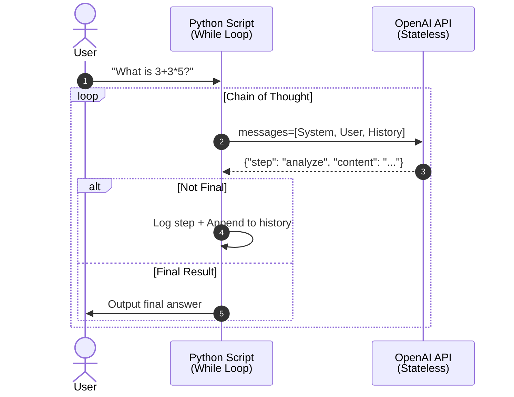

# Session 2: Engineering the Application Layer - Documentation Plan

## Session Context
This is **Class 2 of 16** in the GenAI Deep Dive series. Session 1 established the foundational mental model (the machine/LLM as a stateless function). Session 2 elevates the engineer from "user of ChatGPT" to "architect of AI systems" by teaching prompt engineering as **system design**.

---

## 10-Step Documentation Plan

### **Step 1: Foundation - The Primitive (GIGO & Stochastic Function)**
**Estimated Words:** ~1,200

**Content Structure:**
- Revisit the stateless function: `Output = f(Input_Tokens)`
- Deep dive into **Garbage In, Garbage Out (GIGO)** from an engineering perspective
- Why the quality of input state determines output distribution entropy
- **Critical Rule:** "Do not use AI to write prompts for AI" (Signal Degeneration)
- Backend analogy: Treating prompts as **Request Payloads** in REST APIs

**Practical Example Walkthrough:**
- Scenario: Customer Support Bot receiving vague query "Money not showing"
- Show how ambiguous input leads to flattened probability distribution
- Demonstrate entropy calculation conceptually

**Checkpoint Question:**
- Banking bot scenario: Why raw user input is architectural failure
- Answer: Need middleware classification layer before LLM call
- Architectural diagram showing preprocessing pipeline

---

### **Step 2: The Protocol - Anatomy of an LLM API Request**
**Estimated Words:** ~1,500

**Content Structure:**
- LLM API calls as **Structured State Objects**, not raw strings
- Protocol differences across providers:
  - **OpenAI/ChatML:** `[{"role": "system"/"user"/"assistant", "content": "..."}]`
  - **Llama/Alpaca:** Special tokens `[INST]...[/INST]`, `<s>...</s>`
- Role hierarchy: System (God Mode) → User (Input) → Assistant (History)
- Why this matters: Serialization for the tokenizer

**Code Examples:**
```python
# OpenAI format
messages = [
    {"role": "system", "content": "You are a JSON parser."},
    {"role": "user", "content": "Extract: Piyush is here."}
]

# Under the hood: This gets serialized to tokens
```

**Practical Example Walkthrough:**
- Complete API request structure dissection
- Show how history is maintained in the messages array
- Memory management: Context window as a circular buffer

**Checkpoint Question:**
- Scenario: Migrating from OpenAI GPT-4 to self-hosted Llama-3
- Challenge: Different payload formats will break existing code
- Answer: Implement Adapter Design Pattern for model abstraction
- Show interface + concrete implementations

**Mermaid Diagram:**
- Sequence diagram: Application → Adapter → Model-specific serializer → LLM API

---

### **Step 3: Prompt Engineering Fundamentals (Zero-Shot, Few-Shot, System Prompts)**
**Estimated Words:** ~2,000

**Content Structure:**

**A. Zero-Shot Prompting**
- Definition: Single instruction, no examples
- Use case: General knowledge queries
- Risk: High variance in output format/quality
- When to use: Simple, deterministic tasks

**B. Few-Shot Prompting (In-Context Learning)**
- The mechanism: Priming the attention mechanism with patterns
- Show Input→Output examples teaching transformation logic
- Why it works: Model infers the function from examples
- Pattern matching vs. reasoning

**C. System Prompts**
- "God Mode" instructions: Sets behavior, constraints, tone
- Analogy: Environment variables (`ENV=PRODUCTION`) for the neural network
- Priority hierarchy: System > User > Assistant
- Global state management through system prompts

**Practical Example Walkthrough:**
- Zero-Shot: "Extract the name" → Variable results
- Few-Shot: Show 3 examples of extraction → Consistent format
- System Prompt: "You are a JSON-only parser. Never use prose."

**Code Implementation:**
```python
# Zero-shot
messages = [{"role": "user", "content": "Extract name from: John Smith"}]

# Few-shot (In-Context Learning)
messages = [
    {"role": "user", "content": "Extract: Alice Brown"},
    {"role": "assistant", "content": '{"name": "Alice Brown"}'},
    {"role": "user", "content": "Extract: Bob Lee"},
    {"role": "assistant", "content": '{"name": "Bob Lee"}'},
    {"role": "user", "content": "Extract: John Smith"}
]
```

**Checkpoint Question:**
- Scenario: Using 50 few-shot examples in every API call
- Challenge: Costs exploding, high latency (TTFT)
- Answer: Dynamic Few-Shotting via RAG for prompts
  - Store examples in Vector DB
  - Retrieve top-3 relevant examples per query
  - Reduces input tokens while maintaining quality

---

### **Step 4: Advanced Orchestration - Chain of Thought (CoT)**
**Estimated Words:** ~1,800

**Content Structure:**
- **The Problem:** LLMs fail at multi-step reasoning when forced to answer immediately
- **The Solution:** "Show your work" - force intermediate reasoning steps
- Implementation: Inject instructions like "Analyze → Think → Validate → Output"
- **Why it works:** Token-by-token generation dumps "thinking state" into context
  - Subsequent tokens attend to earlier reasoning tokens
  - Increases probability of correct final answer

**Engineering Insight:**
- Trade-off: More tokens (cost + latency) for higher accuracy
- Analogous to **Speculative Execution** in CPUs or **Write-Ahead Logging** in databases
- You're buying reliability with computational overhead

**Practical Example Walkthrough:**
- Query: "Is 9.11 greater than 9.8?"
- Without CoT: Model answers "Yes" (wrong - treating as string comparison)
- With CoT prompt:
  ```
  Step 1: Analyze the numbers (9.11 vs 9.8)
  Step 2: Compare decimal values (9.11 = 9.11, 9.8 = 9.80)
  Step 3: Determine which is larger (9.80 > 9.11)
  Step 4: Answer: No
  ```

**Code Implementation:**
```python
system_prompt = """
You must think step-by-step.
1. Analyze the problem
2. Break it down
3. Solve each part
4. Synthesize answer
"""
```

**Checkpoint Question:**
- Scenario: Real-time chatbot with CoT generates 500 words of thinking before answering
- Challenge: User perceives high latency
- Answer: Architecture pattern - **Optimistic UI + Streaming**
  - Use Server-Sent Events (SSE) to stream thinking steps
  - Frontend shows "Thinking..." accordion with progressive disclosure
  - Don't wait for final 200 OK
- Alternative: Router pattern - detect simple math, route to calculator tool (deterministic) instead of LLM (probabilistic)

**Mermaid Diagram:**
- Flowchart: Query → Classifier → [Math? → Calculator Tool | Complex? → CoT Loop]

---

### **Step 5: Advanced Orchestration - Self-Consistency & Ensemble Methods**
**Estimated Words:** ~1,400

**Content Structure:**
- **Definition:** Run same prompt N times (parallel), take majority vote
- **Engineering Analog:** Quorum reads in distributed databases (Cassandra, DynamoDB)
- Trade compute/cost for strong consistency/reliability

**Implementation Pattern:**
```python
# Fan-out: 3 parallel requests
responses = await asyncio.gather(
    llm_call(prompt),
    llm_call(prompt),
    llm_call(prompt)
)

# Map-Reduce: Aggregate answers
answer = majority_vote(responses)
```

**When to Use:**
- High-stakes decisions (financial advice, medical triage)
- When single hallucination is unacceptable
- When accuracy > cost

**Practical Example Walkthrough:**
- Query: "Classify sentiment: 'This product is not bad'"
- Response 1: Positive
- Response 2: Neutral
- Response 3: Positive
- **Output:** Positive (2/3 consensus)

**Checkpoint Question:**
- Scenario: Healthcare diagnostic assistant
- Challenge: Cannot afford single hallucination (patient safety)
- Question: How do you architect for 99.9% accuracy given model is probabilistic?
- Answer: Multi-layer defense:
  1. Self-Consistency (N=5 parallel calls)
  2. Confidence scoring (if vote is 3/5, trigger human review)
  3. Fallback to deterministic rules for critical cases
  4. Observability: Log all disagreements for model retraining

---

### **Step 6: Advanced Orchestration - The Agent Loop (Orchestrator Pattern)**
**Estimated Words:** ~2,000

**Content Structure:**
- **Definition:** Treating LLM call not as single transaction but as iterative loop
- The genesis of "AI Agents" - recursive thought processes
- Stop treating the API as `request → response`, start treating it as `while True:`

**The Orchestrator Pattern:**
```python
history = [{"role": "system", "content": system_prompt}]
user_query = {"role": "user", "content": "Solve: 3+3*5"}

history.append(user_query)

while True:
    response = llm_call(messages=history)
    
    # Parse response (structured output)
    step = parse_json(response)
    
    # Is this the final answer?
    if step["type"] == "final_result":
        return step["content"]
    
    # Otherwise, it's an intermediate thought
    # Append to history (this is the "memory")
    history.append({"role": "assistant", "content": response})
    
    # Loop continues - model sees its own thinking
```

**Engineering Insights:**
- The `history` array is the **State Machine**
- Each iteration appends to context (growing context window)
- Must implement **Memory Management** (sliding window, summarization)
- Termination conditions required (max iterations, timeout)

**Practical Example Walkthrough:**
- Complete trace of multi-turn problem solving
- Show how context grows with each iteration
- Demonstrate early stopping vs. exhaustive search

**Checkpoint Question:**
- Scenario: Implementing agent loop for code review bot
- Challenge: Context window fills up after 10 file reviews (128k token limit)
- Question: How do you architect memory management?
- Answer: Implement **Hierarchical Memory System**:
  1. **Short-term (Working Memory):** Last 5 messages in full
  2. **Mid-term (Summarized):** Messages 6-20 → LLM-generated summary
  3. **Long-term (Vector Store):** All previous reviews → Semantic search retrieval
  4. On each iteration, load: Working + Summary + Top-3 relevant long-term memories

**Mermaid Diagram:**
- Sequence diagram showing the while loop with memory tiers

---

### **Step 7: Structured Output & JSON Enforcement**
**Estimated Words:** ~1,600

**Content Structure:**
- **The Problem:** Backend systems need structured data (JSON), not prose
- **The Solution:** Prompt + Schema + Validation + Self-Correction

**Technique Layers:**
1. **Prompt-level:** "Output strictly in JSON format. Schema: {...}"
2. **API-level:** `response_format={"type": "json_object"}` (GPT-4o)
3. **Validation-level:** Pydantic/Zod schema enforcement
4. **Self-correction-level:** If validation fails, send error back to LLM

**Code Implementation:**
```python
from pydantic import BaseModel

class UserExtraction(BaseModel):
    user_id: str
    name: str
    email: str

# Prompt
prompt = f"""
Extract user data. Output JSON matching this schema:
{UserExtraction.schema_json()}
Input: "John (john@example.com) ID: 12345"
"""

# Call LLM
response = llm_call(prompt)

# Validate
try:
    data = UserExtraction.parse_raw(response)
except ValidationError as e:
    # Self-correction: Send error back to LLM
    retry_prompt = f"You generated: {response}\nValidation failed: {e}\nFix it."
    response = llm_call(retry_prompt)
```

**Practical Example Walkthrough:**
- Show successful extraction
- Show failed extraction (missing field)
- Show self-correction loop converging to valid output

**Checkpoint Question:**
- Scenario: ETL pipeline converting unstructured user emails to database records
- Challenge: LLM returns valid JSON 99% of time, but 1% has missing `user_id`, crashes pipeline
- Question: How do you make this system robust and self-healing?
- Answer: **Self-Correction Loop + Circuit Breaker**:
  1. Catch validation error
  2. Retry with error message (max 3 attempts)
  3. If still fails, route to **Dead Letter Queue** (DLQ) for human review
  4. Implement **Circuit Breaker:** If error rate > 5%, stop processing, alert engineers

---

### **Step 8: Cost & Performance - Token Economics**
**Estimated Words:** ~1,500

**Content Structure:**
- **The Reality:** Every token costs money (input + output)
- **Pricing models:** $X per 1M input tokens, $Y per 1M output tokens
- **Cost explosions:** Few-shot prompts, long histories, retries

**Optimization Strategies:**

**A. Prompt Compression**
- Remove verbosity: "Please kindly assist" → "Extract name"
- Use abbreviations where model understands

**B. Caching (Prompt Caching)**
- OpenAI/Anthropic: Cache system prompts (reused across requests)
- Cost: Pay once for first occurrence, 90% discount on subsequent hits
- Architecture: Design prompts with reusable prefixes

**C. Model Selection Routing**
- Small/Fast model (GPT-3.5, Llama-3-8B) for simple tasks
- Large/Slow model (GPT-4o, Claude Opus) for complex reasoning
- Implement classifier to route requests

**D. Output Token Limiting**
- Set `max_tokens=100` when you only need short answer
- Prevent rambling (cost + latency)

**Practical Example Walkthrough:**
- Cost comparison:
  - Without caching: 1000 requests × 2000 tokens × $0.01 = $20
  - With caching: 1 × $20 + 999 × $2 = $22 (but same functionality)
  - With routing: 900 to small model ($5) + 100 to large model ($15) = $20 → $10 total

**Checkpoint Question:**
- Scenario: SaaS startup using GPT-4 for all user queries
- Challenge: $50k/month API bill, customers paying $10k/month
- Question: How do you architect for profitability without degrading quality?
- Answer: **Multi-tier Architecture:**
  1. **Tier 0 (Free):** Regex/Rules for FAQ (no LLM)
  2. **Tier 1 ($):** Small model (Llama-3-8B self-hosted) for 80% of queries
  3. **Tier 2 ($$):** GPT-4 for complex queries (detected by classifier)
  4. **Caching:** Aggressive caching of common queries
  5. **Rate limiting:** Per-user quotas
  - **Result:** 10x cost reduction

---

### **Step 9: Role-Specific Deep Dives**
**Estimated Words:** ~2,400 (480 per role)

**A. Backend/Cloud Engineer**
- **Focus:** API Latency, Streaming, Async Patterns, State Management
- **Key Patterns:**
  - **Streaming (SSE/WebSockets):** Don't wait for full response, stream tokens as they're generated
    - Reduces perceived latency (TTFT vs. total latency)
    - Better UX for long responses (users see progress)
  - **Timeout Management:** LLM calls can take 30-120 seconds
    - Implement progressive timeouts (warn at 30s, error at 120s)
    - Use async/await to prevent blocking main thread
  - **Async/Await Patterns:** Parallelize independent LLM calls
    - Example: Summarization + Sentiment analysis in parallel
  - **Context Window Management:** The `messages[]` array is your state
    - Implement sliding window (keep last N messages)
    - Implement summarization (compress old messages)
    - Implement pruning (remove low-relevance messages)
- **Code Example:** 
  ```python
  # FastAPI with SSE streaming
  from fastapi import FastAPI
  from fastapi.responses import StreamingResponse
  
  @app.post("/chat/stream")
  async def chat_stream(query: str):
      async def generate():
          async for chunk in llm_stream(query):
              yield f"data: {chunk}\n\n"
      return StreamingResponse(generate(), media_type="text/event-stream")
  ```
- **Production Consideration:** 
  - Handle connection drops mid-stream (client disconnects)
  - Implement backpressure (if client slow, pause generation)
  - Connection pooling for HTTP/2 multiplexing

**B. DevOps**
- **Focus:** Self-hosting Models, Quantization, Infrastructure as Code
- **Key Concepts:**
  - **Quantization:** Reduce precision to save VRAM/cost
    - **FP16 (16-bit):** 2 bytes per parameter (baseline)
    - **INT8 (8-bit):** 1 byte per parameter (2x smaller, minimal accuracy loss)
    - **INT4 (4-bit):** 0.5 bytes per parameter (4x smaller, some accuracy loss)
    - **Example:** Llama-3-70B (70 billion parameters)
      - FP16: 70B × 2 bytes = 140GB VRAM → Requires 2× A100 (80GB each)
      - INT4: 70B × 0.5 bytes = 35GB VRAM → Runs on 1× A100 or 2× A10G
  - **Model Serving Frameworks:**
    - **vLLM:** High-throughput inference (PagedAttention for memory efficiency)
    - **TensorRT-LLM:** NVIDIA-optimized (3-5x faster than vanilla PyTorch)
    - **Text Generation Inference (TGI):** HuggingFace production server
  - **Kubernetes Integration:**
    - NVIDIA GPU Operator for device plugin
    - Node affinity for GPU-enabled nodes
    - Horizontal Pod Autoscaling based on queue depth (not CPU/memory)
  - **GPU Passthrough:** PCIe passthrough in VMs vs. containerized
- **Infrastructure Example:**
  ```yaml
  # Kubernetes deployment for self-hosted Llama
  apiVersion: apps/v1
  kind: Deployment
  metadata:
    name: llama-inference
  spec:
    replicas: 2
    template:
      spec:
        containers:
        - name: vllm
          image: vllm/vllm-openai:latest
          resources:
            limits:
              nvidia.com/gpu: 1
          env:
          - name: MODEL_NAME
            value: "meta-llama/Llama-3-8B-Instruct"
          - name: QUANTIZATION
            value: "awq"  # 4-bit quantization
  ```
- **Production Consideration:** 
  - Blue-green deployments for model updates (no downtime)
  - Model registry (versioning, rollback capability)
  - Cost optimization: Spot instances for non-critical workloads
  - Monitoring GPU utilization (if < 60%, you're over-provisioned)

**C. SRE (Site Reliability Engineering)**
- **Focus:** Observability, Golden Signals, Incident Response
- **AI-Specific Golden Signals:**
  1. **Latency Metrics:**
     - **TTFT (Time to First Token):** How fast does streaming start? (Target: < 500ms)
     - **TPOT (Time Per Output Token):** Throughput metric (Target: > 50 tokens/sec)
     - **Total Latency:** End-to-end response time
  2. **Throughput Metrics:**
     - **Requests/sec:** Standard HTTP metric
     - **Tokens/sec:** AI-specific (varies by request size)
  3. **Cost Metrics:**
     - **Cost Per Request:** Input tokens × $X + Output tokens × $Y
     - **Cost Per User Session:** Track across multi-turn conversations
  4. **Quality Metrics:**
     - **Hallucination Rate:** Requires eval harness (compare to ground truth)
     - **Format Compliance Rate:** % of responses that pass JSON validation
     - **Retry Rate:** How often do self-correction loops trigger?
  5. **Error Rates:**
     - **4xx errors:** Bad prompts, context length exceeded
     - **5xx errors:** Model unavailable, timeout
     - **Rate limit hits:** Need to scale quota or add caching
- **Alerting Thresholds:**
  - **P1 (Page immediately):** TTFT > 5s for 5 minutes (user-facing impact)
  - **P2 (Business hours):** Cost/request increased 2x (possible prompt bloat)
  - **P3 (Next day):** Hallucination rate increased 10% (model drift)
- **Dashboard Example (Grafana):**
  ```promql
  # TTFT percentiles
  histogram_quantile(0.95, rate(llm_ttft_seconds_bucket[5m]))
  
  # Cost per request
  rate(llm_input_tokens_total[5m]) * 0.002 / 1000 +
  rate(llm_output_tokens_total[5m]) * 0.006 / 1000
  
  # Hallucination rate (requires custom metric)
  rate(llm_hallucination_total[5m]) / rate(llm_requests_total[5m])
  ```
- **Production Consideration:** 
  - **Drift Detection:** Model behavior changes over time (new data patterns)
    - Run daily evaluation suite on fixed test set
    - Alert if accuracy drops > 5%
  - **Cascading Failures:** LLM timeout causes thread pool exhaustion
    - Implement circuit breaker (after 10 consecutive failures, stop calling API for 60s)
  - **Cost Runaway Protection:** Infinite loop bug burns $10K overnight
    - Per-user rate limiting (100 requests/hour)
    - Per-request token limits (max 4096 output tokens)
    - Daily budget alerts ($1K spent in last hour)

**D. Platform Engineering**
- **Focus:** AI Gateway, Multi-tenancy, Developer Experience
- **AI Gateway Architecture:**
  - **Centralized Proxy:** All LLM API calls route through single service
  - **Key Features:**
    1. **Rate Limiting:** Per-user, per-team, per-model quotas
    2. **Caching:** Cache responses for identical prompts (30-50% hit rate typical)
    3. **Load Balancing:** Route to multiple providers (OpenAI, Anthropic, Azure)
    4. **Observability:** Centralized logging, tracing, metrics
    5. **Cost Attribution:** Tag requests by team/product for chargeback
    6. **Security:** PII redaction, prompt injection detection
  - **Tools:** Portkey, Helicone, LiteLLM, Kong AI Gateway
- **Multi-tenancy Patterns:**
  - **Namespace Isolation:** Team A cannot see Team B's prompts/logs
  - **Resource Quotas:** Team A gets 1M tokens/day, Team B gets 10M tokens/day
  - **Model Access Control:** Team A approved for GPT-4, Team B only GPT-3.5
- **Developer Experience:**
  - **Unified SDK:** Abstract away provider differences
    ```python
    # Developer writes provider-agnostic code
    from platform_sdk import LLM
    
    llm = LLM(model="gpt-4")  # Platform routes to best available
    response = llm.complete("Summarize this...")
    ```
  - **Prompt Playground:** Web UI for testing prompts (non-engineers)
  - **Evaluation Framework:** Built-in testing harness
- **Caching Strategy:**
  - **Exact Match Cache:** Hash(system_prompt + user_prompt) → Cache key
    - Hit rate: 30-40% for FAQ-style bots
  - **Semantic Cache:** Embed prompt → Vector search for similar prompts
    - Hit rate: 50-60% but adds latency (embedding + search)
  - **Prompt Prefix Cache:** OpenAI/Anthropic feature (cache system prompt)
    - 90% cost reduction for reused system prompts
- **Production Consideration:** 
  - **A/B Testing:** Route 10% of traffic to new prompt variant, measure quality
  - **Gradual Rollout:** Canary deployments for prompt changes
  - **Fallback Chain:** OpenAI down → Try Anthropic → Try Azure → Return cached response
  - **Governance Dashboard:** Real-time view of who's using what, how much it costs

**E. Cloud & AI Transformation Leader**
- **Focus:** Strategic Decision-Making, Build vs. Buy Framework, ROI Analysis, Risk Management
- **Decision Matrix:**
  - **Use APIs (Buy):** General language understanding, JSON parsing, summarization, sentiment analysis
    - **When:** Standard capabilities, fast time-to-market, variable usage patterns
    - **Cost:** $X/month predictable OpEx, scales with usage
    - **Risk:** Vendor lock-in, data privacy, rate limits
  - **Fine-tune (Build Lite):** Domain-specific terminology, corporate writing style, brand voice
    - **When:** Custom behavior needed, high volume justifies investment
    - **Cost:** $Y upfront (data prep + training) + $Z/month hosting
    - **Risk:** Maintenance burden, drift over time
  - **Train from scratch (Build Heavy):** Proprietary languages, extreme privacy requirements, competitive moat
    - **When:** Unique competitive advantage, regulatory constraints (HIPAA, defense)
    - **Cost:** $1M+ one-time + $$$$ infrastructure + team
    - **Risk:** 18+ month timeline, talent acquisition, technical debt
- **Economic Model Example:**
  - **Scenario:** 10M API calls/month, 500 tokens avg per call
  - **API Cost:** 10M × 500 × $0.002/1K tokens = $10,000/month
  - **Self-Hosted:** $50K setup + $5K/month infra = Break-even at 9 months
  - **Decision:** If usage stable + privacy critical → Self-host. If experimental → API.
- **Governance Framework:**
  - **Prompt Library:** Centralized, version-controlled system prompts
  - **Evaluation Harness:** Automated quality checks before production
  - **Cost Attribution:** Charge-back model per team/product
  - **Compliance:** PII detection, audit logging, model cards
- **Production Consideration:** 
  - Multi-vendor strategy (avoid OpenAI-only dependency)
  - Fallback mechanisms (if primary vendor down, route to backup)
  - Data sovereignty (EU customers → EU-hosted models)
  - Contract negotiations (volume discounts, SLA guarantees)

---

### **Step 10: Hardcore Practical Exercise - Chain-of-Thought Orchestrator**
**Estimated Words:** ~2,000

**Objective:**
Build a production-grade Chain-of-Thought Orchestrator from scratch. This exercise bridges theory to practice and reveals the internal pattern used by LangChain, AutoGPT, and BabyAGI.

**Why This Exercise:**
- Proves you can manipulate context window programmatically
- Demonstrates understanding of the agent loop
- Reveals how "memory" is just array manipulation
- Shows self-correction and structured output in action

**Exercise Specifications:**

**Task:** Create a Python CLI tool that solves multi-step problems using explicit reasoning.

**Requirements:**
1. Accept user query via command line
2. Use OpenAI or Gemini API
3. System prompt forces step-by-step JSON output:
   ```json
   {"step": "analyze|think|calculate|final_result", "content": "..."}
   ```
4. Implement `while True` orchestrator loop
5. Parse JSON, log each step (observability)
6. Append steps to context (memory)
7. Terminate when `step == "final_result"`
8. Handle errors (malformed JSON, API failures)

**Starter Code Template:**
```python
import openai
import json

SYSTEM_PROMPT = """
You are a reasoning engine. Break down problems into steps.
Output ONLY valid JSON. Use this format:
{"step": "analyze", "content": "..."}
{"step": "think", "content": "..."}
{"step": "calculate", "content": "..."}
{"step": "final_result", "content": "..."}
"""

def orchestrator(user_query):
    messages = [
        {"role": "system", "content": SYSTEM_PROMPT},
        {"role": "user", "content": user_query}
    ]
    
    iteration = 0
    max_iterations = 10
    
    while iteration < max_iterations:
        # TODO: Call LLM API
        # TODO: Parse JSON response
        # TODO: Check if final_result
        # TODO: Append to messages
        # TODO: Log step for observability
        iteration += 1
    
    return "Max iterations reached"

if __name__ == "__main__":
    query = input("Enter problem: ")
    result = orchestrator(query)
    print(f"Final Answer: {result}")
```

**Expected Output Example:**
```
User: "What is 3 + 3 * 5?"

[Step 1] analyze: "Order of operations: Multiply first, then add"
[Step 2] calculate: "3 * 5 = 15"
[Step 3] calculate: "3 + 15 = 18"
[Step 4] final_result: "18"

Final Answer: 18
```

**Architecture Visualization (Mermaid):**


**Advanced Challenges:**
1. Add self-correction: If JSON parsing fails, retry with error message
2. Implement prompt caching for system prompt
3. Add streaming: Print each step as it arrives (SSE)
4. Add memory management: Summarize history if > 10 steps
5. Add cost tracking: Log input/output tokens per iteration

**What You Learn:**
- You're now an "Architect of Agentic Workflows"
- You understand how LangChain's `AgentExecutor` works internally
- You can build custom agents without frameworks
- You control the machine's thought process programmatically

---

## Summary of Document Flow

**Narrative Arc:**
1. **Foundation:** GIGO - Quality input = Quality output
2. **Protocol:** How to structure API calls (messages array)
3. **Programming:** Zero-shot → Few-shot → System prompts (increasing control)
4. **Orchestration:** CoT → Self-Consistency → Agent Loop (increasing sophistication)
5. **Production:** Structured output, cost optimization, role-specific concerns
6. **Mastery:** Build an orchestrator from scratch

**Pedagogical Philosophy:**
- Each concept builds on the previous
- Every concept has a backend engineering analogy
- Every section has a production-grade checkpoint question
- The exercise ties everything together

---

## Key Differentiators from Session 1

- **Session 1:** "What is an LLM?" (The machine)
- **Session 2:** "How do I program it?" (The interface)

- **Session 1:** Focused on architecture (tokens, embeddings, attention)
- **Session 2:** Focused on application (prompts, context, orchestration)

- **Session 1:** Understanding the black box
- **Session 2:** Using the black box in production systems

---

## Document Metadata

- **Target Word Count:** 12,000 words
- **Estimated Diagrams:** 6-8 Mermaid diagrams
- **Code Blocks:** 15-20 examples
- **Checkpoint Questions:** 10 scenarios (with detailed answers)
- **Delivery Format:** Single markdown file (`session-02-application-layer.md`)
- **Reading Time:** 60-90 minutes (deep focus)
- **Lecture Time:** 3-4 hours (with discussions)

---

## Success Criteria (Session 2)

After completing this document, the engineer should be able to:

1. ✅ Explain why "Garbage In, Garbage Out" is a system design problem
2. ✅ Structure LLM API requests with proper role hierarchy
3. ✅ Implement Zero-shot, Few-shot, and System prompt patterns
4. ✅ Build Chain-of-Thought workflows
5. ✅ Implement self-consistency for high-stakes decisions
6. ✅ Architect an agent loop with memory management
7. ✅ Enforce structured JSON output with self-correction
8. ✅ Optimize for cost (caching, routing, compression)
9. ✅ Understand role-specific production concerns
10. ✅ Build a working CoT orchestrator from scratch

---

## Approval Checklist

Before proceeding to documentation:

- [ ] Does the narrative flow logically (building complexity)?
- [ ] Are the checkpoint questions FAANG-level system design quality?
- [ ] Is the practical exercise "hardcore" enough (reveals real patterns)?
- [ ] Are backend engineering analogies clear throughout?
- [ ] Is the content scoped to ~12K words (not bloated)?
- [ ] Does it avoid duplicating Session 1 content?
- [ ] Is it production-focused (not toy examples)?

---

**Status:** Awaiting approval to proceed with Steps 1-3 of documentation.
