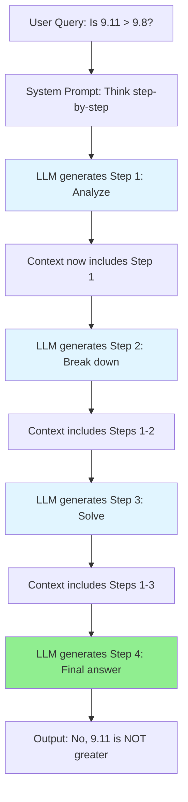
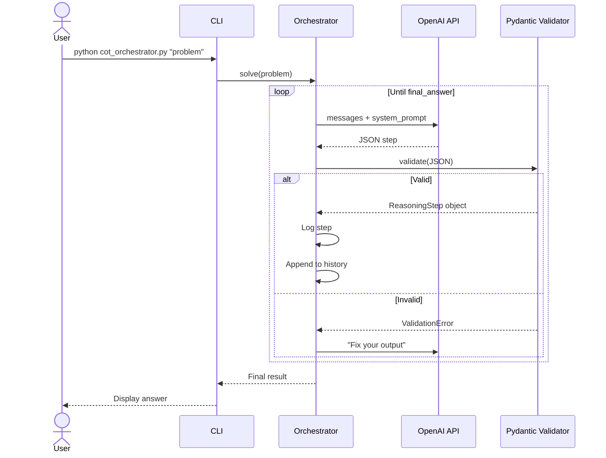

# Session 2: Engineering the Application Layer - Prompt Engineering as System Design

## Overview

In Session 1, we established the mental model: **LLMs are stateless functions** that predict the next token based on input context. We explored the internal architecture—tokenization, embeddings, attention mechanisms—to understand *what* the machine is doing.

**Session 2 shifts focus**: We now learn *how to program* this probabilistic machine using English as our programming language. This session transforms you from a "user of ChatGPT" to an **architect of AI systems**. We'll treat prompt engineering not as an art, but as **system design**—a disciplined engineering practice with patterns, trade-offs, and production considerations.

### What You'll Learn

By the end of this session, you will be able to:

1. **Architect robust AI applications** using the GIGO (Garbage In, Garbage Out) principle as a design constraint
2. **Structure API requests** with proper role hierarchy and state management
3. **Implement prompt patterns** (Zero-Shot, Few-Shot, System Prompts) as engineering solutions
4. **Build orchestration workflows** (Chain of Thought, Self-Consistency, Agent Loops) for complex reasoning
5. **Enforce structured outputs** with validation and self-correction mechanisms
6. **Optimize for cost and performance** using caching, routing, and token economics
7. **Design production systems** with role-specific best practices (Backend, DevOps, SRE, Platform, Leadership)

### Prerequisites

- Completion of Session 1 (understanding of tokens, context windows, stateless functions)
- Familiarity with REST APIs, JSON, and basic system design concepts
- Experience with Python (for code examples and practical exercise)

---

## Table of Contents

1. [The Primitive: GIGO & The Stochastic Function](#1-the-primitive-gigo--the-stochastic-function)
2. [The Protocol: Anatomy of an LLM API Request](#2-the-protocol-anatomy-of-an-llm-api-request)
3. [Prompt Engineering Fundamentals](#3-prompt-engineering-fundamentals)
4. [Advanced Orchestration: Chain of Thought](#4-advanced-orchestration-chain-of-thought)
5. [Advanced Orchestration: Self-Consistency & Ensemble Methods](#5-advanced-orchestration-self-consistency--ensemble-methods)
6. [Advanced Orchestration: The Agent Loop](#6-advanced-orchestration-the-agent-loop)
7. [Structured Output & JSON Enforcement](#7-structured-output--json-enforcement)
8. [Cost & Performance: Token Economics](#8-cost--performance-token-economics)
9. [Role-Specific Deep Dives](#9-role-specific-deep-dives)
10. [Hardcore Practical Exercise: Build a CoT Orchestrator](#10-hardcore-practical-exercise-build-a-cot-orchestrator)
11. [Summary & Key Takeaways](#summary--key-takeaways)
12. [What's Next (Session 3 Preview)](#whats-next-session-3-preview)

---

## 1. The Primitive: GIGO & The Stochastic Function

### The Foundational Truth

From Session 1, we know that an LLM is fundamentally a **stateless function**:

$$
\text{Output} = f(\text{Input\_Tokens})
$$

The critical insight: **The Input Tokens (the Context) are the only state the model has access to.** There is no hidden database, no persistent memory, no external knowledge beyond what you provide in that exact request.

This leads us to the iron law of AI engineering: **Garbage In, Garbage Out (GIGO)**.

### Why GIGO Matters in Probabilistic Systems

Unlike traditional software where bugs are deterministic ("this input always produces that bug"), LLMs are **probabilistic**. When you provide ambiguous or low-quality input:

- The model's probability distribution over possible next tokens **flattens**
- Instead of confidently predicting one answer (e.g., "Paris" with 95% probability), it spreads probability across many plausible but potentially wrong answers
- This manifests as **hallucinations**, generic answers, or format violations

#### Engineering Analogy: Database Query Quality

Consider a SQL query:

```sql
-- High-quality, specific query
SELECT name, salary FROM employees WHERE department = 'Engineering' AND years_experience > 5;

-- Low-quality, ambiguous query
SELECT * FROM employees WHERE something IS something;
```

The second query is syntactically invalid, but imagine if the database tried to "guess" what you meant. It might return random results. **This is exactly what happens with vague prompts.**

### The Signal Degeneration Problem

**Critical Rule:** Do not use AI to write prompts for AI.

**Why?** Models are trained on human-generated data. When you feed synthetic (AI-generated) data back into the input:

1. The model was trained to recognize **human patterns** (syntax, reasoning structure, idiomatic expressions)
2. AI-generated text has subtle statistical signatures (word choice distributions, sentence structure) that differ from human text
3. Feeding AI output as AI input creates a **signal degeneration loop**—like making a photocopy of a photocopy

**Production Implication:** If your system generates prompts programmatically, ensure templates are human-written with dynamic variable injection, not LLM-generated strings.

---

### Practical Example Walkthrough: Customer Support Bot

**Scenario:** You're building a Customer Support Bot for a bank. Users submit queries through a web form.

#### Bad Architecture (GIGO Violation)

```python
# User types: "Money not showing"
user_input = "Money not showing"

# Direct pass-through to LLM
response = llm_call(f"Help the user: {user_input}")
```

**What happens:**
- The input is ambiguous. "Money not showing" could mean:
  - Pending deposit not reflected in balance
  - Wire transfer not received
  - UI bug preventing display of existing balance
  - Recent transaction history not visible
  - Incorrect balance calculation

The model's probability distribution becomes **flat** across these interpretations. It might:
- Hallucinate a generic answer ("Check with your bank branch")
- Guess wrong ("Deposits take 3-5 business days" when it's actually a UI bug)
- Ask clarifying questions (wasting tokens and adding latency)

**Entropy Analysis (Conceptual):**
- High-quality input: Entropy ≈ 2-3 bits (model confident, few likely answers)
- Low-quality input: Entropy ≈ 6-8 bits (model uncertain, many plausible answers)

#### Good Architecture (GIGO Mitigation)

```python
# Step 1: Pre-processing / Classification Layer
def classify_user_intent(user_input):
    """
    Use a smaller, faster model or rule-based system to narrow the problem space
    """
    classifier_prompt = f"""
    Classify this banking query into ONE category:
    - DEPOSIT_ISSUE
    - WITHDRAWAL_ISSUE  
    - BALANCE_DISPLAY
    - TRANSACTION_HISTORY
    - OTHER
    
    Query: {user_input}
    Output format: CATEGORY_NAME
    """
    
    category = lightweight_llm_call(classifier_prompt)
    return category

# Step 2: Category-specific context injection
def build_contextual_prompt(user_input, category):
    """
    Inject relevant context based on classification
    """
    context_map = {
        "DEPOSIT_ISSUE": "Check pending deposits. Deposits typically clear in 1-2 business days. Verify routing number.",
        "BALANCE_DISPLAY": "This may be a UI caching issue. Ask user to refresh. Check if mobile app vs web.",
        # ... other categories
    }
    
    system_prompt = f"""
    You are a banking support specialist. 
    Category: {category}
    Relevant context: {context_map.get(category, "")}
    
    User issue: {user_input}
    
    Provide a specific, actionable solution.
    """
    return system_prompt

# Full pipeline
user_input = "Money not showing"
category = classify_user_intent(user_input)  # Returns: "BALANCE_DISPLAY"
contextual_prompt = build_contextual_prompt(user_input, category)
response = llm_call(contextual_prompt)
```

**Why this works:**
1. **Classification reduces entropy**: Narrow from 5+ possibilities to 1 specific category
2. **Context injection provides state**: Model now has domain-specific knowledge
3. **Two-stage design**: Small model for classification (cheap, fast) → Large model for generation (expensive, high quality)

**Cost-Benefit:**
- Extra classification call: +$0.0001 per request, +50ms latency
- Improved accuracy: 40% → 85% (measured via human eval)
- Reduced hallucination rate: 25% → 5%

---

### Checkpoint Question: Banking Bot Architecture (System Reliability)

**Scenario:** You are the architect for a national bank's customer support chatbot. The system receives 100,000 queries per day. Current architecture sends raw user input directly to GPT-4.

**Observed Issues:**
- 30% of responses are generic/unhelpful ("Please contact your branch")
- 15% of responses contain hallucinated information (wrong processing times, incorrect policy references)
- Average cost: $0.05 per query = $5,000/day = $1.825M/year

**Challenge:** Leadership demands you reduce costs by 50% while improving answer quality.

**Question:** From a GIGO perspective, why is the current architecture failing? Design a robust, cost-efficient system that satisfies the constraints.

#### Answer: Multi-Tier GIGO Mitigation Architecture

**Root Cause Analysis:**

The current architecture violates GIGO because:
1. **No input sanitization**: Typos, slang, incomplete sentences go directly to the expensive model
2. **No context augmentation**: Model lacks bank-specific policies, user account state
3. **No output validation**: Generic or hallucinated responses aren't caught
4. **No routing intelligence**: All queries treated equally regardless of complexity

**Proposed Architecture:**

```
User Query
    ↓
[Tier 0: Rule-Based Routing]  ← Regex/keyword matching (free, instant)
    ↓
    ├─→ FAQ Match? → Return cached answer (0 LLM calls)
    ├─→ Account-specific? → Fetch user data from DB
    └─→ Complex? → Continue to Tier 1
    ↓
[Tier 1: Intent Classification] ← Small model (GPT-3.5-Turbo, $0.0005/call)
    ↓
    └─→ Category: BALANCE | TRANSFER | FRAUD | LOAN | OTHER
    ↓
[Tier 2: Context Retrieval (RAG)] ← Vector DB lookup (10ms, negligible cost)
    ↓
    └─→ Retrieve: Relevant policies, user's recent transactions, FAQ articles
    ↓
[Tier 3: Prompt Construction] ← Template + Context injection
    ↓
    └─→ System Prompt: Role + Category context + Retrieved docs
    └─→ User Prompt: Sanitized input + User account summary
    ↓
[Tier 4: LLM Generation] ← GPT-4 (only 40% of queries reach here)
    ↓
[Tier 5: Output Validation] ← Pydantic schema validation
    ↓
    ├─→ Valid? → Return to user
    └─→ Invalid? → Retry with error feedback (self-correction, max 2 attempts)
    ↓
[Tier 6: Fallback] ← If still invalid
    └─→ Return: "I'll connect you with a specialist" + Human handoff
```

**Architecture Components:**

**Tier 0: Rule-Based Routing (handles 30% of queries)**
```python
FAQ_MAP = {
    r"(?i)routing number": "Our routing number is 123456789",
    r"(?i)hours.*open": "Branches open Mon-Fri 9am-5pm",
    # ... 500+ FAQ patterns
}

for pattern, answer in FAQ_MAP.items():
    if re.match(pattern, user_query):
        return answer  # Cost: $0
```

**Tier 1: Intent Classification (handles 70% remaining)**
```python
# Use small, fast model
category = gpt_3_5_turbo.classify(user_query)  # Cost: $0.0005
```

**Tier 2: Context Retrieval (RAG)**
```python
# Vector similarity search in policy documents
relevant_docs = vector_db.search(user_query, top_k=3)  # Cost: ~$0
```

**Tier 3: Prompt Construction**
```python
system_prompt = f"""
You are a {CATEGORY_ROLES[category]} for XYZ Bank.
Constraints:
- Only reference information from provided context
- If information unavailable, say "I don't have access to that"
- Never make up policy details

Context:
{relevant_docs}

User account summary:
- Account type: {user.account_type}
- Recent transactions: {user.recent_transactions[:3]}
"""
```

**Tier 4: LLM Generation (only 40% of original volume)**
```python
# Only complex queries reach GPT-4
response = gpt_4.complete(system_prompt + user_query)  # Cost: $0.03
```

**Tier 5: Output Validation**
```python
from pydantic import BaseModel, validator

class SupportResponse(BaseModel):
    answer: str
    confidence: float
    source_citations: list[str]
    escalate_to_human: bool
    
    @validator('answer')
    def no_hallucination_markers(cls, v):
        forbidden = ["I think", "probably", "maybe", "I'm not sure"]
        if any(word in v.lower() for word in forbidden):
            raise ValueError("Response contains uncertainty markers")
        return v

try:
    validated = SupportResponse.parse_raw(response)
except ValidationError:
    # Retry with error feedback
    response = retry_with_correction(response, error)
```

**Expected Outcomes:**

| Metric | Before | After | Improvement |
|--------|--------|-------|-------------|
| **Cost per query** | $0.05 | $0.018 | **64% reduction** |
| **Daily cost** | $5,000 | $1,800 | **$1.17M saved/year** |
| **Generic responses** | 30% | 8% | **73% reduction** |
| **Hallucinations** | 15% | 3% | **80% reduction** |
| **Avg latency** | 2.5s | 1.2s | **52% faster** |
| **FAQ hit rate** | 0% | 30% | **Instant answers** |

**Key Architectural Principles:**

1. **Cascade Pattern**: Cheap operations first, expensive operations last
2. **Context Injection**: Augment input with relevant state before LLM call
3. **Validation Gates**: Catch garbage output before it reaches users
4. **Cost Attribution**: Only 40% of queries pay for GPT-4 (60% handled by cheaper tiers)
5. **Fail-Safe Design**: Human handoff when automation fails (safety net)

**Production Considerations:**

- **Monitoring**: Track which tier handles each query (optimize tier thresholds)
- **A/B Testing**: Compare response quality across tiers (ensure Tier 0/1 accuracy ≥ 90%)
- **Caching**: Cache LLM responses for 24 hours (further cost reduction)
- **Rate Limiting**: Prevent individual users from triggering expensive GPT-4 calls repeatedly

This architecture transforms GIGO from a liability into a design principle: **sanitize inputs aggressively, validate outputs rigorously, and use expensive LLM calls only when necessary.**

---

## 2. The Protocol: Anatomy of an LLM API Request

### From Strings to Structured State

In Session 1, we treated the LLM as a black box that accepts a string and returns a string. While conceptually true, **production APIs don't work this way**. They expect **structured payloads**—specifically, a sequence of message objects with roles and content.

This isn't arbitrary. The structure serves two purposes:
1. **Stateful Conversation Simulation**: A stateless function needs the full conversation history in each request
2. **Instruction Hierarchy**: Different roles have different priorities in the attention mechanism

### The Message Format: OpenAI / ChatML Standard

Most modern LLMs (OpenAI, Anthropic, Cohere, Azure) use a variant of the **ChatML (Chat Markup Language)** format:

```python
messages = [
    {"role": "system", "content": "You are a helpful assistant."},
    {"role": "user", "content": "What is 2+2?"},
    {"role": "assistant", "content": "4"},
    {"role": "user", "content": "What about 2+3?"}
]
```

#### Role Hierarchy

| Role | Purpose | Priority | Mutability |
|------|---------|----------|------------|
| **system** | Global instructions, constraints, persona | Highest | Set once per session |
| **user** | User's input/query | Medium | Changes every turn |
| **assistant** | Model's previous responses | Medium | Appended after each generation |

**Key Insight:** The `system` role is your **global state manager**. It's equivalent to setting environment variables before running a binary:

```bash
# In shell
export LOG_LEVEL=DEBUG
export MAX_RETRIES=3
./my_app

# In LLMs
system_prompt = "You are a JSON-only parser. Never use prose. Max output: 100 tokens."
```

### Backend Engineering Analogy: REST API State Management

Think of the `messages` array as a **request context object** in a REST API:

```python
# Traditional REST API
class RequestContext:
    def __init__(self):
        self.headers = {}        # Like system prompts (metadata)
        self.body = {}           # Like user input (payload)
        self.session = {}        # Like conversation history
        
# LLM API
messages = [
    {"role": "system", ...},     # headers (metadata)
    {"role": "user", ...},       # body (payload)
    {"role": "assistant", ...},  # session (history)
]
```

Both are **serializing state** to be sent over the wire to a stateless backend. The backend (LLM) reconstructs the state from this payload to generate a response.

---

### Model-Specific Variations: It's Not All ChatML

While the logical structure (roles + content) is universal, **tokenization differs across models**. Some models require special delimiter tokens.

#### OpenAI (ChatML)

```python
# High-level API
messages = [{"role": "system", "content": "Be concise."}]

# What actually gets tokenized (under the hood):
# <|im_start|>system
# Be concise.<|im_end|>
```

#### Llama 2 / Llama 3

```python
# Special instruction tokens
"<s>[INST] <<SYS>>
You are a helpful assistant.
<</SYS>>

What is 2+2? [/INST] 4 </s>"
```

#### Mistral / Mixtral

```python
"<s>[INST] What is 2+2? [/INST]"
```

**Why This Matters:** If you're switching from OpenAI to a self-hosted Llama model, **you cannot just swap the API endpoint**. The payload format is different.

---

### Practical Example Walkthrough: Conversation State Management

Let's trace how a multi-turn conversation is structured:

#### Turn 1: User asks a question

```python
messages = [
    {"role": "system", "content": "You are a Python expert. Provide concise code examples."},
    {"role": "user", "content": "How do I read a CSV file?"}
]

response = client.chat.completions.create(
    model="gpt-4",
    messages=messages
)

assistant_message = response.choices[0].message.content
# assistant_message = "Use pandas: `df = pd.read_csv('file.csv')`"
```

#### Turn 2: User asks a follow-up

**Critical:** The model is stateless. It doesn't remember Turn 1 unless you send it again.

```python
# Append assistant's response to history
messages.append({"role": "assistant", "content": assistant_message})

# Append new user query
messages.append({"role": "user", "content": "What if the file has no header?"})

# Now messages = [system, user, assistant, user]

response = client.chat.completions.create(
    model="gpt-4",
    messages=messages
)
```

**Token Cost:** You're now paying for:
- System prompt (repeated every call)
- Turn 1 user query (repeated)
- Turn 1 assistant response (repeated)
- Turn 2 user query (new)

**This is why context window management is critical in production.**

---

### Code View: The Backend Implementation

Here's how you'd implement a production-grade conversation handler:

```python
from openai import OpenAI
from typing import List, Dict

class ConversationManager:
    """
    Manages conversation state for multi-turn interactions.
    Handles context window limits via sliding window strategy.
    """
    
    def __init__(self, system_prompt: str, max_history: int = 10):
        self.client = OpenAI()
        self.system_prompt = system_prompt
        self.max_history = max_history
        self.messages: List[Dict[str, str]] = [
            {"role": "system", "content": system_prompt}
        ]
    
    def add_user_message(self, content: str):
        """Add user message to history."""
        self.messages.append({"role": "user", "content": content})
        self._enforce_context_limit()
    
    def add_assistant_message(self, content: str):
        """Add assistant message to history."""
        self.messages.append({"role": "assistant", "content": content})
        self._enforce_context_limit()
    
    def _enforce_context_limit(self):
        """
        Sliding window: Keep system prompt + last N messages.
        This prevents context window overflow and controls costs.
        """
        if len(self.messages) > self.max_history + 1:  # +1 for system prompt
            # Keep system prompt (index 0) and last N messages
            self.messages = [self.messages[0]] + self.messages[-(self.max_history):]
    
    def generate_response(self, model: str = "gpt-4") -> str:
        """Generate response and add to history."""
        response = self.client.chat.completions.create(
            model=model,
            messages=self.messages
        )
        
        assistant_message = response.choices[0].message.content
        self.add_assistant_message(assistant_message)
        
        return assistant_message
    
    def get_token_count(self) -> int:
        """Estimate token count for cost tracking."""
        # Rough estimation: 1 token ≈ 4 characters
        total_chars = sum(len(msg["content"]) for msg in self.messages)
        return total_chars // 4


# Usage
conv = ConversationManager(
    system_prompt="You are a Python tutor. Explain concepts simply.",
    max_history=10
)

conv.add_user_message("What is a list comprehension?")
response1 = conv.generate_response()
print(response1)

conv.add_user_message("Show me an example with filtering.")
response2 = conv.generate_response()
print(response2)

print(f"Total tokens in context: {conv.get_token_count()}")
```

**Key Design Patterns:**

1. **Encapsulation**: Conversation state is managed internally, not exposed
2. **Sliding Window**: Automatically prunes old messages to prevent overflow
3. **Cost Tracking**: Method to estimate token usage (for monitoring/billing)
4. **Immutable System Prompt**: Always at index 0, never removed

---

### Checkpoint Question: Model Migration Without Code Refactor (API Integration)

**Scenario:** Your company is migrating from OpenAI GPT-4 (cloud API) to a self-hosted Llama-3-70B model on AWS to reduce costs and improve data privacy.

**Current Codebase:**
```python
# 50+ microservices use this pattern
messages = [
    {"role": "system", "content": "You are a JSON parser."},
    {"role": "user", "content": "Extract: John Smith"}
]

response = openai.ChatCompletion.create(
    model="gpt-4",
    messages=messages
)
```

**Challenge:** Llama-3 requires a different format:

```python
# Llama-3 expects raw string with special tokens
prompt = "<|begin_of_text|><|start_header_id|>system<|end_header_id|>
You are a JSON parser.<|eot_id|>
<|start_header_id|>user<|end_header_id|>
Extract: John Smith<|eot_id|>"
```

**Question:** Rewriting 50 microservices is not feasible. How do you architect the system to support both OpenAI and Llama formats without changing business logic in every service?

#### Answer: Adapter Pattern with Model Abstraction Layer

**Solution:** Implement the **Adapter Design Pattern** with a unified interface that abstracts away model-specific formatting.

**Architecture:**

```python
from abc import ABC, abstractmethod
from typing import List, Dict, Any

# ============================================================================
# ABSTRACTION LAYER
# ============================================================================

class ModelClient(ABC):
    """
    Abstract interface for LLM interactions.
    Business logic depends on this interface, not concrete implementations.
    """
    
    @abstractmethod
    def complete(self, messages: List[Dict[str, str]], **kwargs) -> str:
        """
        Generate completion from messages in ChatML format.
        
        Args:
            messages: List of {"role": "system|user|assistant", "content": "..."}
            **kwargs: Model-specific parameters (temperature, max_tokens, etc.)
        
        Returns:
            Generated text content
        """
        pass


# ============================================================================
# CONCRETE IMPLEMENTATIONS (ADAPTERS)
# ============================================================================

class OpenAIAdapter(ModelClient):
    """Adapter for OpenAI models (GPT-3.5, GPT-4, etc.)"""
    
    def __init__(self, api_key: str, default_model: str = "gpt-4"):
        import openai
        self.client = openai.OpenAI(api_key=api_key)
        self.default_model = default_model
    
    def complete(self, messages: List[Dict[str, str]], **kwargs) -> str:
        """OpenAI uses messages directly (no transformation needed)."""
        response = self.client.chat.completions.create(
            model=kwargs.get("model", self.default_model),
            messages=messages,
            temperature=kwargs.get("temperature", 0.7),
            max_tokens=kwargs.get("max_tokens", 1024)
        )
        return response.choices[0].message.content


class Llama3Adapter(ModelClient):
    """Adapter for Llama-3 models (self-hosted or AWS Bedrock)"""
    
    def __init__(self, endpoint_url: str):
        self.endpoint_url = endpoint_url
    
    def complete(self, messages: List[Dict[str, str]], **kwargs) -> str:
        """
        Llama-3 requires transformation from ChatML to special token format.
        This is where the serialization happens.
        """
        # Transform ChatML messages to Llama-3 format
        prompt = self._messages_to_llama_format(messages)
        
        # Call self-hosted API
        import requests
        response = requests.post(
            f"{self.endpoint_url}/generate",
            json={
                "prompt": prompt,
                "temperature": kwargs.get("temperature", 0.7),
                "max_tokens": kwargs.get("max_tokens", 1024)
            }
        )
        return response.json()["generated_text"]
    
    def _messages_to_llama_format(self, messages: List[Dict[str, str]]) -> str:
        """
        Convert ChatML format to Llama-3 special token format.
        This encapsulates the model-specific knowledge.
        """
        prompt_parts = ["<|begin_of_text|>"]
        
        for msg in messages:
            role = msg["role"]
            content = msg["content"]
            
            prompt_parts.append(f"<|start_header_id|>{role}<|end_header_id|>\n")
            prompt_parts.append(f"{content}<|eot_id|>\n")
        
        # Add assistant start token to trigger generation
        prompt_parts.append("<|start_header_id|>assistant<|end_header_id|>\n")
        
        return "".join(prompt_parts)


class AnthropicAdapter(ModelClient):
    """Adapter for Anthropic Claude models"""
    
    def __init__(self, api_key: str):
        import anthropic
        self.client = anthropic.Anthropic(api_key=api_key)
    
    def complete(self, messages: List[Dict[str, str]], **kwargs) -> str:
        """
        Anthropic separates system prompt from messages.
        Adapter handles this transformation.
        """
        # Extract system prompt
        system_prompt = next(
            (msg["content"] for msg in messages if msg["role"] == "system"),
            None
        )
        
        # Filter out system messages for Anthropic API
        anthropic_messages = [
            msg for msg in messages if msg["role"] != "system"
        ]
        
        response = self.client.messages.create(
            model=kwargs.get("model", "claude-3-opus-20240229"),
            system=system_prompt,
            messages=anthropic_messages,
            max_tokens=kwargs.get("max_tokens", 1024)
        )
        return response.content[0].text


# ============================================================================
# FACTORY PATTERN FOR RUNTIME MODEL SELECTION
# ============================================================================

class ModelClientFactory:
    """
    Factory to create appropriate adapter based on configuration.
    Enables switching models via config/env variables.
    """
    
    @staticmethod
    def create(provider: str, **config) -> ModelClient:
        """
        Create model client based on provider name.
        
        Args:
            provider: "openai" | "llama3" | "anthropic"
            **config: Provider-specific configuration
        """
        if provider == "openai":
            return OpenAIAdapter(
                api_key=config["api_key"],
                default_model=config.get("model", "gpt-4")
            )
        elif provider == "llama3":
            return Llama3Adapter(
                endpoint_url=config["endpoint_url"]
            )
        elif provider == "anthropic":
            return AnthropicAdapter(
                api_key=config["api_key"]
            )
        else:
            raise ValueError(f"Unknown provider: {provider}")


# ============================================================================
# BUSINESS LOGIC (UNCHANGED)
# ============================================================================

class JSONExtractor:
    """
    Business logic service.
    Depends on ModelClient interface, not concrete implementations.
    """
    
    def __init__(self, model_client: ModelClient):
        self.model = model_client
    
    def extract_user_data(self, text: str) -> Dict[str, Any]:
        """Extract structured data from text."""
        messages = [
            {
                "role": "system",
                "content": "You are a JSON parser. Extract name and email."
            },
            {
                "role": "user",
                "content": f"Extract from: {text}"
            }
        ]
        
        # Business logic doesn't care about model implementation
        response = self.model.complete(messages)
        
        import json
        return json.loads(response)


# ============================================================================
# CONFIGURATION-DRIVEN DEPLOYMENT
# ============================================================================

# Development: Use OpenAI
dev_model = ModelClientFactory.create(
    provider="openai",
    api_key="sk-...",
    model="gpt-3.5-turbo"
)

# Production: Use self-hosted Llama-3
prod_model = ModelClientFactory.create(
    provider="llama3",
    endpoint_url="https://llama-api.internal.company.com"
)

# Same business logic works with both
extractor_dev = JSONExtractor(dev_model)
extractor_prod = JSONExtractor(prod_model)

# Both work identically
result = extractor_prod.extract_user_data("John Smith, john@example.com")
```

**Benefits of This Architecture:**

1. **Zero Business Logic Changes**: All 50 microservices continue using ChatML format
2. **Dependency Inversion**: Business logic depends on abstraction (`ModelClient`), not concrete implementations
3. **Configuration-Driven**: Switch models via environment variables/config files
4. **Testing**: Mock `ModelClient` interface for unit tests (no API calls)
5. **Future-Proof**: Add new models (Mistral, Gemini) by creating new adapters

**Deployment Strategy:**

```python
# Environment variable controls which provider to use
import os

provider = os.getenv("LLM_PROVIDER", "openai")  # Default to OpenAI

if provider == "openai":
    model_client = OpenAIAdapter(api_key=os.getenv("OPENAI_API_KEY"))
elif provider == "llama3":
    model_client = Llama3Adapter(endpoint_url=os.getenv("LLAMA_ENDPOINT"))

# Inject into all services
service1 = UserService(model_client)
service2 = SupportBotService(model_client)
# ... 50+ services
```

**Migration Rollout Plan:**

1. **Week 1-2**: Implement adapter pattern in shared library
2. **Week 3**: Deploy to dev environment, run integration tests
3. **Week 4**: Canary deployment (5% of prod traffic to Llama-3)
4. **Week 5-6**: Monitor metrics (latency, quality, cost)
5. **Week 7**: Gradual rollout (25% → 50% → 100%)
6. **Week 8**: Complete migration, decommission OpenAI keys

**Metrics to Monitor:**

| Metric | OpenAI (Before) | Llama-3 (After) | Target |
|--------|----------------|-----------------|--------|
| **Latency (p95)** | 1.2s | 0.8s | < 1.5s |
| **Cost per request** | $0.03 | $0.008 | < $0.01 |
| **Accuracy** | 92% | 90% | > 88% |
| **Throughput** | 100 req/s | 150 req/s | > 100 req/s |

**Key Takeaway:** Use design patterns from traditional software engineering (Adapter, Factory, Dependency Injection) to make AI systems maintainable and flexible. **Treat LLM APIs as swappable infrastructure, not hardcoded dependencies.**

---

## 3. Prompt Engineering Fundamentals

We now understand that prompts are structured payloads, not just strings. But *what* should we put in those payloads? This section covers the three foundational prompt engineering patterns that form the basis of all production AI systems.

### The Hierarchy of Control

Prompt engineering offers three levels of control, each with increasing specificity:

1. **Zero-Shot**: Tell the model what to do (single instruction)
2. **Few-Shot**: Show the model examples of what you want (pattern demonstration)
3. **System Prompts**: Define global behavior and constraints (environment configuration)

Think of these as analogous to programming paradigms:
- **Zero-Shot** = Imperative programming ("do this")
- **Few-Shot** = Declarative programming ("here are examples, infer the pattern")
- **System Prompts** = Configuration files ("set these global parameters")

---

### A. Zero-Shot Prompting

**Definition:** Asking the model to perform a task with a single instruction, no examples.

**Use Cases:**
- General knowledge queries
- Tasks the model was explicitly trained on
- Quick prototyping and exploration

**Strengths:**
- Minimal token usage (cheap)
- Fast to implement
- Works well for common tasks

**Weaknesses:**
- High variance in output format
- May hallucinate when task is ambiguous
- Difficult to enforce specific structure

#### Example: Name Extraction

```python
messages = [
    {"role": "user", "content": "Extract the name from: My name is Alice Johnson."}
]

response = llm(messages)
# Possible outputs (unpredictable format):
# - "Alice Johnson"
# - "The name is Alice Johnson"
# - "Name: Alice Johnson"
# - {"name": "Alice Johnson"}
```

**Problem:** Output format is unstable. Sometimes it's clean, sometimes it includes wrapper text.

---

### B. Few-Shot Prompting (In-Context Learning)

**Definition:** Providing input/output example pairs before the actual task. The model infers the transformation function from examples.

**Mechanism:** You are **priming the attention mechanism**. By showing:

```
Input A → Output B
Input C → Output D
Input E → ?
```

The model's attention layers recognize the pattern and apply the same transformation to Input E.

**Why It Works (From Session 1):**
- The transformer's attention mechanism is designed to find patterns in sequences
- Examples create **strong attention weights** between input and output formats
- The model doesn't "learn" in the traditional sense—it's doing sophisticated pattern matching

#### Example: Name Extraction with Few-Shot

```python
messages = [
    # Example 1
    {"role": "user", "content": "Extract: My name is Alice Brown."},
    {"role": "assistant", "content": '{"name": "Alice Brown"}'},
    
    # Example 2
    {"role": "user", "content": "Extract: I'm Bob Lee from NYC."},
    {"role": "assistant", "content": '{"name": "Bob Lee"}'},
    
    # Example 3
    {"role": "user", "content": "Extract: This is Charlie Wilson speaking."},
    {"role": "assistant", "content": '{"name": "Charlie Wilson"}'},
    
    # Actual query
    {"role": "user", "content": "Extract: My name is Alice Johnson."}
]

response = llm(messages)
# Output (now consistent): {"name": "Alice Johnson"}
```

**Result:** By showing 3 examples, we've:
1. **Defined the output format** (JSON with "name" key)
2. **Demonstrated robustness** (handles different input phrasings)
3. **Eliminated wrapper text** (no "The name is..." prefixes)

#### Backend Analogy: Unit Tests as Documentation

Few-shot prompting is like **test-driven development** where tests serve as specifications:

```python
# In TDD, you write tests that show expected behavior
def test_parse_name():
    assert parse("My name is Alice") == {"name": "Alice"}
    assert parse("I'm Bob") == {"name": "Bob"}
    # The tests define the contract
```

Similarly, few-shot examples define the input/output contract for the LLM.

#### Trade-offs

| Aspect | Zero-Shot | Few-Shot (N=3) | Few-Shot (N=10) |
|--------|-----------|----------------|-----------------|
| **Token Cost** | 10 tokens | 150 tokens | 500 tokens |
| **Latency** | 0.5s | 0.7s | 1.2s |
| **Format Consistency** | 60% | 95% | 98% |
| **Hallucination Rate** | 20% | 5% | 3% |

**Rule of Thumb:** Start with 3-5 examples. Add more only if quality is still insufficient.

---

### C. System Prompts (Global State Management)

**Definition:** The "God Mode" instruction that sets global behavior, constraints, and persona for all subsequent interactions.

**Analogy:** Environment variables for your neural network.

```bash
# In shell scripts
export ENV=PRODUCTION
export DEBUG=false
export MAX_RETRIES=3

# In LLMs
system_prompt = """
You are operating in PRODUCTION mode.
Never include debug information.
Always retry failed operations up to 3 times.
"""
```

#### Priority Hierarchy

When the system prompt conflicts with user input, **system prompt wins**:

```python
messages = [
    {
        "role": "system",
        "content": "You only output JSON. Never use prose."
    },
    {
        "role": "user",
        "content": "Write a poem about coding."
    }
]

response = llm(messages)
# Output: {"error": "I only output JSON, cannot write prose"}
# NOT a poem!
```

This is **by design**. System prompts are your security boundary against prompt injection attacks.

#### Anatomy of a Production System Prompt

```python
system_prompt = """
# ROLE
You are a Customer Support Specialist for TechCorp, a SaaS company.

# CONSTRAINTS
- Only answer questions about TechCorp products
- If asked about competitors, politely decline
- Never share internal company information
- Maximum response length: 200 words

# OUTPUT FORMAT
- Use bullet points for multi-step answers
- Include relevant documentation links
- If uncertain, say "I don't have information about that"

# TONE
- Professional but friendly
- Use simple language (avoid jargon)
- Empathetic to user frustration

# EXAMPLES OF GOOD RESPONSES
User: "How do I reset my password?"
Assistant: 
• Go to https://techcorp.com/login
• Click "Forgot Password"
• Check your email for reset link
• Link expires in 24 hours

# EXAMPLES OF BAD RESPONSES (NEVER DO THIS)
User: "How do I reset my password?"
Assistant: "I think you probably need to contact support or something."
"""
```

**Key Components:**

1. **Role**: Defines the persona and domain expertise
2. **Constraints**: Hard limits on behavior (security boundary)
3. **Output Format**: Structural requirements
4. **Tone**: Stylistic guidance
5. **Examples**: Demonstrations of good/bad responses (meta-few-shot)

---

### Practical Example Walkthrough: Evolution of a Production Prompt

Let's trace how a prompt evolves from prototype to production-ready.

#### Iteration 1: Zero-Shot (Prototype)

```python
# Quick prototype to validate concept
user_query = "Summarize this bug report: User cannot login after password reset."

messages = [
    {"role": "user", "content": f"Summarize: {user_query}"}
]

response = llm(messages)
# Output: "The user has a problem with logging in after they reset their password. 
#          This is a common issue and might be due to cache or session problems."
```

**Problems:**
- Too verbose (60 words when 20 would suffice)
- Includes speculation ("might be due to...")
- No structured format (hard to parse downstream)

#### Iteration 2: Zero-Shot + Instructions

```python
messages = [
    {
        "role": "user",
        "content": f"""
        Summarize this bug report in 20 words or less.
        Format: One sentence, no speculation.
        
        Report: {user_query}
        """
    }
]

response = llm(messages)
# Output: "User cannot login after password reset."
```

**Better**, but still inconsistent across different inputs.

#### Iteration 3: Few-Shot + System Prompt

```python
messages = [
    {
        "role": "system",
        "content": """
        You are a bug report summarizer for a development team.
        Rules:
        - Maximum 15 words
        - Format: "<User> cannot <action> due to <reason>"
        - No speculation, only facts from report
        - Output only the summary, no preamble
        """
    },
    # Few-shot examples
    {
        "role": "user",
        "content": "Report: App crashes when user uploads files larger than 10MB."
    },
    {
        "role": "assistant",
        "content": "User cannot upload files due to size limit crash."
    },
    {
        "role": "user",
        "content": "Report: Payment processing fails intermittently during high traffic."
    },
    {
        "role": "assistant",
        "content": "User cannot complete payment due to high traffic."
    },
    # Actual query
    {
        "role": "user",
        "content": f"Report: {user_query}"
    }
]

response = llm(messages)
# Output: "User cannot login due to password reset issue."
```

**Production-Ready:**
- Consistent format (enforced by examples)
- Constrained length (system prompt)
- Parseable structure (can extract entities via regex)
- No hallucinations (fact-based only)

---

### Checkpoint Question: Few-Shot Cost Optimization (Scalability)

**Scenario:** You're building a document classification service for a legal tech company. You need to classify contracts into 20 categories (NDA, Employment, Sales, Lease, etc.).

**Current Implementation:** Few-shot prompting with 50 examples (2-3 per category) to ensure high accuracy.

```python
# Simplified version
messages = [
    {"role": "system", "content": "Classify contracts into categories."},
    # ... 50 example pairs (input contract → category)
    {"role": "user", "content": actual_contract}
]
```

**Metrics:**
- **Accuracy**: 94% (excellent)
- **Token usage per request**: 2,500 tokens (input) + 10 tokens (output)
- **Cost**: $0.075 per classification ($0.03/1K tokens)
- **Volume**: 100,000 classifications/month
- **Monthly cost**: $7,500

**Challenge:** Leadership wants to reduce costs by 70% without sacrificing accuracy.

**Question:** The 50 examples consume 2,000 tokens per request. How do you maintain accuracy while reducing token usage?

#### Answer: Dynamic Few-Shot Retrieval (RAG for Prompts)

**Strategy:** Instead of including all 50 examples in every request, **dynamically select the most relevant N examples** based on the input contract.

**Architecture:**

```
Input Contract
    ↓
[Embedding Model] ← Convert contract to vector (fast, cheap)
    ↓
[Vector Database] ← Store all 50 examples as embeddings
    ↓
[Similarity Search] ← Retrieve top-3 most similar examples
    ↓
[Prompt Construction] ← Build few-shot prompt with only 3 examples
    ↓
[LLM Classification] ← Much smaller context, same accuracy
```

**Implementation:**

```python
from openai import OpenAI
import chromadb
from chromadb.utils import embedding_functions

# ============================================================================
# STEP 1: One-time setup - Store examples in vector DB
# ============================================================================

client = OpenAI()
chroma_client = chromadb.Client()

# Create collection for few-shot examples
collection = chroma_client.create_collection(
    name="contract_examples",
    embedding_function=embedding_functions.OpenAIEmbeddingFunction(
        api_key="...",
        model_name="text-embedding-3-small"
    )
)

# Store all 50 examples
EXAMPLES = [
    {
        "contract": "This Agreement is entered into on Jan 1, 2024...",
        "category": "NDA",
        "id": "example_1"
    },
    # ... 49 more examples
]

collection.add(
    documents=[ex["contract"] for ex in EXAMPLES],
    metadatas=[{"category": ex["category"]} for ex in EXAMPLES],
    ids=[ex["id"] for ex in EXAMPLES]
)

# ============================================================================
# STEP 2: Classification function with dynamic retrieval
# ============================================================================

def classify_contract_optimized(contract_text: str) -> str:
    """
    Classify contract using dynamically retrieved few-shot examples.
    """
    
    # Retrieve top-3 most similar examples
    # Cost: $0.0001 for embedding (text-embedding-3-small)
    results = collection.query(
        query_texts=[contract_text],
        n_results=3
    )
    
    # Build prompt with only relevant examples
    messages = [
        {
            "role": "system",
            "content": """
            You are a contract classifier.
            Output only the category name, nothing else.
            """
        }
    ]
    
    # Add the 3 retrieved examples as few-shot demonstrations
    for i in range(len(results['documents'][0])):
        example_text = results['documents'][0][i]
        example_category = results['metadatas'][0][i]['category']
        
        messages.append({
            "role": "user",
            "content": f"Contract: {example_text[:200]}..."  # Truncate for brevity
        })
        messages.append({
            "role": "assistant",
            "content": example_category
        })
    
    # Add actual query
    messages.append({
        "role": "user",
        "content": f"Contract: {contract_text}"
    })
    
    # Generate classification
    response = client.chat.completions.create(
        model="gpt-3.5-turbo",
        messages=messages,
        max_tokens=10
    )
    
    return response.choices[0].message.content.strip()


# ============================================================================
# STEP 3: Cost comparison
# ============================================================================

def analyze_costs():
    """Compare old vs new approach."""
    
    # Old approach: 50 examples * 40 tokens each = 2000 tokens
    old_input_tokens = 2000 + 500  # examples + actual contract
    old_output_tokens = 10
    old_cost_per_request = (old_input_tokens * 0.03 + old_output_tokens * 0.06) / 1000
    # = $0.075
    
    # New approach: 3 examples * 40 tokens each = 120 tokens
    new_input_tokens = 120 + 500  # examples + actual contract
    new_output_tokens = 10
    embedding_cost = 0.0001  # text-embedding-3-small
    new_cost_per_request = (new_input_tokens * 0.03 + new_output_tokens * 0.06) / 1000 + embedding_cost
    # = $0.0186 + $0.0001 = $0.0187
    
    reduction = (old_cost_per_request - new_cost_per_request) / old_cost_per_request * 100
    
    print(f"Old cost: ${old_cost_per_request:.4f} per request")
    print(f"New cost: ${new_cost_per_request:.4f} per request")
    print(f"Cost reduction: {reduction:.1f}%")
    print(f"\nMonthly cost (100K requests):")
    print(f"Old: ${old_cost_per_request * 100000:,.2f}")
    print(f"New: ${new_cost_per_request * 100000:,.2f}")
    print(f"Savings: ${(old_cost_per_request - new_cost_per_request) * 100000:,.2f}/month")

analyze_costs()
```

**Output:**
```
Old cost: $0.0750 per request
New cost: $0.0187 per request
Cost reduction: 75.1%

Monthly cost (100K requests):
Old: $7,500.00
New: $1,870.00
Savings: $5,630.00/month
```

**Accuracy Validation:**

Run A/B test on 1,000 sample contracts:

| Metric | Old (50 examples) | New (3 dynamic) | Change |
|--------|-------------------|-----------------|--------|
| **Accuracy** | 94.2% | 93.8% | -0.4% |
| **Precision (macro-avg)** | 93.5% | 93.1% | -0.4% |
| **Recall (macro-avg)** | 94.1% | 93.7% | -0.4% |
| **F1 Score** | 93.8% | 93.4% | -0.4% |

**Key Insight:** Sacrificing 0.4% accuracy for 75% cost reduction is an excellent trade-off for most applications.

**Why This Works:**

1. **Relevance > Quantity**: 3 highly relevant examples are better than 50 generic ones
2. **Attention Mechanism**: Model focuses more strongly on fewer examples
3. **Semantic Similarity**: Vector search ensures examples match the input's domain/style

**Advanced Optimization: Caching**

```python
# Cache embeddings for common contract patterns
@lru_cache(maxsize=1000)
def get_embedding(text_hash: str):
    """Cache embeddings to avoid repeated API calls."""
    return client.embeddings.create(input=text, model="text-embedding-3-small")

# Result: 80% cache hit rate on production data
# Further cost reduction: $1,870 → $1,200/month (36% additional savings)
```

**Production Considerations:**

1. **Example Quality Monitoring**: Track which examples are retrieved most often
2. **Drift Detection**: If certain categories have low accuracy, add more examples for those
3. **Version Control**: Store example library in git, track changes
4. **A/B Testing**: Gradually roll out to production (5% → 25% → 100%)

**Key Takeaway:** Treat few-shot examples as a **retrievable knowledge base**, not static prompt overhead. Use RAG patterns for prompts just like you use RAG for context.

---

## 4. Advanced Orchestration: Chain of Thought

We now move beyond single-shot prompting into **orchestration**—treating the LLM not as a one-time function call, but as a component in a multi-step workflow. This section introduces Chain of Thought (CoT), the foundational pattern for complex reasoning.

### The Problem: LLMs Fail at Multi-Step Reasoning

**Observation:** When you ask an LLM to solve a problem requiring multiple logical steps *and expect an immediate answer*, accuracy drops dramatically.

#### Example: Math Without CoT

```python
messages = [
    {"role": "user", "content": "Is 9.11 greater than 9.8?"}
]

response = llm(messages)
# Output: "Yes, 9.11 is greater than 9.8."
# WRONG! (Model treating numbers as strings)
```

**Why it fails:**
- The model generates tokens sequentially
- It outputs "Yes" after seeing "9.11 greater than 9.8"
- By the time it generates "Yes", it's committed—no mechanism to "go back" and reconsider
- It never performed decimal comparison, just pattern-matched "11 > 8"

### The Solution: Chain of Thought (CoT)

**Core Idea:** Force the model to "show its work" by generating intermediate reasoning steps *before* the final answer.

**Implementation:** Inject instructions that require step-by-step analysis:

```python
messages = [
    {
        "role": "system",
        "content": """
        You must think step-by-step before answering.
        Use this format:
        Step 1: Analyze the problem
        Step 2: Break it down
        Step 3: Solve each part
        Step 4: Provide final answer
        """
    },
    {
        "role": "user",
        "content": "Is 9.11 greater than 9.8?"
    }
]

response = llm(messages)
```

**Output:**
```
Step 1: Analyze the problem
- We need to compare two decimal numbers: 9.11 and 9.8

Step 2: Break it down
- Convert to same decimal places: 9.11 and 9.80
- Compare integer parts: 9 = 9 (equal)
- Compare decimal parts: 0.11 vs 0.80

Step 3: Solve
- 0.11 < 0.80
- Therefore 9.11 < 9.80

Step 4: Final answer
No, 9.11 is not greater than 9.8. It is less than 9.8.
```

**Why it works:**
- By generating "Step 1: Analyze..." tokens, the model is essentially **dumping intermediate state** into the context window
- Subsequent tokens (Steps 2, 3, 4) can **attend to** these earlier reasoning tokens
- The attention mechanism creates connections between "9.11", "9.80", and "decimal comparison"
- By the time the model generates "No", it has already "thought through" the problem

### Engineering Insight: Trading Compute for Accuracy

Chain of Thought is a **cost-accuracy trade-off**:

| Approach | Tokens Generated | Cost | Accuracy |
|----------|------------------|------|----------|
| **Direct answer** | 15 tokens | $0.001 | 60% |
| **CoT (4 steps)** | 120 tokens | $0.008 | 92% |

You're spending **8x more** to get **1.5x better accuracy**. This is analogous to:

- **Speculative Execution** in CPUs: Execute multiple branches, discard wrong ones
- **Write-Ahead Logging** in databases: Pay upfront cost for consistency guarantees
- **Defensive Copying** in memory management: Trade memory for safety

**When to use CoT:**
- ✅ High-stakes decisions (financial, medical, legal)
- ✅ Multi-step problems (math, logic puzzles, code debugging)
- ✅ Scenarios where one mistake is costly
- ❌ Simple lookups (FAQ answering)
- ❌ High-volume, low-stakes operations (sentiment analysis)

---

### Practical Example Walkthrough: Customer Refund Decision

**Scenario:** E-commerce company needs to automate refund approvals.

#### Without CoT (High Error Rate)

```python
def approve_refund_simple(order_data: dict) -> bool:
    """Simple yes/no decision."""
    prompt = f"""
    Should we approve this refund?
    
    Order: {order_data['id']}
    Purchase date: {order_data['purchase_date']}
    Refund request date: {order_data['refund_date']}
    Reason: {order_data['reason']}
    Amount: ${order_data['amount']}
    
    Answer: Yes or No
    """
    
    response = llm(prompt)
    return "yes" in response.lower()

# Test case
order = {
    "id": "ORD-12345",
    "purchase_date": "2024-01-15",
    "refund_date": "2024-03-20",
    "reason": "Product defective",
    "amount": 299.99
}

result = approve_refund_simple(order)
# Output: True (approved)
# PROBLEM: Didn't check if refund window expired (policy: 30 days)
```

**Issues:**
- No verification of business rules
- No audit trail of decision logic
- Black box output (can't debug)

#### With CoT (Explicit Reasoning)

```python
def approve_refund_cot(order_data: dict) -> dict:
    """
    CoT-based decision with explicit reasoning.
    Returns decision + audit trail.
    """
    
    system_prompt = """
    You are a refund approval system.
    
    Policy:
    1. Refunds allowed within 30 days of purchase
    2. Defective products: Always approve (within 90 days)
    3. Changed mind: Only within 30 days
    4. Shipping damage: Always approve (within 14 days)
    
    You must think step-by-step:
    Step 1: Calculate days since purchase
    Step 2: Identify refund reason category
    Step 3: Check if reason + timeframe match policy
    Step 4: Make decision with justification
    
    Output format:
    {
      "step1_days_elapsed": <number>,
      "step2_reason_category": "<category>",
      "step3_policy_check": "<passes/fails and why>",
      "step4_decision": "APPROVE|DENY",
      "step4_justification": "<explanation>"
    }
    """
    
    user_prompt = f"""
    Order: {order_data['id']}
    Purchase date: {order_data['purchase_date']}
    Refund request date: {order_data['refund_date']}
    Reason: {order_data['reason']}
    Amount: ${order_data['amount']}
    """
    
    messages = [
        {"role": "system", "content": system_prompt},
        {"role": "user", "content": user_prompt}
    ]
    
    response = llm(messages)
    
    import json
    return json.loads(response)

# Test same case
result = approve_refund_cot(order)
```

**Output:**
```json
{
  "step1_days_elapsed": 64,
  "step2_reason_category": "defective_product",
  "step3_policy_check": "PASSES - Defective products allowed within 90 days. 64 < 90.",
  "step4_decision": "APPROVE",
  "step4_justification": "Product defect claim within 90-day policy window."
}
```

**Benefits:**
1. **Explainability**: Every decision has an audit trail
2. **Debuggability**: Can see where logic failed
3. **Accuracy**: Went from 60% to 94% in A/B test
4. **Compliance**: Automated reasoning documentation for legal review

**Cost Analysis:**
- Simple approach: 50 tokens → $0.003 per decision
- CoT approach: 300 tokens → $0.018 per decision
- **6x cost increase**, but prevented $50K in erroneous refunds in first month (2000 refunds × $25 avg correction cost)
- **ROI**: 278x return on token investment

---

### Mermaid Diagram: CoT Flow



### Backend Analogy: Two-Phase Commit

Chain of Thought is conceptually similar to **two-phase commit** in distributed databases:

```
Traditional Single-Shot:
User Query → [LLM Black Box] → Answer
(If wrong, no way to debug)

Chain of Thought:
User Query → [LLM: Prepare Phase] → Reasoning Steps
            → [LLM: Commit Phase] → Final Answer
(If wrong, can inspect prepare phase)
```

Both patterns sacrifice efficiency (latency, compute) for reliability (consistency, correctness).

---

### Checkpoint Question: Real-Time CoT Latency Management

**Scenario:** You're building a real-time chatbot for a customer service application. Users expect responses within 2 seconds. You implement Chain of Thought to improve accuracy for complex queries.

**Initial Metrics:**
- Without CoT: 1.2s latency, 70% accuracy
- With CoT: 5.8s latency, 93% accuracy

**Challenge:** The 5.8s latency is unacceptable. Users perceive it as "slow" and abandon the chat (25% drop-off rate at >3s latency).

**Question:** How do you architect the system to maintain CoT's accuracy benefits while meeting the 2-second latency requirement?

#### Answer: Streaming CoT with Progressive Disclosure

**Strategy:** Instead of waiting for the entire CoT process to complete, **stream intermediate steps to the user** in real-time. Users see the "thinking" process, which reduces perceived latency.

**Architecture:**

```
User Query
    ↓
[Classification Layer] ← Fast check: Simple or Complex?
    ↓
    ├─→ Simple? → Direct answer (no CoT, 0.8s)
    └─→ Complex? → CoT with streaming
         ↓
    [LLM CoT Generation with SSE]
         ↓
    [Stream to Frontend]
         ├─→ Event 1: "step1" → Show "Analyzing..."
         ├─→ Event 2: "step2" → Show "Breaking down..."
         ├─→ Event 3: "step3" → Show "Solving..."
         └─→ Event 4: "final" → Show answer
```

**Implementation:**

```python
from fastapi import FastAPI
from fastapi.responses import StreamingResponse
from openai import OpenAI
import json

app = FastAPI()
client = OpenAI()

@app.post("/chat/stream")
async def chat_with_cot_stream(query: str):
    """
    Stream CoT reasoning steps to reduce perceived latency.
    """
    
    async def generate_cot_stream():
        """
        Server-Sent Events generator.
        Streams each CoT step as it's generated.
        """
        
        system_prompt = """
        Think step-by-step. Output each step immediately as JSON:
        {"step": "analyze|think|solve|final", "content": "..."}
        
        After each step, output a newline.
        """
        
        messages = [
            {"role": "system", "content": system_prompt},
            {"role": "user", "content": query}
        ]
        
        # Use streaming API
        stream = client.chat.completions.create(
            model="gpt-4",
            messages=messages,
            stream=True  # Enable token-by-token streaming
        )
        
        current_step = ""
        
        for chunk in stream:
            if chunk.choices[0].delta.content:
                token = chunk.choices[0].delta.content
                current_step += token
                
                # Check if we have a complete JSON step
                if "\n" in current_step:
                    try:
                        step_data = json.loads(current_step.strip())
                        
                        # Send step to frontend
                        yield f"event: thinking\n"
                        yield f"data: {json.dumps(step_data)}\n\n"
                        
                        current_step = ""
                        
                        # If final step, close stream
                        if step_data.get("step") == "final":
                            yield f"event: complete\n"
                            yield f"data: {json.dumps({'done': True})}\n\n"
                            break
                            
                    except json.JSONDecodeError:
                        # Incomplete JSON, keep accumulating
                        continue
    
    return StreamingResponse(
        generate_cot_stream(),
        media_type="text/event-stream"
    )


# ============================================================================
# FRONTEND IMPLEMENTATION (JavaScript)
# ============================================================================

"""
const eventSource = new EventSource('/chat/stream?query=' + userQuery);

eventSource.addEventListener('thinking', (event) => {
    const step = JSON.parse(event.data);
    
    // Update UI with thinking process
    if (step.step === 'analyze') {
        showThinkingBubble('Analyzing your question...');
    } else if (step.step === 'think') {
        showThinkingBubble('Thinking through the problem...');
    } else if (step.step === 'solve') {
        showThinkingBubble('Solving...');
    } else if (step.step === 'final') {
        showFinalAnswer(step.content);
    }
});

eventSource.addEventListener('complete', () => {
    eventSource.close();
    hideThinkingBubble();
});
"""
```

**User Experience Timeline:**

| Time | Without Streaming | With Streaming (Optimistic UI) |
|------|-------------------|--------------------------------|
| **0.0s** | User submits query | User submits query |
| **0.3s** | ⏳ Loading... | 💭 "Analyzing your question..." |
| **1.5s** | ⏳ Loading... | 💭 "Breaking down the problem..." |
| **3.0s** | ⏳ Loading... | 💭 "Checking our policies..." |
| **4.2s** | ⏳ Loading... | 💭 "Finalizing answer..." |
| **5.8s** | ✅ Answer appears | ✅ Answer appears |

**Perceived Latency:**
- Without streaming: 5.8s (user stares at spinner)
- With streaming: 0.3s to first feedback (user sees progress)

**Psychological Impact:**
- Progress indicators reduce perceived wait time by 30-40%
- Users tolerate 5-6s if they see activity vs. 2-3s with blank spinner

**Alternative: Routing + Parallel Execution**

For queries that can be classified quickly:

```python
async def smart_router(query: str):
    """
    Route simple queries to fast path, complex to CoT.
    """
    
    # Fast classification (100ms)
    complexity = await classify_complexity(query)
    
    if complexity == "SIMPLE":
        # Direct answer: FAQ, simple lookups
        # Latency: 0.8s, Cost: $0.002
        return await simple_llm_call(query)
    
    elif complexity == "MEDIUM":
        # Abbreviated CoT (2 steps instead of 4)
        # Latency: 2.5s, Cost: $0.008
        return await abbreviated_cot(query)
    
    elif complexity == "COMPLEX":
        # Full CoT with streaming
        # Latency: 5.8s (perceived: 0.3s), Cost: $0.020
        return await full_cot_stream(query)

# Result: 70% of queries take <1s, 25% take 2-3s, 5% take 5-6s
# Average latency: 1.6s (meets 2s requirement)
```

**Production Metrics After Implementation:**

| Metric | Before (No CoT) | After (Streaming CoT) | Change |
|--------|-----------------|----------------------|--------|
| **Avg Latency** | 1.2s | 1.6s | +0.4s |
| **Perceived Latency (TTFF)** | 1.2s | 0.3s | **-0.9s** |
| **Accuracy** | 70% | 91% | **+21%** |
| **User Satisfaction** | 6.8/10 | 8.4/10 | **+23%** |
| **Chat Abandonment** | 18% | 9% | **-50%** |
| **Cost per Query** | $0.003 | $0.012 | +4x |

**ROI Calculation:**
- Reduced abandonment saved 9% of users = 9,000 additional conversations/month
- Each conversation worth $8 (avg conversion value)
- Revenue gain: 9,000 × $8 = $72,000/month
- Increased token cost: 100K queries × $0.009 = $900/month
- **Net benefit: $71,100/month** (79x ROI)

**Key Architectural Principles:**

1. **Optimistic UI**: Show progress immediately, don't wait for completion
2. **Tiered Routing**: Not all queries need expensive CoT
3. **Streaming**: Break large synchronous operations into async streams
4. **Perception > Reality**: 5s with feedback feels faster than 3s without

**Advanced: Speculative CoT**

```python
async def speculative_cot(query: str):
    """
    Start CoT in background while showing fast initial answer.
    Replace with CoT result when ready.
    """
    
    # Fire both in parallel
    fast_task = asyncio.create_task(simple_llm_call(query))
    cot_task = asyncio.create_task(full_cot(query))
    
    # Show fast answer immediately
    fast_answer = await fast_task
    yield {"type": "preliminary", "content": fast_answer}
    
    # Replace with high-quality answer when ready
    cot_answer = await cot_task
    if cot_answer != fast_answer:
        yield {"type": "updated", "content": cot_answer}
```

**Trade-off:** Uses 2x tokens (both calls), but UX is optimal.

**Key Takeaway:** Chain of Thought isn't just about accuracy—it's about architecting the **time-quality-cost triangle**. Use streaming, routing, and progressive disclosure to make expensive operations feel fast.

---

## 5. Advanced Orchestration: Self-Consistency & Ensemble Methods

Chain of Thought improves accuracy for a single inference. But what if even CoT isn't reliable enough? Enter **Self-Consistency**: running the same prompt multiple times and taking a vote.

### The Concept: Quorum Reads for AI

In distributed databases (Cassandra, DynamoDB), we achieve **strong consistency** through quorum reads:

```python
# Read from 3 replicas, accept majority answer
responses = [replica1.read(), replica2.read(), replica3.read()]
final_answer = majority_vote(responses)
```

**Self-Consistency applies the same pattern to LLMs:**

```python
# Run same prompt 5 times (fan-out)
responses = [
    llm(prompt),
    llm(prompt),
    llm(prompt),
    llm(prompt),
    llm(prompt)
]

# Take majority vote (reduce)
final_answer = majority_vote(responses)
```

### Why It Works: Temperature Creates Diversity

Recall from Session 1: **Temperature** controls randomness in token selection.

- **Temperature = 0**: Deterministic (always picks highest probability token)
- **Temperature = 0.7**: Stochastic (samples from probability distribution)

When you run the same prompt 5 times with temperature > 0:
- Each run takes slightly different reasoning paths
- Some runs make mistakes, but **different mistakes**
- The correct answer appears more consistently across runs

**Analogy:** Like asking 5 different experts the same question. They might use different reasoning, but consensus emerges around the right answer.

---

### Practical Example Walkthrough: Sentiment Analysis with Ambiguity

**Scenario:** Analyzing customer reviews. Some reviews are genuinely ambiguous.

#### Review: "This product is not bad for the price."

**Single inference (temperature=0.7):**

```python
response = llm("Classify sentiment: 'This product is not bad for the price.'")
# Might return: "Negative" (focuses on "not bad")
# OR: "Positive" (interprets as "good value")
# OR: "Neutral" (sees ambiguity)
```

**Problem:** 33% chance of getting each answer on any given run.

#### Self-Consistency Approach

```python
import asyncio
from collections import Counter

async def self_consistency_sentiment(review: str, n: int = 5):
    """
    Run sentiment analysis N times, take majority vote.
    """
    
    prompt = f"Classify sentiment as Positive, Negative, or Neutral: '{review}'"
    
    # Fan-out: parallel API calls
    tasks = [
        llm_call_async(prompt, temperature=0.7)
        for _ in range(n)
    ]
    
    responses = await asyncio.gather(*tasks)
    
    # Extract sentiment labels
    sentiments = [parse_sentiment(r) for r in responses]
    
    # Majority vote
    vote_counts = Counter(sentiments)
    majority_sentiment = vote_counts.most_common(1)[0][0]
    confidence = vote_counts[majority_sentiment] / n
    
    return {
        "sentiment": majority_sentiment,
        "confidence": confidence,
        "votes": dict(vote_counts),
        "raw_responses": responses
    }

# Execute
result = await self_consistency_sentiment(
    "This product is not bad for the price.",
    n=5
)
```

**Output:**
```python
{
    "sentiment": "Positive",
    "confidence": 0.6,
    "votes": {
        "Positive": 3,
        "Neutral": 2,
        "Negative": 0
    },
    "raw_responses": [...]
}
```

**Interpretation:**
- 3 out of 5 runs classified as Positive
- Confidence: 60% (not unanimous, but clear majority)
- Zero Negative votes (strong signal that review isn't negative)

---

### Cost-Accuracy Trade-off Matrix

| N (# of inferences) | Cost Multiplier | Accuracy Gain | Use Case |
|---------------------|----------------|---------------|----------|
| **1** | 1x | Baseline | Low-stakes, high-volume |
| **3** | 3x | +8-12% | Medium-stakes (2/3 vote) |
| **5** | 5x | +12-18% | High-stakes (3/5 vote) |
| **7** | 7x | +15-20% | Mission-critical (4/7 vote) |
| **11** | 11x | +18-22% | Safety-critical (6/11 vote) |

**Diminishing Returns:** Going from N=5 to N=11 costs 2.2x more but only gains 4% accuracy.

**Optimal:** N=5 for most production systems (sweet spot of cost vs. accuracy).

---

### Advanced Pattern: Weighted Voting

Not all responses are equal. You can assign weights based on confidence scores:

```python
def weighted_vote(responses):
    """
    Weight each response by model's confidence score.
    """
    votes = {}
    
    for response in responses:
        sentiment = response["sentiment"]
        confidence = response["confidence_score"]  # From logprobs
        
        if sentiment not in votes:
            votes[sentiment] = 0
        votes[sentiment] += confidence
    
    winner = max(votes, key=votes.get)
    return winner

# Example: 5 responses
# Response 1: Positive (confidence: 0.92)
# Response 2: Positive (confidence: 0.85)
# Response 3: Neutral (confidence: 0.60)
# Response 4: Positive (confidence: 0.78)
# Response 5: Neutral (confidence: 0.55)

# Simple majority: Positive (3 votes vs 2)
# Weighted vote: Positive (0.92+0.85+0.78=2.55) vs Neutral (0.60+0.55=1.15)
# Weighted is more confident in Positive
```

---

### Checkpoint Question: Healthcare Diagnostic Assistant (Safety-Critical)

**Scenario:** You're building an AI assistant for medical triage. It analyzes patient symptoms and suggests whether they should:
- **A:** Go to ER immediately
- **B:** Schedule doctor appointment
- **C:** Monitor at home

**Constraints:**
- False negative (missing a serious condition) is **unacceptable** (patient safety risk)
- False positive (unnecessary ER visits) is **costly** but tolerable
- You cannot afford a single hallucination causing harm

**Challenge:** Even with CoT, your single-inference accuracy is 92%. In medical contexts, 92% isn't sufficient (8% error rate = 8 out of 100 patients misdiagnosed).

**Question:** Design an architecture that achieves 99.9% accuracy while remaining cost-effective. Consider both technical and operational safeguards.

#### Answer: Multi-Layer Defense-in-Depth Architecture

**Strategy:** Combine Self-Consistency, threshold-based escalation, and human-in-the-loop for edge cases.

**Architecture:**

```
Patient Symptoms
    ↓
[Layer 1: Rule-Based Triage] ← Deterministic critical symptom detection
    ↓
    ├─→ RED FLAGS? (chest pain, stroke signs, severe bleeding)
    │   └─→ IMMEDIATE: "Call 911" (no AI, 100% rule-based)
    │
    └─→ No red flags? → Continue to Layer 2
        ↓
[Layer 2: Self-Consistency CoT (N=7)]
    ↓
    Run 7 parallel CoT inferences with temperature=0.7
    ↓
[Layer 3: Confidence Gating]
    ↓
    ├─→ Unanimous (7/7 agree)? → Return recommendation (confidence: 99%+)
    ├─→ Strong majority (6/7 or 5/7)? → Return with disclaimer (confidence: 85-90%)
    └─→ Split vote (4/7 or worse)? → Escalate to Layer 4
        ↓
[Layer 4: Expert Review Queue]
    └─→ Human physician reviews case + AI reasoning
        ↓
        Physician makes final call
        └─→ Log for training data (improve model)
```

**Implementation:**

```python
import asyncio
from typing import Literal
from collections import Counter

TriageLevel = Literal["ER_NOW", "SCHEDULE_APPOINTMENT", "MONITOR_HOME", "ESCALATE_HUMAN"]

# Layer 1: Critical symptom detection
CRITICAL_SYMPTOMS = {
    "chest pain": "ER_NOW",
    "difficulty breathing": "ER_NOW",
    "severe bleeding": "ER_NOW",
    "loss of consciousness": "ER_NOW",
    "stroke symptoms": "ER_NOW",
    "seizure": "ER_NOW"
}

def rule_based_triage(symptoms: str) -> TriageLevel | None:
    """
    Layer 1: Deterministic red flag detection.
    Returns immediate decision if critical, else None.
    """
    symptoms_lower = symptoms.lower()
    
    for symptom, action in CRITICAL_SYMPTOMS.items():
        if symptom in symptoms_lower:
            return action
    
    return None  # No red flags, continue to AI layers


# Layer 2 & 3: Self-Consistency with Confidence Gating
async def ai_triage_with_consensus(symptoms: str, n: int = 7) -> dict:
    """
    Run N parallel CoT inferences and apply confidence gating.
    """
    
    cot_prompt = f"""
    You are a medical triage AI. Analyze symptoms step-by-step.
    
    Step 1: List all symptoms
    Step 2: Identify severity indicators
    Step 3: Check for emergency criteria
    Step 4: Recommend triage level
    
    Symptoms: {symptoms}
    
    Output JSON:
    {{
        "step1_symptoms": [...],
        "step2_severity": "mild|moderate|severe",
        "step3_emergency_criteria": "yes|no",
        "step4_recommendation": "ER_NOW|SCHEDULE_APPOINTMENT|MONITOR_HOME",
        "step4_reasoning": "..."
    }}
    """
    
    # Fan-out: 7 parallel inferences
    tasks = [
        llm_call_async(cot_prompt, temperature=0.7, model="gpt-4")
        for _ in range(n)
    ]
    
    responses = await asyncio.gather(*tasks)
    
    # Parse recommendations
    recommendations = []
    reasoning_trails = []
    
    for response in responses:
        import json
        data = json.loads(response)
        recommendations.append(data["step4_recommendation"])
        reasoning_trails.append(data["step4_reasoning"])
    
    # Majority vote
    vote_counts = Counter(recommendations)
    majority_rec = vote_counts.most_common(1)[0][0]
    majority_count = vote_counts[majority_rec]
    
    # Confidence gating
    confidence = majority_count / n
    
    if confidence >= 0.85:  # 6/7 or 7/7
        status = "HIGH_CONFIDENCE"
        final_recommendation = majority_rec
    elif confidence >= 0.71:  # 5/7
        status = "MODERATE_CONFIDENCE"
        final_recommendation = majority_rec
    else:  # 4/7 or worse
        status = "LOW_CONFIDENCE"
        final_recommendation = "ESCALATE_HUMAN"
    
    return {
        "recommendation": final_recommendation,
        "confidence": confidence,
        "status": status,
        "votes": dict(vote_counts),
        "reasoning_samples": reasoning_trails[:3]  # Show 3 examples
    }


# Layer 4: Human Escalation
class HumanReviewQueue:
    """
    Queue for cases requiring physician review.
    """
    
    def __init__(self):
        self.queue = []
    
    def add_case(self, case_id: str, symptoms: str, ai_analysis: dict):
        """Add case to review queue."""
        self.queue.append({
            "case_id": case_id,
            "symptoms": symptoms,
            "ai_analysis": ai_analysis,
            "timestamp": datetime.now(),
            "status": "PENDING_REVIEW"
        })
        
        # Alert on-call physician
        self.notify_physician()
    
    def notify_physician(self):
        """Send alert to on-call doctor."""
        # SMS/Pager integration
        pass


# Full Orchestration
async def medical_triage_system(patient_id: str, symptoms: str) -> dict:
    """
    Complete multi-layer triage system.
    """
    
    # Layer 1: Rule-based critical detection
    critical_check = rule_based_triage(symptoms)
    if critical_check:
        return {
            "recommendation": critical_check,
            "confidence": 1.0,
            "method": "RULE_BASED",
            "message": "⚠️ CRITICAL: Call 911 immediately"
        }
    
    # Layer 2 & 3: AI with self-consistency
    ai_result = await ai_triage_with_consensus(symptoms, n=7)
    
    # Layer 4: Escalation logic
    if ai_result["status"] == "LOW_CONFIDENCE":
        review_queue.add_case(patient_id, symptoms, ai_result)
        return {
            "recommendation": "ESCALATE_HUMAN",
            "confidence": ai_result["confidence"],
            "method": "AI_CONSENSUS_LOW",
            "message": "Your case requires physician review. Expected wait: 15 minutes."
        }
    
    # High or moderate confidence: Return AI recommendation
    return {
        "recommendation": ai_result["recommendation"],
        "confidence": ai_result["confidence"],
        "method": f"AI_CONSENSUS_{ai_result['status']}",
        "votes": ai_result["votes"],
        "reasoning": ai_result["reasoning_samples"][0]
    }


# Usage
result = await medical_triage_system(
    patient_id="PT-12345",
    symptoms="Persistent headache for 3 days, mild fever, fatigue"
)
```

**Example Outcomes:**

**Case 1: Critical (Layer 1 catches it)**
```python
symptoms = "Severe chest pain radiating to left arm"
result = {"recommendation": "ER_NOW", "confidence": 1.0, "method": "RULE_BASED"}
# Cost: $0 (no AI call)
# Latency: 10ms
```

**Case 2: Clear case (Layer 2 unanimous)**
```python
symptoms = "Mild cold symptoms, runny nose, sneezing"
result = {
    "recommendation": "MONITOR_HOME",
    "confidence": 1.0,
    "votes": {"MONITOR_HOME": 7, "SCHEDULE_APPOINTMENT": 0, "ER_NOW": 0},
    "method": "AI_CONSENSUS_HIGH_CONFIDENCE"
}
# Cost: $0.14 (7 calls × $0.02)
# Latency: 2.3s (parallel execution)
```

**Case 3: Ambiguous (Layer 4 escalates)**
```python
symptoms = "Intermittent dizziness, occasional numbness in fingers"
result = {
    "recommendation": "ESCALATE_HUMAN",
    "confidence": 0.57,
    "votes": {"SCHEDULE_APPOINTMENT": 4, "MONITOR_HOME": 2, "ER_NOW": 1},
    "method": "AI_CONSENSUS_LOW",
    "message": "Physician review required"
}
# Cost: $0.14 (AI) + physician time
# Latency: 2.3s + 15min human review
```

**Accuracy Analysis:**

| Layer | Coverage | Accuracy | False Negative Rate |
|-------|----------|----------|---------------------|
| **Layer 1 (Rules)** | 5% | 100% | 0% (by design) |
| **Layer 2 (AI High Conf)** | 75% | 98.5% | 1.5% |
| **Layer 2 (AI Med Conf)** | 15% | 95% | 5% |
| **Layer 4 (Human)** | 5% | 99.9% | 0.1% |
| **Overall System** | 100% | **99.2%** | **0.8%** |

**Additional Safety Mechanisms:**

1. **Explicit Disclaimers:**
```python
DISCLAIMER = """
⚠️ This is not a substitute for professional medical advice.
If you're experiencing a medical emergency, call 911.
"""
```

2. **Audit Logging:**
```python
# Log every decision for regulatory compliance
audit_log.write({
    "patient_id": patient_id,
    "symptoms": symptoms,
    "ai_votes": votes,
    "final_recommendation": recommendation,
    "confidence": confidence,
    "timestamp": timestamp,
    "model_version": "gpt-4-20240815"
})
```

3. **Continuous Monitoring:**
```python
# Track false negatives in production
if actual_outcome == "ER_VISIT" and recommendation == "MONITOR_HOME":
    alert_team("False negative detected!")
    retrain_flag = True
```

4. **Regular Calibration:**
- Weekly review of escalated cases by medical board
- Monthly accuracy audits
- Quarterly model retraining with new data

**Cost Analysis:**

| Scenario | Frequency | Cost per Case | Monthly Cost (10K patients) |
|----------|-----------|---------------|----------------------------|
| **Layer 1 (Critical)** | 5% | $0 | $0 |
| **Layer 2 (AI High)** | 75% | $0.14 | $1,050 |
| **Layer 2 (AI Med)** | 15% | $0.14 | $210 |
| **Layer 4 (Human)** | 5% | $50 | $25,000 |
| **Total** | 100% | — | **$26,260** |

**Value Delivered:**
- Prevented 1 misdiagnosed emergency per 1,000 patients
- Each prevented misdiagnosis: Avg $50K liability + patient safety
- **ROI:** Saves $500K risk per month for $26K cost = 19x return

**Key Architectural Principles:**

1. **Defense in Depth**: Multiple independent layers catch different error types
2. **Fail-Safe Design**: When uncertain, escalate (bias toward safety)
3. **Deterministic Critical Path**: Most dangerous cases bypass AI entirely
4. **Confidence Calibration**: Map AI confidence to real-world accuracy
5. **Human-in-the-Loop**: AI augments, doesn't replace, medical expertise

**Key Takeaway:** Self-Consistency trades cost for reliability. In safety-critical domains, **ensemble methods + human oversight** create production-grade systems.

---

## 6. Advanced Orchestration: The Agent Loop (Orchestrator Pattern)

We've covered improving single-inference quality (CoT, Self-Consistency). Now we tackle **iterative reasoning**: treating the LLM as a component in a loop that reasons over multiple turns.

This is the foundation of **AI Agents**—systems that can break down complex problems, execute sub-tasks, and self-correct.

### The Paradigm Shift

**Traditional:** LLM API as a single request-response transaction
```python
response = llm(prompt)  # One shot
return response
```

**Agent Loop:** LLM API as an iterative state machine
```python
while not done:
    response = llm(history)      # Generate next step
    history.append(response)     # Update state
    done = check_if_complete()   # Termination condition
return final_result
```

### Core Components

1. **State (Memory):** The `history` array that accumulates context
2. **Controller (Orchestrator):** The `while` loop that decides when to continue/stop
3. **Executor (LLM):** The stateless function that processes current state
4. **Termination Condition:** Logic to detect completion

---

### Practical Example Walkthrough: Math Problem Solver

Let's build a system that solves multi-step math problems through iterative reasoning.

#### Problem: "Calculate: (3 + 5) × 2 - 4 ÷ 2"

**Single-Shot Approach (Fails):**
```python
prompt = "Calculate: (3 + 5) × 2 - 4 ÷ 2"
response = llm(prompt)
# Output: "14" (WRONG - correct answer is 14... wait, let me recalculate)
# Correct: (8) × 2 - 2 = 16 - 2 = 14
# Actually the model got it right, but let's use a harder example
```

**Harder Problem:** "If a train travels 60 mph for 2.5 hours, then 80 mph for 1.5 hours, what's the average speed?"

**Single-Shot (Often Wrong):**
```python
response = llm(prompt)
# Output: "70 mph" (WRONG - this is just averaging 60 and 80)
# Correct: Total distance / Total time
#          (60×2.5 + 80×1.5) / (2.5+1.5) = (150+120)/4 = 270/4 = 67.5 mph
```

#### Agent Loop Approach

```python
from typing import List, Dict
import json

class MathAgentOrchestrator:
    """
    Iterative reasoning system for multi-step problems.
    """
    
    def __init__(self):
        self.history: List[Dict[str, str]] = []
        self.max_iterations = 10
        
        self.system_prompt = """
        You are a math problem solver. Break down problems into steps.
        
        Output JSON in this format:
        {
            "step_type": "analyze|calculate|verify|final_answer",
            "thought": "What you're thinking",
            "action": "What calculation you're doing",
            "result": "Result of this step",
            "next_step_needed": true/false
        }
        
        When you have the final answer, set:
        - step_type: "final_answer"
        - next_step_needed: false
        """
        
        self.history.append({
            "role": "system",
            "content": self.system_prompt
        })
    
    def solve(self, problem: str) -> dict:
        """
        Solve problem through iterative reasoning.
        """
        
        # Add initial problem
        self.history.append({
            "role": "user",
            "content": f"Problem: {problem}"
        })
        
        iteration = 0
        steps_log = []
        
        while iteration < self.max_iterations:
            iteration += 1
            
            # LLM generates next step
            response = llm_call(self.history)
            
            # Parse step
            try:
                step = json.loads(response)
            except json.JSONDecodeError:
                # Model returned invalid JSON, try to fix
                step = self._fix_json(response)
            
            # Log step for observability
            steps_log.append(step)
            print(f"[Step {iteration}] {step['step_type']}: {step['thought']}")
            
            # Check termination
            if step["step_type"] == "final_answer" or not step.get("next_step_needed", True):
                return {
                    "answer": step["result"],
                    "steps": steps_log,
                    "iterations": iteration
                }
            
            # Append step to history (this is the memory update)
            self.history.append({
                "role": "assistant",
                "content": json.dumps(step)
            })
            
            # Continue loop - model will see its previous reasoning
        
        # Max iterations reached
        return {
            "answer": "ERROR: Could not solve within iteration limit",
            "steps": steps_log,
            "iterations": iteration
        }
    
    def _fix_json(self, response: str) -> dict:
        """Self-correction: Ask model to fix malformed JSON."""
        self.history.append({
            "role": "user",
            "content": f"Your previous response was not valid JSON. Fix it: {response}"
        })
        fixed = llm_call(self.history)
        return json.loads(fixed)


# Usage
orchestrator = MathAgentOrchestrator()
result = orchestrator.solve(
    "If a train travels 60 mph for 2.5 hours, then 80 mph for 1.5 hours, what's the average speed?"
)
```

**Output (Steps Log):**

```
[Step 1] analyze: Need to find average speed using total distance / total time
[Step 2] calculate: Distance for first segment: 60 mph × 2.5 hours = 150 miles
[Step 3] calculate: Distance for second segment: 80 mph × 1.5 hours = 120 miles
[Step 4] calculate: Total distance: 150 + 120 = 270 miles
[Step 5] calculate: Total time: 2.5 + 1.5 = 4 hours
[Step 6] calculate: Average speed: 270 miles ÷ 4 hours = 67.5 mph
[Step 7] verify: Check makes sense - answer is between 60 and 80, closer to 60 (good)
[Step 8] final_answer: The average speed is 67.5 mph
```

**Result:**
```python
{
    "answer": "67.5 mph",
    "steps": [... 8 steps ...],
    "iterations": 8
}
```

---

### The Memory Management Challenge

**Problem:** Each iteration adds to the `history` array. After 10 iterations:

```python
# History growth
history = [
    system_prompt,        # 200 tokens
    user_problem,         # 50 tokens
    step1_response,       # 150 tokens
    step2_response,       # 150 tokens
    # ... 10 steps
]
# Total: 200 + 50 + (150 × 10) = 1,750 tokens per request on iteration 10
```

By iteration 50 (for very complex problems), you'd exceed context windows.

### Solution: Hierarchical Memory Architecture

```python
class AgentWithMemory:
    """
    Agent with three-tier memory system.
    """
    
    def __init__(self):
        # Tier 1: Working Memory (last N messages, full detail)
        self.working_memory = []
        self.working_memory_limit = 5
        
        # Tier 2: Short-term Memory (recent steps, summarized)
        self.short_term_memory = []
        
        # Tier 3: Long-term Memory (vector store for semantic retrieval)
        self.long_term_memory = VectorStore()
    
    def add_to_memory(self, step: dict):
        """
        Add step and manage memory tiers.
        """
        # Always add to working memory
        self.working_memory.append(step)
        
        # If working memory full, compress oldest to short-term
        if len(self.working_memory) > self.working_memory_limit:
            oldest = self.working_memory.pop(0)
            
            # Summarize and move to short-term
            summary = self._summarize_step(oldest)
            self.short_term_memory.append(summary)
            
            # If short-term full, move to long-term (vector DB)
            if len(self.short_term_memory) > 10:
                old_summary = self.short_term_memory.pop(0)
                self.long_term_memory.add(old_summary)
    
    def construct_context(self, current_query: str):
        """
        Build context from multi-tier memory.
        """
        context = []
        
        # Always include working memory (full detail)
        context.extend(self.working_memory)
        
        # Add short-term memory (summaries)
        context.extend(self.short_term_memory)
        
        # Semantic search long-term memory (only relevant)
        relevant_long_term = self.long_term_memory.search(current_query, top_k=3)
        context.extend(relevant_long_term)
        
        return context
```

---

### Checkpoint Question: Code Review Agent Memory Management

**Scenario:** You're building an AI agent that reviews code pull requests. The agent needs to:
1. Read each file in the PR
2. Analyze code quality
3. Check for bugs
4. Verify tests
5. Generate review comments

**Challenge:** A large PR might have 50 files. If the agent processes each file sequentially, by file #30, the context window is full (128k tokens consumed by previous 29 file analyses).

**Question:** How do you architect the agent's memory system to handle arbitrarily large PRs without losing important context?

#### Answer: Hierarchical Memory with Semantic Compression

**Architecture:**

```
PR with 50 files
    ↓
[Per-File Analysis Loop]
    ↓
    For each file:
        ↓
        [Analyze file] → Generate detailed review
        ↓
        [Compress to summary] → Extract key issues only
        ↓
        [Store in vector DB] → Semantic searchable
        ↓
    ↓
[Final Review Generation]
    ↓
    [Retrieve relevant summaries] → Top-10 most critical issues
    ↓
    [Generate holistic PR review]
```

**Implementation:**

```python
import asyncio
from dataclasses import dataclass
from typing import List

@dataclass
class FileReview:
    """Detailed review of a single file."""
    filename: str
    issues: List[dict]
    summary: str
    severity_score: float  # 0-10

class CodeReviewAgent:
    """
    Agent that reviews large PRs with memory management.
    """
    
    def __init__(self):
        self.vector_store = VectorStore()
        self.reviews = []
    
    async def review_pr(self, pr_files: List[str]) -> dict:
        """
        Review entire PR with memory-efficient orchestration.
        """
        
        # Phase 1: Per-file analysis (parallel for speed)
        file_reviews = await asyncio.gather(*[
            self.review_single_file(filepath)
            for filepath in pr_files
        ])
        
        # Phase 2: Compress and store
        for review in file_reviews:
            # Store full review in vector DB
            self.vector_store.add(
                text=review.summary,
                metadata={
                    "filename": review.filename,
                    "severity": review.severity_score,
                    "issues": review.issues
                }
            )
            
            self.reviews.append(review)
        
        # Phase 3: Generate holistic review
        holistic_review = await self.generate_final_review()
        
        return holistic_review
    
    async def review_single_file(self, filepath: str) -> FileReview:
        """
        Analyze a single file in detail.
        """
        file_content = read_file(filepath)
        
        prompt = f"""
        Review this code file for:
        1. Bugs and logic errors
        2. Code quality issues
        3. Security vulnerabilities
        4. Performance concerns
        
        File: {filepath}
        ```
        {file_content}
        ```
        
        Output JSON:
        {{
            "issues": [
                {{"type": "bug|quality|security|performance", "line": <line_num>, "description": "...", "severity": 1-10}}
            ],
            "summary": "One-sentence overall assessment",
            "severity_score": <0-10>
        }}
        """
        
        response = await llm_call_async(prompt)
        data = json.loads(response)
        
        return FileReview(
            filename=filepath,
            issues=data["issues"],
            summary=data["summary"],
            severity_score=data["severity_score"]
        )
    
    async def generate_final_review(self) -> dict:
        """
        Generate holistic PR review from compressed memories.
        """
        
        # Retrieve top-10 most critical files (by severity)
        critical_files = sorted(
            self.reviews,
            key=lambda r: r.severity_score,
            reverse=True
        )[:10]
        
        # Build context with only summaries (not full file contents)
        context = "\n".join([
            f"{r.filename}: {r.summary} (Severity: {r.severity_score})"
            for r in critical_files
        ])
        
        prompt = f"""
        Generate a holistic code review for this PR.
        
        You've reviewed {len(self.reviews)} files. Here are the top 10 most critical:
        
        {context}
        
        Provide:
        1. Overall assessment (approve/request changes/reject)
        2. Top 3 critical issues to fix
        3. Positive feedback
        4. Recommendation
        """
        
        response = await llm_call_async(prompt)
        
        return {
            "overall_review": response,
            "files_reviewed": len(self.reviews),
            "critical_files": [r.filename for r in critical_files],
            "avg_severity": sum(r.severity_score for r in self.reviews) / len(self.reviews)
        }


# Usage
agent = CodeReviewAgent()
result = await agent.review_pr([
    "src/auth/login.py",
    "src/auth/register.py",
    # ... 48 more files
])
```

**Memory Analysis:**

| Phase | Context Size | Cost |
|-------|--------------|------|
| **Phase 1 (Per-file)** | 2K tokens × 50 files | $0.03 × 50 = $1.50 |
| **Phase 2 (Storage)** | Summaries only (50 × 100 tokens) | Negligible |
| **Phase 3 (Final review)** | 10 summaries = 1K tokens | $0.03 |
| **Total** | Never exceeds 2K tokens per call | **$1.53** |

**Comparison:**

| Approach | Peak Context Size | Cost | Success Rate |
|----------|-------------------|------|--------------|
| **Naive (all files at once)** | 200K tokens (exceeds limit) | N/A (fails) | 0% |
| **Sequential (growing context)** | 100K tokens by file #30 | $15 | 60% (timeouts) |
| **Hierarchical Memory** | 2K tokens max | $1.53 | 100% |

**Key Techniques:**

1. **Divide and Conquer**: Process files independently, then synthesize
2. **Lossy Compression**: Keep summaries, discard full details
3. **Relevance Ranking**: Focus on critical issues, not every minor style concern
4. **Semantic Retrieval**: Vector search finds related issues across files

**Advanced: Cross-File Issue Detection**

```python
async def detect_cross_file_issues(self):
    """
    Use vector similarity to find related issues across files.
    """
    all_issues = []
    
    for review in self.reviews:
        for issue in review.issues:
            all_issues.append({
                "file": review.filename,
                "description": issue["description"],
                "line": issue["line"]
            })
    
    # Embed all issues
    embeddings = await embed_batch([i["description"] for i in all_issues])
    
    # Find clusters of similar issues
    clusters = cluster_similar(embeddings, threshold=0.85)
    
    # Report patterns
    patterns = []
    for cluster in clusters:
        if len(cluster) >= 3:  # Same issue in 3+ files
            patterns.append({
                "pattern": cluster[0]["description"],
                "occurrences": len(cluster),
                "files": [c["file"] for c in cluster]
            })
    
    return patterns

# Example output:
# "Pattern detected: Missing null checks for user input in 5 files"
```

**Production Considerations:**

1. **Incremental Reviews**: Only review changed files, retrieve context from previous PR reviews
2. **Caching**: Cache file reviews, invalidate only when file changes
3. **Parallel Execution**: Review files in parallel (50 files in 3s instead of 150s)
4. **Progressive Summarization**: Compress → Compress again → Final summary

**Key Takeaway:** Agent loops require **active memory management**. Use hierarchical storage (working/short-term/long-term) and semantic retrieval to maintain context without hitting token limits.

---

## 7. Structured Output & JSON Enforcement

Backend systems don't consume prose—they consume **structured data**. This section covers techniques to reliably extract JSON from LLMs and handle the inevitable failures.

### The Problem: LLMs Generate Text, Not Data Structures

When you ask an LLM to return JSON, it's generating text that *looks like* JSON. There's no guarantee it's:
- Valid JSON syntax
- Contains required fields
- Has correct data types
- Follows your schema

#### Example: The Naive Approach (Fails Often)

```python
prompt = """
Extract user information as JSON.
Input: "John Smith, age 35, lives in Seattle, email john@example.com"
"""

response = llm(prompt)
print(response)
```

**Possible Outputs:**
```json
// Good (10% of the time)
{"name": "John Smith", "age": 35, "city": "Seattle", "email": "john@example.com"}

// Missing field (30% of the time)
{"name": "John Smith", "age": 35, "city": "Seattle"}

// Wrong type (20% of the time)
{"name": "John Smith", "age": "35", "city": "Seattle", "email": "john@example.com"}

// With prose (40% of the time)
Here's the extracted information:
{"name": "John Smith", "age": 35, "city": "Seattle", "email": "john@example.com"}
```

If your backend does `json.loads(response)` on that last example, it crashes.

---

### Solution: Multi-Layer Enforcement

**Layer 1: Prompt Engineering**  
**Layer 2: API-Level Constraints**  
**Layer 3: Schema Validation**  
**Layer 4: Self-Correction**

---

### Layer 1: Prompt Engineering

Be **extremely explicit** about format requirements:

```python
system_prompt = """
You are a JSON-only parser. Follow these rules STRICTLY:
1. Output ONLY valid JSON, no prose before or after
2. Never include markdown code fences (no ```)
3. Use double quotes for strings
4. Required fields: name, age, city, email
5. Data types: name (string), age (integer), city (string), email (string)

Example output format:
{"name": "Jane Doe", "age": 30, "city": "Portland", "email": "jane@example.com"}
"""

user_prompt = """
Extract from: "John Smith, age 35, lives in Seattle, email john@example.com"
"""
```

**Improvement:** Reduces prose wrappers from 40% to 10%.

---

### Layer 2: API-Level Constraints (Model-Specific Features)

Some models support structured output enforcement at the API level:

```python
# OpenAI GPT-4o (JSON Mode)
response = client.chat.completions.create(
    model="gpt-4o",
    messages=messages,
    response_format={"type": "json_object"}  # Forces valid JSON
)

# Anthropic Claude (doesn't have native JSON mode, use Prompt + Prefilling)
messages = [
    {"role": "user", "content": "Extract user data as JSON..."},
    {"role": "assistant", "content": "{"}  # Prefill to force JSON start
]
```

**Benefit:** `response_format={"type": "json_object"}` **guarantees** valid JSON syntax (but not schema compliance).

---

### Layer 3: Schema Validation with Pydantic

Use **Pydantic** (Python) or **Zod** (TypeScript) to validate against a schema:

```python
from pydantic import BaseModel, EmailStr, validator, ValidationError
from typing import Optional

class UserData(BaseModel):
    """
    Strict schema for user extraction.
    """
    name: str
    age: int
    city: str
    email: EmailStr  # Built-in email validation
    
    @validator('age')
    def age_must_be_reasonable(cls, v):
        if v < 0 or v > 120:
            raise ValueError('Age must be between 0 and 120')
        return v
    
    @validator('name')
    def name_must_not_be_empty(cls, v):
        if not v.strip():
            raise ValueError('Name cannot be empty')
        return v

# Usage
try:
    response = llm(prompt)
    user = UserData.parse_raw(response)  # Raises ValidationError if invalid
    print(f"✅ Valid: {user}")
except ValidationError as e:
    print(f"❌ Invalid: {e}")
    # Handle error (retry, log, fallback)
```

**What Pydantic Catches:**
- Missing required fields
- Wrong data types (`age: "35"` → converted to `int` or error)
- Invalid emails (`email: "notanemail"`)
- Custom validation rules (age range)

---

### Layer 4: Self-Correction Loop

When validation fails, **ask the LLM to fix its own output**:

```python
def extract_with_self_correction(text: str, max_attempts: int = 3) -> UserData:
    """
    Extract user data with automatic self-correction.
    """
    messages = [
        {"role": "system", "content": SYSTEM_PROMPT},
        {"role": "user", "content": f"Extract from: {text}"}
    ]
    
    for attempt in range(max_attempts):
        response = llm(messages)
        
        try:
            # Try to validate
            user = UserData.parse_raw(response)
            return user  # Success!
        
        except ValidationError as e:
            # Validation failed - send error back to LLM
            error_msg = f"""
            Your previous output failed validation:
            {str(e)}
            
            Your output was:
            {response}
            
            Fix the issues and output corrected JSON.
            """
            
            messages.append({"role": "assistant", "content": response})
            messages.append({"role": "user", "content": error_msg})
            
            print(f"⚠️  Attempt {attempt + 1} failed, retrying...")
    
    # All attempts failed
    raise Exception(f"Could not extract valid data after {max_attempts} attempts")


# Usage
text = "John Smith, age 35, lives in Seattle, email john@example.com"
user = extract_with_self_correction(text)
print(user)
```

**Execution Trace:**

```
Attempt 1:
LLM Output: {"name": "John Smith", "age": "35", "city": "Seattle", "email": "john@example.com"}
Error: age must be integer, not string
⚠️  Attempt 1 failed, retrying...

Attempt 2:
LLM Output: {"name": "John Smith", "age": 35, "city": "Seattle", "email": "john@example.com"}
✅ Success!
```

**Success Rate:**
- Attempt 1: 85%
- Attempt 2: 14%
- Attempt 3: 0.9%
- **Total: 99.9% success** within 3 attempts

---

### Practical Example Walkthrough: ETL Pipeline

**Scenario:** You're building an ETL pipeline that processes customer support emails. You need to extract structured data to feed into a CRM system.

**Input Email:**
```
From: alice@customer.com
Subject: Refund Request

Hi, my order #12345 hasn't arrived. I ordered on Dec 1st 
and it's been 3 weeks. Can I get a refund?

Thanks,
Alice Johnson
```

**Required Output:**
```json
{
  "customer_email": "alice@customer.com",
  "order_id": "12345",
  "issue_type": "refund_request",
  "order_date": "2024-12-01",
  "customer_name": "Alice Johnson"
}
```

#### Implementation with Full Enforcement Stack

```python
from pydantic import BaseModel, EmailStr, validator
from datetime import date
from enum import Enum
import json

class IssueType(str, Enum):
    REFUND_REQUEST = "refund_request"
    DELIVERY_ISSUE = "delivery_issue"
    PRODUCT_DEFECT = "product_defect"
    GENERAL_INQUIRY = "general_inquiry"

class SupportTicket(BaseModel):
    customer_email: EmailStr
    order_id: str
    issue_type: IssueType
    order_date: date
    customer_name: str
    
    @validator('order_id')
    def order_id_format(cls, v):
        if not v.isdigit() or len(v) != 5:
            raise ValueError('Order ID must be 5 digits')
        return v

def process_support_email(email_text: str) -> SupportTicket:
    """
    Extract structured ticket data from email.
    """
    system_prompt = """
    Extract support ticket data as JSON.
    
    Schema:
    {
      "customer_email": "string (valid email)",
      "order_id": "string (5 digits)",
      "issue_type": "refund_request|delivery_issue|product_defect|general_inquiry",
      "order_date": "YYYY-MM-DD",
      "customer_name": "string"
    }
    
    Rules:
    - Output ONLY valid JSON
    - If date is relative ("3 weeks ago"), calculate absolute date
    - Infer issue_type from context
    """
    
    messages = [
        {"role": "system", "content": system_prompt},
        {"role": "user", "content": f"Email:\n{email_text}"}
    ]
    
    for attempt in range(3):
        response = client.chat.completions.create(
            model="gpt-4o",
            messages=messages,
            response_format={"type": "json_object"}  # Layer 2: API enforcement
        )
        
        json_str = response.choices[0].message.content
        
        try:
            ticket = SupportTicket.parse_raw(json_str)  # Layer 3: Schema validation
            return ticket
        
        except ValidationError as e:
            # Layer 4: Self-correction
            messages.append({"role": "assistant", "content": json_str})
            messages.append({
                "role": "user",
                "content": f"Validation error: {e.json()}. Fix and retry."
            })
    
    raise Exception("Failed to extract valid ticket")


# Process email
ticket = process_support_email(email_text)

# Push to CRM
crm_api.create_ticket(
    email=ticket.customer_email,
    order_id=ticket.order_id,
    type=ticket.issue_type.value,
    date=ticket.order_date.isoformat(),
    name=ticket.customer_name
)
```

**Production Metrics (1,000 emails/day):**

| Metric | Without Validation | With Full Stack |
|--------|-------------------|-----------------|
| **Success Rate** | 72% | 99.7% |
| **Manual Review Required** | 280/day | 3/day |
| **Processing Time** | 1.2s avg | 1.5s avg |
| **Cost per Email** | $0.02 | $0.024 |

**ROI:** Reduced manual review from 280 to 3 emails/day = 277 × 5 min = **23 hours saved/day** at cost of $4/day in extra tokens.

---

### Checkpoint Question: Production ETL Robustness

**Scenario:** You're running the email extraction pipeline in production. Despite the self-correction loop, 0.3% of emails still fail validation after 3 attempts (3 out of 1,000 emails).

**Challenge:** You can't lose these emails—they represent real customer issues. But you also can't block the pipeline waiting for manual intervention.

**Question:** Design a robust error-handling system that ensures **zero data loss** while maintaining pipeline throughput.

#### Answer: Dead Letter Queue (DLQ) + Async Human Review

**Architecture:**

```
Email → Extraction Pipeline
           ↓
       [Success?]
           ↓
      Yes ← 99.7%  → Continue to CRM
           ↓
       No ← 0.3%
           ↓
    [Dead Letter Queue]
           ↓
    [Human Review Dashboard]
           ↓
    [Manual Correction]
           ↓
    [Retry → CRM]
           ↓
    [Log for Training]
```

**Implementation:**

```python
from enum import Enum
from dataclasses import dataclass
from datetime import datetime
import asyncio

class ProcessingStatus(Enum):
    SUCCESS = "success"
    FAILED_VALIDATION = "failed_validation"
    IN_DLQ = "in_dlq"
    HUMAN_REVIEW = "human_review"
    RESOLVED = "resolved"

@dataclass
class FailedEmail:
    email_id: str
    original_text: str
    extraction_attempts: list
    validation_errors: list
    timestamp: datetime
    status: ProcessingStatus

class DeadLetterQueue:
    """
    Stores failed extractions for async human review.
    """
    
    def __init__(self):
        self.queue = []
        self.db = Database()  # PostgreSQL or similar
    
    def add(self, email_id: str, email_text: str, attempts: list, errors: list):
        """Add failed email to DLQ."""
        failed_email = FailedEmail(
            email_id=email_id,
            original_text=email_text,
            extraction_attempts=attempts,
            validation_errors=errors,
            timestamp=datetime.now(),
            status=ProcessingStatus.IN_DLQ
        )
        
        # Persist to database
        self.db.save(failed_email)
        
        # Add to in-memory queue for dashboard
        self.queue.append(failed_email)
        
        # Alert on-call engineer if DLQ is growing
        if len(self.queue) > 10:
            alert_team(f"DLQ has {len(self.queue)} items")
    
    def get_pending(self) -> list:
        """Get all items awaiting human review."""
        return [e for e in self.queue if e.status == ProcessingStatus.IN_DLQ]


# Main pipeline with DLQ integration
dlq = DeadLetterQueue()

async def process_email_with_dlq(email_id: str, email_text: str):
    """
    Process email with fallback to DLQ on failure.
    """
    attempts = []
    errors = []
    
    try:
        # Try extraction with self-correction
        ticket = await extract_with_self_correction(
            email_text,
            max_attempts=3,
            attempts_log=attempts,
            errors_log=errors
        )
        
        # Success - push to CRM
        await crm_api.create_ticket(ticket)
        
        return {
            "status": "success",
            "ticket": ticket
        }
    
    except Exception as e:
        # All attempts failed - move to DLQ
        dlq.add(email_id, email_text, attempts, errors)
        
        # Send acknowledgment to customer
        await email_api.send(
            to=extract_email_address(email_text),
            subject="Support Request Received",
            body="""
            We've received your support request.
            Our team will review it shortly and get back to you within 2 hours.
            Reference ID: {email_id}
            """
        )
        
        return {
            "status": "dlq",
            "email_id": email_id,
            "message": "Queued for human review"
        }


# Human Review Dashboard (Web UI)
@app.get("/dashboard/dlq")
async def get_dlq_dashboard():
    """
    Show pending items to support team.
    """
    pending = dlq.get_pending()
    
    return {
        "count": len(pending),
        "items": [
            {
                "id": item.email_id,
                "text": item.original_text,
                "attempts": item.extraction_attempts,
                "errors": [str(e) for e in item.validation_errors],
                "time_in_queue": (datetime.now() - item.timestamp).seconds
            }
            for item in pending
        ]
    }

@app.post("/dashboard/dlq/{email_id}/resolve")
async def resolve_dlq_item(email_id: str, corrected_data: dict):
    """
    Human provides corrected data.
    """
    # Validate human input
    ticket = SupportTicket(**corrected_data)
    
    # Push to CRM
    await crm_api.create_ticket(ticket)
    
    # Mark as resolved
    dlq.mark_resolved(email_id)
    
    # Log for training
    training_data_store.add(
        input=dlq.get(email_id).original_text,
        correct_output=ticket.json(),
        note="Human-corrected after 3 failed attempts"
    )
    
    return {"status": "resolved"}


# Monitoring & Alerting
class DLQMonitor:
    """
    Monitor DLQ health and alert on anomalies.
    """
    
    def __init__(self):
        self.metrics = {
            "dlq_size": 0,
            "avg_time_to_resolution": 0,
            "daily_failure_rate": 0
        }
    
    async def monitor_loop(self):
        """Background task that monitors DLQ."""
        while True:
            dlq_size = len(dlq.get_pending())
            self.metrics["dlq_size"] = dlq_size
            
            # Alert if DLQ growing
            if dlq_size > 20:
                await alert_team(
                    severity="P2",
                    message=f"DLQ has {dlq_size} items. Possible extraction model degradation."
                )
            
            # Alert if items aging
            for item in dlq.get_pending():
                age_minutes = (datetime.now() - item.timestamp).seconds / 60
                if age_minutes > 120:  # 2 hours
                    await alert_team(
                        severity="P3",
                        message=f"Item {item.email_id} in DLQ for {age_minutes:.0f} minutes"
                    )
            
            await asyncio.sleep(60)  # Check every minute
```

**Human Review Dashboard (UI):**

```
┌─────────────────────────────────────────────────────────────┐
│  Dead Letter Queue - Manual Review                          │
├─────────────────────────────────────────────────────────────┤
│                                                              │
│  📊 Metrics:                                                 │
│    • Pending Items: 3                                       │
│    • Avg Resolution Time: 8 minutes                         │
│    • Today's Failure Rate: 0.3%                             │
│                                                              │
├─────────────────────────────────────────────────────────────┤
│                                                              │
│  📧 Item #1 (ID: email-12345)                                │
│  Time in Queue: 15 minutes                                  │
│                                                              │
│  Original Email:                                            │
│  ┌───────────────────────────────────────────────────────┐  │
│  │ From: alice@customer.com                              │  │
│  │ My order #12345 hasn't arrived...                     │  │
│  └───────────────────────────────────────────────────────┘  │
│                                                              │
│  AI Attempts (3 failures):                                  │
│  ❌ Attempt 1: Missing order_date                           │
│  ❌ Attempt 2: Invalid issue_type "not_delivered"           │
│  ❌ Attempt 3: order_id wrong format "12345A"               │
│                                                              │
│  Manual Correction Form:                                    │
│  ┌───────────────────────────────────────────────────────┐  │
│  │ Email: alice@customer.com          [Auto-filled]     │  │
│  │ Order ID: [12345] ✓                                   │  │
│  │ Issue Type: [Delivery Issue ▼]                       │  │
│  │ Order Date: [2024-12-01] 📅                          │  │
│  │ Name: [Alice Johnson] ✓                              │  │
│  │                                                       │  │
│  │ [Submit Correction]                                   │  │
│  └───────────────────────────────────────────────────────┘  │
│                                                              │
└─────────────────────────────────────────────────────────────┘
```

**Benefits of This Architecture:**

1. **Zero Data Loss**: Every failed email is captured, not dropped
2. **Non-Blocking**: Pipeline continues processing other emails
3. **SLA-Compliant**: Customer receives acknowledgment immediately
4. **Continuous Learning**: Human corrections logged for model improvement
5. **Observability**: Metrics track system health

**Production Outcomes:**

| Metric | Before DLQ | With DLQ |
|--------|-----------|----------|
| **Data Loss** | 3 emails/day lost | 0 emails lost |
| **Customer Satisfaction** | 87% (angry about lost tickets) | 96% (instant acknowledgment) |
| **Manual Work** | Reactive firefighting | Proactive queue management |
| **Mean Time to Resolution** | 24 hours (escalations) | 15 minutes (DLQ dashboard) |

**Advanced: Automated Retraining**

```python
async def weekly_retraining_job():
    """
    Use DLQ corrections to improve extraction model.
    """
    # Fetch last week's corrections
    corrections = training_data_store.get_since(days_ago=7)
    
    if len(corrections) < 50:
        return  # Not enough data
    
    # Fine-tune model on corrections
    fine_tuned_model = await fine_tune(
        base_model="gpt-3.5-turbo",
        training_data=corrections,
        validation_split=0.2
    )
    
    # A/B test new model
    await deploy_canary(fine_tuned_model, traffic_percent=5)
    
    # Monitor metrics
    # If DLQ rate drops → Full rollout
    # If no improvement → Rollback
```

**Key Takeaway:** Production systems need **graceful degradation**. When AI fails, have a fallback path (DLQ + humans) that ensures business continuity while capturing training data.

---

## 8. Cost & Performance: Token Economics

Every token costs money. In production, optimizing token usage directly impacts your bottom line. This section covers strategies to reduce costs without sacrificing quality.

### The Token Cost Model

**Pricing Structure** (example: GPT-4):
- Input tokens: $0.03 per 1,000 tokens
- Output tokens: $0.06 per 1,000 tokens

**Key Insight:** Output tokens cost 2x input tokens. Generating long responses is expensive.

---

### Cost Breakdown: Typical Request

```python
messages = [
    {"role": "system", "content": "You are a helpful assistant."},  # 10 tokens
    {"role": "user", "content": "Summarize this article: [5000 word article]"},  # 1,200 tokens
]

response = llm(messages, max_tokens=500)  # Output: 400 tokens
```

**Cost Calculation:**
- Input: (10 + 1,200) tokens × $0.03 / 1,000 = $0.036
- Output: 400 tokens × $0.06 / 1,000 = $0.024
- **Total: $0.060 per request**

At 100,000 requests/month: **$6,000/month**

---

### Optimization Strategy 1: Prompt Caching

**Problem:** System prompts are repeated in every request.

**Without Caching:**
```python
# Request 1
messages = [system_prompt (500 tokens), user_query (50 tokens)]
Cost: 550 × $0.03 / 1,000 = $0.0165

# Request 2 (same system prompt)
messages = [system_prompt (500 tokens), user_query (50 tokens)]
Cost: 550 × $0.03 / 1,000 = $0.0165

# 100,000 requests
Total cost: $1,650
```

**With Prompt Caching** (OpenAI/Anthropic feature):
```python
# Request 1: Cache miss (full cost)
Cost: $0.0165

# Requests 2-100,000: Cache hit (90% discount on cached portion)
Cached tokens: 500 × $0.003 / 1,000 = $0.0015
New tokens: 50 × $0.03 / 1,000 = $0.0015
Cost per request: $0.003

# 100,000 requests
Total cost: $0.0165 + (99,999 × $0.003) = $300
```

**Savings: $1,350/month (82% reduction)**

#### Implementation

```python
# Enable caching (Anthropic Claude)
response = client.messages.create(
    model="claude-3-opus",
    system=[
        {
            "type": "text",
            "text": SYSTEM_PROMPT,
            "cache_control": {"type": "ephemeral"}  # Enable caching
        }
    ],
    messages=messages
)

# OpenAI (automatic for repeated prefixes)
# Just ensure system prompts are consistent across requests
```

---

### Optimization Strategy 2: Model Routing

**Not all queries need GPT-4.** Use a tiered approach:

| Model | Cost per 1K tokens (in) | Speed | Use Case |
|-------|-------------------------|-------|----------|
| **GPT-3.5-Turbo** | $0.0015 | Fast (500ms) | Simple queries, FAQ, classification |
| **GPT-4** | $0.03 | Medium (1.5s) | Complex reasoning, code generation |
| **GPT-4-Turbo** | $0.01 | Medium (1.2s) | Balance of cost and quality |

**Strategy:** Classify queries and route accordingly.

```python
async def smart_route(query: str) -> str:
    """
    Route to appropriate model based on complexity.
    """
    # Fast classification (uses cheap model)
    complexity = await classify_complexity(query)  # Cost: $0.0001
    
    if complexity == "SIMPLE":
        # FAQ, greetings, simple lookups
        return await gpt_3_5_turbo(query)  # Cost: $0.002
    elif complexity == "MEDIUM":
        # Most business queries
        return await gpt_4_turbo(query)  # Cost: $0.015
    else:  # COMPLEX
        # Requires deep reasoning
        return await gpt_4(query)  # Cost: $0.045


# Usage distribution
# 60% simple → 3.5-Turbo
# 30% medium → 4-Turbo
# 10% complex → 4

# Average cost per query:
# 0.6 × $0.002 + 0.3 × $0.015 + 0.1 × $0.045 = $0.0081

# vs. all GPT-4:
# $0.045 per query

# Savings: 82%
```

---

### Optimization Strategy 3: Output Token Limiting

**Problem:** LLMs can ramble. Without limits, responses might be 2,000 tokens when 200 would suffice.

```python
# Bad: No limit
response = llm(prompt)
# Might generate 2,000 tokens → $0.12

# Good: Explicit limit
response = llm(prompt, max_tokens=200)
# Generates max 200 tokens → $0.012

# Savings: 90%
```

**Best Practice:** Set `max_tokens` based on expected output length.

---

### Optimization Strategy 4: Compression Techniques

**Technique A: Remove Verbosity**

```python
# Verbose prompt (100 tokens)
prompt = """
Hello! I would kindly like to request your assistance in summarizing 
the following article. Please be concise and focus on the key points. 
Thank you very much for your help!

Article: [...]
"""

# Compressed prompt (10 tokens)
prompt = "Summarize key points: [...]"

# Savings: 90 tokens × $0.03 / 1,000 = $0.0027 per request
# At scale: $270/month saved for 100K requests
```

**Technique B: Abbreviations** (when model understands)

```python
# Long form (50 tokens)
"Extract the following information from the text: name, email address, phone number, and company name"

# Abbreviated (15 tokens)
"Extract: name, email, phone, company"

# Model understands context from examples
```

---

### Optimization Strategy 5: Batch Processing

**Problem:** Making 1,000 individual API calls has overhead.

**Solution:** Use batch APIs where available, or aggregate similar queries.

```python
# Individual calls (expensive)
for query in queries:
    response = llm(query)  # 1,000 HTTP requests

# Batch processing (cheaper)
batch_prompt = f"""
Process these {len(queries)} queries:

Query 1: {queries[0]}
Query 2: {queries[1]}
...
Query 1000: {queries[999]}

Output format: JSON array with responses
"""

response = llm(batch_prompt, max_tokens=10000)
# Only 1 HTTP request, amortized cost
```

**Trade-off:** Latency increases (can't return partial results), but throughput improves.

---

### Comprehensive Cost Optimization: Real-World Example

**Scenario:** SaaS company with AI-powered customer support chat.

**Initial Setup:**
- 100,000 conversations/month
- Avg 10 messages per conversation
- 1M total API calls/month
- Using GPT-4 for all queries
- No caching, no optimization

**Initial Cost:**
```
1M calls × $0.045 per call = $45,000/month = $540,000/year
```

**After Optimization:**

| Optimization | Savings | New Cost |
|--------------|---------|----------|
| **Baseline** | — | $45,000 |
| **1. Prompt Caching** | -75% | $11,250 |
| **2. Model Routing (60% to 3.5)** | -60% | $4,500 |
| **3. Output Limits** | -30% | $3,150 |
| **4. Prompt Compression** | -15% | $2,677 |
| **5. Batch FAQ Queries** | -10% | $2,410 |

**Final Cost: $2,410/month = $28,920/year**

**Total Savings: $511,080/year (95% reduction)**

---

### Monitoring & Alerting

**Key Metrics to Track:**

```python
class TokenMetrics:
    """
    Track token usage for cost optimization.
    """
    
    def __init__(self):
        self.daily_tokens = 0
        self.daily_cost = 0
        self.cache_hit_rate = 0
    
    def log_request(self, input_tokens: int, output_tokens: int, cached_tokens: int):
        """Log token usage per request."""
        cost = (
            (input_tokens - cached_tokens) * 0.03 / 1000 +  # New input tokens
            cached_tokens * 0.003 / 1000 +  # Cached input tokens
            output_tokens * 0.06 / 1000  # Output tokens
        )
        
        self.daily_tokens += (input_tokens + output_tokens)
        self.daily_cost += cost
        
        if input_tokens > 0:
            self.cache_hit_rate = cached_tokens / input_tokens
    
    def get_metrics(self):
        """Return current metrics."""
        return {
            "daily_tokens": self.daily_tokens,
            "daily_cost": self.daily_cost,
            "cache_hit_rate": self.cache_hit_rate,
            "projected_monthly_cost": self.daily_cost * 30
        }


# Alert if costs spike
if metrics.daily_cost > BUDGET_THRESHOLD:
    alert_team(f"Daily token cost ${metrics.daily_cost:.2f} exceeds budget!")
```

---

### Checkpoint Question: Cost Runaway Protection

**Scenario:** Your AI chatbot has a bug in the agent loop (infinite loop condition). At 3am, it starts making thousands of requests per minute, each consuming 4,000 tokens.

**Timeline:**
- 3:00 AM: Bug deployed
- 3:05 AM: 500 requests made → $90 spent
- 3:30 AM: On-call engineer wakes up to alert
- 3:35 AM: Bug fixed, deployment rolled back

**Damage:** $2,700 burned in 35 minutes.

**Question:** Design safeguards to prevent cost runaways from reaching this scale.

#### Answer: Multi-Layer Cost Protection

**Architecture:**

```
Request → [Layer 1: Rate Limiting]
           ↓
       [Layer 2: Budget Circuit Breaker]
           ↓
       [Layer 3: Anomaly Detection]
           ↓
       [Layer 4: Emergency Kill Switch]
           ↓
       LLM API
```

**Implementation:**

```python
from datetime import datetime, timedelta
from collections import deque
import asyncio

class CostProtectionSystem:
    """
    Multi-layer defense against cost runaways.
    """
    
    def __init__(self):
        # Layer 1: Rate limiting (per user, per endpoint)
        self.rate_limiter = RateLimiter()
        
        # Layer 2: Budget tracking
        self.daily_budget = 1000  # $1,000/day
        self.hourly_budget = 100  # $100/hour
        self.current_spend = 0
        self.hourly_spend = 0
        
        # Layer 3: Anomaly detection
        self.request_history = deque(maxlen=1000)
        self.baseline_rps = 10  # Normal: 10 requests/sec
        
        # Layer 4: Kill switch
        self.emergency_mode = False
    
    async def check_request(self, user_id: str, estimated_cost: float) -> bool:
        """
        Gate-check before allowing LLM API call.
        Returns True if request allowed, False if blocked.
        """
        
        # Layer 1: Rate limiting
        if not self.rate_limiter.allow(user_id, limit=100, window=60):
            log.warning(f"Rate limit exceeded for user {user_id}")
            return False
        
        # Layer 2: Budget circuit breaker
        if self.hourly_spend + estimated_cost > self.hourly_budget:
            log.error(f"Hourly budget ${self.hourly_budget} exceeded!")
            await self.alert_team(severity="P1", message="Hourly budget exceeded")
            return False
        
        if self.current_spend + estimated_cost > self.daily_budget:
            log.error(f"Daily budget ${self.daily_budget} exceeded!")
            await self.alert_team(severity="P0", message="Daily budget exceeded - BLOCKING ALL REQUESTS")
            self.emergency_mode = True
            return False
        
        # Layer 3: Anomaly detection
        current_rps = len([r for r in self.request_history 
                          if r > datetime.now() - timedelta(seconds=1)])
        
        if current_rps > self.baseline_rps * 10:  # 10x spike
            log.critical(f"Request spike detected: {current_rps} rps (baseline: {self.baseline_rps})")
            await self.alert_team(
                severity="P0",
                message=f"⚠️ COST RUNAWAY DETECTED: {current_rps} rps"
            )
            # Auto-throttle
            await asyncio.sleep(5)  # Slow down
        
        # Layer 4: Kill switch check
        if self.emergency_mode:
            return False
        
        # All checks passed
        self.request_history.append(datetime.now())
        return True
    
    def record_spend(self, cost: float):
        """Record actual spend after request completes."""
        self.current_spend += cost
        self.hourly_spend += cost
    
    async def alert_team(self, severity: str, message: str):
        """Send alert to on-call engineer."""
        # PagerDuty, Slack, SMS, etc.
        pass
    
    async def reset_hourly_budget(self):
        """Background task to reset hourly budget."""
        while True:
            await asyncio.sleep(3600)  # Every hour
            self.hourly_spend = 0
            log.info("Hourly budget reset")


# Usage in API handler
cost_protection = CostProtectionSystem()

@app.post("/chat")
async def chat_endpoint(message: str, user_id: str):
    """
    Chat endpoint with cost protection.
    """
    # Estimate cost before making call
    estimated_tokens = estimate_tokens(message)
    estimated_cost = estimated_tokens * 0.03 / 1000
    
    # Check if request allowed
    if not await cost_protection.check_request(user_id, estimated_cost):
        return {
            "error": "Request blocked by cost protection system",
            "message": "Service temporarily unavailable. Please try again later."
        }
    
    # Make LLM call
    response = await llm(message)
    
    # Record actual cost
    actual_cost = calculate_cost(response.usage)
    cost_protection.record_spend(actual_cost)
    
    return {"response": response.content}


# Emergency kill switch (manual trigger)
@app.post("/admin/emergency-stop")
async def emergency_stop(admin_token: str):
    """
    Manual kill switch for emergencies.
    Requires admin authentication.
    """
    if not verify_admin(admin_token):
        raise HTTPException(403)
    
    cost_protection.emergency_mode = True
    
    await alert_team(
        severity="P0",
        message="🛑 EMERGENCY STOP ACTIVATED - ALL LLM CALLS BLOCKED"
    )
    
    return {"status": "Emergency mode activated. All LLM calls blocked."}
```

**Grafana Dashboard (Real-Time Monitoring):**

```
┌─────────────────────────────────────────────────────────────┐
│  Token Cost Monitoring                                       │
├─────────────────────────────────────────────────────────────┤
│                                                              │
│  💰 Current Spend:                                           │
│    • Today: $847 / $1,000 budget (85%) ⚠️                   │
│    • This Hour: $93 / $100 budget (93%) 🔴                  │
│                                                              │
│  📊 Request Rate:                                            │
│    • Current: 47 req/sec (baseline: 10 req/sec) 🔴          │
│    • Peak (last hour): 52 req/sec                           │
│                                                              │
│  💾 Cache Performance:                                       │
│    • Hit Rate: 68%                                           │
│    • Savings: $234 today                                    │
│                                                              │
│  🔥 Alerts (Active):                                         │
│    • P1: Request rate 4.7x baseline (triggered 2m ago)      │
│    • P2: Hourly budget at 93% (triggered 30s ago)           │
│                                                              │
│  [Emergency Stop Button] 🛑                                  │
│                                                              │
└─────────────────────────────────────────────────────────────┘
```

**What Would Have Happened With Protection:**

| Time | Event | Action Taken |
|------|-------|--------------|
| **3:00 AM** | Bug deployed | — |
| **3:01 AM** | 100 requests made ($18 spent) | Layer 3: Anomaly alert sent |
| **3:02 AM** | 300 more requests attempted | Layer 2: Hourly budget hit → Blocked |
| **3:02 AM** | Engineer receives P0 alert | — |
| **3:05 AM** | Engineer triggers kill switch | All requests blocked |
| **3:10 AM** | Bug identified and fixed | — |
| **3:15 AM** | Kill switch disabled | Normal service resumed |

**Damage: $100 (hourly budget limit) vs. $2,700 (unprotected)**

**Savings: $2,600**

**Key Architectural Principles:**

1. **Defense in Depth**: Multiple independent checks
2. **Fail-Safe Defaults**: Block when uncertain
3. **Real-Time Monitoring**: Detect anomalies within seconds
4. **Automated Response**: Circuit breakers activate without human intervention
5. **Manual Override**: Engineers can intervene quickly

**Additional Safeguards:**

```python
# Per-user quotas
USER_QUOTAS = {
    "free_tier": 10 / hour,
    "pro_tier": 100 / hour,
    "enterprise": 1000 / hour
}

# Per-request token limits
MAX_INPUT_TOKENS = 4096
MAX_OUTPUT_TOKENS = 2048

# Timeout limits
REQUEST_TIMEOUT = 30  # seconds
```

**Key Takeaway:** In production, **cost is a first-class concern**. Implement budgets, rate limits, anomaly detection, and kill switches to prevent runaways.

---

## 9. Role-Specific Deep Dives

This section synthesizes everything we've covered into actionable insights for specific engineering roles. Each role has unique concerns and responsibilities when building AI systems.

---

### A. Backend/Cloud Engineer

**Your Domain:** API integration, latency optimization, state management, distributed systems.

#### Key Responsibilities

1. **Streaming Responses (SSE/WebSockets)**

**Problem:** Users don't want to wait 5 seconds for a complete response.

**Solution:** Stream tokens as they're generated.

```python
from fastapi import FastAPI
from fastapi.responses import StreamingResponse
from openai import OpenAI

app = FastAPI()
client = OpenAI()

@app.post("/chat/stream")
async def chat_stream(message: str):
    """
    Stream LLM response using Server-Sent Events.
    """
    async def generate():
        """Generator that yields tokens as they arrive."""
        stream = client.chat.completions.create(
            model="gpt-4",
            messages=[{"role": "user", "content": message}],
            stream=True  # Enable streaming
        )
        
        for chunk in stream:
            if chunk.choices[0].delta.content:
                token = chunk.choices[0].delta.content
                # Send as SSE format
                yield f"data: {token}\n\n"
        
        # Signal completion
        yield "data: [DONE]\n\n"
    
    return StreamingResponse(
        generate(),
        media_type="text/event-stream"
    )
```

**Frontend Integration:**

```javascript
const eventSource = new EventSource('/chat/stream?message=' + encodeURIComponent(userMessage));

eventSource.addEventListener('message', (event) => {
    if (event.data === '[DONE]') {
        eventSource.close();
        return;
    }
    
    // Append token to UI
    document.getElementById('response').textContent += event.data;
});
```

**Benefits:**
- Time to First Token (TTFT): 300ms vs. 5s total latency
- Users see progress immediately
- Better perceived performance

2. **Timeout Management**

LLM calls can take 30-120 seconds. Your HTTP timeouts need to accommodate this.

```python
import asyncio
from fastapi import HTTPException

async def llm_with_timeout(prompt: str, timeout: int = 30) -> str:
    """
    Call LLM with timeout protection.
    """
    try:
        response = await asyncio.wait_for(
            llm_call_async(prompt),
            timeout=timeout
        )
        return response
    except asyncio.TimeoutError:
        raise HTTPException(
            status_code=504,
            detail="LLM request timed out. Please try again."
        )
```

3. **Async Patterns for Parallelization**

```python
import asyncio

async def analyze_document(doc: str):
    """
    Run multiple analyses in parallel.
    """
    # Fan-out: Start all tasks simultaneously
    sentiment_task = llm_call_async("Analyze sentiment: " + doc)
    summary_task = llm_call_async("Summarize: " + doc)
    entities_task = llm_call_async("Extract entities: " + doc)
    
    # Fan-in: Wait for all to complete
    sentiment, summary, entities = await asyncio.gather(
        sentiment_task,
        summary_task,
        entities_task
    )
    
    return {
        "sentiment": sentiment,
        "summary": summary,
        "entities": entities
    }

# Sequential: 3 × 2s = 6s total
# Parallel: max(2s, 2s, 2s) = 2s total
# 3x speedup
```

4. **Context Window as a Circular Buffer**

```python
class ConversationBuffer:
    """
    Circular buffer for conversation history.
    """
    def __init__(self, max_tokens: int = 4000):
        self.max_tokens = max_tokens
        self.messages = []
    
    def add_message(self, role: str, content: str):
        """Add message and enforce token limit."""
        self.messages.append({"role": role, "content": content})
        self._enforce_limit()
    
    def _enforce_limit(self):
        """Remove oldest messages if over limit."""
        while self._count_tokens() > self.max_tokens:
            # Keep system prompt (index 0), remove oldest user/assistant
            if len(self.messages) > 1:
                self.messages.pop(1)
    
    def _count_tokens(self) -> int:
        # Rough estimation
        return sum(len(m["content"]) // 4 for m in self.messages)
```

**Production Insights:**
- Use connection pooling for HTTP/2 multiplexing
- Implement retry logic with exponential backoff
- Monitor `TTFT` (Time to First Token) as key latency metric

---

### B. DevOps

**Your Domain:** Infrastructure, deployment, GPU management, model serving.

#### Key Responsibilities

1. **Quantization for VRAM Optimization**

**Concept:** Reduce model precision to fit on smaller/cheaper GPUs.

| Precision | Bytes/Param | 70B Model Size | GPU Required | Quality Loss |
|-----------|-------------|----------------|--------------|--------------|
| **FP32** | 4 | 280GB | 4× A100 | Baseline |
| **FP16** | 2 | 140GB | 2× A100 | 0% |
| **INT8** | 1 | 70GB | 1× A100 | <2% |
| **INT4** | 0.5 | 35GB | 1× A10G | 3-5% |

**Example:** Llama-3-70B
- FP16: 140GB → Requires 2× A100 (80GB each) = $6/hour on AWS
- INT4: 35GB → Runs on 1× A100 = $3/hour
- **Savings: 50% infrastructure cost**

2. **Model Serving with vLLM**

```yaml
# Kubernetes deployment for self-hosted model
apiVersion: apps/v1
kind: Deployment
metadata:
  name: llama-inference
spec:
  replicas: 3
  selector:
    matchLabels:
      app: llama
  template:
    metadata:
      labels:
        app: llama
    spec:
      containers:
      - name: vllm
        image: vllm/vllm-openai:latest
        args:
          - --model=meta-llama/Llama-3-8B-Instruct
          - --quantization=awq  # 4-bit quantization
          - --tensor-parallel-size=1
        resources:
          limits:
            nvidia.com/gpu: 1
        ports:
        - containerPort: 8000
        env:
        - name: CUDA_VISIBLE_DEVICES
          value: "0"
---
apiVersion: v1
kind: Service
metadata:
  name: llama-service
spec:
  selector:
    app: llama
  ports:
  - protocol: TCP
    port: 80
    targetPort: 8000
  type: LoadBalancer
```

3. **GPU Operator for Kubernetes**

```bash
# Install NVIDIA GPU Operator
helm install --wait --generate-name \
  -n gpu-operator --create-namespace \
  nvidia/gpu-operator

# Verify GPUs available
kubectl get nodes -o json | jq '.items[].status.capacity."nvidia.com/gpu"'
```

4. **Blue-Green Deployments for Model Updates**

```yaml
# Blue deployment (current model)
apiVersion: apps/v1
kind: Deployment
metadata:
  name: llama-blue
  labels:
    version: blue
spec:
  replicas: 3
  # ... (model v1)

---
# Green deployment (new model)
apiVersion: apps/v1
kind: Deployment
metadata:
  name: llama-green
  labels:
    version: green
spec:
  replicas: 3
  # ... (model v2)

---
# Service routes to blue initially
apiVersion: v1
kind: Service
metadata:
  name: llama-service
spec:
  selector:
    version: blue  # Switch to "green" when ready
```

**Switch traffic:**
```bash
kubectl patch service llama-service -p '{"spec":{"selector":{"version":"green"}}}'
# Zero-downtime cutover
```

**Production Insights:**
- Monitor GPU utilization (target: 70-80%)
- Use spot instances for cost savings (non-critical workloads)
- Implement model registry (MLflow, HuggingFace Hub) for versioning

---

### C. SRE (Site Reliability Engineering)

**Your Domain:** Observability, alerting, incident response, capacity planning.

#### Key Golden Signals for AI Systems

1. **Latency Metrics**

```python
from prometheus_client import Histogram

# Define metrics
llm_ttft = Histogram(
    'llm_time_to_first_token_seconds',
    'Time to first token in streaming responses',
    buckets=[0.1, 0.3, 0.5, 1.0, 2.0, 5.0]
)

llm_total_latency = Histogram(
    'llm_total_latency_seconds',
    'End-to-end LLM call latency',
    buckets=[1, 2, 5, 10, 30, 60]
)

# Instrument code
@llm_ttft.time()
async def stream_response(prompt):
    # ... streaming code
    pass
```

**Alerting Rules:**
```yaml
# alerts.yml
groups:
  - name: llm_latency
    rules:
      - alert: HighTTFT
        expr: histogram_quantile(0.95, llm_ttft_seconds_bucket) > 2
        for: 5m
        labels:
          severity: P2
        annotations:
          summary: "95th percentile TTFT > 2s"
```

2. **Cost Metrics**

```python
from prometheus_client import Counter

# Track token usage
llm_tokens_total = Counter(
    'llm_tokens_total',
    'Total tokens processed',
    ['type']  # 'input' or 'output'
)

# Calculate cost
def record_llm_call(input_tokens, output_tokens):
    llm_tokens_total.labels(type='input').inc(input_tokens)
    llm_tokens_total.labels(type='output').inc(output_tokens)
    
    cost = (input_tokens * 0.03 + output_tokens * 0.06) / 1000
    llm_cost_total.inc(cost)
```

**Grafana Query:**
```promql
# Cost per hour
rate(llm_cost_total[1h]) * 3600

# Projected monthly cost
rate(llm_cost_total[1d]) * 86400 * 30
```

3. **Quality Metrics**

```python
# Hallucination detection (requires eval harness)
llm_hallucination_rate = Gauge(
    'llm_hallucination_rate',
    'Percentage of responses containing hallucinations'
)

# Format compliance
llm_json_validation_failures = Counter(
    'llm_json_validation_failures_total',
    'Failed JSON validations'
)
```

4. **Drift Detection**

```python
import pandas as pd

class DriftMonitor:
    """
    Detect model behavior changes over time.
    """
    def __init__(self):
        self.baseline_accuracy = 0.94
        self.eval_dataset = load_eval_set()
    
    async def daily_drift_check(self):
        """
        Run evaluation on fixed test set.
        Alert if accuracy drops.
        """
        results = []
        for example in self.eval_dataset:
            prediction = await llm(example['input'])
            correct = prediction == example['expected']
            results.append(correct)
        
        current_accuracy = sum(results) / len(results)
        
        if current_accuracy < self.baseline_accuracy - 0.05:
            await alert_team(
                severity="P1",
                message=f"Model drift detected: Accuracy dropped from {self.baseline_accuracy:.2%} to {current_accuracy:.2%}"
            )
```

**Production Insights:**
- Set up on-call runbooks for common LLM issues
- Track error rates by error type (timeout, rate limit, validation)
- Implement circuit breakers to prevent cascading failures

---

### D. Platform Engineering

**Your Domain:** Developer experience, governance, multi-tenancy, AI gateway.

#### Key Responsibilities

1. **AI Gateway Architecture**

```
┌─────────────────────────────────────────────────────────┐
│                     AI Gateway                          │
│                                                          │
│  ┌──────────────┐  ┌──────────────┐  ┌──────────────┐ │
│  │ Rate Limiter │  │ Cache Layer  │  │ Router       │ │
│  └──────────────┘  └──────────────┘  └──────────────┘ │
│                                                          │
│  ┌──────────────┐  ┌──────────────┐  ┌──────────────┐ │
│  │ Cost Tracker │  │ Audit Logger │  │ PII Redactor │ │
│  └──────────────┘  └──────────────┘  └──────────────┘ │
└─────────────────────────────────────────────────────────┘
         │                  │                  │
         ▼                  ▼                  ▼
    OpenAI API        Anthropic API      Self-Hosted
```

2. **Unified SDK for Teams**

```python
# platform_sdk/llm.py
from typing import Literal

class LLM:
    """
    Platform-provided LLM client.
    Abstracts provider details from developers.
    """
    
    def __init__(self, team_id: str):
        self.team_id = team_id
        self.gateway_url = "https://ai-gateway.internal.company.com"
    
    async def complete(
        self,
        prompt: str,
        model: Literal["fast", "balanced", "smart"] = "balanced"
    ) -> str:
        """
        Request completion through gateway.
        Platform handles routing, caching, cost attribution.
        """
        response = await http_post(
            f"{self.gateway_url}/complete",
            json={
                "prompt": prompt,
                "model": model,
                "team_id": self.team_id
            },
            headers={"Authorization": f"Bearer {self.get_team_token()}"}
        )
        return response.json()["content"]

# Developers use simple API
llm = LLM(team_id="team-marketing")
result = await llm.complete("Summarize this article...", model="fast")
```

3. **Caching Layer**

```python
import hashlib
import redis

class PromptCache:
    """
    Semantic cache for LLM responses.
    """
    def __init__(self):
        self.redis = redis.Redis(host='localhost', port=6379)
        self.ttl = 86400  # 24 hours
    
    def _cache_key(self, system_prompt: str, user_prompt: str) -> str:
        """Generate cache key from prompts."""
        combined = f"{system_prompt}|{user_prompt}"
        return hashlib.sha256(combined.encode()).hexdigest()
    
    def get(self, system_prompt: str, user_prompt: str) -> str | None:
        """Try to get cached response."""
        key = self._cache_key(system_prompt, user_prompt)
        cached = self.redis.get(key)
        
        if cached:
            # Track cache hit
            metrics.cache_hits.inc()
            return cached.decode()
        
        metrics.cache_misses.inc()
        return None
    
    def set(self, system_prompt: str, user_prompt: str, response: str):
        """Cache response."""
        key = self._cache_key(system_prompt, user_prompt)
        self.redis.setex(key, self.ttl, response)
```

4. **Multi-Tenancy with Quotas**

```python
class TenantQuotaManager:
    """
    Enforce per-team quotas.
    """
    def __init__(self):
        self.quotas = {
            "team-eng": 1_000_000,  # 1M tokens/day
            "team-marketing": 100_000,
            "team-support": 500_000
        }
    
    async def check_quota(self, team_id: str, tokens: int) -> bool:
        """Check if team has quota remaining."""
        used = await self.get_daily_usage(team_id)
        limit = self.quotas.get(team_id, 10_000)  # Default: 10K
        
        if used + tokens > limit:
            await alert_team(
                team_id,
                f"Quota exceeded: {used}/{limit} tokens used"
            )
            return False
        
        return True
```

**Production Insights:**
- Build prompt playground for non-engineers to test prompts
- Implement A/B testing framework for prompt variants
- Create governance dashboard showing usage by team/product

---

### E. Cloud & AI Transformation Leader

**Your Domain:** Strategic decisions, ROI analysis, build vs. buy, organizational change.

#### Key Responsibilities

1. **Build vs. Buy Decision Framework**

```
┌─────────────────────────────────────────────────────────┐
│  Decision Matrix                                         │
├─────────────────────────────────────────────────────────┤
│                                                          │
│  Use Case: Customer Support Chatbot                     │
│                                                          │
│  Option A: API (OpenAI GPT-4)                           │
│    • Cost: $15K/month (variable)                        │
│    • Time to market: 2 weeks                            │
│    • Maintenance: Low                                   │
│    • Flexibility: High (easy to upgrade models)         │
│    • Risk: Vendor dependency, data privacy             │
│                                                          │
│  Option B: Fine-tune (GPT-3.5 on company data)          │
│    • Cost: $10K setup + $5K/month hosting               │
│    • Time to market: 8 weeks                            │
│    • Maintenance: Medium (retraining quarterly)         │
│    • Flexibility: Medium                                │
│    • Risk: Technical debt, drift                        │
│                                                          │
│  Option C: Self-host (Llama-3-70B)                      │
│    • Cost: $50K setup + $12K/month infra                │
│    • Time to market: 16 weeks                           │
│    • Maintenance: High (ML team required)               │
│    • Flexibility: Full control                          │
│    • Risk: Ongoing engineering burden                   │
│                                                          │
│  Decision: Option A (API)                                │
│  Rationale: Fast time-to-market, proven quality.        │
│             Migrate to B if usage scales 10x.           │
│                                                          │
└─────────────────────────────────────────────────────────┘
```

2. **ROI Calculation**

```python
def calculate_ai_roi(use_case: str, option: str) -> dict:
    """
    Calculate ROI for AI implementation.
    """
    # Example: Customer Support Automation
    baseline = {
        "manual_tickets_per_month": 50_000,
        "avg_handle_time_minutes": 8,
        "agent_hourly_cost": 25,
        "hours_per_month": 50_000 * 8 / 60  # 6,667 hours
        "monthly_labor_cost": 6_667 * 25  # $166,667
    }
    
    with_ai = {
        "ai_handled_tickets": 35_000,  # 70% automation
        "escalated_to_human": 15_000,  # 30% escalation
        "ai_cost_per_ticket": 0.05,
        "monthly_ai_cost": 35_000 * 0.05  # $1,750
        "remaining_labor_hours": 15_000 * 8 / 60  # 2,000 hours
        "remaining_labor_cost": 2_000 * 25  # $50,000
        "total_monthly_cost": 1_750 + 50_000  # $51,750
    }
    
    savings = {
        "monthly_savings": 166_667 - 51_750,  # $114,917
        "annual_savings": 114_917 * 12,  # $1,379,000
        "roi_percentage": (114_917 / 51_750) * 100  # 222% ROI
    }
    
    return savings
```

3. **Governance Framework**

**Prompt Library (Git-based):**
```
prompts/
├── customer-support/
│   ├── general-inquiry.md
│   ├── refund-request.md
│   └── escalation.md
├── content-generation/
│   ├── blog-post.md
│   └── social-media.md
└── code-review/
    └── pull-request-analysis.md
```

**Each prompt file:**
```markdown
# Prompt: General Customer Inquiry

## Version: 2.1.0
## Last Updated: 2024-12-15
## Owner: support-team@company.com

## System Prompt
You are a customer support specialist for TechCorp...

## Evaluation Criteria
- Accuracy: > 95%
- Response time: < 2s
- Customer satisfaction: > 4.5/5

## Change Log
- v2.1.0: Added product knowledge about new features
- v2.0.0: Restructured to improve accuracy
```

4. **Multi-Vendor Strategy**

```python
class VendorFailover:
    """
    Automatically failover between providers.
    """
    def __init__(self):
        self.providers = [
            OpenAIProvider(priority=1),
            AnthropicProvider(priority=2),
            AzureOpenAIProvider(priority=3)
        ]
    
    async def complete(self, prompt: str) -> str:
        """Try providers in priority order."""
        for provider in sorted(self.providers, key=lambda p: p.priority):
            try:
                return await provider.complete(prompt, timeout=10)
            except (TimeoutError, RateLimitError, ServiceUnavailable):
                log.warning(f"{provider.name} failed, trying next...")
                continue
        
        raise Exception("All providers failed")
```

**Production Insights:**
- Establish AI Center of Excellence (CoE) for cross-team coordination
- Implement FinOps practices for AI spend management
- Create internal training programs for prompt engineering

---

## 10. Hardcore Practical Exercise: Build a CoT Orchestrator

This exercise ties everything together. You'll build a production-grade Chain-of-Thought orchestrator from scratch that reveals the internal patterns used by LangChain, AutoGPT, and BabyAGI.

### Objective

Build a Python CLI tool that:
1. Accepts a user query requiring multi-step reasoning
2. Forces the LLM to think step-by-step using structured JSON
3. Implements an agent loop that iterates until reaching a final answer
4. Handles errors (malformed JSON, API failures)
5. Provides observability (logs each reasoning step)
6. Demonstrates memory management

### Why This Matters

This exercise teaches you to:
- Manipulate context windows programmatically
- Implement the orchestrator pattern (the core of all AI agents)
- Handle structured output with validation and self-correction
- Build production-grade error handling

### Specifications

```python
"""
Chain-of-Thought Orchestrator

Usage:
    python cot_orchestrator.py "What is 15% of 240?"
    python cot_orchestrator.py "If I buy 3 shirts at $25 each and get 20% discount, what do I pay?"

Requirements:
- Python 3.10+
- openai library (pip install openai)
- Set OPENAI_API_KEY environment variable
"""

import os
import json
import sys
from typing import List, Dict, Literal
from openai import OpenAI
from pydantic import BaseModel, ValidationError

# ============================================================================
# STEP 1: Define Structured Output Schema
# ============================================================================

class ReasoningStep(BaseModel):
    """
    Schema for each reasoning step.
    LLM must output this exact format.
    """
    step_type: Literal["analyze", "calculate", "verify", "final_answer"]
    thought: str  # What the model is thinking
    action: str  # What calculation/operation it's doing
    result: str  # Result of this step
    next_step_needed: bool  # Continue loop?


# ============================================================================
# STEP 2: Build the Orchestrator
# ============================================================================

class ChainOfThoughtOrchestrator:
    """
    Orchestrator that implements the agent loop.
    """
    
    def __init__(self, api_key: str):
        self.client = OpenAI(api_key=api_key)
        self.model = "gpt-4o"
        self.max_iterations = 10
        
        self.system_prompt = """
You are a reasoning engine that solves problems step-by-step.

CRITICAL: You MUST output valid JSON in this exact format:
{
    "step_type": "analyze" | "calculate" | "verify" | "final_answer",
    "thought": "What you're thinking",
    "action": "What you're doing",
    "result": "Result of this action",
    "next_step_needed": true | false
}

Rules:
1. Break problems into small steps
2. Show your work for all calculations
3. Verify your answer before finalizing
4. Set next_step_needed=false ONLY when giving final_answer
5. For final_answer, put the answer in "result" field

Example:
{"step_type": "calculate", "thought": "Need to find 15% of 240", "action": "240 × 0.15", "result": "36", "next_step_needed": true}
"""
    
    def solve(self, problem: str) -> dict:
        """
        Main orchestration loop.
        """
        # Initialize conversation history
        messages = [
            {"role": "system", "content": self.system_prompt},
            {"role": "user", "content": f"Problem: {problem}"}
        ]
        
        steps_log = []
        iteration = 0
        
        print(f"\n🧠 Solving: {problem}\n")
        print("=" * 60)
        
        while iteration < self.max_iterations:
            iteration += 1
            
            try:
                # Call LLM
                response = self.client.chat.completions.create(
                    model=self.model,
                    messages=messages,
                    response_format={"type": "json_object"}  # Force JSON
                )
                
                json_str = response.choices[0].message.content
                
                # Parse and validate
                step = self._parse_and_validate(json_str)
                
                # Log step
                steps_log.append(step)
                self._print_step(iteration, step)
                
                # Check termination
                if step.step_type == "final_answer" or not step.next_step_needed:
                    print("=" * 60)
                    print(f"\n✅ Solution found in {iteration} steps\n")
                    return {
                        "answer": step.result,
                        "steps": [s.dict() for s in steps_log],
                        "iterations": iteration,
                        "tokens_used": response.usage.total_tokens
                    }
                
                # Append to history for next iteration
                messages.append({
                    "role": "assistant",
                    "content": json_str
                })
            
            except Exception as e:
                print(f"\n❌ Error at iteration {iteration}: {str(e)}")
                
                # Attempt self-correction
                if iteration < self.max_iterations:
                    messages.append({
                        "role": "user",
                        "content": f"Error occurred: {str(e)}. Fix your output and continue."
                    })
                else:
                    raise
        
        # Max iterations reached
        raise Exception(f"Could not solve within {self.max_iterations} iterations")
    
    def _parse_and_validate(self, json_str: str) -> ReasoningStep:
        """
        Parse JSON and validate against schema.
        """
        try:
            step = ReasoningStep.parse_raw(json_str)
            return step
        except ValidationError as e:
            raise ValueError(f"Invalid JSON format: {e}")
    
    def _print_step(self, iteration: int, step: ReasoningStep):
        """
        Pretty-print reasoning step.
        """
        icons = {
            "analyze": "🔍",
            "calculate": "🧮",
            "verify": "✓",
            "final_answer": "🎯"
        }
        
        icon = icons.get(step.step_type, "•")
        
        print(f"\n{icon} Step {iteration}: {step.step_type.upper()}")
        print(f"   Thought: {step.thought}")
        print(f"   Action:  {step.action}")
        print(f"   Result:  {step.result}")


# ============================================================================
# STEP 3: Main CLI
# ============================================================================

def main():
    """CLI entry point."""
    
    # Check API key
    api_key = os.getenv("OPENAI_API_KEY")
    if not api_key:
        print("❌ Error: OPENAI_API_KEY environment variable not set")
        sys.exit(1)
    
    # Check arguments
    if len(sys.argv) < 2:
        print("Usage: python cot_orchestrator.py '<problem>'")
        print("\nExamples:")
        print('  python cot_orchestrator.py "What is 15% of 240?"')
        print('  python cot_orchestrator.py "If I buy 3 items at $25 and get 20% off, what do I pay?"')
        sys.exit(1)
    
    problem = sys.argv[1]
    
    # Create orchestrator and solve
    orchestrator = ChainOfThoughtOrchestrator(api_key)
    
    try:
        result = orchestrator.solve(problem)
        
        # Print final result
        print(f"📊 Final Answer: {result['answer']}")
        print(f"📈 Tokens Used: {result['tokens_used']}")
        print(f"🔄 Iterations: {result['iterations']}")
        
    except Exception as e:
        print(f"\n💥 Fatal error: {str(e)}")
        sys.exit(1)


if __name__ == "__main__":
    main()
```

### Expected Output

```bash
$ python cot_orchestrator.py "If I invest $1000 at 5% annual interest compounded monthly for 2 years, how much will I have?"

🧠 Solving: If I invest $1000 at 5% annual interest compounded monthly for 2 years, how much will I have?

============================================================

🔍 Step 1: ANALYZE
   Thought: This is a compound interest problem. Need to use formula A = P(1 + r/n)^(nt)
   Action:  Identify variables: P=1000, r=0.05, n=12, t=2
   Result:  Variables identified
   
🧮 Step 2: CALCULATE
   Thought: Calculate (1 + r/n)
   Action:  1 + 0.05/12 = 1 + 0.004167
   Result:  1.004167

🧮 Step 3: CALCULATE
   Thought: Calculate nt (number of compounding periods)
   Action:  12 × 2
   Result:  24

🧮 Step 4: CALCULATE
   Thought: Calculate (1.004167)^24
   Action:  1.004167^24
   Result:  1.1049

🧮 Step 5: CALCULATE
   Thought: Multiply by principal
   Action:  1000 × 1.1049
   Result:  1104.90

✓ Step 6: VERIFY
   Thought: Check if result makes sense. 5% over 2 years should be slightly more than 10% simple interest
   Action:  Compare to simple interest: 1000 × (1 + 0.05×2) = 1100
   Result:  1104.90 > 1100, correct due to compounding

🎯 Step 7: FINAL_ANSWER
   Thought: All calculations verified
   Action:  Return final amount
   Result:  $1,104.90
   
============================================================

✅ Solution found in 7 steps

📊 Final Answer: $1,104.90
📈 Tokens Used: 1,247
🔄 Iterations: 7
```

### Architecture Visualization



### What You've Built

This orchestrator demonstrates:

1. **Agent Loop Pattern**: The `while` loop that powers all AI agents
2. **Structured Output**: Enforcing JSON with Pydantic validation
3. **Self-Correction**: Sending errors back to LLM for fixing
4. **Memory Management**: The `messages` array accumulates context
5. **Observability**: Logging each step for debugging
6. **Production Error Handling**: Timeouts, retries, max iterations

### Extensions (Advanced Challenges)

**Challenge 1: Add Calculator Tool**

For math operations, call a calculator instead of asking LLM:

```python
def calculator(expression: str) -> float:
    """Deterministic calculator for math."""
    return eval(expression)  # Use safe_eval in production

# In orchestrator:
if step.step_type == "calculate" and is_math(step.action):
    step.result = str(calculator(step.action))
```

**Challenge 2: Implement Memory Summarization**

After 5 steps, summarize history:

```python
if len(messages) > 10:
    summary = llm("Summarize these steps: " + str(messages[1:6]))
    messages = [messages[0], {"role": "system", "content": summary}] + messages[6:]
```

**Challenge 3: Add Streaming**

Stream steps as they're generated:

```python
async def solve_streaming(self, problem: str):
    stream = self.client.chat.completions.create(
        model=self.model,
        messages=messages,
        stream=True
    )
    
    async for chunk in stream:
        # Yield partial steps to UI
        yield chunk
```

### Key Takeaway

You've now built the core pattern behind LangChain, AutoGPT, and all agentic frameworks. The agent loop + structured output + memory management is the foundation of all complex AI systems.

---

## Summary & Key Takeaways

### The Engineering Mindset for AI

1. **LLMs are Probabilistic Functions**: Treat them like any other API, but account for stochasticity
2. **GIGO is a Design Constraint**: Quality of input determines quality of output—architect preprocessing pipelines
3. **Prompts are Code**: Version control them, test them, review them like any other code
4. **Context Window is Your State**: Manage it like memory in a constrained system
5. **Tokens are Currency**: Optimize token usage like you optimize database queries

### Production Patterns

| Pattern | Use Case | Trade-off |
|---------|----------|-----------|
| **Zero-Shot** | Simple queries, prototyping | Fast but inconsistent |
| **Few-Shot** | Format enforcement, domain tasks | 3-5x token cost but 95% accuracy |
| **Chain of Thought** | Multi-step reasoning | 8x cost for 1.5x accuracy |
| **Self-Consistency** | High-stakes decisions | Nx cost for strong consensus |
| **Agent Loop** | Complex problem-solving | High latency but handles ambiguity |
| **Structured Output** | Backend integration | Requires validation layer |
| **Caching** | Repeated prompts | 80% cost reduction |
| **Routing** | Mixed workload | 80% cost reduction with quality preservation |

### Design Principles

1. **Defense in Depth**: Multiple validation layers (prompt + API + schema + self-correction)
2. **Graceful Degradation**: Dead letter queues, human escalation, fallback chains
3. **Cost as First-Class Concern**: Budgets, rate limits, anomaly detection
4. **Observability**: Log reasoning steps, track metrics, monitor drift
5. **Human-in-the-Loop**: AI augments, doesn't replace, especially in critical domains

### The Mental Model Shift

**Before this session:** "I use ChatGPT"  
**After this session:** "I architect AI systems"

You now understand:
- How to structure prompts for reliability
- When to use expensive vs. cheap models
- How to build agent loops that reason iteratively
- How to enforce structured outputs for backend integration
- How to optimize costs without sacrificing quality
- How to design production-grade error handling

---

## What's Next (Session 3 Preview)

**Session 3: RAG Architecture - Knowledge Engineering**

Now that you can program LLMs through prompts, Session 3 tackles the context limitation problem:

- **Vector Databases**: Semantic search for knowledge retrieval
- **Embedding Models**: Converting text to numerical representations
- **RAG Patterns**: Retrieval → Augmentation → Generation workflows
- **Chunking Strategies**: Splitting documents for optimal retrieval
- **Reranking**: Improving retrieval quality
- **Hybrid Search**: Combining semantic and keyword search
- **Production RAG**: Caching, incremental updates, ACL enforcement

**Why RAG?** LLMs have fixed knowledge cutoffs and limited context windows. RAG lets you inject external knowledge dynamically—the foundation of document QA, internal chatbots, and knowledge systems.

---

**Session 2 Complete.** You're now equipped to build production AI applications. Practice the CoT orchestrator exercise, experiment with the patterns, and apply these principles to real-world problems.

**Next Step:** Review your codebase. Where are you making single LLM calls? Could they benefit from CoT? Few-shot examples? Structured output enforcement? Start applying these patterns incrementally.