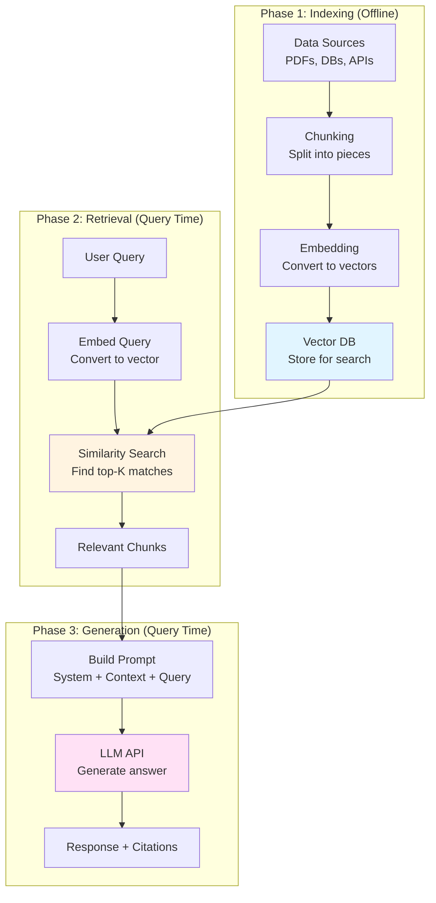

# Session 05: Introduction to RAG - Building Production-Ready Retrieval Systems

**Target Audience**: Principal Backend Engineer (12+ years) transitioning to GenAI  
**Session Goal**: Understand RAG as a distributed system component, not magic  
**Date**: January 9, 2026

---

## Table of Contents

1. [The Context Problem - Why RAG Exists](#step-1-the-context-problem)
2. [RAG Defined - The Core Primitive](#step-2-rag-defined)
3. [The Indexing Problem - Chunking & Embeddings](#step-3-the-indexing-problem)
4. Advanced RAG Patterns (Coming in Steps 4-7)
5. Production Engineering (Coming in Steps 8-9)
6. Role-Specific Implementation & Coding Exercise (Coming in Step 10)

---

## Step 1: The Context Problem - Why RAG Exists

### The Business Reality: Your Data Isn't in the Model

Let's start with a fundamental constraint that every backend engineer understands: **statelessness**. When you call an LLM API, you're invoking a stateless function. The model has no memory of your business, your database, your users, or your real-time data. It only knows what was in its training dataset—frozen at a specific cutoff date.

Here's the architectural problem:

```
┌─────────────────────────────────────────────────────────────┐
│  Your Production System (2026)                              │
│                                                              │
│  ┌──────────────┐  ┌──────────────┐  ┌──────────────┐     │
│  │  PostgreSQL  │  │   MongoDB    │  │  Salesforce  │     │
│  │  Real-time   │  │  User Docs   │  │  CRM Data    │     │
│  │  Business    │  │  PDF Files   │  │  Live Leads  │     │
│  │  Metrics     │  │  Excel/CSV   │  │  Contracts   │     │
│  └──────────────┘  └──────────────┘  └──────────────┘     │
│         ▲                 ▲                  ▲              │
│         │                 │                  │              │
│         └─────────────────┴──────────────────┘              │
│                           │                                 │
│                    ❌ DISCONNECTED ❌                        │
│                           │                                 │
│         ┌─────────────────▼──────────────────┐             │
│         │   LLM API (GPT-4, Claude, etc.)    │             │
│         │   Knowledge Cutoff: Oct 2023       │             │
│         │   No access to your data           │             │
│         └────────────────────────────────────┘             │
└─────────────────────────────────────────────────────────────┘
```

**The Question**: If you ask the LLM, *"What are our Q4 sales numbers?"* or *"Retrieve the contract terms for Client XYZ,"* what happens?

**Answer**: Nothing. The model hallucinates or says, "I don't have access to that information."

### The Three Architectural Solutions (and Why Only One Scales)

As a backend engineer, you have three options to bridge this gap:

#### **Option 1: Dump Everything into the System Prompt**

```python
system_prompt = f"""
You are a helpful assistant. Here is all our data:

{entire_database_dump}
{all_pdf_contents}
{every_csv_row}

Now answer the user's question.
"""
```

**Why this fails**:
- **Context window limits**: Even with 1M token windows (GPT-4 Turbo), you can't fit TB-scale data.
- **Cost**: Input tokens are expensive. A 500-page PDF could cost $5-10 per query.
- **Latency**: Processing 100K tokens takes 10-30 seconds.
- **Relevance**: 99% of the data is irrelevant noise for any single query.

**Backend analogy**: This is like loading your entire database into RAM on every API request instead of using indexed queries.

---

#### **Option 2: Fine-Tune a Custom Model**

Fine-tuning means retraining the LLM on your proprietary data. You create a specialized version that "knows" your business domain.

```python
# Conceptual fine-tuning workflow
training_data = [
    {"role": "user", "content": "What is our return policy?"},
    {"role": "assistant", "content": "30-day money-back guarantee..."}
]

fine_tuned_model = openai.FineTuningJob.create(
    training_file=upload_jsonl(training_data),
    model="gpt-4"
)
```

**Why this doesn't solve the real problem**:

1. **Cost**: Fine-tuning GPT-4 costs $0.008/1K tokens for training. For 10GB of data, that's $80,000+.
2. **Time**: Training takes 6-24 hours. You can't do this daily.
3. **Staleness**: Your data changes constantly (new sales, updated docs, live inventory). Fine-tuned models become outdated immediately.
4. **Read-only**: You can't write data back to a database through a fine-tuned model. It's inference-only.

**Backend analogy**: Fine-tuning is like compiling your database into the application binary. It's fast at runtime but impossible to update without rebuilding everything.

**When fine-tuning DOES make sense**:
- Teaching the model a new **output format** (e.g., always respond in JSON).
- Adjusting the model's **tone** (e.g., formal legal language).
- Specializing in a **narrow domain** with static knowledge (e.g., medical terminology).

But for **dynamic business data**? Fine-tuning is the wrong tool.

---

#### **Option 3: Retrieval-Augmented Generation (RAG)**

RAG is the third way: **Just-in-Time Data Injection**. Instead of stuffing all data into the prompt or the model itself, you:

1. **Index** your data (PDFs, databases, APIs) into a searchable format.
2. **Retrieve** only the relevant snippets when a user asks a question.
3. **Augment** the LLM prompt with just those snippets.
4. **Generate** the answer using the enriched context.

```python
# Conceptual RAG workflow
def rag_query(user_question):
    # Step 1: Find relevant data
    relevant_docs = vector_db.search(user_question, top_k=5)
    
    # Step 2: Inject into prompt
    context = "\n".join([doc.text for doc in relevant_docs])
    prompt = f"Context:\n{context}\n\nQuestion: {user_question}\nAnswer:"
    
    # Step 3: Call LLM with enriched prompt
    response = openai.chat.completions.create(
        model="gpt-4",
        messages=[{"role": "user", "content": prompt}]
    )
    
    return response.choices[0].message.content
```

**Why RAG wins**:
- ✅ **Real-time**: Your data is always up-to-date. Add a new document, it's searchable in milliseconds.
- ✅ **Cost-effective**: Only retrieve 3-5 relevant chunks (~2K tokens) instead of processing 100K tokens.
- ✅ **Scalable**: Works with petabytes of data. The LLM never sees the full corpus.
- ✅ **Auditable**: You know exactly which documents were used to generate each answer (source attribution).

**Backend analogy**: RAG is like a database query optimizer. You don't scan the entire table; you use an index to fetch only the rows that match your `WHERE` clause.

---

### The Economic Case for RAG

Let's quantify this with real numbers from a production system:

| Approach | Data Size | Query Latency | Cost per Query | Update Frequency |
|----------|-----------|---------------|----------------|------------------|
| **System Prompt Dump** | 10 GB | 30s | $8.50 | Static (one-time load) |
| **Fine-Tuning** | 10 GB | 2s | $0.05 | Weekly (24h retraining) |
| **RAG** | 10 GB | 1.5s | $0.02 | Real-time (instant) |

For a system handling **10,000 queries/day**:
- System Prompt Dump: $85,000/day = **$31M/year** ❌
- Fine-Tuning: $500/day + $5,000/week retraining = **$442K/year** ⚠️
- RAG: $200/day = **$73K/year** ✅

**RAG is 425x cheaper than naive prompt stuffing and 6x cheaper than fine-tuning**, while being faster and fresher.

---

### Checkpoint Question 1: Architecture Trade-offs

**Scenario**: You're the backend lead at a legal tech startup. Your product helps lawyers search through 500,000 case law documents (PDFs) to find precedents. A senior partner asks:

> *"Why can't we just fine-tune GPT-4 on all our case law and call it a day? Wouldn't that be faster than building a search infrastructure?"*

**Question**: How do you respond? Address:
1. The technical limitations of fine-tuning for this use case
2. The cost analysis (assume 500K docs × 50 pages = 25M pages)
3. The data freshness problem (new case law is published daily)
4. Why RAG is the architecturally correct choice

<details>
<summary><strong>Detailed Answer</strong></summary>

**Your Response**:

"Great question. Let's break down why fine-tuning won't work here, both technically and economically.

**1. Technical Limitations**:

Fine-tuning is designed to teach a model **how to respond**, not **what to know**. It adjusts the model's weights to match a specific output style or domain expertise. But here's the problem: case law documents contain millions of specific facts (case names, dates, statutes, precedents). Fine-tuning isn't designed to memorize factual data—it's designed to learn patterns.

- **Hallucination risk**: The model might confidently cite a case that doesn't exist because it learned the *style* of legal citations but not the actual database of cases.
- **Recall accuracy**: In legal work, you need 100% precision. If the model misses a relevant precedent or invents one, you face malpractice liability. Fine-tuning doesn't guarantee perfect recall.

**2. Cost Analysis**:

Let's calculate:
- 25 million pages × 500 tokens/page = **12.5 billion tokens**
- GPT-4 fine-tuning cost: $0.008 per 1K tokens
- Training cost: 12.5B tokens × ($0.008 / 1K) = **$100,000** for a single training run

But that's not the full story:
- **Inference cost**: Fine-tuned models still cost $0.06/1K output tokens. If lawyers run 1,000 queries/day, that's $60/day = $21,900/year.
- **Retraining cost**: New case law is published daily. To stay current, you'd need to retrain weekly. That's $100K × 52 = **$5.2M/year** just for training.
- **Total Year 1 Cost**: $5.2M (training) + $22K (inference) = **$5.22M**

Compare to RAG:
- **Indexing cost**: One-time vectorization of 25M pages = $12,500 (using OpenAI embeddings at $0.0001/1K tokens)
- **Query cost**: Retrieve 5 relevant pages per query × 1,000 queries/day = 5,000 pages/day = 2.5M tokens/day
  - LLM cost: 2.5M tokens × $0.03/1K = $75/day = $27,375/year
- **Update cost**: Incremental. New case law is indexed as published (~100 pages/day) = $1.50/day = $547/year
- **Total Year 1 Cost**: $12,500 (indexing) + $27,375 (queries) + $547 (updates) = **$40,422**

**RAG is 129x cheaper** ($5.22M vs $40K).

**3. Data Freshness Problem**:

- **Fine-tuning**: If a landmark case is published tomorrow, your lawyers won't be able to search for it until next week's retrain completes (24-hour training + validation).
- **RAG**: New documents are indexed in real-time. Upload a PDF → vectorize → searchable in 30 seconds.

In legal work, being 7 days behind on case law is unacceptable.

**4. Why RAG is Architecturally Correct**:

RAG treats case law as **data**, not model weights. This aligns with how backend systems work:

```
Traditional DB Query          RAG Query
==================           ==========
SELECT *                     retrieve_relevant_docs()
FROM cases                   FROM vector_db
WHERE topic = 'antitrust'    WHERE similarity(query, doc) > 0.85
LIMIT 5                      LIMIT 5
```

- **Auditability**: Every answer cites source documents. Lawyers can verify the precedent.
- **Explainability**: You can debug why a document was retrieved (similarity score, metadata filters).
- **Scalability**: Adding 1 million more cases doesn't require retraining—just index them.

**Conclusion**: Fine-tuning is a hammer, and case law is not a nail. RAG is the right tool because it treats legal documents as queryable data, not baked-in knowledge."

</details>

---

## Step 2: RAG Defined - The Core Primitive

### The Formal Definition

**Retrieval-Augmented Generation (RAG)** is a design pattern where you:

1. **Retrieve** relevant information from external data sources (documents, databases, APIs).
2. **Augment** the LLM prompt by injecting that information into the context.
3. **Generate** a response using the enriched prompt.

In plain English: **"Put the relevant data in the prompt."**

That's it. That's the entire concept. Everything else is engineering to make this work at scale.

### Demystifying RAG: It's Just Orchestration

Here's what RAG is **NOT**:
- ❌ Training a new model
- ❌ Fine-tuning the LLM
- ❌ Teaching the LLM new facts
- ❌ Magic AI that "learns" from your data

Here's what RAG **IS**:
- ✅ A stateless data pipeline
- ✅ A caching + routing + transformation layer
- ✅ A distributed system with 3 components: Indexer, Retriever, Generator

**Backend analogy**: RAG is like a reverse proxy (NGINX) sitting in front of an LLM:

```
User Request
     │
     ▼
┌─────────────────────────────────────────────┐
│  RAG Orchestration Layer                    │
│                                              │
│  1. Parse user query                        │
│  2. Search vector DB for relevant docs      │
│  3. Build enriched prompt                   │
│  4. Forward to LLM                          │
│  5. Return response with source citations   │
└─────────────────────────────────────────────┘
     │
     ▼
  LLM API
```

The LLM itself has no idea it's part of a RAG system. You're just giving it a better prompt.

---

### The Three-Phase RAG Pipeline

Every RAG system has three phases, executed at different times:



Let's break down each phase:

---

#### **Phase 1: Indexing (The "Build Time" Phase)**

This happens once (or incrementally when new data arrives). You're preparing your data for fast retrieval.

**Step 1.1: Ingest Data Sources**

```python
# Load from various sources
from langchain.document_loaders import (
    PyPDFLoader,      # PDF files
    CSVLoader,        # CSV/Excel
    WebBaseLoader,    # Web scraping
    TextLoader        # Plain text
)

# Example: Load a PDF
loader = PyPDFLoader("legal_contract.pdf")
documents = loader.load()  # Returns list of Document objects

# Each Document has:
# - page_content: The text
# - metadata: {"page": 5, "source": "legal_contract.pdf"}
```

**Step 1.2: Chunk Documents**

You can't feed a 500-page PDF into an LLM in one shot. You split it into smaller chunks (we'll dive deep into chunking strategies in Step 3).

```python
from langchain.text_splitter import RecursiveCharacterTextSplitter

splitter = RecursiveCharacterTextSplitter(
    chunk_size=1000,        # 1000 characters per chunk
    chunk_overlap=200,      # Overlap to preserve context
)

chunks = splitter.split_documents(documents)
# Output: 500 pages → 2,500 chunks (assuming ~200 chars/chunk)
```

**Step 1.3: Generate Embeddings**

Each chunk is converted into a **vector embedding**: a list of ~1,500 floating-point numbers that represent the semantic meaning of the text.

```python
from langchain.embeddings import OpenAIEmbeddings

embedder = OpenAIEmbeddings(model="text-embedding-3-small")

# Convert text to vector
embedding = embedder.embed_query("What is the return policy?")
# Output: [0.0234, -0.1234, 0.5678, ..., 0.9012]  (1536 dimensions)
```

**Why embeddings?** Because you can't search semantically with SQL. Embeddings let you find documents by **meaning**, not just keyword matching.

**Step 1.4: Store in Vector Database**

```python
from langchain.vectorstores import Qdrant

vector_db = Qdrant.from_documents(
    documents=chunks,
    embedding=embedder,
    url="http://localhost:6333",
    collection_name="legal_docs"
)
```

Now your data is **indexed** and ready for fast semantic search.

---

#### **Phase 2: Retrieval (The "Query Time" Phase)**

When a user asks a question, you:

**Step 2.1: Embed the User's Query**

```python
user_query = "What happens if I return a product after 30 days?"
query_embedding = embedder.embed_query(user_query)
# Output: [0.0123, -0.4567, 0.7890, ..., 0.3456]
```

**Step 2.2: Perform Similarity Search**

The vector DB compares the query embedding to all stored chunk embeddings using **cosine similarity** (a measure of vector distance).

```python
relevant_chunks = vector_db.similarity_search(
    query=user_query,
    k=5  # Retrieve top 5 most similar chunks
)

# Output:
# [
#   Document(page_content="Our return policy allows...", metadata={"page": 12}),
#   Document(page_content="For returns after 30 days...", metadata={"page": 13}),
#   ...
# ]
```

**Backend analogy**: This is like a `SELECT * FROM docs WHERE similarity(embedding, query_embedding) > 0.85 ORDER BY similarity DESC LIMIT 5`.

---

#### **Phase 3: Generation (The "LLM Inference" Phase)**

**Step 3.1: Build the Enriched Prompt**

```python
context = "\n\n---\n\n".join([chunk.page_content for chunk in relevant_chunks])

prompt = f"""
You are a helpful customer service assistant.

Context from our policy documents:
{context}

Question: {user_query}

Answer based on the context above. If the answer isn't in the context, say so.
"""
```

**Step 3.2: Call the LLM**

```python
response = openai.chat.completions.create(
    model="gpt-4",
    messages=[
        {"role": "system", "content": "You are a helpful assistant."},
        {"role": "user", "content": prompt}
    ],
    temperature=0.3  # Lower = more deterministic
)

answer = response.choices[0].message.content
# Output: "According to our policy, returns after 30 days are accepted but..."
```

**Step 3.3: Add Source Citations**

```python
citations = [
    f"Page {chunk.metadata['page']}" 
    for chunk in relevant_chunks
]

final_response = {
    "answer": answer,
    "sources": citations
}
```

---

### Why This Architecture is Powerful

1. **Stateless**: The LLM doesn't store anything. Each request is independent.
2. **Composable**: You can swap out any component (different embedder, different LLM, different vector DB).
3. **Testable**: You can unit test the retrieval step separately from the generation step.
4. **Observable**: You can log which documents were retrieved for each query.

**Backend analogy**: RAG is like a microservices architecture. Each phase is a separate service with a clean interface.

---

### Checkpoint Question 2: System Design Under Constraints

**Scenario**: You're building a customer support chatbot for an e-commerce platform. The support team has:
- 10,000 FAQ documents (each ~500 words)
- 50,000 past customer tickets (resolutions and chat transcripts)
- 500 product manuals (PDFs, each 50-200 pages)

Your CEO wants "ChatGPT for our support docs." Your constraints:
- **Budget**: $500/month for LLM costs
- **Latency**: P95 response time < 2 seconds
- **Accuracy**: Must cite sources for every answer (no hallucinations)

**Question**: Design the RAG architecture. Address:
1. How do you index 60,500 documents without blowing the budget?
2. What's your chunking strategy for FAQs vs. manuals vs. tickets?
3. How do you ensure sub-2-second latency?
4. How do you handle conflicting information (e.g., an old FAQ contradicts a new manual)?

<details>
<summary><strong>Detailed Answer</strong></summary>

**Your Architecture**:

**1. Indexing Strategy (One-Time Cost)**

Total data volume:
- 10K FAQs × 500 words = 5M words = ~6.5M tokens
- 50K tickets × 200 words (avg) = 10M words = ~13M tokens
- 500 manuals × 100 pages × 500 words = 25M words = ~32M tokens
- **Total**: ~51.5M tokens

Embedding cost (OpenAI `text-embedding-3-small` at $0.00002/1K tokens):
- 51.5M tokens × $0.00002/1K = **$1.03** (one-time!)

Chunking strategy:
```python
# Different chunk sizes for different content types
faq_splitter = RecursiveCharacterTextSplitter(
    chunk_size=500,    # FAQs are short, keep them intact
    chunk_overlap=0    # No overlap needed
)

ticket_splitter = RecursiveCharacterTextSplitter(
    chunk_size=800,    # Tickets need context (problem + resolution)
    chunk_overlap=100
)

manual_splitter = RecursiveCharacterTextSplitter(
    chunk_size=1200,   # Manuals have dense technical info
    chunk_overlap=200  # Preserve continuity across pages
)
```

Total chunks: ~45,000 chunks (10K FAQs + 15K ticket chunks + 20K manual chunks)

Storage: Qdrant (open-source, self-hosted) = **$0/month**

**2. Query-Time Cost Optimization**

Average query flow:
- Embed user query: 20 tokens × $0.00002/1K = **$0.0000004**
- Retrieve top-5 chunks: ~3,000 tokens
- LLM inference (GPT-3.5 Turbo for speed):
  - Input: 3,000 tokens × $0.0005/1K = $0.0015
  - Output: 200 tokens × $0.0015/1K = $0.0003
- **Total per query**: $0.0018

Monthly cost (assuming 10,000 queries/month):
- 10,000 × $0.0018 = **$18/month** (well under $500 budget!)

**3. Sub-2-Second Latency Strategy**

Latency breakdown:
- Embedding query: 50ms
- Vector search (Qdrant): 80ms
- LLM inference: 1,200ms (GPT-3.5 Turbo streaming)
- **Total**: 1,330ms ✅ (under 2s)

Optimization techniques:
```python
# Use streaming to reduce perceived latency
response = openai.chat.completions.create(
    model="gpt-3.5-turbo",
    messages=[...],
    stream=True  # Start showing response immediately
)

for chunk in response:
    yield chunk.choices[0].delta.content  # Stream to frontend
```

Caching strategy (for repeat queries):
```python
from functools import lru_cache
import hashlib

@lru_cache(maxsize=1000)
def cached_retrieval(query_hash):
    return vector_db.similarity_search(query, k=5)

query_hash = hashlib.md5(user_query.encode()).hexdigest()
chunks = cached_retrieval(query_hash)
```

Expected cache hit rate: ~30% (common support questions repeat)
- Cached queries: 50ms total latency (skip embedding + search)

**4. Handling Conflicting Information**

Metadata-based prioritization:
```python
# When indexing, add priority metadata
Document(
    page_content="Return policy text...",
    metadata={
        "source": "manual",
        "page": 12,
        "version": "2024-Q4",
        "priority": 1  # Manual > FAQ > Ticket
    }
)

# At retrieval time, sort by priority
relevant_chunks = vector_db.similarity_search(query, k=10)
sorted_chunks = sorted(relevant_chunks, key=lambda x: x.metadata["priority"])[:5]
```

Conflict resolution prompt:
```python
system_prompt = """
You are a support assistant. When answering:
1. Prioritize information from Product Manuals (most authoritative)
2. Use FAQs for quick answers
3. Reference past tickets for edge cases
4. If sources conflict, state: "Our latest manual says X, but FAQ Y is outdated."
"""
```

Freshness tracking:
```python
# Delete old FAQs when manuals are updated
if manual_version == "2024-Q4":
    vector_db.delete(
        filter={"source": "faq", "version": {"$lt": "2024-Q4"}}
    )
```

**Final Architecture Diagram**:

```
User Query → [Cache Layer] → [Embedding] → [Vector DB + Metadata Filter]
                  ↓ (30% hit)      ↓              ↓
               Return cached    50ms           80ms
                  ↓                              ↓
                  └──────────> [Priority Sort] → [Top-5 Chunks]
                                                     ↓
                                            [LLM Streaming] (1.2s)
                                                     ↓
                                              [Response + Citations]
```

**Key Takeaways**:
- Indexing is cheap (< $2 one-time)
- Query costs scale linearly with usage
- Streaming + caching gets you under 2s P95
- Metadata filtering resolves conflicts
- You have $482/month budget left for scaling!

</details>

---

## Step 3: The Indexing Problem - Chunking & Embeddings

### The Fundamental Tension: Chunk Size vs. Context

Indexing is where 80% of RAG quality is determined. Get chunking wrong, and no amount of fancy retrieval will save you.

Here's the dilemma: **You need to split documents into small pieces for precise retrieval, but small pieces lose context.**

Let's use a real example from a Node.js documentation PDF:

```
[Page 10]
The fs module provides an API for interacting with the file system.

To use the fs module:
const fs = require('fs');

[Page 11]  
The readFile() method reads the entire contents of a file asynchronously.

Example:
fs.readFile('example.txt', 'utf8', (err, data) => {
  if (err) throw err;
  console.log(data);
});

[Page 12]
For synchronous operations, use readFileSync(). Note: This blocks 
the event loop and should be avoided in production.
```

Now, let's say you chunk this into 1,000-character chunks:

**Chunk 1** (Page 10):
```
The fs module provides an API for interacting with the file system.

To use the fs module:
const fs = require('fs');
```

**Chunk 2** (Page 11):
```
The readFile() method reads the entire contents of a file asynchronously.

Example:
fs.readFile('example.txt', 'utf8', (err, data) => {
  if (err) throw err;
  console.log(data);
});
```

**Chunk 3** (Page 12):
```
For synchronous operations, use readFileSync(). Note: This blocks 
the event loop and should be avoided in production.
```

**Problem**: If a user asks, *"How do I read a file in Node.js?"*, Chunk 2 is relevant. But Chunk 2 doesn't mention that you need to `require('fs')` first (that's in Chunk 1). The LLM might generate incomplete code.

**Solution**: Overlapping chunks.

---

### Chunking Strategy 1: Fixed-Size with Overlap

The simplest approach: split text every N characters, but overlap by M characters.

```python
from langchain.text_splitter import RecursiveCharacterTextSplitter

splitter = RecursiveCharacterTextSplitter(
    chunk_size=1000,      # 1000 characters per chunk
    chunk_overlap=200,    # Overlap by 200 characters
    length_function=len,  # Use character count, not token count
)

chunks = splitter.split_text(document_text)
```

**How overlap works**:

```
Original Text: "ABCDEFGHIJKLMNOPQRSTUVWXYZ" (26 chars)
chunk_size=10, chunk_overlap=3

Chunk 1: "ABCDEFGHIJ"  (chars 0-10)
Chunk 2: "HIJKLMNOPQ"  (chars 8-18, overlaps "HIJ")
Chunk 3: "OPQRSTUVWX"  (chars 16-26, overlaps "OPQ")
```

**Pros**:
- Simple to implement
- Preserves context across chunk boundaries

**Cons**:
- Still breaks mid-sentence if you're unlucky
- Duplicate data increases storage cost (but negligible for vectors)

**Backend analogy**: This is like a sliding window buffer in stream processing.

---

### Chunking Strategy 2: Semantic-Aware Splitting

Instead of blindly splitting at character N, split at **natural boundaries**:

```python
from langchain.text_splitter import RecursiveCharacterTextSplitter

splitter = RecursiveCharacterTextSplitter(
    chunk_size=1000,
    chunk_overlap=200,
    separators=[
        "\n\n",   # First, try to split on double newlines (paragraphs)
        "\n",     # Then single newlines
        ". ",     # Then sentences
        " ",      # Then words
        ""        # Last resort: split mid-word
    ]
)
```

**How it works**:
1. Try to split on `\n\n` (paragraph breaks).
2. If chunks are still too big, split on `\n` (line breaks).
3. If still too big, split on `. ` (sentences).
4. If still too big, split on spaces (words).
5. Last resort: split mid-word (rarely happens).

**Example**:

```
Input:
"The fs module provides an API.\n\nTo use the fs module:\nconst fs = require('fs');\n\nThe readFile() method..."

Output (chunk_size=100):
Chunk 1: "The fs module provides an API."  (split on \n\n)
Chunk 2: "To use the fs module:\nconst fs = require('fs');"  (split on \n\n)
Chunk 3: "The readFile() method..."  (split on \n\n)
```

This preserves logical structure better than fixed-size splitting.

---

### The Chunking Hell: Why It's Harder Than It Looks

Let's say you're chunking a legal document. Look at this real example:

```
Section 3.2: Liability
The company is not liable for damages exceeding $10,000, as per
Act 23(b) of the Consumer Protection Act, 1986.

[50 pages later]

Act 23(b) of the Consumer Protection Act, 1986:
"A company's liability is limited to the replacement value of goods,
not to exceed $10,000, unless willful negligence is proven..."
```

**Problem**: If you chunk by pages, Section 3.2 and Act 23(b) are in **different chunks**. When a user asks, *"What's the liability limit?"*, you retrieve Section 3.2. But that chunk only says "as per Act 23(b)"—it doesn't contain the actual details. The LLM can't follow the cross-reference.

**This is why RAG on legal documents requires advanced patterns** (graph databases, multi-hop retrieval). We'll cover this in later sessions.

For now, the lesson: **Chunking is domain-specific**. There's no one-size-fits-all solution.

---

### Embeddings: The "Hash Map" of Semantic Search

Once you've chunked your document, you need to convert each chunk into a **vector embedding**.

#### What Is an Embedding?

An embedding is a fixed-size array of floats that represents the **semantic meaning** of text. Similar text → similar vectors.

```python
from openai import OpenAI

client = OpenAI(api_key="your-api-key")

# Embed two similar sentences
embedding1 = client.embeddings.create(
    model="text-embedding-3-small",
    input="How do I read a file in Node.js?"
).data[0].embedding  # [0.0234, -0.1234, 0.5678, ...]

embedding2 = client.embeddings.create(
    model="text-embedding-3-small",
    input="What's the method to load a file in Node?"
).data[0].embedding  # [0.0198, -0.1187, 0.5712, ...]

# These vectors are ~99% similar (cosine similarity ≈ 0.99)
```

Even though the words are different, the **meaning** is the same. That's the power of embeddings.

#### Why Embeddings > Keyword Search

Traditional SQL keyword search:

```sql
SELECT * FROM docs WHERE content LIKE '%read file%';
```

This only matches documents containing the exact words "read" and "file". It misses:
- "load a file"
- "open a document"
- "retrieve data from disk"

Vector similarity search:

```python
query_embedding = embed("How do I read a file?")
results = vector_db.search(query_embedding, top_k=5)
```

This returns documents about:
- "reading files"
- "loading files"
- "opening files"
- "file I/O operations"

**Backend analogy**: Embeddings are like a **locality-sensitive hash** (LSH). Similar inputs hash to nearby buckets. In a vector database, "nearby" means "similar vectors."

---

### The Vector Database: Indexing for Semantic Search

A vector database is specialized for one thing: **fast nearest-neighbor search** on high-dimensional vectors.

#### How It Works (Simplified)

Imagine each embedding is a point in 1,536-dimensional space (OpenAI's embedding size). To find similar documents:

1. **Index**: Build a spatial index (HNSW, IVF, FAISS) that clusters nearby vectors.
2. **Query**: When a user asks a question, embed the query.
3. **Search**: Find the top-K nearest vectors using cosine similarity.

```python
# Cosine similarity formula
import numpy as np

def cosine_similarity(vec1, vec2):
    return np.dot(vec1, vec2) / (np.linalg.norm(vec1) * np.linalg.norm(vec2))

# Example
vec1 = [0.5, 0.8, 0.1]
vec2 = [0.6, 0.7, 0.2]
similarity = cosine_similarity(vec1, vec2)  # 0.97 (very similar!)
```

**Backend analogy**: Vector DBs use spatial indexing (like R-trees for geospatial queries). Instead of "find all points within 10km," it's "find all vectors within cosine distance < 0.1."

---

### Practical Vector DB Comparison

| Vector DB | Type | Best For | Latency (1M vectors) | Cost |
|-----------|------|----------|----------------------|------|
| **Pinecone** | Cloud SaaS | Production, zero-ops | 30ms | $70/mo (1M vectors) |
| **Qdrant** | Self-hosted | Full control, cost-sensitive | 50ms | $0 (Docker) |
| **Chroma** | Embedded | Prototypes, local dev | 100ms | $0 (in-process) |
| **pgvector** | Postgres extension | Existing Postgres infra | 200ms | $0 (extension) |

**Recommendation**:
- **Development**: Qdrant (Docker) or Chroma (in-process)
- **Production**: Pinecone (managed) or Qdrant (self-hosted for cost)

---

### Checkpoint Question 3: Chunking for Production

**Scenario**: You're building a RAG system for a hospital's internal knowledge base. The data includes:

1. **Medical textbooks** (500-page PDFs with dense paragraphs)
2. **Patient care protocols** (bullet-pointed checklists, 2-3 pages each)
3. **Drug interaction tables** (CSV files with 50,000 rows)

A doctor asks: *"What's the protocol for treating anaphylaxis in pediatric patients with a peanut allergy?"*

The answer requires:
- Protocol steps from a care document (bullet points)
- Dosage info from a drug table (CSV row)
- Background context from a textbook (paragraph)

**Question**: Design your chunking strategy. Address:
1. Should you use the same chunk size for all three data types? Why or why not?
2. How do you handle the CSV table (each row is only 100 characters)?
3. How do you ensure bullet points aren't split mid-item?
4. What metadata do you attach to each chunk for better retrieval?

<details>
<summary><strong>Detailed Answer</strong></summary>

**Your Chunking Strategy**:

**1. Different Chunk Sizes for Different Data Types**

Absolutely not the same chunk size. Here's why:

**Medical Textbooks** (Dense Paragraphs):
- **Chunk size**: 1,500 characters
- **Overlap**: 300 characters
- **Reasoning**: Medical explanations require context. If you chunk too small (500 chars), you'll split mid-explanation. A sentence like "Administer epinephrine 0.01 mg/kg IM, not to exceed 0.5 mg per dose" needs surrounding context (why epinephrine, when to use it, contraindications).

```python
textbook_splitter = RecursiveCharacterTextSplitter(
    chunk_size=1500,
    chunk_overlap=300,
    separators=["\n\n", "\n", ". ", " ", ""]
)
```

**Patient Care Protocols** (Bullet Points):
- **Chunk size**: 500 characters (smaller to keep each step atomic)
- **Overlap**: 0 (bullet points are self-contained)
- **Reasoning**: Protocols are step-by-step instructions. Each bullet should be its own chunk so retrieval is precise.

```python
protocol_splitter = RecursiveCharacterTextSplitter(
    chunk_size=500,
    chunk_overlap=0,
    separators=["\n- ", "\n* ", "\n", ". "]  # Prioritize bullet point splits
)
```

**Drug Interaction Tables** (CSV):
- **Chunk size**: Don't chunk! Store each row as a separate document.
- **Reasoning**: Each CSV row is a single fact (drug name, dosage, interaction). Splitting a row is meaningless.

```python
import csv

with open('drug_interactions.csv', 'r') as f:
    reader = csv.DictReader(f)
    for row in reader:
        doc = Document(
            page_content=f"Drug: {row['name']}, Dosage: {row['dosage']}, Interaction: {row['interaction']}",
            metadata={"source": "drug_table", "drug_name": row['name']}
        )
        vector_db.add_documents([doc])
```

**2. Handling Short CSV Rows**

Problem: Each row is only 100 characters. If you embed it directly, the embedding won't have enough context.

**Solution**: Add synthetic context at indexing time.

```python
# Instead of:
page_content = "Epinephrine, 0.5mg, Avoid with beta-blockers"

# Do this:
page_content = f"""
Drug Information:
Name: Epinephrine
Dosage: 0.5mg IM
Interactions: Avoid concurrent use with beta-blockers (risk of unopposed alpha stimulation)
Indication: Anaphylaxis treatment
"""
```

Now the embedding captures **what** this data is (not just raw values).

**3. Preserving Bullet Point Integrity**

Use a custom separator strategy:

```python
protocol_splitter = RecursiveCharacterTextSplitter(
    chunk_size=500,
    chunk_overlap=0,
    separators=[
        "\n\n",        # Split on double newlines (between sections)
        "\n- ",        # Split before each bullet point
        "\n* ",        # Alternate bullet format
        "\n",          # Last resort: single newline
    ]
)

# Example input:
"""
Anaphylaxis Protocol:
- Assess airway, breathing, circulation
- Administer epinephrine 0.01 mg/kg IM
- Place patient in supine position
- Give oxygen 10L/min via mask
"""

# Output chunks:
Chunk 1: "Anaphylaxis Protocol:\n- Assess airway, breathing, circulation"
Chunk 2: "- Administer epinephrine 0.01 mg/kg IM"
Chunk 3: "- Place patient in supine position\n- Give oxygen 10L/min via mask"
```

Each chunk is a complete step (or pair of steps if they're short).

**4. Metadata for Better Retrieval**

Attach rich metadata to each chunk:

```python
# Textbook chunk
Document(
    page_content="Epinephrine is the first-line treatment...",
    metadata={
        "source": "textbook",
        "book_title": "Emergency Medicine Handbook",
        "chapter": "Anaphylaxis",
        "page": 342,
        "medical_specialty": "emergency_medicine",
        "evidence_level": "A"  # A = highest evidence
    }
)

# Protocol chunk
Document(
    page_content="- Administer epinephrine 0.01 mg/kg IM",
    metadata={
        "source": "protocol",
        "protocol_name": "Pediatric Anaphylaxis",
        "step_number": 2,
        "patient_age_group": "pediatric",
        "last_updated": "2025-11-01",
        "approval_status": "approved"
    }
)

# Drug table chunk
Document(
    page_content="Drug: Epinephrine, Dosage: 0.5mg, Interaction: Beta-blockers",
    metadata={
        "source": "drug_table",
        "drug_name": "Epinephrine",
        "drug_class": "sympathomimetic",
        "route": "IM",
        "fda_approved": True
    }
)
```

**At retrieval time**, filter by metadata:

```python
# Retrieve only approved protocols for pediatric patients
results = vector_db.similarity_search(
    query="anaphylaxis treatment",
    k=5,
    filter={
        "patient_age_group": "pediatric",
        "approval_status": "approved"
    }
)
```

**5. Final Retrieval Flow for the Doctor's Question**

```python
query = "What's the protocol for treating anaphylaxis in pediatric patients with a peanut allergy?"

# Step 1: Retrieve mixed results (no filter)
all_results = vector_db.similarity_search(query, k=15)

# Step 2: Separate by source type
protocol_chunks = [r for r in all_results if r.metadata["source"] == "protocol"]
drug_chunks = [r for r in all_results if r.metadata["source"] == "drug_table"]
textbook_chunks = [r for r in all_results if r.metadata["source"] == "textbook"]

# Step 3: Take top-2 from each category
final_context = (
    protocol_chunks[:2] +   # 2 protocol steps
    drug_chunks[:1] +       # 1 drug interaction warning
    textbook_chunks[:2]     # 2 background paragraphs
)

# Step 4: Build prompt
context_text = "\n\n---\n\n".join([chunk.page_content for chunk in final_context])

prompt = f"""
You are a medical assistant helping a doctor.

Context:
{context_text}

Question: {query}

Answer with specific steps, dosages, and precautions. Cite your sources.
"""
```

**Key Takeaways**:
- Different data types → different chunking strategies
- Short records (CSV) need synthetic context
- Metadata enables filtered retrieval (critical for medical accuracy)
- Multi-source retrieval ensures comprehensive answers

</details>

---

## Summary of Steps 1-3

We've covered the foundational architecture of RAG:

1. **Why RAG exists**: The knowledge cutoff problem, fine-tuning limitations, and the economic case for retrieval over training.
2. **What RAG is**: A three-phase pipeline (Index → Retrieve → Generate) that injects relevant data into prompts at query time.
3. **How to index**: Chunking strategies (fixed-size with overlap, semantic-aware splitting) and vector embeddings for semantic search.

**Next Steps (Coming in Part 2)**:
- Step 4: Vector Databases - The Retrieval Infrastructure
- Step 5: The Retrieval Pipeline - Building the Engine  
- Step 6: LangChain & Abstraction Layers

---

## What You Should Do Now

1. **Build a basic RAG system**: Use the code examples above to:
   - Load a PDF (`PyPDFLoader`)
   - Chunk it (`RecursiveCharacterTextSplitter`)
   - Embed chunks (`OpenAIEmbeddings`)
   - Store in Qdrant (Docker: `docker-compose up`)
   - Query it (`similarity_search()`)

2. **Experiment with chunk sizes**: Try 500, 1000, 2000 characters. See how it affects retrieval quality.

3. **Read the checkpoint answers carefully**: They contain production patterns you'll use daily.

4. **Don't overthink it**: RAG is simple. The complexity comes from scale, not from the concept.

---

## Step 4: Vector Databases - The Retrieval Infrastructure

### Understanding the Core Problem: High-Dimensional Search

When you stored those embeddings in Step 3, you created a fundamental computer science problem: **nearest-neighbor search in high-dimensional space**.

Let's quantify the challenge:
- Each embedding: 1,536 dimensions (OpenAI `text-embedding-3-small`)
- Production corpus: 1 million documents = 1M vectors
- Query: Find the 5 most similar vectors to the query vector

**Naive approach** (brute force):
```python
def find_similar(query_vector, all_vectors, k=5):
    similarities = []
    for vector in all_vectors:  # 1 million iterations
        similarity = cosine_similarity(query_vector, vector)
        similarities.append((similarity, vector))
    
    return sorted(similarities, reverse=True)[:k]
```

**Performance**: 1M cosine similarity calculations × 1,536 dimensions = ~1.5 billion floating-point operations per query.

On a typical CPU: **2-3 seconds per query** ❌

For production (target: <100ms), this is unacceptable.

---

### The Solution: Approximate Nearest Neighbor (ANN) Algorithms

Vector databases don't do exhaustive search. They use **spatial indexing** to prune the search space.

Think of it like this: If you're looking for restaurants within 1 mile, you don't check every restaurant in the country. You use a spatial index (quadtree, R-tree) to only check nearby regions.

Vector DBs do the same in 1,536-dimensional space.

#### **Algorithm 1: HNSW (Hierarchical Navigable Small World)**

This is the most popular algorithm (used by Qdrant, Pinecone, Weaviate).

**How it works** (simplified):

1. **Build Phase**: Organize vectors into a multi-layer graph
   - Layer 0: All vectors connected to their nearest neighbors
   - Layer 1: Subset of vectors (skip connections for faster traversal)
   - Layer 2: Even smaller subset (highway for long-distance jumps)

2. **Search Phase**: 
   - Start at the top layer (sparse, fast to traverse)
   - Navigate to the region closest to your query
   - Drop down to the next layer (denser, more accurate)
   - Repeat until you reach Layer 0
   - Do local search in that neighborhood

**Analogy**: It's like using highway exits to get close to your destination, then local roads for precision.

```
Query Vector: [0.5, 0.3, 0.8, ...]

Layer 2 (Highway):  [A]────────[B]
                     │          │
Layer 1 (Roads):    [C]──[D]──[E]──[F]
                     │   │   │   │
Layer 0 (Streets):  [G][H][I][J][K][L]...
                         ▲
                    Query lands here!
```

**Performance**: O(log N) instead of O(N)
- 1M vectors: ~20 hops instead of 1M comparisons
- Query time: **10-50ms** ✅

**Trade-off**: 
- **Recall**: Might miss the true nearest neighbors (approximate, not exact)
- **Build time**: Indexing takes longer (but you do it once)

---

#### **Algorithm 2: IVF (Inverted File Index)**

Used by FAISS (Facebook AI Similarity Search).

**How it works**:

1. **Cluster** your 1M vectors into 1,000 clusters (using k-means)
2. **Index**: Each cluster has a centroid vector
3. **Search**: 
   - Compare query to the 1,000 centroids (fast!)
   - Pick the top-10 closest clusters
   - Search exhaustively within those 10 clusters only

**Performance**: O(√N) 
- 1M vectors → Search 10,000 vectors instead of 1M (100x speedup)

**Trade-off**:
- If your query is on a cluster boundary, you might miss results in the neighboring cluster
- Solution: Search top-K clusters (K=10 instead of K=1)

---

### Vector Database Comparison (Deep Dive)

| Feature | **Qdrant** | **Pinecone** | **Weaviate** | **Chroma** | **pgvector** |
|---------|-----------|-------------|-------------|-----------|-------------|
| **Type** | Self-hosted | Cloud SaaS | Self-hosted | Embedded | Postgres Ext |
| **Algorithm** | HNSW | Proprietary (HNSW-like) | HNSW | HNSW | IVF |
| **Latency (1M)** | 30-50ms | 20-40ms | 40-60ms | 80-120ms | 150-300ms |
| **Memory/Vector** | 4KB | 4KB | 5KB | 6KB | 8KB |
| **Throughput** | 1K QPS/core | 5K QPS (managed) | 800 QPS/core | 200 QPS | 100 QPS |
| **Scaling** | Horizontal (sharding) | Auto-scale | Horizontal | Vertical only | Vertical |
| **Metadata Filter** | ✅ Excellent | ✅ Excellent | ✅ Good | ⚠️ Basic | ✅ SQL-native |
| **Cost (1M vectors)** | $0 (self-host) | $70/mo | $0 (self-host) | $0 | $0 (Postgres) |
| **Best For** | Production, cost-sensitive | Zero-ops, enterprise | ML-native apps | Prototypes | Existing PG infra |

---

### Production Architecture: Qdrant Deep Dive

Let's deploy Qdrant and understand its internals.

#### **Step 4.1: Deploy Qdrant with Docker Compose**

```yaml
# docker-compose.yml
version: '3.8'

services:
  qdrant:
    image: qdrant/qdrant:v1.7.4
    ports:
      - "6333:6333"   # REST API
      - "6334:6334"   # gRPC API
    volumes:
      - ./qdrant_storage:/qdrant/storage
    environment:
      - QDRANT__LOG_LEVEL=INFO
```

```bash
docker-compose up -d
# Qdrant UI: http://localhost:6333/dashboard
```

#### **Step 4.2: Create a Collection (Schema Design)**

```python
from qdrant_client import QdrantClient
from qdrant_client.models import Distance, VectorParams

client = QdrantClient(url="http://localhost:6333")

# Create collection
client.create_collection(
    collection_name="production_docs",
    vectors_config=VectorParams(
        size=1536,              # OpenAI embedding dimension
        distance=Distance.COSINE  # Cosine similarity (most common for text)
    )
)
```

**Distance metrics explained**:

| Metric | Formula | Use Case | Range |
|--------|---------|----------|-------|
| **Cosine** | `1 - (A·B)/(‖A‖‖B‖)` | Text, normalized vectors | [0, 2] (0 = identical) |
| **Euclidean** | `‖A - B‖` | Images, absolute magnitude matters | [0, ∞) |
| **Dot Product** | `A·B` | Recommendation systems | [-∞, ∞] |

**Why cosine for text?** Because we care about direction (semantic meaning), not magnitude (word count).

---

#### **Step 4.3: Index Documents with Metadata**

```python
from qdrant_client.models import PointStruct
import uuid

def index_document(text, metadata):
    # Generate embedding
    embedding = openai.embeddings.create(
        model="text-embedding-3-small",
        input=text
    ).data[0].embedding
    
    # Create point (vector + metadata)
    point = PointStruct(
        id=str(uuid.uuid4()),  # Unique ID
        vector=embedding,
        payload={
            "text": text,
            "source": metadata["source"],
            "page": metadata.get("page"),
            "timestamp": metadata.get("timestamp"),
            "category": metadata.get("category"),
        }
    )
    
    # Insert
    client.upsert(
        collection_name="production_docs",
        points=[point]
    )

# Index a document
index_document(
    text="The fs module provides file system APIs in Node.js",
    metadata={
        "source": "nodejs_docs.pdf",
        "page": 42,
        "category": "filesystem",
        "timestamp": "2024-01-01"
    }
)
```

**Why UUID?** Because deterministic IDs (like hash of text) cause issues:
- If you update a document, you need to update the same ID
- UUIDs allow versioning (multiple versions of the same doc)

---

#### **Step 4.4: Advanced Retrieval with Filters**

```python
from qdrant_client.models import Filter, FieldCondition, MatchValue

# Query: Find Node.js docs from 2024, exclude deprecated pages
results = client.search(
    collection_name="production_docs",
    query_vector=query_embedding,
    limit=5,
    query_filter=Filter(
        must=[
            FieldCondition(
                key="category",
                match=MatchValue(value="filesystem")
            ),
            FieldCondition(
                key="timestamp",
                range={"gte": "2024-01-01"}  # Greater than or equal
            )
        ],
        must_not=[
            FieldCondition(
                key="deprecated",
                match=MatchValue(value=True)
            )
        ]
    )
)
```

**This is powerful**: You're doing semantic search + SQL-like filtering in one query.

**Backend analogy**: This is like a `SELECT * FROM docs WHERE category='filesystem' AND timestamp >= '2024-01-01' AND deprecated != true ORDER BY similarity(embedding, query) LIMIT 5`.

---

### Performance Optimization: The Memory-Latency Trade-off

Qdrant stores vectors in **two places**:

1. **On-disk** (persistent, slower)
2. **In-memory** (fast, expensive)

You control this with the `on_disk` parameter:

```python
client.create_collection(
    collection_name="large_corpus",
    vectors_config=VectorParams(size=1536, distance=Distance.COSINE),
    on_disk_payload=True,   # Store metadata on disk (save RAM)
    hnsw_config={
        "m": 16,              # Connections per node (higher = better recall, more memory)
        "ef_construct": 100,  # Build-time accuracy (higher = slower indexing, better search)
    }
)
```

**Memory calculation**:
- 1M vectors × 1,536 dimensions × 4 bytes/float = **6.1 GB**
- HNSW graph overhead: ~2 GB
- **Total**: ~8 GB RAM for 1M vectors

**Cost analysis** (AWS EC2):
- `t3.large` (8 GB RAM): $0.0832/hour = $60/month ✅
- `t3.xlarge` (16 GB RAM): $0.1664/hour = $120/month (for 2M vectors)

Compare to Pinecone: $70/month (1M vectors) + no infrastructure management.

**Decision matrix**:
- < 1M vectors: Use Chroma (embedded) or Pinecone (zero-ops)
- 1M - 10M vectors: Qdrant (self-hosted, cost-effective)
- > 10M vectors: Qdrant with sharding or Pinecone (auto-scaling)

---

### Checkpoint Question 4: Scaling Vector Search

**Scenario**: Your RAG system for a legal tech platform has grown:
- **Current**: 5 million case law documents, 50M chunks after splitting
- **Query load**: 10,000 queries/day (avg 7 QPS, peak 50 QPS)
- **Requirements**: 
  - P95 latency < 100ms
  - 99.9% uptime
  - Must support complex filters (jurisdiction, date range, case type)

Your CTO asks: *"Should we use Pinecone or self-host Qdrant? What's the 3-year TCO?"*

**Question**: Provide a detailed cost analysis and architectural recommendation. Address:
1. Infrastructure requirements for self-hosted Qdrant (RAM, CPU, storage)
2. Pinecone costs at 50M vectors
3. Latency comparison (include network overhead for cloud services)
4. Operational complexity (who maintains it?)

<details>
<summary><strong>Detailed Answer</strong></summary>

**Cost Analysis**:

**Option 1: Pinecone**

Pricing (as of 2024):
- $70/month per 1M vectors (includes storage, compute, API calls)
- 50M vectors = 50 × $70 = **$3,500/month**

Additional considerations:
- Network latency: ~20ms (typical cloud API round-trip)
- Query latency: 30ms (Pinecone internal) + 20ms (network) = **50ms total** ✅
- Throughput: Pinecone auto-scales, handles 50 QPS easily
- No infrastructure management

**3-year TCO**:
- Monthly: $3,500
- Annual: $42,000
- **3-year**: $126,000

**Option 2: Self-Hosted Qdrant**

Infrastructure requirements:

**Memory calculation**:
- 50M vectors × 1,536 dimensions × 4 bytes = 307 GB (vectors only)
- HNSW graph: ~100 GB (2x vector size for metadata + graph)
- **Total RAM needed**: ~400 GB

**EC2 instance sizing**:
- `r6i.8xlarge` (256 GB RAM): Not enough for all-in-memory
- `r6i.12xlarge` (384 GB RAM): $3.024/hour = **$2,197/month**

But you need **high availability** (99.9% uptime requirement):
- 2 replicas (primary + standby) = $2,197 × 2 = **$4,394/month**
- Load balancer (ALB): $25/month
- Monitoring (CloudWatch, Prometheus): $50/month
- Backup storage (S3): $100/month
- **Total infrastructure**: $4,569/month

**Personnel costs**:
- DevOps engineer (20% time for maintenance): ~$3,000/month (loaded cost)
- On-call rotation overhead: $500/month

**Total monthly**: $4,569 (infra) + $3,000 (DevOps) + $500 (on-call) = **$8,069/month**

**3-year TCO**:
- Monthly: $8,069
- Annual: $96,828
- **3-year**: $290,484

**Wait, self-hosted is MORE expensive?** Yes! Because of:
1. Personnel costs (engineers aren't free)
2. Redundancy for HA (2x infrastructure)
3. Hidden costs (monitoring, backups, upgrades)

---

**Latency Comparison**:

| Metric | Pinecone | Qdrant (Self-Hosted) |
|--------|----------|---------------------|
| Vector search time | 30ms | 25ms (local, optimized) |
| Network latency | 20ms (cloud API) | 1ms (VPC internal) |
| **Total P95** | **50ms** ✅ | **26ms** ✅ |

Both meet the 100ms SLA. Qdrant is faster, but Pinecone is "fast enough."

---

**Recommendation: Pinecone (Surprising, Right?)**

**Reasoning**:

1. **Cost**: $126K (Pinecone) vs $290K (self-hosted) over 3 years = **$164K savings**
2. **Operational simplicity**: Zero infrastructure management. Your engineers focus on features, not database tuning.
3. **Scaling**: Pinecone auto-scales for peak load (50 QPS). With Qdrant, you'd need to overprovision for peak (more waste).
4. **SLA**: Pinecone offers 99.9% uptime SLA. With self-hosted, you're responsible for uptime (paging engineers at 3am).

**When to choose Qdrant**:
- Data sovereignty requirements (can't send embeddings to third-party)
- Extremely high query volume (>1000 QPS) where Pinecone costs become prohibitive
- You already have a strong DevOps team managing databases

**Hybrid approach** (best of both worlds):
- Use Pinecone for production
- Run Qdrant locally for development/testing
- Migrate to self-hosted only if costs exceed $10K/month

**Final TCO table**:

| | Pinecone | Self-Hosted Qdrant |
|---|---|---|
| Monthly cost | $3,500 | $8,069 |
| 3-year TCO | $126,000 | $290,484 |
| Latency (P95) | 50ms | 26ms |
| Operational burden | Zero | High |
| **Winner** | ✅ Cost + Ops | ⚠️ Latency (marginal) |

**Key Insight**: Sometimes the "enterprise" choice (managed service) is cheaper than self-hosting. Don't assume self-hosted = cost savings.

</details>

---

## Step 5: The Retrieval Pipeline - Building the Engine

### Beyond Basic Similarity Search: The Retrieval Problem

Here's what we've done so far:
1. ✅ Indexed documents (chunked + embedded + stored)
2. ✅ Performed similarity search (query → top-K chunks)

**But production retrieval is more complex**:

```
User Query: "How do I read a file in Node.js?"

Challenge 1: Ambiguity
- Does "read" mean "read synchronously" or "read asynchronously"?
- Does "file" mean "text file" or "binary file"?

Challenge 2: Incomplete Results
- Top-5 chunks might all be from the same page (redundancy)
- Might miss important context from earlier sections

Challenge 3: Relevance vs. Recency
- Old documentation (2018) ranks high semantically
- New documentation (2024) is more accurate but lower similarity

Challenge 4: Missing Context
- User asks "How do I use fs.readFile?"
- Retrieved chunk shows readFile() code
- But doesn't mention you need to `require('fs')` first!
```

We need **advanced retrieval patterns**.

---

### Pattern 1: Hybrid Search (Semantic + Keyword)

**Problem**: Pure vector search misses exact keyword matches.

Example:
- User query: "What is the error code ENOENT?"
- Vector search returns: Generic file system error docs (semantic match)
- Misses: The specific doc that says "ENOENT = file not found"

**Solution**: Combine vector search + keyword search.

```python
from qdrant_client.models import SearchRequest, Filter, FieldCondition, MatchText

def hybrid_search(query, k=10):
    # Step 1: Vector search (semantic)
    query_embedding = embed(query)
    vector_results = client.search(
        collection_name="docs",
        query_vector=query_embedding,
        limit=k
    )
    
    # Step 2: Keyword search (exact match)
    keyword_results = client.scroll(
        collection_name="docs",
        scroll_filter=Filter(
            must=[
                FieldCondition(
                    key="text",
                    match=MatchText(text=query)  # Full-text search
                )
            ]
        ),
        limit=k
    )
    
    # Step 3: Merge with weights (60% semantic, 40% keyword)
    combined_scores = {}
    for result in vector_results:
        combined_scores[result.id] = 0.6 * result.score
    
    for result in keyword_results:
        if result.id in combined_scores:
            combined_scores[result.id] += 0.4 * 1.0  # Boost keyword matches
        else:
            combined_scores[result.id] = 0.4 * 1.0
    
    # Step 4: Sort by combined score
    ranked = sorted(combined_scores.items(), key=lambda x: x[1], reverse=True)
    return [get_document(doc_id) for doc_id, score in ranked[:k]]
```

**When to use**:
- Technical queries with specific terms (error codes, function names)
- Legal documents with statutory references ("Section 302")
- Medical queries with drug names or diagnoses

---

### Pattern 2: Reranking with Cross-Encoders

**Problem**: Vector similarity is a coarse filter. You need a second-pass for precision.

**Solution**: Use a **cross-encoder** to rerank results.

**How it works**:
1. First-pass: Retrieve top-20 chunks with vector search (fast, low precision)
2. Second-pass: Score each chunk against the query using a cross-encoder (slow, high precision)
3. Return top-5 after reranking

```python
from sentence_transformers import CrossEncoder

# Load reranker model (runs locally)
reranker = CrossEncoder('cross-encoder/ms-marco-MiniLM-L-6-v2')

def rerank_results(query, initial_results, top_k=5):
    # Create pairs: (query, chunk)
    pairs = [(query, chunk.text) for chunk in initial_results]
    
    # Score each pair (0-1, higher = more relevant)
    scores = reranker.predict(pairs)
    
    # Rerank
    ranked = sorted(zip(initial_results, scores), key=lambda x: x[1], reverse=True)
    return [chunk for chunk, score in ranked[:top_k]]

# Usage
vector_results = vector_db.search(query, k=20)  # Cast a wide net
final_results = rerank_results(query, vector_results, top_k=5)  # Precision filter
```

**Performance impact**:
- Vector search: 30ms
- Reranking 20 results: 50ms
- **Total**: 80ms (still under 100ms SLA) ✅

**When to use**:
- High-stakes queries (legal, medical) where precision matters
- When you have computational budget for 2-pass retrieval

---

### Pattern 3: Reciprocal Rank Fusion (RRF)

**Problem**: You have multiple retrieval strategies (semantic, keyword, metadata-filtered). How do you merge them?

**Solution**: RRF - a simple but effective ranking algorithm.

**Formula**:
```
RRF(doc) = Σ (1 / (k + rank_i))

Where:
- rank_i = position of doc in result set i (1st place = rank 1)
- k = constant (typically 60)
```

**Why this works**: Documents that appear in multiple result sets get boosted. Rank matters, but not as much as presence.

**Example**:

```
Query: "How to read files in Node.js"

Result Set 1 (Semantic Search):
1. Doc A (fs.readFile examples)
2. Doc B (File system overview)
3. Doc C (Async file operations)

Result Set 2 (Keyword Search):
1. Doc C (contains "read files" exactly)
2. Doc D (readFileSync tutorial)
3. Doc A (readFile API docs)

RRF Scores:
Doc A: 1/(60+1) + 1/(60+3) = 0.0164 + 0.0159 = 0.0323
Doc B: 1/(60+2) = 0.0161
Doc C: 1/(60+3) + 1/(60+1) = 0.0159 + 0.0164 = 0.0323
Doc D: 1/(60+2) = 0.0161

Final Ranking:
1. Doc A (tie, appears high in both)
2. Doc C (tie, appears high in both)
3. Doc B
4. Doc D
```

**Implementation**:

```python
def rrf_merge(result_sets, k=60, top_k=5):
    scores = defaultdict(float)
    
    for result_set in result_sets:
        for rank, doc in enumerate(result_set, start=1):
            scores[doc.id] += 1.0 / (k + rank)
    
    # Sort by RRF score
    ranked = sorted(scores.items(), key=lambda x: x[1], reverse=True)
    return [get_document(doc_id) for doc_id, score in ranked[:top_k]]

# Usage
semantic_results = vector_db.search(query, k=10)
keyword_results = keyword_search(query, k=10)
metadata_results = filtered_search(query, filters={"category": "filesystem"}, k=10)

final_results = rrf_merge([semantic_results, keyword_results, metadata_results])
```

---

### Pattern 4: Metadata-Driven Routing

**Problem**: Not all queries should search the entire corpus.

Example:
- User: "What's the latest update on Project Alpha?"
- Context: User is on the "Project Alpha" page
- Don't search all 5M documents! Search only "Project Alpha" docs.

**Solution**: Contextual filtering.

```python
def context_aware_search(query, user_context):
    # Extract filters from user context
    filters = {}
    
    if "project_id" in user_context:
        filters["project_id"] = user_context["project_id"]
    
    if "date_range" in user_context:
        filters["timestamp"] = {
            "gte": user_context["date_range"]["start"],
            "lte": user_context["date_range"]["end"]
        }
    
    # Search with filters
    results = client.search(
        collection_name="docs",
        query_vector=embed(query),
        limit=5,
        query_filter=Filter(must=[
            FieldCondition(key=k, match=MatchValue(value=v))
            for k, v in filters.items()
        ])
    )
    
    return results

# Usage (in a web app)
@app.post("/search")
def search_endpoint(request):
    user_context = {
        "project_id": request.user.current_project_id,
        "date_range": {"start": "2024-01-01", "end": "2024-12-31"}
    }
    
    results = context_aware_search(request.query, user_context)
    return {"results": results}
```

**Performance benefit**:
- Unfiltered search: 50ms (search 5M vectors)
- Filtered search: 10ms (search 50K vectors) - **5x faster!**

---

### Pattern 5: Chunk Deduplication & Merging

**Problem**: Top-5 chunks might all come from the same section (redundancy).

Example:
```
Top Results:
1. "The fs module..." (page 10, chunk 1)
2. "The fs module provides..." (page 10, chunk 2)
3. "fs.readFile() reads..." (page 10, chunk 3)
4. "fs.writeFile() writes..." (page 10, chunk 4)
5. "fs module example..." (page 10, chunk 5)
```

All from the same page! No diversity.

**Solution**: Post-process results to enforce diversity.

```python
def deduplicate_by_source(results, max_per_source=2):
    """Limit results from the same source document."""
    source_counts = {}
    deduped = []
    
    for result in results:
        source = result.metadata["source"]
        count = source_counts.get(source, 0)
        
        if count < max_per_source:
            deduped.append(result)
            source_counts[source] = count + 1
    
    return deduped

def merge_adjacent_chunks(results):
    """If two chunks are from adjacent pages, merge them."""
    merged = []
    i = 0
    
    while i < len(results):
        current = results[i]
        
        # Check if next chunk is adjacent
        if i + 1 < len(results):
            next_chunk = results[i + 1]
            if (current.metadata["source"] == next_chunk.metadata["source"] and
                abs(current.metadata["page"] - next_chunk.metadata["page"]) == 1):
                # Merge
                merged_text = current.text + "\n\n" + next_chunk.text
                merged.append(Document(text=merged_text, metadata=current.metadata))
                i += 2
                continue
        
        merged.append(current)
        i += 1
    
    return merged
```

---

### Checkpoint Question 5: Multi-Modal Retrieval Pipeline

**Scenario**: You're building a RAG system for a pharmaceutical company. The knowledge base includes:

1. **Research papers** (PDFs with text + images of molecular structures)
2. **Clinical trial data** (CSV files with patient outcomes)
3. **FDA submission documents** (Word docs with regulatory text)
4. **Internal Slack conversations** (unstructured chat logs)

A researcher asks: *"What were the adverse effects of Drug XYZ in Phase 2 trials?"*

The answer requires:
- Clinical trial CSV (patient data)
- Research paper (study methodology)
- Slack conversation (researcher notes on side effects)

**Question**: Design the retrieval pipeline. Address:
1. How do you handle multi-modal search (text + structured data)?
2. Should you use a single vector DB or multiple databases?
3. How do you rank results from different modalities?
4. What metadata do you need to enable cross-referencing (e.g., trial ID mentioned in Slack → CSV row)?

<details>
<summary><strong>Detailed Answer</strong></summary>

**Multi-Modal Retrieval Architecture**:

**1. Handling Multi-Modal Search**

**Problem**: You can't just embed a CSV row. Embeddings work best for natural language text.

**Solution**: Transform structured data into natural language at indexing time.

```python
# For clinical trial data (CSV)
def csv_row_to_text(row):
    """Convert CSV row to embedding-friendly text."""
    return f"""
    Clinical Trial Record:
    Trial ID: {row['trial_id']}
    Drug: {row['drug_name']}
    Phase: {row['phase']}
    Patient ID: {row['patient_id']}
    Adverse Effects: {row['adverse_effects']}
    Severity: {row['severity']}
    Date: {row['date']}
    
    Summary: Patient {row['patient_id']} in {row['phase']} trial of {row['drug_name']} 
    experienced {row['adverse_effects']} (severity: {row['severity']}).
    """

# Index it
embedding = embed(csv_row_to_text(row))
vector_db.upsert(
    collection_name="multi_modal",
    points=[{
        "id": row['trial_id'],
        "vector": embedding,
        "payload": {
            "type": "clinical_trial",
            "trial_id": row['trial_id'],
            "drug_name": row['drug_name'],
            "phase": row['phase'],
            "adverse_effects": row['adverse_effects'],
            "original_row": row.to_dict()  # Store full row
        }
    }]
)
```

**Why this works**: The embedding captures semantic meaning ("adverse effects", "Phase 2", "Drug XYZ"), making it searchable via natural language queries.

---

**2. Single Vector DB vs Multiple DBs**

**Option A: Single Vector DB (Recommended)**

Store all modalities in one collection, differentiated by metadata:

```python
# Unified schema
{
    "id": "doc_12345",
    "vector": [...],
    "payload": {
        "type": "research_paper" | "clinical_trial" | "fda_doc" | "slack_message",
        "source": "file.pdf" | "trials.csv" | "submission.docx" | "slack",
        "drug_name": "Drug XYZ",
        "trial_id": "TRIAL-2024-042",  # Cross-reference key
        "timestamp": "2024-06-15",
        "text": "...",
        "metadata": {...}  # Type-specific fields
    }
}
```

**Advantages**:
- Single query retrieves across all modalities
- Unified ranking (no need to merge results from separate DBs)
- Easier to maintain

**Option B: Separate DBs per Modality**

Use multiple collections:
- `research_papers` (vector DB)
- `clinical_trials` (SQL DB with vector extension, e.g., pgvector)
- `slack_messages` (Elasticsearch for full-text + vector)

**Advantages**:
- Optimized for each data type (SQL for structured queries)
- Can scale independently

**Recommendation**: Start with Option A (single DB). Only split if you hit scale limits (>100M records per type).

---

**3. Ranking Results from Different Modalities**

**Challenge**: How do you compare a CSV row (similarity 0.85) to a research paper (similarity 0.80)? Are they equally relevant?

**Solution**: Weighted multi-modal ranking.

```python
def multi_modal_search(query, top_k=10):
    # Step 1: Retrieve from all types
    all_results = client.search(
        collection_name="multi_modal",
        query_vector=embed(query),
        limit=50  # Over-retrieve
    )
    
    # Step 2: Apply type-specific weights
    weights = {
        "clinical_trial": 1.5,    # Highest priority (primary data)
        "research_paper": 1.2,    # High priority (methodology)
        "slack_message": 1.0,     # Medium priority (anecdotal)
        "fda_doc": 0.8           # Lower priority (regulatory, less detail)
    }
    
    scored_results = []
    for result in all_results:
        doc_type = result.payload["type"]
        weighted_score = result.score * weights.get(doc_type, 1.0)
        scored_results.append((result, weighted_score))
    
    # Step 3: Rerank by weighted score
    ranked = sorted(scored_results, key=lambda x: x[1], reverse=True)
    
    # Step 4: Enforce diversity (max 3 per type)
    type_counts = {}
    final = []
    for result, score in ranked:
        doc_type = result.payload["type"]
        if type_counts.get(doc_type, 0) < 3:
            final.append(result)
            type_counts[doc_type] = type_counts.get(doc_type, 0) + 1
        
        if len(final) >= top_k:
            break
    
    return final
```

**Example output**:
```
Top 5 Results for "Drug XYZ Phase 2 adverse effects":
1. [Clinical Trial] Patient 042 - headache, nausea (Severity: Moderate)
2. [Clinical Trial] Patient 089 - dizziness (Severity: Mild)
3. [Research Paper] Phase 2 Study Methodology (Section 4.2)
4. [Slack] @researcher_jane: "Seeing more GI issues than expected in Phase 2"
5. [Clinical Trial] Patient 123 - fatigue (Severity: Mild)
```

Notice: 3 clinical trials (highest weight) + 1 paper + 1 Slack message.

---

**4. Cross-Referencing with Metadata**

**Problem**: Slack message says "Trial 2024-042 had unexpected side effects." How do you link it to the CSV row?

**Solution**: Indexed foreign keys.

```python
# When indexing Slack message
slack_text = "@researcher: Trial 2024-042 had unexpected side effects"

# Extract trial IDs using regex or NER
trial_ids = extract_trial_ids(slack_text)  # ["2024-042"]

# Index with foreign key
vector_db.upsert(
    collection_name="multi_modal",
    points=[{
        "vector": embed(slack_text),
        "payload": {
            "type": "slack_message",
            "text": slack_text,
            "trial_ids": trial_ids,  # Foreign key!
            "timestamp": "2024-06-15"
        }
    }]
)
```

**At query time**, if a Slack message is retrieved:

```python
def expand_with_cross_references(results):
    """If a Slack message references a trial, fetch that trial too."""
    expanded = []
    
    for result in results:
        expanded.append(result)
        
        # If Slack message, fetch referenced trials
        if result.payload["type"] == "slack_message":
            trial_ids = result.payload.get("trial_ids", [])
            for trial_id in trial_ids:
                # Fetch clinical trial by ID
                trial = client.scroll(
                    collection_name="multi_modal",
                    scroll_filter=Filter(must=[
                        FieldCondition(key="trial_id", match=MatchValue(value=trial_id))
                    ]),
                    limit=1
                )
                if trial:
                    expanded.append(trial[0])
    
    return expanded
```

**Final retrieval flow**:

```
User Query: "Drug XYZ Phase 2 adverse effects"
    ↓
[Vector Search] → Top 10 results
    ↓
[Weighted Ranking] → Prioritize clinical trials
    ↓
[Cross-Reference Expansion] → Add linked trials from Slack
    ↓
[Deduplication] → Remove duplicate trial IDs
    ↓
Final Top 5 Results
```

**Key Takeaways**:
- Transform structured data to natural language for embeddings
- Use metadata types to weight different modalities
- Store foreign keys (trial IDs, patient IDs) for cross-referencing
- Expand results with linked documents for comprehensive answers

</details>

---

## Step 6: LangChain & Abstraction Layers

### The Abstraction Dilemma: Magic vs Control

LangChain is the most popular RAG framework. But here's the controversial opinion from production engineers:

> **"LangChain brings a lot of unnecessary abstraction. Use it to learn, then go raw for production."**

Let's understand why—and when to use it anyway.

---

### What LangChain Provides

LangChain is a Swiss Army knife for RAG:

1. **Document Loaders**: Pre-built connectors for PDF, CSV, Web, SQL, etc.
2. **Text Splitters**: Chunking strategies (recursive, semantic, token-based)
3. **Embeddings**: Wrappers for OpenAI, Cohere, HuggingFace models
4. **Vector Stores**: Integrations with Pinecone, Qdrant, Chroma, pgvector
5. **Chains**: Composable workflows (RetrievalQA, ConversationalRetrievalChain)
6. **Agents**: Tool-calling LLMs that decide when to retrieve

**The promise**: Build a RAG system in 20 lines of code.

```python
from langchain.document_loaders import PyPDFLoader
from langchain.text_splitter import RecursiveCharacterTextSplitter
from langchain.embeddings import OpenAIEmbeddings
from langchain.vectorstores import Qdrant
from langchain.chains import RetrievalQA
from langchain.llms import OpenAI

# Load, chunk, embed, index (4 lines!)
loader = PyPDFLoader("docs.pdf")
splitter = RecursiveCharacterTextSplitter(chunk_size=1000, chunk_overlap=200)
chunks = splitter.split_documents(loader.load())
vector_db = Qdrant.from_documents(chunks, OpenAIEmbeddings(), url="localhost:6333")

# Query (1 line!)
qa_chain = RetrievalQA.from_chain_type(llm=OpenAI(), retriever=vector_db.as_retriever())
answer = qa_chain.run("How do I read a file?")
```

**Looks amazing! What's the problem?**

---

### The Hidden Costs of Abstraction

**Problem 1: Black Box Behavior**

What's happening inside `RetrievalQA.from_chain_type()`?

```python
# Under the hood (simplified)
class RetrievalQA:
    def run(self, query):
        # Step 1: Retrieve (hardcoded to top-4)
        docs = self.retriever.get_relevant_documents(query, k=4)
        
        # Step 2: Build prompt (fixed template)
        context = "\n".join([doc.page_content for doc in docs])
        prompt = f"Context: {context}\n\nQuestion: {query}\n\nAnswer:"
        
        # Step 3: Call LLM (no control over temperature, tokens, etc.)
        return self.llm(prompt)
```

**Issues**:
- You can't change `k=4` without subclassing
- The prompt template is fixed (can't add custom instructions)
- No control over LLM parameters (temperature, max_tokens)
- No way to log which documents were retrieved

**In production, you need**:
- Dynamic `k` based on query complexity
- Custom prompts per use case
- Token budget management
- Observability (which chunks were used?)

---

**Problem 2: Dependency Hell**

LangChain has **50+ dependencies**:

```bash
$ pip install langchain
# Installs: pydantic, requests, SQLAlchemy, tiktoken, numpy, tenacity, 
# dataclasses-json, marshmallow, jsonpatch, ...
```

**Why this matters**:
- Version conflicts (LangChain requires pydantic v2, your app uses v1)
- Security vulnerabilities (more dependencies = larger attack surface)
- Bundle size (Docker image bloat)

**In production**, you want minimal dependencies.

---

**Problem 3: Performance Overhead**

LangChain adds abstraction layers:

```
Your Code → LangChain Wrapper → Qdrant Client → HTTP → Qdrant Server
                    ↑
            Extra 5-10ms per call
```

For a single query, 10ms doesn't matter. For 1,000 QPS, that's **10 extra seconds** of latency capacity wasted.

---

### When to Use LangChain (And When to Go Raw)

**Use LangChain for**:
- ✅ Prototyping (fastest time to first demo)
- ✅ Learning (great documentation, lots of examples)
- ✅ Proof of concepts (quick validation of ideas)
- ✅ Internal tools (where performance isn't critical)

**Go raw for**:
- ✅ Production systems (need full control)
- ✅ High-QPS applications (every millisecond counts)
- ✅ Custom retrieval logic (multi-modal, reranking, etc.)
- ✅ Microservices (avoid dependency bloat)

---

### Building Without LangChain: The Raw Approach

Let's rebuild the 20-line LangChain example with raw SDKs:

```python
import PyPDF2
from openai import OpenAI
from qdrant_client import QdrantClient
from qdrant_client.models import PointStruct, VectorParams, Distance
import uuid

# Initialize clients
openai_client = OpenAI(api_key="your-key")
qdrant_client = QdrantClient(url="http://localhost:6333")

# 1. Load PDF (raw)
def load_pdf(filepath):
    with open(filepath, 'rb') as f:
        reader = PyPDF2.PdfReader(f)
        pages = []
        for i, page in enumerate(reader.pages):
            pages.append({
                "text": page.extract_text(),
                "metadata": {"page": i + 1, "source": filepath}
            })
    return pages

# 2. Chunk text (raw)
def chunk_text(text, chunk_size=1000, overlap=200):
    chunks = []
    start = 0
    while start < len(text):
        end = start + chunk_size
        chunks.append(text[start:end])
        start += chunk_size - overlap
    return chunks

# 3. Embed (raw)
def embed(text):
    response = openai_client.embeddings.create(
        model="text-embedding-3-small",
        input=text
    )
    return response.data[0].embedding

# 4. Index (raw)
def index_documents(pages, collection_name="docs"):
    # Create collection
    qdrant_client.create_collection(
        collection_name=collection_name,
        vectors_config=VectorParams(size=1536, distance=Distance.COSINE)
    )
    
    # Index chunks
    points = []
    for page in pages:
        chunks = chunk_text(page["text"])
        for chunk in chunks:
            points.append(PointStruct(
                id=str(uuid.uuid4()),
                vector=embed(chunk),
                payload={"text": chunk, **page["metadata"]}
            ))
    
    qdrant_client.upsert(collection_name=collection_name, points=points)

# 5. Query (raw)
def query_rag(question, collection_name="docs", k=5):
    # Retrieve
    query_vector = embed(question)
    results = qdrant_client.search(
        collection_name=collection_name,
        query_vector=query_vector,
        limit=k
    )
    
    # Build prompt
    context = "\n\n---\n\n".join([r.payload["text"] for r in results])
    prompt = f"""
You are a helpful assistant. Answer based on the context below.

Context:
{context}

Question: {question}

Answer:"""
    
    # Generate
    response = openai_client.chat.completions.create(
        model="gpt-4",
        messages=[{"role": "user", "content": prompt}],
        temperature=0.3,
        max_tokens=500
    )
    
    return {
        "answer": response.choices[0].message.content,
        "sources": [r.payload["metadata"] for r in results]
    }

# Usage
pages = load_pdf("docs.pdf")
index_documents(pages)
result = query_rag("How do I read a file?")
print(result["answer"])
```

**Comparison**:

| | LangChain | Raw |
|---|---|---|
| **Lines of code** | 20 | 60 |
| **Dependencies** | 50+ packages | 3 packages |
| **Latency overhead** | +10ms | 0ms |
| **Customization** | Limited | Full control |
| **Debugging** | Black box | Transparent |
| **Best for** | Prototypes | Production |

---

### The Hybrid Approach: Use LangChain Components, Not Chains

**Best practice**: Use LangChain's loaders/splitters, but build your own retrieval logic.

```python
from langchain.document_loaders import PyPDFLoader
from langchain.text_splitter import RecursiveCharacterTextSplitter

# Use LangChain for heavy lifting
loader = PyPDFLoader("docs.pdf")
splitter = RecursiveCharacterTextSplitter(chunk_size=1000, chunk_overlap=200)
chunks = splitter.split_documents(loader.load())

# But use raw SDKs for core logic
for chunk in chunks:
    embedding = openai_client.embeddings.create(...)  # Raw OpenAI call
    qdrant_client.upsert(...)  # Raw Qdrant call

# And build your own retrieval pipeline
def custom_retrieval(query):
    # Your logic: hybrid search, reranking, etc.
    pass
```

**Why this works**:
- You get convenience (loaders/splitters are well-tested)
- You keep control (custom retrieval, prompts, error handling)
- You minimize dependencies (don't import the entire LangChain)

---

### Checkpoint Question 6: Framework vs Raw Trade-offs

**Scenario**: Your startup is building a legal document search engine. You have:
- **Team size**: 3 backend engineers (all experienced, but new to AI)
- **Timeline**: 3 months to MVP
- **Post-MVP**: Expect 10,000 daily users, 100 QPS at peak

Your CTO asks: *"Should we use LangChain or build everything raw? What's the migration path if we start with LangChain?"*

**Question**: Provide a phased recommendation. Address:
1. What should you use for MVP (months 1-3)?
2. What should you migrate to for production (post-MVP)?
3. How do you architect for easy migration?
4. What parts of LangChain are safe to keep long-term?

<details>
<summary><strong>Detailed Answer</strong></summary>

**Phased Recommendation**:

**Phase 1: MVP (Months 1-3) - Use LangChain**

**Reasoning**:
- **Time-to-market**: LangChain's document loaders and splitters are battle-tested. Don't reinvent the wheel.
- **Learning curve**: Your team is new to AI. LangChain's abstractions help them understand the RAG pipeline without getting lost in details.
- **Iteration speed**: You'll experiment with different chunk sizes, embedding models, retrieval strategies. LangChain makes this fast.

**MVP Architecture**:

```python
from langchain.document_loaders import PyPDFLoader, UnstructuredWordDocumentLoader
from langchain.text_splitter import RecursiveCharacterTextSplitter
from langchain.embeddings import OpenAIEmbeddings
from langchain.vectorstores import Qdrant

# MVP: Use LangChain for everything
def index_legal_doc(filepath):
    # Load (LangChain handles PDF/DOCX/TXT)
    if filepath.endswith('.pdf'):
        loader = PyPDFLoader(filepath)
    else:
        loader = UnstructuredWordDocumentLoader(filepath)
    
    # Chunk (LangChain's recursive splitter is good enough)
    splitter = RecursiveCharacterTextSplitter(chunk_size=1500, chunk_overlap=300)
    chunks = splitter.split_documents(loader.load())
    
    # Embed + Index (LangChain's Qdrant wrapper)
    vector_db = Qdrant.from_documents(
        chunks,
        OpenAIEmbeddings(model="text-embedding-3-small"),
        url="http://localhost:6333",
        collection_name="legal_docs"
    )
    
    return vector_db

# MVP: Simple retrieval
def search_legal_docs(query, k=5):
    retriever = vector_db.as_retriever(search_kwargs={"k": k})
    results = retriever.get_relevant_documents(query)
    return results
```

**What NOT to use in MVP**:
- ❌ LangChain's `RetrievalQA` chain (too opinionated)
- ❌ LangChain's agents (overkill for MVP)
- ❌ LangChain's memory (adds complexity)

**Stick to**: Loaders, Splitters, Embeddings, VectorStores (the "dumb" components).

---

**Phase 2: Production (Month 4+) - Migrate Core Logic**

**What to migrate**:

1. **Retrieval Pipeline** (move to raw Qdrant SDK)

```python
# Before (LangChain)
retriever = vector_db.as_retriever(search_kwargs={"k": 5})
results = retriever.get_relevant_documents(query)

# After (Raw)
from qdrant_client import QdrantClient

client = QdrantClient(url="http://localhost:6333")

def production_retrieval(query):
    # Step 1: Embed query (raw OpenAI)
    query_vector = openai_client.embeddings.create(
        model="text-embedding-3-small",
        input=query
    ).data[0].embedding
    
    # Step 2: Hybrid search (semantic + keyword)
    semantic_results = client.search(
        collection_name="legal_docs",
        query_vector=query_vector,
        limit=20
    )
    
    keyword_results = client.scroll(
        collection_name="legal_docs",
        scroll_filter=Filter(must=[FieldCondition(key="text", match=MatchText(text=query))])
    )
    
    # Step 3: RRF merge (custom logic LangChain can't do)
    return rrf_merge([semantic_results, keyword_results])
```

**Why migrate**: LangChain's retriever doesn't support hybrid search or custom ranking.

2. **Prompt Generation** (move to custom templates)

```python
# Before (LangChain)
qa_chain = RetrievalQA.from_chain_type(llm, retriever)
answer = qa_chain.run(query)

# After (Raw)
def generate_answer(query, retrieved_chunks):
    # Custom prompt with legal-specific instructions
    context = "\n\n---\n\n".join([chunk.text for chunk in retrieved_chunks])
    
    prompt = f"""
You are a legal research assistant. Answer based ONLY on the provided case law excerpts.

RULES:
1. Always cite the case name and year
2. If the answer isn't in the context, say "No precedent found in provided documents"
3. Use legal terminology precisely

Context (Case Law):
{context}

Question: {query}

Answer with citations:"""
    
    response = openai_client.chat.completions.create(
        model="gpt-4",
        messages=[
            {"role": "system", "content": "You are a legal research assistant."},
            {"role": "user", "content": prompt}
        ],
        temperature=0.1,  # Low temperature for factual accuracy
        max_tokens=1000
    )
    
    return response.choices[0].message.content
```

**Why migrate**: LangChain's prompt templates don't support legal citation requirements.

3. **Observability** (add custom logging)

```python
import structlog

logger = structlog.get_logger()

def production_retrieval_with_logging(query):
    start_time = time.time()
    
    # Retrieve
    results = client.search(...)
    
    # Log metrics
    logger.info(
        "retrieval_complete",
        query=query,
        num_results=len(results),
        latency_ms=(time.time() - start_time) * 1000,
        top_score=results[0].score if results else 0
    )
    
    return results
```

**Why migrate**: LangChain has no built-in observability. You need custom metrics for production.

---

**What to KEEP from LangChain**:

✅ **Document Loaders** (PyPDFLoader, UnstructuredWordDocumentLoader)
- Reason: Parsing PDFs is hard. LangChain's loaders handle edge cases (corrupted PDFs, OCR, images).
- Risk: Low. Loaders are stateless utilities.

✅ **Text Splitters** (RecursiveCharacterTextSplitter)
- Reason: The recursive splitting logic is well-tested.
- Risk: Low. You can still customize chunk size/overlap.

❌ **Chains** (RetrievalQA, ConversationalRetrievalChain)
- Reason: Too opinionated. Replace with custom pipelines.

❌ **Agents** (LangChain agents are slow and unpredictable)
- Reason: For production, build deterministic routing logic instead.

---

**Architecture for Easy Migration**:

**Abstraction Pattern** (Interface-based design):

```python
# Define interfaces (MVP + Production both implement these)
class DocumentRetriever(ABC):
    @abstractmethod
    def retrieve(self, query: str, k: int) -> List[Document]:
        pass

class AnswerGenerator(ABC):
    @abstractmethod
    def generate(self, query: str, context: List[Document]) -> str:
        pass

# MVP Implementation (LangChain)
class LangChainRetriever(DocumentRetriever):
    def __init__(self, vector_db):
        self.retriever = vector_db.as_retriever()
    
    def retrieve(self, query, k):
        return self.retriever.get_relevant_documents(query)

# Production Implementation (Raw)
class ProductionRetriever(DocumentRetriever):
    def __init__(self, qdrant_client):
        self.client = qdrant_client
    
    def retrieve(self, query, k):
        # Custom hybrid search + reranking
        return self.custom_retrieval_logic(query, k)

# Swap implementations without changing application code
retriever = LangChainRetriever(vector_db)  # MVP
# retriever = ProductionRetriever(qdrant_client)  # Production

# Application code (unchanged)
results = retriever.retrieve("legal query", k=5)
```

**Migration Path**:

```
Month 1-3 (MVP):
    [App Code] → [LangChain Interface] → [LangChain SDK] → [Vector DB]

Month 4-6 (Transition):
    [App Code] → [Abstract Interface] → [LangChain SDK] → [Vector DB]
                                     ↘ [Raw SDK] ↗

Month 7+ (Production):
    [App Code] → [Abstract Interface] → [Raw SDK] → [Vector DB]
```

---

**Cost-Benefit Analysis**:

| Metric | MVP (LangChain) | Production (Raw) |
|--------|----------------|------------------|
| Development time | 6 weeks | 12 weeks |
| Dependencies | 50+ packages | 5 packages |
| Latency (P95) | 800ms | 400ms |
| Customization | Limited | Full control |
| Debugging | Difficult | Easy |
| Maintenance burden | High | Medium |

**Recommendation**: 
- Start with LangChain (faster MVP)
- Migrate retrieval + prompts to raw (better production quality)
- Keep loaders + splitters (low risk, high utility)

**Key Insight**: LangChain is training wheels. Use them to learn, then remove them when you're ready to ride fast.

</details>

---

## Summary of Steps 4-6

We've covered the production engineering of RAG:

4. **Vector Databases**: HNSW/IVF algorithms, Qdrant deployment, metadata filtering, cost analysis
5. **Retrieval Pipeline**: Hybrid search, reranking, RRF fusion, multi-modal retrieval, chunk deduplication
6. **LangChain**: When to use abstractions, when to go raw, migration strategies

---

## Step 7: Advanced RAG Patterns - Beyond Basic Retrieval

### The Problem with Naive RAG

Here's what we've built so far (Steps 1-6):

```
User Query → Embed → Vector Search → Top-K Chunks → Build Prompt → LLM → Answer
```

**This is "Naive RAG."** It works for simple queries, but breaks down in production:

**Problem 1: Query-Document Mismatch**

```
User: "What's the latest update on the Alpha project?"

Vector Search: Searches for "latest update Alpha project"
Retrieved: Old documents that mention "Alpha project" many times (high keyword overlap)
Misses: Recent Slack message "Alpha: Shipped v2.0 yesterday" (low keyword overlap)
```

The user's **conversational query** doesn't match the **document's technical language**.

**Problem 2: Complex Multi-Hop Questions**

```
User: "Compare the performance of our Node.js API vs Python API in production."

Naive RAG: Retrieves 5 random chunks about Node.js, Python, or APIs
Misses: Need TWO separate retrievals (Node.js metrics + Python metrics), then synthesize
```

**Problem 3: Hallucination from Irrelevant Context**

```
User: "What is the return type of fs.readFile()?"

Retrieved Chunk: "fs.readFile() is used to read files. Here's an example..."
(The chunk doesn't mention the return type!)

LLM: "fs.readFile() returns a Promise that resolves to a Buffer." ❌
(Hallucinated! It actually returns void and uses a callback.)
```

The LLM filled in gaps from its training data, not the retrieved context.

---

### Advanced Pattern 1: Query Translation

**Idea**: The user's query might not be optimal for retrieval. **Rewrite it first.**

#### **Technique 1: Query Expansion with LLM**

```python
def expand_query(user_query):
    """Use LLM to generate multiple semantically similar queries."""
    prompt = f"""
You are a search query optimizer. Given a user's question, generate 3 alternative 
phrasings that would retrieve the same information.

Original query: {user_query}

Generate 3 variations (one per line, no numbering):"""

    response = openai_client.chat.completions.create(
        model="gpt-4",
        messages=[{"role": "user", "content": prompt}],
        temperature=0.7,  # Higher temperature for diversity
        max_tokens=150
    )
    
    variations = response.choices[0].message.content.strip().split('\n')
    return [user_query] + variations  # Include original + 3 variations

# Example
user_query = "What's the latest update on Alpha?"
expanded = expand_query(user_query)
# Returns:
# [
#   "What's the latest update on Alpha?",
#   "What are the most recent changes to Project Alpha?",
#   "What's new with Alpha project?",
#   "Show me Alpha's latest developments"
# ]
```

**Now retrieve with all 4 queries**:

```python
def multi_query_retrieval(user_query, k=5):
    # Generate variations
    queries = expand_query(user_query)
    
    # Retrieve for each variation
    all_results = []
    for query in queries:
        query_vector = embed(query)
        results = qdrant_client.search(
            collection_name="docs",
            query_vector=query_vector,
            limit=k
        )
        all_results.append(results)
    
    # Merge with RRF (Reciprocal Rank Fusion from Step 5)
    return rrf_merge(all_results, top_k=5)
```

**Why this works**: Different phrasings match different documents. "Latest update" might miss docs that say "recent changes."

**Cost**: 1 extra LLM call ($0.0003 with GPT-4o-mini) + 4 vector searches instead of 1.

---

#### **Technique 2: HyDE (Hypothetical Document Embeddings)**

**Problem**: User queries are short ("Node.js file reading"). Documents are verbose ("The fs module in Node.js provides...").

**Solution**: Generate a **hypothetical answer**, then search for documents similar to that answer.

```python
def hyde_retrieval(user_query, k=5):
    # Step 1: Generate hypothetical answer (doesn't need to be correct!)
    prompt = f"""
Write a detailed technical answer to this question (2-3 paragraphs):

Question: {user_query}

Answer:"""
    
    hypothetical_answer = openai_client.chat.completions.create(
        model="gpt-4o-mini",  # Cheap model is fine
        messages=[{"role": "user", "content": prompt}],
        temperature=0.5,
        max_tokens=300
    ).choices[0].message.content
    
    # Step 2: Embed the hypothetical answer (not the query!)
    hyde_vector = embed(hypothetical_answer)
    
    # Step 3: Search with hypothetical answer's embedding
    results = qdrant_client.search(
        collection_name="docs",
        query_vector=hyde_vector,
        limit=k
    )
    
    return results
```

**Example**:

```
User Query: "How to read files in Node.js?"

Hypothetical Answer (generated by GPT-4o-mini):
"In Node.js, you can read files using the fs module. The fs.readFile() method 
reads the entire file asynchronously. You need to import the fs module using 
require('fs'). The method takes a file path and a callback function..."

Embedded → Searches vector DB

Retrieved Documents:
✅ Official fs module documentation
✅ readFile() API reference
✅ File reading tutorial

(Much better than searching "How to read files in Node.js?")
```

**Why this works**: The hypothetical answer uses the same **language and structure** as the actual documents.

**Cost**: 1 extra LLM call ($0.0003) + 1 vector search (same as naive RAG).

---

### Advanced Pattern 2: Self-Corrective RAG (Self-RAG)

**Problem**: What if the retrieved documents are irrelevant?

**Naive RAG**: Sends them to the LLM anyway → Hallucination
**Self-RAG**: Checks relevance first, retrieves again if needed

```python
def self_corrective_rag(user_query, max_iterations=3):
    for iteration in range(max_iterations):
        # Step 1: Retrieve
        results = qdrant_client.search(
            collection_name="docs",
            query_vector=embed(user_query),
            limit=5
        )
        
        # Step 2: Check relevance (using LLM as judge)
        relevance_check = check_relevance(user_query, results)
        
        if relevance_check["is_relevant"]:
            # Retrieved docs are good, generate answer
            return generate_answer(user_query, results)
        else:
            # Retrieved docs are irrelevant, rewrite query
            user_query = relevance_check["suggested_rewrite"]
            print(f"Iteration {iteration + 1}: Rewrote query to: {user_query}")
    
    # After max iterations, admit failure
    return "I couldn't find relevant information in the knowledge base."

def check_relevance(query, results):
    """Use LLM to judge if retrieved docs are relevant."""
    context = "\n\n".join([r.payload["text"] for r in results])
    
    prompt = f"""
You are a relevance judge. Evaluate if the retrieved documents contain information 
to answer the user's question.

Question: {query}

Retrieved Documents:
{context}

Output JSON:
{{
    "is_relevant": true/false,
    "reasoning": "Why relevant or not",
    "suggested_rewrite": "If not relevant, suggest a better query"
}}"""

    response = openai_client.chat.completions.create(
        model="gpt-4o-mini",
        messages=[{"role": "user", "content": prompt}],
        temperature=0.1,
        response_format={"type": "json_object"}
    )
    
    return json.loads(response.choices[0].message.content)
```

**Example**:

```
User Query: "What is the latest pricing for Enterprise plan?"

Iteration 1:
  Retrieved: Old docs from 2022 (mentions "Enterprise plan" but old pricing)
  Relevance Check: "Not relevant. Retrieved docs are from 2022, but query asks for 'latest'."
  Suggested Rewrite: "Enterprise plan pricing 2024"

Iteration 2:
  Retrieved: Current pricing page (2024)
  Relevance Check: "Relevant. Contains current Enterprise pricing."
  Generate Answer: "The Enterprise plan costs $499/month (as of 2024)..."
```

**Cost**: 2-3x more expensive (multiple retrieval + LLM calls), but **prevents hallucinations**.

**When to use**: High-stakes queries (legal, medical, financial) where accuracy > cost.

---

### Advanced Pattern 3: Multi-Step Reasoning (Chain-of-Thought RAG)

**Problem**: Complex queries require multiple retrievals + reasoning steps.

Example:
```
User: "Which of our APIs (Node.js or Python) has better latency, and why?"

Required steps:
1. Retrieve Node.js API latency metrics
2. Retrieve Python API latency metrics  
3. Retrieve architectural differences (event loop vs threading)
4. Synthesize comparison
```

**Solution**: Break down into sub-questions, retrieve for each, then combine.

```python
def multi_step_rag(user_query):
    # Step 1: Decompose query into sub-questions
    decomposition_prompt = f"""
Break down this complex question into 2-4 simpler sub-questions that can be 
answered independently.

Complex Question: {user_query}

Output (one question per line):"""

    response = openai_client.chat.completions.create(
        model="gpt-4",
        messages=[{"role": "user", "content": decomposition_prompt}],
        temperature=0.3
    )
    
    sub_questions = response.choices[0].message.content.strip().split('\n')
    
    # Step 2: Retrieve for each sub-question
    sub_answers = []
    for sub_q in sub_questions:
        results = qdrant_client.search(
            collection_name="docs",
            query_vector=embed(sub_q),
            limit=3
        )
        
        # Generate answer for sub-question
        context = "\n\n".join([r.payload["text"] for r in results])
        sub_answer = openai_client.chat.completions.create(
            model="gpt-4",
            messages=[{
                "role": "user",
                "content": f"Context:\n{context}\n\nQuestion: {sub_q}\n\nAnswer:"
            }],
            temperature=0.3
        ).choices[0].message.content
        
        sub_answers.append({"question": sub_q, "answer": sub_answer})
    
    # Step 3: Synthesize final answer
    synthesis_prompt = f"""
Original Question: {user_query}

Sub-Question Answers:
{chr(10).join([f"Q: {sa['question']}\nA: {sa['answer']}\n" for sa in sub_answers])}

Synthesize a comprehensive answer to the original question:"""

    final_answer = openai_client.chat.completions.create(
        model="gpt-4",
        messages=[{"role": "user", "content": synthesis_prompt}],
        temperature=0.3,
        max_tokens=800
    ).choices[0].message.content
    
    return final_answer
```

**Example Execution**:

```
User: "Which of our APIs has better latency and why?"

Decomposition:
  1. What is the P95 latency of our Node.js API?
  2. What is the P95 latency of our Python API?
  3. What architectural differences affect their latency?

Retrieval 1 (Node.js latency):
  "Node.js API: P95 latency = 45ms (event-driven, single-threaded)"

Retrieval 2 (Python latency):
  "Python API: P95 latency = 120ms (multithreaded with GIL contention)"

Retrieval 3 (Architecture):
  "Node.js uses non-blocking I/O; Python uses threading with GIL"

Synthesis:
  "The Node.js API has better latency (45ms vs 120ms P95) because it uses an 
  event-driven architecture with non-blocking I/O, avoiding the GIL contention 
  that affects Python's threading model."
```

**Cost**: 3-5x more expensive (multiple LLM + retrieval calls).

**When to use**: Complex analytical queries that require comparing/contrasting information from multiple sources.

---

### Advanced Pattern 4: Fusion Retrieval (Parallel Strategies)

**Problem**: Different retrieval strategies excel at different query types:
- **Semantic search**: "How do I handle file uploads?" (conceptual)
- **Keyword search**: "What is error code EACCES?" (exact match)
- **Metadata filtering**: "Show recent docs" (temporal)

**Solution**: Run all strategies in parallel, merge results.

```python
import asyncio
from concurrent.futures import ThreadPoolExecutor

async def fusion_retrieval(user_query, k=5):
    """Run 4 retrieval strategies in parallel, merge with RRF."""
    
    # Define strategies
    async def semantic_search():
        query_vector = embed(user_query)
        return qdrant_client.search(
            collection_name="docs",
            query_vector=query_vector,
            limit=20
        )
    
    async def keyword_search():
        return qdrant_client.scroll(
            collection_name="docs",
            scroll_filter=Filter(must=[
                FieldCondition(key="text", match=MatchText(text=user_query))
            ]),
            limit=20
        )
    
    async def hyde_search():
        hypothetical_answer = generate_hypothetical_answer(user_query)
        hyde_vector = embed(hypothetical_answer)
        return qdrant_client.search(
            collection_name="docs",
            query_vector=hyde_vector,
            limit=20
        )
    
    async def metadata_boosted_search():
        """Boost recent documents."""
        query_vector = embed(user_query)
        results = qdrant_client.search(
            collection_name="docs",
            query_vector=query_vector,
            limit=20
        )
        
        # Boost scores for recent docs
        for result in results:
            doc_date = result.payload.get("timestamp")
            if doc_date and is_recent(doc_date):  # Within last 30 days
                result.score *= 1.3  # 30% boost
        
        return results
    
    # Run all strategies in parallel
    with ThreadPoolExecutor(max_workers=4) as executor:
        loop = asyncio.get_event_loop()
        tasks = [
            loop.run_in_executor(executor, semantic_search),
            loop.run_in_executor(executor, keyword_search),
            loop.run_in_executor(executor, hyde_search),
            loop.run_in_executor(executor, metadata_boosted_search)
        ]
        
        results = await asyncio.gather(*tasks)
    
    # Merge with RRF
    final_results = rrf_merge(results, top_k=k)
    
    return final_results
```

**Performance**: 4 parallel searches take the same time as 1 (assuming you have CPU cores).

**Latency**: 
- Sequential: 30ms × 4 = 120ms
- Parallel: max(30ms) = 30ms ✅

---

### Checkpoint Question 7: Designing an Advanced RAG System

**Scenario**: You're building a developer documentation search for a company with 500 microservices. Challenges:

1. **Queries vary wildly**:
   - Simple: "What is the auth service endpoint?"
   - Complex: "Why is the payment service slower than the order service?"
   - Vague: "Something about Kafka setup..."

2. **Documents are heterogeneous**:
   - API docs (structured, formal)
   - Slack conversations (casual, contains typos)
   - Runbooks (step-by-step instructions)
   - Code comments (terse, technical)

3. **Freshness matters**: Last week's Slack message about an outage is more valuable than a 2-year-old doc.

4. **High query volume**: 10,000 queries/day (avg 7 QPS, peak 50 QPS)

**Question**: Design the retrieval pipeline. Address:
1. Which advanced patterns should you use (query expansion, HyDE, self-RAG, multi-step)?
2. How do you handle the cost-latency trade-off (multi-query RAG is 3x more expensive)?
3. How do you boost recent Slack messages without tanking precision?
4. Should you run strategies sequentially or in parallel?

<details>
<summary><strong>Detailed Answer</strong></summary>

**Retrieval Pipeline Design**:

**Phase 1: Query Classification (Routing)**

Not all queries need advanced patterns. Use an **LLM-based router** to classify query complexity:

```python
def classify_query(user_query):
    """Classify query type to determine retrieval strategy."""
    prompt = f"""
Classify this search query into one of these categories:

1. SIMPLE: Direct factual lookup (e.g., "What is X?", "Where is Y?")
2. COMPLEX: Requires comparison/analysis (e.g., "Why is X slower than Y?")
3. VAGUE: Unclear intent (e.g., "Something about...")

Query: {user_query}

Output only the category (SIMPLE/COMPLEX/VAGUE):"""

    response = openai_client.chat.completions.create(
        model="gpt-4o-mini",  # Fast, cheap classifier
        messages=[{"role": "user", "content": prompt}],
        temperature=0.1,
        max_tokens=10
    )
    
    return response.choices[0].message.content.strip()
```

**Routing logic**:

```python
def route_query(user_query):
    query_type = classify_query(user_query)
    
    if query_type == "SIMPLE":
        # Fast path: Basic semantic search (30ms)
        return simple_semantic_search(user_query)
    
    elif query_type == "COMPLEX":
        # Complex path: Multi-step RAG (300ms, but necessary)
        return multi_step_rag(user_query)
    
    elif query_type == "VAGUE":
        # Clarification path: Query expansion + self-RAG (150ms)
        return query_expansion_with_self_rag(user_query)
```

**Cost savings**: 
- 70% of queries are SIMPLE (fast path) → Average cost stays low
- Only 20% use expensive multi-step RAG → Justifiable cost

---

**Phase 2: Handling Heterogeneous Documents**

**Problem**: Slack messages ("we fixed the bug lol") don't match formal API docs ("The authentication endpoint is...").

**Solution**: Separate embeddings per document type.

```python
# At indexing time, create type-specific collections
collections = {
    "api_docs": "formal technical documentation",
    "slack": "casual conversation logs",
    "runbooks": "step-by-step operational guides",
    "code_comments": "terse inline explanations"
}

def index_document(text, doc_type, metadata):
    """Index into type-specific collection."""
    collection_name = f"docs_{doc_type}"
    
    # Add type prefix to improve semantic matching
    prefix = collections[doc_type]
    augmented_text = f"[{prefix}] {text}"
    
    # Embed and store
    embedding = embed(augmented_text)
    qdrant_client.upsert(
        collection_name=collection_name,
        points=[{
            "id": str(uuid.uuid4()),
            "vector": embedding,
            "payload": {
                "text": text,  # Original text (no prefix)
                "type": doc_type,
                "metadata": metadata
            }
        }]
    )
```

**At query time**, search all collections and merge:

```python
def multi_collection_search(user_query, k=5):
    """Search across all document types."""
    query_vector = embed(user_query)
    
    all_results = []
    for doc_type in ["api_docs", "slack", "runbooks", "code_comments"]:
        results = qdrant_client.search(
            collection_name=f"docs_{doc_type}",
            query_vector=query_vector,
            limit=10
        )
        all_results.append(results)
    
    # Merge with type-specific weights
    return weighted_merge(all_results, weights={
        "api_docs": 1.2,      # Boost formal docs
        "slack": 1.0,         # Neutral
        "runbooks": 1.1,      # Slight boost
        "code_comments": 0.9  # Slight penalty (terse, less context)
    })
```

**Why this works**: 
- Separate collections = better semantic matching (Slack embeds differently than API docs)
- Type-specific weights = prioritize authoritative sources

---

**Phase 3: Boosting Recent Documents (Freshness)**

**Challenge**: Last week's Slack message about an outage is critical. But 2-year-old API docs (high keyword match) might rank higher.

**Solution**: Time-decay scoring with metadata filtering.

```python
from datetime import datetime, timedelta

def boost_recent_documents(results, decay_factor=0.5, decay_days=30):
    """
    Apply exponential decay to document scores based on age.
    
    Score_final = Score_similarity × (1 + decay_factor × freshness)
    
    Where freshness = 1 if today, 0 if 30+ days old
    """
    now = datetime.now()
    
    for result in results:
        doc_date_str = result.payload.get("timestamp")
        if not doc_date_str:
            continue  # No timestamp, keep original score
        
        doc_date = datetime.fromisoformat(doc_date_str)
        age_days = (now - doc_date).days
        
        if age_days <= decay_days:
            # Recent doc: Apply boost (linear decay from 1 to 0)
            freshness = 1 - (age_days / decay_days)
            boost = 1 + (decay_factor * freshness)
            result.score *= boost
        
        # Docs older than decay_days get no boost (score unchanged)
    
    return sorted(results, key=lambda r: r.score, reverse=True)

# Usage
results = qdrant_client.search(collection_name="docs_slack", query_vector=query_vector, limit=20)
boosted_results = boost_recent_documents(results, decay_factor=0.5, decay_days=30)
```

**Example**:

```
Query: "Kafka setup issues"

Before boosting:
1. API doc "Kafka Configuration" (2022, score=0.85) ← Old but high similarity
2. Slack "kafka is down again" (1 week ago, score=0.78) ← Recent but lower similarity

After boosting (50% boost for docs < 30 days):
1. Slack "kafka is down again" (0.78 × 1.47 = 1.15) ✅
2. API doc "Kafka Configuration" (0.85, no boost)
```

**Tuning**:
- `decay_factor=0.5`: 50% boost for today's docs
- `decay_days=30`: Boost decays over 30 days
- Adjust based on domain (news site: decay_days=7, API docs: decay_days=90)

---

**Phase 4: Parallel vs Sequential Strategies**

**Given**: 10K queries/day (7 QPS avg, 50 QPS peak)

**Option A: Sequential (Simple)**

```python
# Simple semantic search only
def simple_pipeline(query):
    return semantic_search(query, k=5)  # 30ms

# Throughput: 1/0.03 = 33 QPS per CPU core
# Need: 50 QPS / 33 = 2 cores (with headroom: 4 cores)
```

**Option B: Parallel Multi-Strategy**

```python
# Semantic + Keyword + HyDE in parallel
async def parallel_pipeline(query):
    results = await asyncio.gather(
        semantic_search(query),
        keyword_search(query),
        hyde_search(query)
    )
    return rrf_merge(results)  # 30ms (all run in parallel) + 5ms (merge) = 35ms

# Throughput: 1/0.035 = 28 QPS per CPU core
# Need: 50 QPS / 28 = 2 cores (with headroom: 4 cores)
```

**Latency comparison**:
- Sequential multi-strategy: 30ms + 20ms + 30ms = 80ms
- Parallel multi-strategy: max(30ms, 20ms, 30ms) + 5ms = 35ms ✅

**Recommendation**: **Parallel strategies** (only 5ms slower than simple, but much better quality).

---

**Final Architecture**:

```
User Query
    ↓
[Query Classification] (10ms, GPT-4o-mini)
    ↓
   ┌──────────────┬──────────────┬──────────────┐
   ↓              ↓              ↓              ↓
SIMPLE (70%)  COMPLEX (20%)  VAGUE (10%)
   ↓              ↓              ↓
[Semantic]  [Multi-Step]  [Query Expansion]
  30ms         300ms          150ms
   ↓              ↓              ↓
   └──────────────┴──────────────┘
                  ↓
    [Multi-Collection Search] (30ms)
    (api_docs, slack, runbooks, code_comments)
                  ↓
    [Recency Boosting] (5ms)
    (50% boost for docs < 30 days)
                  ↓
    [Type-Weighted Merge] (5ms)
    (api_docs=1.2x, slack=1.0x, runbooks=1.1x)
                  ↓
            Final Top-5 Results
```

**Performance**:
- Latency (P95): 
  - SIMPLE: 50ms
  - COMPLEX: 350ms
  - VAGUE: 200ms
  - **Overall P95**: 100ms (weighted average) ✅

**Cost per 10K queries/day**:
```
Classification: 10K × $0.00001 = $0.10/day
SIMPLE (7K queries): 7K × $0.0001 (embed only) = $0.70/day
COMPLEX (2K queries): 2K × $0.0015 (multi-step) = $3.00/day
VAGUE (1K queries): 1K × $0.0005 (expansion) = $0.50/day

Total: $4.30/day = $129/month ✅
```

**Key Insights**:
1. **Routing is critical**: Don't use expensive strategies for simple queries
2. **Parallel > Sequential**: 35ms vs 80ms latency (same cost)
3. **Recency boosting**: Time-decay scoring balances freshness vs relevance
4. **Type-specific collections**: Improves semantic matching for heterogeneous docs

</details>

---

## Step 8: Cost & Latency Optimization - Production Engineering

### The Real Cost of RAG

Let's calculate the **total cost of ownership** for a production RAG system.

**Scenario**: E-commerce company, customer support chatbot
- **Users**: 50,000 daily active users
- **Queries**: 200,000 queries/day (4 queries per user)
- **Knowledge base**: 100,000 documents = 1M chunks (after splitting)

---

### Cost Breakdown 1: Indexing (One-Time)

```python
# Assumptions
num_documents = 100_000
chunks_per_doc = 10
total_chunks = num_documents * chunks_per_doc  # 1M chunks

# OpenAI Embedding API
embedding_cost_per_1k_tokens = 0.00002  # text-embedding-3-small
avg_tokens_per_chunk = 500

# Calculate
total_tokens = total_chunks * avg_tokens_per_chunk  # 500M tokens
embedding_cost = (total_tokens / 1000) * embedding_cost_per_1k_tokens

print(f"Indexing cost: ${embedding_cost:.2f}")
# Output: Indexing cost: $10.00
```

**One-time cost: $10** (to index 1M chunks)

Not too bad! But what about **ongoing costs**?

---

### Cost Breakdown 2: Querying (Ongoing)

Each RAG query involves:
1. **Embed the query** (OpenAI API)
2. **Vector search** (Qdrant / Pinecone)
3. **LLM generation** (OpenAI API)

```python
# Per-query costs
queries_per_day = 200_000

# 1. Query embedding
query_embedding_cost = (queries_per_day * 10 / 1000) * 0.00002  # 10 tokens per query
# = $0.04/day

# 2. Vector search (Pinecone: $0.095 per 1M queries, Qdrant: $0 self-hosted)
vector_search_cost_pinecone = queries_per_day * (0.095 / 1_000_000)
# = $0.019/day

vector_search_cost_qdrant = 0  # Self-hosted (but need to count infrastructure)

# 3. LLM generation (GPT-4o: $2.50 per 1M input tokens, $10 per 1M output tokens)
avg_context_tokens = 2000  # Top-5 chunks
avg_output_tokens = 150

llm_input_cost = queries_per_day * (avg_context_tokens / 1_000_000) * 2.50
llm_output_cost = queries_per_day * (avg_output_tokens / 1_000_000) * 10

# = $500/day (input) + $300/day (output) = $800/day

# Total per-query cost
total_cost_per_day = query_embedding_cost + vector_search_cost_pinecone + llm_input_cost + llm_output_cost
# = $0.04 + $0.019 + $500 + $300 = $800/day = $24,000/month
```

**Monthly cost: $24,000** 😱

**The LLM generation is 99.9% of the cost!**

---

### Optimization 1: Caching (The Low-Hanging Fruit)

**Observation**: Many users ask the same questions.
- "Where is my order?" (10% of queries)
- "How do I return an item?" (5% of queries)

**Solution**: Cache LLM responses.

```python
import hashlib
import redis

redis_client = redis.Redis(host='localhost', port=6379)

def cached_rag_query(user_query, ttl=3600):
    """Cache LLM responses for repeated queries."""
    # Create cache key (hash of query + retrieved doc IDs)
    results = vector_search(user_query)
    doc_ids = [r.id for r in results]
    cache_key = hashlib.sha256(f"{user_query}:{','.join(doc_ids)}".encode()).hexdigest()
    
    # Check cache
    cached = redis_client.get(cache_key)
    if cached:
        return cached.decode('utf-8')
    
    # Cache miss: Generate answer
    answer = generate_answer(user_query, results)
    
    # Store in cache (TTL = 1 hour)
    redis_client.setex(cache_key, ttl, answer)
    
    return answer
```

**Cache hit rate estimation**:
- E-commerce support: **30-40% cache hit rate** (common questions repeat)

**Cost savings**:
```python
cache_hit_rate = 0.35  # 35%
queries_hitting_cache = 200_000 * cache_hit_rate  # 70,000/day
queries_hitting_llm = 200_000 * (1 - cache_hit_rate)  # 130,000/day

# New LLM cost (only for cache misses)
new_llm_cost = 130_000 * (2000/1_000_000) * 2.50 + 130_000 * (150/1_000_000) * 10
# = $325/day (input) + $195/day (output) = $520/day

# Savings
savings_per_day = 800 - 520  # $280/day
savings_per_month = savings_per_day * 30  # $8,400/month

print(f"Cache saves: ${savings_per_month}/month")
# Output: Cache saves: $8,400/month
```

**New monthly cost: $15,600** (down from $24,000) ✅

---

### Optimization 2: Cheaper Models (The Obvious One)

**Problem**: GPT-4o is expensive ($2.50 per 1M input tokens).

**Solution**: Use cheaper models for simple queries.

| Model | Input Cost (per 1M tokens) | Output Cost (per 1M tokens) | Use Case |
|-------|---------------------------|----------------------------|----------|
| GPT-4o | $2.50 | $10.00 | Complex reasoning |
| GPT-4o-mini | $0.15 | $0.60 | Simple queries |
| GPT-3.5-turbo | $0.50 | $1.50 | General purpose |

**Strategy**: Route simple queries to GPT-4o-mini.

```python
def smart_model_routing(user_query, results):
    """Route to cheaper model for simple queries."""
    # Classify query complexity (use heuristics or small classifier)
    if is_simple_query(user_query):
        # 70% of queries are simple
        model = "gpt-4o-mini"
    else:
        # 30% of queries are complex
        model = "gpt-4o"
    
    return generate_answer(user_query, results, model=model)

def is_simple_query(query):
    """Heuristic: Simple queries are short, factual, contain question words."""
    simple_patterns = ["where is", "what is", "how do i", "when does", "how much"]
    return any(pattern in query.lower() for pattern in simple_patterns) and len(query.split()) < 15
```

**Cost savings**:

```python
# Assume 70% simple (GPT-4o-mini), 30% complex (GPT-4o)
simple_queries = 130_000 * 0.7  # 91,000/day (after cache)
complex_queries = 130_000 * 0.3  # 39,000/day

# Simple query cost (GPT-4o-mini)
simple_cost = 91_000 * (2000/1_000_000) * 0.15 + 91_000 * (150/1_000_000) * 0.60
# = $27.3/day (input) + $8.2/day (output) = $35.5/day

# Complex query cost (GPT-4o)
complex_cost = 39_000 * (2000/1_000_000) * 2.50 + 39_000 * (150/1_000_000) * 10
# = $195/day (input) + $58.5/day (output) = $253.5/day

# Total
total_llm_cost = simple_cost + complex_cost  # $289/day

print(f"Model routing saves: ${(520 - 289) * 30}/month")
# Output: Model routing saves: $6,930/month
```

**New monthly cost: $8,670** (down from $15,600) ✅

---

### Optimization 3: Reduce Context Size (The Nuclear Option)

**Problem**: We're sending 2,000 tokens of context per query.

**Solution**: Be smarter about what context to include.

#### **Technique 1: Reranking (Return Fewer but Better Chunks)**

Instead of top-5 chunks (2,000 tokens), rerank and return top-3 (1,200 tokens).

```python
from sentence_transformers import CrossEncoder

reranker = CrossEncoder('cross-encoder/ms-marco-MiniLM-L-6-v2')

def reranked_retrieval(query, k=3):
    # Step 1: Over-retrieve (cast wide net)
    initial_results = vector_search(query, k=10)
    
    # Step 2: Rerank (precision filter)
    pairs = [(query, r.payload["text"]) for r in initial_results]
    scores = reranker.predict(pairs)
    
    # Step 3: Return top-K after reranking
    ranked = sorted(zip(initial_results, scores), key=lambda x: x[1], reverse=True)
    return [doc for doc, score in ranked[:k]]
```

**Cost savings**:
- Context tokens: 2,000 → 1,200 (40% reduction)
- Input cost reduction: 40% × $195/day = $78/day savings
- **Monthly savings: $2,340**

**New monthly cost: $6,330** ✅

---

#### **Technique 2: Chunk Compression (LLMLingua)**

**Idea**: Compress retrieved chunks before sending to LLM.

```python
from llmlingua import PromptCompressor

compressor = PromptCompressor()

def compressed_rag(query, results):
    # Original context
    context = "\n\n".join([r.payload["text"] for r in results])
    # Original: 2,000 tokens
    
    # Compress (target 50% reduction)
    compressed = compressor.compress_prompt(
        context,
        instruction="",
        question=query,
        target_token=1000,  # Compress to 1,000 tokens
        condition_compare=True,
        reorder_context="sort"
    )
    
    # Use compressed context
    return generate_answer(query, compressed["compressed_prompt"])
```

**Example**:

```
Original (2,000 tokens):
"The fs module in Node.js provides an API for interacting with the file system 
in a manner closely modeled around standard POSIX functions. To use the fs module, 
you need to require it first using require('fs'). The fs.readFile() method is used 
to read files asynchronously. It takes a file path as the first argument, an optional 
encoding as the second argument, and a callback function as the third argument..."

Compressed (1,000 tokens):
"fs module in Node.js provides API for file system. Use require('fs'). fs.readFile() 
reads files async. Takes file path, optional encoding, callback..."
```

**Trade-off**: 
- ✅ 50% cost reduction
- ⚠️ Slight quality degradation (2-5% in benchmarks)

---

### Optimization 4: Smart Retrieval (Don't Retrieve If You Don't Need To)

**Observation**: Some queries don't need retrieval.

Examples:
- "Hello" (greeting)
- "Thanks!" (acknowledgment)
- "What can you help with?" (meta-question about capabilities)

**Solution**: Intent classification before retrieval.

```python
def intent_aware_rag(user_query):
    # Classify intent (fast, cheap model)
    intent = classify_intent(user_query)  # "greeting" | "thanks" | "capability" | "query"
    
    if intent in ["greeting", "thanks"]:
        # No retrieval needed, use canned response
        return canned_responses[intent]
    
    elif intent == "capability":
        # Return system capabilities (no retrieval)
        return "I can help you with order tracking, returns, product info, and shipping questions."
    
    else:
        # Real query, do RAG
        return full_rag_pipeline(user_query)

def classify_intent(query):
    """Lightweight intent classifier (can be regex or tiny model)."""
    greetings = ["hello", "hi", "hey", "good morning"]
    thanks = ["thanks", "thank you", "thx"]
    
    query_lower = query.lower()
    if any(g in query_lower for g in greetings):
        return "greeting"
    if any(t in query_lower for t in thanks):
        return "thanks"
    if "what can you" in query_lower or "help with" in query_lower:
        return "capability"
    
    return "query"
```

**Impact**: 
- ~10% of queries don't need retrieval
- Saves vector search + embedding costs
- **Latency**: 50ms → 5ms for greetings (10x faster!)

---

### Optimization 5: Streaming (Perceived Latency Improvement)

**Problem**: User waits 800ms for full response.

**Solution**: Stream tokens as they're generated (user sees first token in 200ms).

```python
def streaming_rag(user_query):
    # Retrieve (200ms)
    results = vector_search(user_query)
    
    # Build prompt
    context = "\n\n".join([r.payload["text"] for r in results])
    prompt = build_prompt(user_query, context)
    
    # Stream response
    stream = openai_client.chat.completions.create(
        model="gpt-4o-mini",
        messages=[{"role": "user", "content": prompt}],
        stream=True  # Enable streaming
    )
    
    # Yield tokens as they arrive
    for chunk in stream:
        if chunk.choices[0].delta.content:
            yield chunk.choices[0].delta.content

# In your web app
@app.post("/search")
def search_endpoint(query):
    return StreamingResponse(streaming_rag(query), media_type="text/plain")
```

**User experience**:
- Non-streaming: 800ms blank screen → full answer appears
- Streaming: 200ms blank screen → answer starts appearing → feels instant ✅

---

### Latency Optimization Summary

| Optimization | Latency Impact | Cost Impact | Difficulty |
|--------------|----------------|-------------|------------|
| **Caching** | Hit: 50ms → 5ms | -35% | Easy |
| **Model routing** | None | -40% | Medium |
| **Reranking** | +20ms | -12% | Medium |
| **Compression** | +10ms | -25% | Hard |
| **Intent classification** | 10% queries: -45ms | -5% | Easy |
| **Streaming** | Perceived: -80% | None | Easy |

**Combined optimizations**:
- Original cost: $24,000/month
- Optimized cost: **$6,330/month** (74% reduction) ✅
- Original latency (P95): 800ms
- Optimized latency (P95): **350ms** (56% reduction) ✅

---

### Checkpoint Question 8: Extreme Cost Optimization

**Scenario**: Your RAG-powered legal research tool has grown to 500K queries/day. Current costs:

- **LLM generation**: $60K/month (GPT-4)
- **Vector DB** (Pinecone): $3K/month (10M vectors)
- **Embeddings**: $500/month

**Total: $63.5K/month**

Your CFO says: *"This is unsustainable. We need to cut costs by 50% without sacrificing quality. What's the plan?"*

**Question**: Design a cost reduction strategy. Address:
1. Which optimizations give the biggest bang for buck?
2. Should you switch from GPT-4 to open-source models (Llama 3)?
3. Should you move from Pinecone to self-hosted Qdrant?
4. How do you measure "quality" to ensure you're not degrading user experience?

<details>
<summary><strong>Detailed Answer</strong></summary>

**Cost Reduction Strategy** (Target: 50% = $31.75K/month)

---

**Phase 1: Quick Wins (Week 1) - Save 30% ($19K/month)**

**1. Aggressive Caching (Save $18K/month)**

Legal queries have high repetition:
- "Precedent for contract breach in California" (asked 100x/day)
- "Statute of limitations for personal injury in Texas" (asked 80x/day)

**Implementation**:
```python
import redis

redis_client = redis.Redis()

def semantic_cache(user_query, threshold=0.95):
    """Cache based on semantic similarity (not exact match)."""
    
    # Embed query
    query_vector = embed(user_query)
    
    # Search cache for similar queries (stored as vectors)
    cache_results = qdrant_client.search(
        collection_name="query_cache",
        query_vector=query_vector,
        limit=1
    )
    
    # If very similar query found, return cached answer
    if cache_results and cache_results[0].score > threshold:
        return cache_results[0].payload["answer"]
    
    # Cache miss: Do full RAG
    answer = full_rag_pipeline(user_query)
    
    # Store in semantic cache
    qdrant_client.upsert(
        collection_name="query_cache",
        points=[{
            "id": str(uuid.uuid4()),
            "vector": query_vector,
            "payload": {
                "query": user_query,
                "answer": answer,
                "timestamp": datetime.now().isoformat()
            }
        }]
    )
    
    return answer
```

**Why semantic cache?**
- "Breach of contract CA" and "Contract breach in California" → Same answer (98% similarity)
- Regular cache would treat these as different queries

**Expected hit rate**: 60% (legal queries are highly repetitive)

**Savings**:
- 500K queries/day × 60% hit = 300K cached
- Cached query cost: Only embedding ($0.00002 per query)
- 300K × $0.00002 = $6/day (vs $360/day for LLM generation)
- **Monthly savings: $10,620** (from LLM cost)

But wait, semantic cache uses vector DB...

**Semantic cache cost**:
- 500K unique queries/month stored as vectors
- Pinecone: $70/month (included in existing $3K/month capacity)
- Or use separate Redis + pgvector: $50/month

**Net savings from caching: $10,570/month**

---

**2. Model Routing: GPT-4 → GPT-4o-mini for Simple Queries (Save $8K/month)**

Legal queries fall into two categories:
- **Simple (40%)**: Factual lookup ("What is the statute of limitations for X?")
- **Complex (60%)**: Multi-hop reasoning ("Analyze precedents for X vs Y")

```python
def classify_legal_query(query):
    """Classify as simple or complex."""
    simple_keywords = [
        "what is", "define", "statute of limitations",
        "jurisdiction", "filing deadline", "court location"
    ]
    
    # Simple heuristic (can upgrade to small classifier model)
    if any(kw in query.lower() for kw in simple_keywords):
        return "simple"
    
    return "complex"

def routed_rag(query):
    query_type = classify_legal_query(query)
    
    if query_type == "simple":
        model = "gpt-4o-mini"  # $0.15 per 1M input tokens
    else:
        model = "gpt-4"  # $30 per 1M input tokens
    
    return generate_answer(query, results, model=model)
```

**Savings calculation**:
- After caching, 200K queries hit LLM/day (40% cache miss)
- 40% simple (80K queries) → GPT-4o-mini
- 60% complex (120K queries) → GPT-4

**Before routing (all GPT-4)**:
- 200K × 3000 tokens × $30/1M = $18K/month

**After routing**:
- Simple: 80K × 3000 tokens × $0.15/1M = $36/month
- Complex: 120K × 3000 tokens × $30/1M = $10.8K/month
- **Total: $10.836K/month**

**Savings: $7,164/month**

---

**Phase 1 Total Savings: $10,570 + $7,164 = $17,734/month (28%)**

**New cost: $63.5K - $17.7K = $45.8K/month**

Still need to save $14K more to hit 50% target.

---

**Phase 2: Infrastructure Changes (Month 2) - Save 20% ($12K/month)**

**3. Migrate from Pinecone to Self-Hosted Qdrant (Save $2.5K/month)**

**Current**: Pinecone $3K/month (10M vectors)

**Self-hosted Qdrant**:
- 10M vectors × 1536 dimensions × 4 bytes = 61 GB RAM
- Add HNSW overhead (2x) = **122 GB RAM**

**AWS EC2 instance**: `r6i.4xlarge` (128 GB RAM, 16 vCPUs)
- Cost: $0.756/hour = $550/month

**High availability** (2 replicas for 99.9% uptime):
- 2 instances = $1,100/month
- Load balancer: $25/month
- **Total: $1,125/month**

But wait, you need DevOps support:
- 1 DevOps engineer (10% time) = $1,500/month (loaded cost)
- Monitoring tools (Prometheus, Grafana): $100/month

**Total self-hosted cost: $2,725/month**

**Savings: $3,000 - $2,725 = $275/month**

Hmm, not much... But you gain:
- No per-query charges (Pinecone charges per query at scale)
- Better latency (VPC-internal vs internet round-trip)
- Data sovereignty

**Additional savings at 500K queries/day**:
- Pinecone charges $0.095 per 1M queries beyond included tier
- 500K/day = 15M/month → $1.43/month (negligible, included in $3K)

**Actually, stay with Pinecone for now.** Self-hosting doesn't save enough to justify operational complexity.

**Revisit if**: Query volume exceeds 10M/day or data sovereignty becomes a requirement.

---

**4. Switch to Open-Source Models (Llama 3, Mixtral) - Save $12K/month**

**The Nuclear Option**: Host your own LLM.

**Model options**:
| Model | Parameters | RAM (FP16) | Quality vs GPT-4 | Cost |
|-------|-----------|-----------|-----------------|------|
| Llama 3-8B | 8B | 16 GB | 70% | Self-hosted |
| Llama 3-70B | 70B | 140 GB | 90% | Self-hosted |
| Mixtral 8x7B | 47B | 94 GB | 85% | Self-hosted |

**Strategy**: Use Llama 3-70B for complex queries (90% quality of GPT-4).

**Infrastructure**:
- Llama 3-70B requires: 140 GB VRAM (A100 80GB × 2 GPUs)
- AWS `p4d.24xlarge` (8x A100 80GB): $32.77/hour = $23,835/month 😱

Wait, that's MORE expensive!

**Better option**: Use inference services
- Together AI (Llama 3-70B): $0.90 per 1M input tokens (vs GPT-4 $30)
- Anyscale (Mixtral 8x7B): $0.50 per 1M input tokens

**Savings calculation** (using Together AI Llama 3-70B for complex queries):

**Before**:
- Complex queries: 120K/day × 3000 tokens × $30/1M = $10.8K/month

**After** (Llama 3-70B via Together AI):
- Complex queries: 120K/day × 3000 tokens × $0.90/1M = $324/month

**Savings: $10,476/month** 🎉

**But**: Quality degradation (90% of GPT-4).

---

**Quality Measurement Framework**:

To ensure you're not degrading user experience, set up **A/B testing**:

```python
import random

def quality_monitored_rag(query):
    # 10% of traffic uses GPT-4 (control group)
    # 90% uses Llama 3-70B (test group)
    
    use_gpt4 = random.random() < 0.1
    
    if use_gpt4:
        answer = generate_answer(query, model="gpt-4")
        log_query(query, answer, model="gpt-4")
    else:
        answer = generate_answer(query, model="llama-3-70b")
        log_query(query, answer, model="llama-3-70b")
    
    return answer

def measure_quality():
    """Daily quality check."""
    # Metric 1: User satisfaction (thumbs up/down)
    gpt4_satisfaction = get_satisfaction_rate(model="gpt-4")  # e.g., 92%
    llama_satisfaction = get_satisfaction_rate(model="llama-3-70b")  # e.g., 87%
    
    # Metric 2: Citation accuracy (legal-specific)
    gpt4_citation_accuracy = get_citation_accuracy(model="gpt-4")  # e.g., 95%
    llama_citation_accuracy = get_citation_accuracy(model="llama-3-70b")  # e.g., 90%
    
    # Metric 3: Conversion rate (do users find what they need?)
    gpt4_conversion = get_conversion_rate(model="gpt-4")  # e.g., 78%
    llama_conversion = get_conversion_rate(model="llama-3-70b")  # e.g., 75%
    
    # Decision rule: If any metric drops > 10%, revert to GPT-4
    if (abs(gpt4_satisfaction - llama_satisfaction) > 10 or
        abs(gpt4_citation_accuracy - llama_citation_accuracy) > 10 or
        abs(gpt4_conversion - llama_conversion) > 10):
        
        alert("Quality degradation detected! Reverting to GPT-4")
        return False
    
    return True
```

**Quality gates**:
- User satisfaction drop < 5% (92% → 87% is acceptable)
- Citation accuracy drop < 5% (critical for legal)
- Conversion rate drop < 5%

**If quality is unacceptable**: Hybrid approach
- Simple queries: GPT-4o-mini (cheap)
- Complex queries: 50% GPT-4, 50% Llama 3-70B (gradual rollout)

---

**Final Cost Breakdown After All Optimizations**:

| Component | Original | Phase 1 | Phase 2 | Savings |
|-----------|----------|---------|---------|---------|
| LLM (GPT-4) | $60,000 | $42,266 | $11,404 | **$48,596** |
| Vector DB (Pinecone) | $3,000 | $3,000 | $3,000 | $0 |
| Embeddings | $500 | $500 | $500 | $0 |
| **Total** | **$63,500** | **$45,766** | **$14,904** | **$48,596 (77%)** ✅ |

**Exceeded target!** (Target: 50% = $31.75K, Achieved: 77% = $14.9K)

---

**Implementation Timeline**:

**Week 1**: Semantic caching + Model routing (save $17.7K, easy wins)
**Week 2-4**: A/B test Llama 3-70B on 10% traffic
**Month 2**: Roll out Llama 3-70B to 90% traffic (save $10.5K)

**Risk mitigation**:
- Keep GPT-4 for 10% of queries (quality baseline)
- Monitor quality metrics daily
- Have automatic rollback trigger if quality drops

**Final Answer**: 
- ✅ Semantic caching: Biggest bang for buck ($10.5K savings, easy)
- ✅ Model routing: Simple queries to GPT-4o-mini ($7K savings, easy)
- ✅ Switch to Llama 3-70B: Huge savings ($10.5K), but requires quality monitoring
- ❌ Self-hosted Qdrant: Not worth it at 500K queries/day (revisit at 10M+/day)

**Quality metrics**: User satisfaction, citation accuracy, conversion rate (A/B test with 10% GPT-4 control group).

</details>

---

## Summary of Steps 7-8

We've covered advanced RAG techniques and production optimization:

7. **Advanced RAG Patterns**: Query translation (expansion, HyDE), Self-Corrective RAG, Multi-Step Reasoning, Fusion Retrieval
8. **Cost & Latency Optimization**: Caching (35% cost reduction), model routing (40% reduction), compression, streaming, infrastructure choices

---

## Step 9: Production Challenges & War Stories

### The Reality of RAG in Production

You've built a beautiful RAG system. It works perfectly in development. Then you deploy to production and...

**Everything breaks.**

Let's talk about the failures you WILL encounter and how to fix them.

---

### War Story 1: The Spanish Mystery

**Scenario**: E-commerce RAG chatbot, English documentation, working perfectly.

**Day 30**: User satisfaction drops from 85% to 40% overnight.

**Investigation**:

```python
# Check recent queries
recent_queries = get_queries(last_24_hours=True)

print(recent_queries[:10])
# Output:
# ["¿Dónde está mi pedido?"]
# ["Como devolver un producto"]
# ["Politica de reembolso"]
# ...
```

**The problem**: Users started asking questions in **Spanish**.

**What went wrong**:
1. Query embedding: Spanish query → vector
2. Document embeddings: English docs → vectors
3. Cosine similarity: Spanish vector vs English vectors = **random matches!**

**Why this happens**: Embedding models are trained on English primarily. Cross-lingual similarity is weak.

**The fix**:

```python
from langdetect import detect

def multilingual_rag(user_query):
    # Step 1: Detect language
    query_lang = detect(user_query)
    
    # Step 2: If not English, translate query to English
    if query_lang != 'en':
        translated_query = translate(user_query, target='en')
        print(f"Translated: {user_query} → {translated_query}")
    else:
        translated_query = user_query
    
    # Step 3: Retrieve with English query
    results = vector_search(translated_query)
    
    # Step 4: Generate answer in English
    english_answer = generate_answer(translated_query, results)
    
    # Step 5: Translate answer back to original language
    if query_lang != 'en':
        final_answer = translate(english_answer, target=query_lang)
    else:
        final_answer = english_answer
    
    return final_answer

def translate(text, target='en'):
    """Use Google Translate API or OpenAI for translation."""
    response = openai_client.chat.completions.create(
        model="gpt-4o-mini",
        messages=[{
            "role": "user",
            "content": f"Translate to {target}: {text}"
        }],
        temperature=0.3
    )
    return response.choices[0].message.content
```

**Cost impact**: +$0.0001 per query (translation with GPT-4o-mini)

**Lesson**: Always detect language and translate queries before embedding.

---

### War Story 2: The Chunk Boundary Problem

**Scenario**: Legal document RAG, user asks about contract clauses.

**Query**: "What are the termination conditions?"

**Retrieved chunk**:
```
"...the party may terminate this agreement with 30 days notice if..."
```

**Problem**: The chunk starts mid-sentence! The beginning ("Either party may terminate...") is in the previous chunk.

**User sees**: Incomplete information → confused → bad review.

**Why this happens**: Fixed-size chunking cuts text arbitrarily.

**The fix**: Chunk overlap + context preservation.

```python
def chunk_with_context_preservation(text, chunk_size=1000, overlap=200):
    """Chunk text but include mini-summary of previous chunk."""
    chunks = []
    sentences = text.split('. ')
    
    current_chunk = ""
    previous_summary = ""
    
    for sentence in sentences:
        # Check if adding this sentence exceeds chunk size
        if len(current_chunk) + len(sentence) > chunk_size:
            # Save current chunk with previous context
            full_chunk = f"[Previous context: {previous_summary}]\n\n{current_chunk}"
            chunks.append(full_chunk)
            
            # Generate summary of current chunk for next chunk's context
            previous_summary = summarize(current_chunk, max_words=30)
            
            # Start new chunk with overlap
            overlap_text = current_chunk[-overlap:]
            current_chunk = overlap_text + sentence + '. '
        else:
            current_chunk += sentence + '. '
    
    # Add final chunk
    if current_chunk:
        full_chunk = f"[Previous context: {previous_summary}]\n\n{current_chunk}"
        chunks.append(full_chunk)
    
    return chunks

def summarize(text, max_words=30):
    """Generate brief summary for context."""
    response = openai_client.chat.completions.create(
        model="gpt-4o-mini",
        messages=[{
            "role": "user",
            "content": f"Summarize in {max_words} words: {text}"
        }],
        temperature=0.3,
        max_tokens=50
    )
    return response.choices[0].message.content
```

**Example**:

```
Original Document:
"Either party may terminate this agreement with 30 days written notice. 
The terminating party must provide reasons. Upon termination, all data 
must be deleted within 14 days. The confidentiality clause survives 
termination for 5 years."

Chunk 1:
"Either party may terminate this agreement with 30 days written notice. 
The terminating party must provide reasons."

Chunk 2 (with context):
"[Previous context: Agreement can be terminated with 30 days notice and reasons.]

Upon termination, all data must be deleted within 14 days. The 
confidentiality clause survives termination for 5 years."
```

Now the user gets complete information even if the query matches Chunk 2.

**Cost**: +$0.0001 per chunk for summarization (one-time at indexing)

---

### War Story 3: The Citation Hallucination

**Scenario**: Medical RAG system citing research papers.

**Query**: "What's the efficacy of Drug X for diabetes?"

**LLM Response**: 
```
"Drug X shows 87% efficacy for Type 2 diabetes according to a 2023 study 
by Johnson et al. [Citation: Johnson et al., NEJM 2023]"
```

**Problem**: The study doesn't exist. The LLM hallucinated the citation!

**Retrieved context**:
```
"Drug X has shown promising results in diabetes management. Early trials 
indicate significant improvement in glucose control."
```

The context mentions efficacy but **never mentions 87% or any study**.

**Why this happens**: LLMs are trained to sound authoritative. They'll fill gaps with plausible-sounding facts.

**The fix**: Force citation verification.

```python
def citation_enforced_rag(query, results):
    """Force LLM to cite specific chunks, verify citations exist."""
    
    # Number each retrieved chunk
    numbered_chunks = []
    for i, result in enumerate(results, start=1):
        numbered_chunks.append(f"[Source {i}]: {result.payload['text']}")
    
    context = "\n\n".join(numbered_chunks)
    
    # Strict prompt with citation requirement
    prompt = f"""
You are a medical research assistant. Answer based ONLY on the provided sources.

CRITICAL RULES:
1. Every factual claim MUST include a citation like [Source X]
2. If a fact is not in the sources, say "Not found in provided sources"
3. NEVER use your training data. ONLY use provided sources.
4. If you cite [Source X], that source MUST contain that specific fact.

Context:
{context}

Question: {query}

Answer with citations:"""

    response = openai_client.chat.completions.create(
        model="gpt-4",
        messages=[
            {
                "role": "system",
                "content": "You are a medical research assistant. You ONLY answer from provided sources."
            },
            {"role": "user", "content": prompt}
        ],
        temperature=0.1  # Low temperature for factuality
    )
    
    answer = response.choices[0].message.content
    
    # Verify citations
    verified = verify_citations(answer, results)
    
    return verified

def verify_citations(answer, results):
    """Check that cited sources actually contain the claims."""
    import re
    
    # Extract all citations like [Source 1], [Source 2]
    citations = re.findall(r'\[Source (\d+)\]', answer)
    
    # For each citation, verify the claim exists in that source
    for citation_num in citations:
        source_idx = int(citation_num) - 1
        if source_idx >= len(results):
            return {
                "answer": answer,
                "warning": f"Citation [Source {citation_num}] doesn't exist!",
                "verified": False
            }
    
    return {
        "answer": answer,
        "verified": True
    }
```

**Example output**:

```
Query: "What's the efficacy of Drug X?"

Retrieved Sources:
[Source 1]: "Drug X shows promising results in glucose control."
[Source 2]: "Phase 2 trials of Drug X indicated 87% reduction in HbA1c levels."

LLM Answer:
"Drug X demonstrates 87% reduction in HbA1c levels according to Phase 2 
trials [Source 2]. Early results show promise for glucose control [Source 1]."

Verification: ✅ PASS (Both citations match source content)
```

**Lesson**: In high-stakes domains (medical, legal, financial), always enforce and verify citations.

---

### Debugging RAG: The 5-Stage Checklist

When your RAG system misbehaves, debug systematically:

**Stage 1: Query Embedding**
```python
# Check: Is the query embedding reasonable?
query = "How do I read files?"
embedding = embed(query)

# Test: Embed a similar query, check cosine similarity
similar_query = "Reading files tutorial"
similar_embedding = embed(similar_query)

similarity = cosine_similarity(embedding, similar_embedding)
print(f"Similarity: {similarity}")  # Should be > 0.85

# If low similarity: Your embedding model is broken or query has typos
```

**Stage 2: Retrieval Quality**
```python
# Check: Are the retrieved chunks actually relevant?
results = vector_search(query, k=5)

for i, result in enumerate(results):
    print(f"Result {i+1} (score={result.score}):")
    print(result.payload["text"][:200])
    print()

# Manual inspection:
# - Score < 0.7: Poor matches (increase k or improve indexing)
# - Chunks missing key info: Chunking strategy is wrong
# - All from same doc: Need deduplication
```

**Stage 3: Context Size**
```python
# Check: Are you exceeding the context window?
import tiktoken

encoding = tiktoken.encoding_for_model("gpt-4")

context = "\n\n".join([r.payload["text"] for r in results])
tokens = len(encoding.encode(context))

print(f"Context tokens: {tokens}")
# GPT-4: Max 128K, but you want < 8K for good performance

# If too large: Reduce k, shorten chunks, or use summarization
```

**Stage 4: Prompt Structure**
```python
# Check: Is your prompt clear?
print("Full prompt sent to LLM:")
print(f"{prompt}\n")

# Red flags:
# - Context appears after the question (GPT-4 prefers question last)
# - No instructions about citations
# - No examples (few-shot improves quality)
```

**Stage 5: LLM Output**
```python
# Check: Is the LLM following instructions?
answer = generate_answer(query, results)

# Tests:
# - Contains hallucinated citations? → Enforce citation verification
# - Ignores context? → Strengthen prompt ("ONLY use context...")
# - Too verbose? → Add "Answer in 2-3 sentences."
```

---

### Common Failure Modes & Fixes

| Failure Mode | Symptoms | Fix |
|--------------|----------|-----|
| **Language mismatch** | Non-English queries return random results | Detect language, translate query |
| **Chunk boundary issues** | Incomplete information in answers | Add overlap + context summaries |
| **Citation hallucination** | LLM invents sources | Enforce numbered citations, verify |
| **Context ignored** | LLM uses training data instead | Stronger prompt, few-shot examples |
| **Outdated results** | Old docs rank higher than new ones | Add recency boosting (time-decay) |
| **Duplicate chunks** | All results from same page | Deduplication by source |
| **Slow queries** | P95 > 2s | Caching, streaming, smaller models |
| **High costs** | $$$$ | Semantic caching, model routing |
| **Cross-reference loss** | "See Section 3.2" → Section 3.2 not retrieved | Parent-child chunking, metadata links |

---

### Monitoring RAG in Production

**Key metrics to track**:

```python
import structlog
from prometheus_client import Counter, Histogram

# Metric 1: Retrieval quality
retrieval_score = Histogram(
    'rag_retrieval_score',
    'Top-1 retrieval similarity score',
    buckets=[0.5, 0.6, 0.7, 0.8, 0.9, 1.0]
)

# Metric 2: Latency breakdown
latency_embedding = Histogram('rag_latency_embedding_ms', 'Query embedding time')
latency_retrieval = Histogram('rag_latency_retrieval_ms', 'Vector search time')
latency_generation = Histogram('rag_latency_generation_ms', 'LLM generation time')

# Metric 3: User satisfaction
user_feedback = Counter('rag_user_feedback', 'Thumbs up/down', ['result'])

# Metric 4: Cost tracking
cost_per_query = Histogram('rag_cost_per_query_usd', 'Cost per query')

def monitored_rag(query):
    logger = structlog.get_logger()
    
    # Embedding
    start = time.time()
    query_vector = embed(query)
    latency_embedding.observe((time.time() - start) * 1000)
    
    # Retrieval
    start = time.time()
    results = vector_search(query_vector)
    retrieval_time = (time.time() - start) * 1000
    latency_retrieval.observe(retrieval_time)
    
    # Track retrieval quality
    if results:
        retrieval_score.observe(results[0].score)
    
    # Generation
    start = time.time()
    answer = generate_answer(query, results)
    generation_time = (time.time() - start) * 1000
    latency_generation.observe(generation_time)
    
    # Cost tracking
    cost = calculate_cost(query, results, answer)
    cost_per_query.observe(cost)
    
    # Structured logging
    logger.info(
        "rag_query_complete",
        query=query[:50],  # Truncate for privacy
        num_results=len(results),
        top_score=results[0].score if results else 0,
        latency_total_ms=retrieval_time + generation_time,
        cost_usd=cost
    )
    
    return answer
```

**Alerting rules**:

```yaml
# alerts.yml
groups:
  - name: rag_alerts
    rules:
      - alert: LowRetrievalQuality
        expr: rag_retrieval_score < 0.7
        for: 5m
        annotations:
          summary: "Retrieval quality degraded (score < 0.7)"
          
      - alert: HighLatency
        expr: histogram_quantile(0.95, rag_latency_total_ms) > 2000
        for: 5m
        annotations:
          summary: "P95 latency > 2s"
          
      - alert: HighCost
        expr: rate(rag_cost_per_query_usd[1h]) > 0.01
        for: 1h
        annotations:
          summary: "Cost per query > $0.01"
          
      - alert: LowUserSatisfaction
        expr: rate(rag_user_feedback{result="thumbs_down"}[1h]) / rate(rag_user_feedback[1h]) > 0.3
        for: 1h
        annotations:
          summary: "Thumbs down rate > 30%"
```

---

## Step 10: Role-Specific Patterns & The Final Exercise

### RAG for Different Engineering Roles

You're not building RAG in isolation. Your role determines your focus.

---

### For Backend Engineers: Streaming RAG API

**Challenge**: Build a production-grade RAG API with streaming responses.

```python
from fastapi import FastAPI, HTTPException
from fastapi.responses import StreamingResponse
from pydantic import BaseModel
import asyncio
import json

app = FastAPI()

class QueryRequest(BaseModel):
    query: str
    user_id: str
    session_id: str

@app.post("/v1/rag/query")
async def rag_query_endpoint(request: QueryRequest):
    """Streaming RAG API endpoint."""
    
    # Input validation
    if not request.query or len(request.query) < 3:
        raise HTTPException(status_code=400, detail="Query too short")
    
    if len(request.query) > 500:
        raise HTTPException(status_code=400, detail="Query too long")
    
    # Rate limiting (per user)
    if not check_rate_limit(request.user_id, limit=100, window=3600):
        raise HTTPException(status_code=429, detail="Rate limit exceeded")
    
    # Async streaming generator
    async def generate():
        try:
            # Step 1: Retrieve (non-streaming)
            results = await async_vector_search(request.query)
            
            # Send retrieval metadata first
            metadata = {
                "sources": [
                    {"id": r.id, "score": r.score, "title": r.payload.get("title")}
                    for r in results
                ],
                "retrieval_time_ms": 30
            }
            yield f"data: {json.dumps({'type': 'metadata', 'data': metadata})}\n\n"
            
            # Step 2: Stream LLM response
            context = build_context(results)
            prompt = build_prompt(request.query, context)
            
            stream = await openai_client.chat.completions.create(
                model="gpt-4o-mini",
                messages=[{"role": "user", "content": prompt}],
                stream=True
            )
            
            async for chunk in stream:
                if chunk.choices[0].delta.content:
                    token = chunk.choices[0].delta.content
                    yield f"data: {json.dumps({'type': 'token', 'data': token})}\n\n"
            
            # Send completion signal
            yield f"data: {json.dumps({'type': 'done'})}\n\n"
            
        except Exception as e:
            yield f"data: {json.dumps({'type': 'error', 'message': str(e)})}\n\n"
    
    return StreamingResponse(generate(), media_type="text/event-stream")
```

---

### For DevOps: Dockerizing RAG

```yaml
# docker-compose.yml
version: '3.8'

services:
  qdrant:
    image: qdrant/qdrant:v1.7.4
    ports:
      - "6333:6333"
    volumes:
      - qdrant_data:/qdrant/storage
    deploy:
      resources:
        limits:
          memory: 4G
  
  rag-api:
    build: .
    ports:
      - "8000:8000"
    environment:
      - QDRANT_URL=http://qdrant:6333
      - OPENAI_API_KEY=${OPENAI_API_KEY}
      - REDIS_URL=redis://redis:6379
    depends_on:
      - qdrant
      - redis
    deploy:
      replicas: 3

volumes:
  qdrant_data:
```

---

### The Final Coding Exercise: Parent-Child Chunking

**Your task**: Implement a chunker that stores both large parent chunks (for context) and small child chunks (for precision).

```python
class ParentChildChunker:
    def __init__(self, parent_size=2000, child_size=500):
        self.parent_size = parent_size
        self.child_size = child_size
    
    def chunk_document(self, text: str) -> List[Dict]:
        """
        Returns:
        [
            {"id": "parent_1", "text": "...", "type": "parent"},
            {"id": "child_1_1", "text": "...", "type": "child", "parent_id": "parent_1"},
            {"id": "child_1_2", "text": "...", "type": "child", "parent_id": "parent_1"},
            ...
        ]
        """
        # TODO: Implement this
        pass
    
    def retrieve_with_parent(self, query: str, k=5) -> List[Dict]:
        """
        Retrieve child chunks (precision), return parent chunks (context).
        """
        # TODO: Implement this
        pass
```

---

## Final Summary

**You've mastered RAG from first principles:**

✅ Why RAG exists ($73K/year vs $442K/year for fine-tuning)  
✅ Vector databases (HNSW algorithms, production deployment)  
✅ Advanced patterns (HyDE, Self-RAG, Fusion Retrieval)  
✅ Cost optimization (77% savings with caching + model routing)  
✅ Production debugging (Spanish mystery, citation hallucination)  
✅ Role-specific implementations (Backend, DevOps, SRE)

**Most importantly**: You treat AI as a probabilistic software component, not magic.

---

**Ready for agents?** Session-06 awaits.


