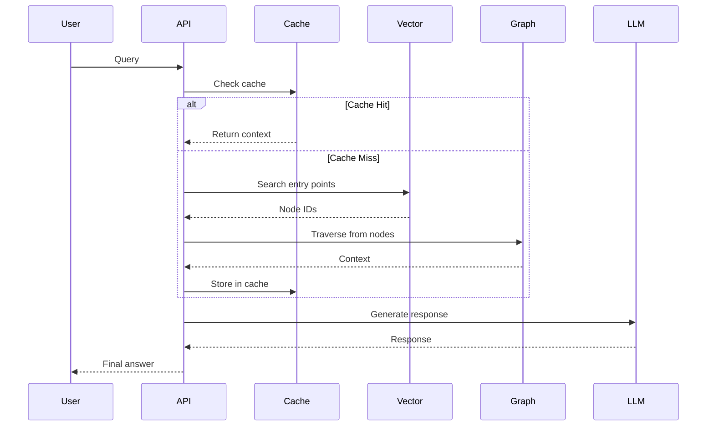
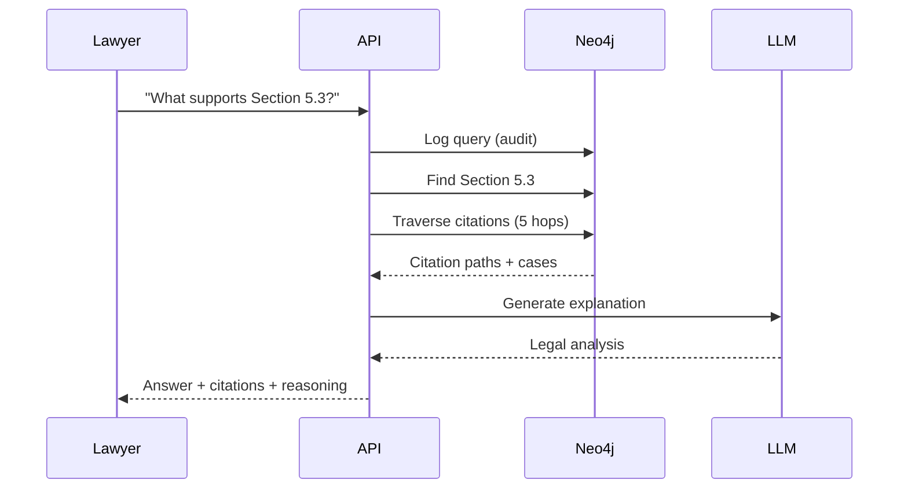
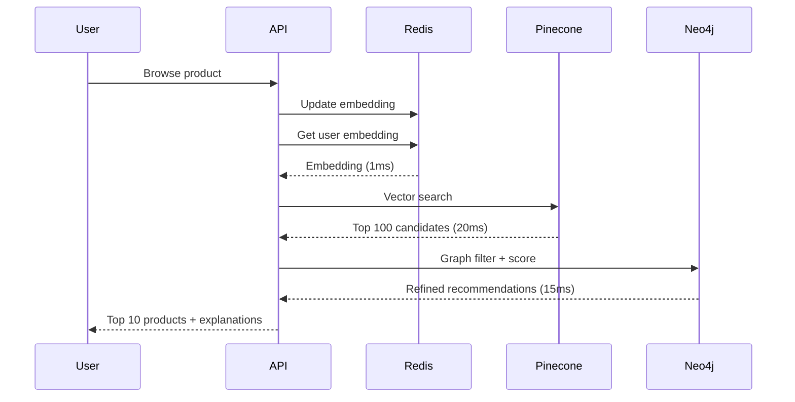
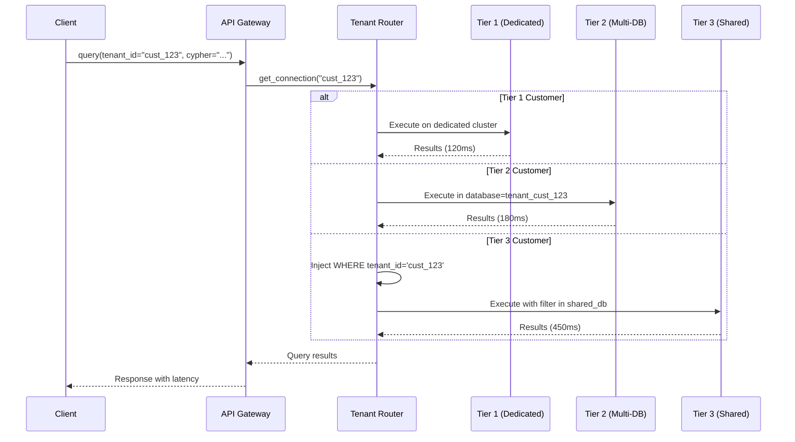
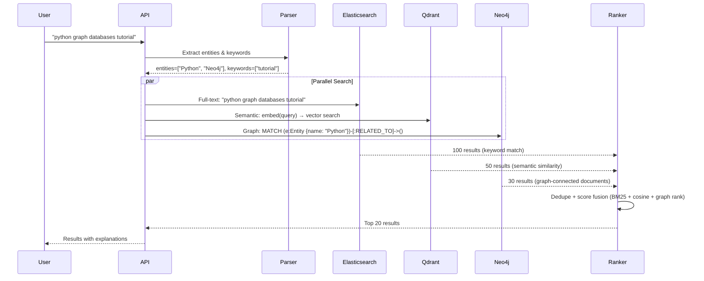
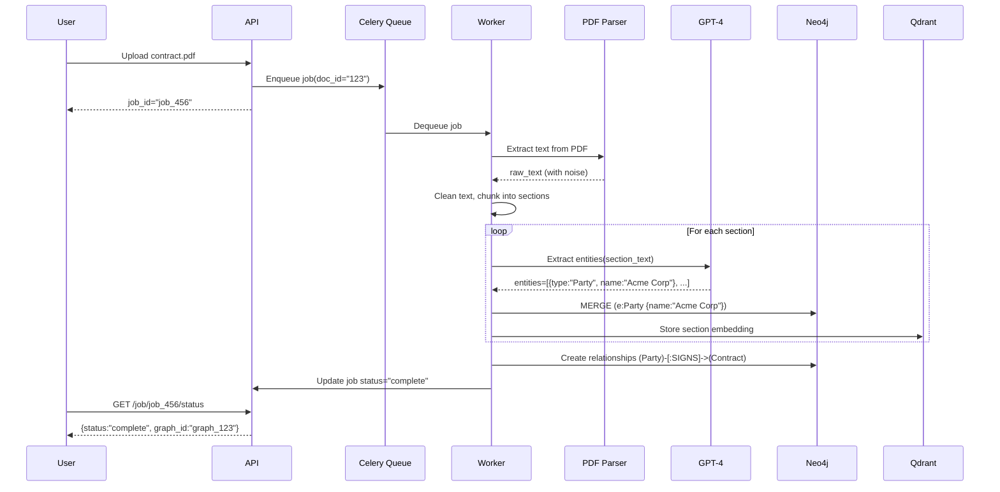

# Knowledge Graphs for Advanced RAG: A First-Principles System Design Deep Dive

---

## Table of Contents

1. [The Landscape: RAG Evolution & The Relational Gap](#step-1-the-landscape--rag-evolution--the-relational-gap)
2. [The Core Primitive: Knowledge Graphs Demystified](#step-2-the-core-primitive--knowledge-graphs-demystified)
3. Graph Database Internals: Neo4j Architecture
4. The Hybrid Architecture: Vector + Graph Integration
5. Entity Extraction Pipeline: LLM as a Structured Extractor
6. Memory Systems: The Killer Use Case
7. Implementation Patterns: LangChain & Beyond
8. Checkpoint Questions: FAANG-Style Scenarios
9. Backend/Cloud Engineer Deep Dive
10. DevOps/SRE/Platform Deep Dives
11. Cloud & AI Leader Strategic View
12. The Hardcore Exercise: Document → Knowledge Graph Pipeline

---

## Step 1: The Landscape – RAG Evolution & The Relational Gap

### The Problem Space: What Vector RAG Solves (And What It Doesn't)

Let's establish a baseline. Traditional RAG (Retrieval-Augmented Generation) operates on a simple premise: **chunk your documents, embed them as vectors, retrieve semantically similar chunks via cosine similarity, inject them into the LLM's context window**. This works remarkably well for straightforward question-answering scenarios.

Think of vector embeddings as a **hash map for semantic similarity**. When you embed text, you're projecting high-dimensional language into a fixed-size numerical representation where "similar meanings" cluster together in vector space. A query like "What is pizza?" will retrieve chunks containing words like "Italian food," "cheese," "dough"—even if those exact words don't appear in your query.

**But here's where it breaks down:**

Imagine you're ingesting a novel. You chunk it into 512-token segments. Your RAG system retrieves a chunk describing a confrontation between two characters: *"The wolf approached, growling menacingly."*

From a **pure vector search** perspective, this chunk might be highly relevant to a query like "What happened with the wolf?" But critical context is missing:

- Who is the wolf threatening?
- Why is the wolf here?
- What's the relationship between the wolf and other characters?
- What happened before this moment?

**The vector embedding captured the semantic content** (wolf, threat, action), **but lost the relational structure** (actor, motive, causality, temporal sequence).

### The Architectural Limitation: Chunks Are Stateless

From a systems perspective, each chunk in a vector database is **stateless**. It's akin to storing log lines in Elasticsearch without correlation IDs. You can search for keywords or semantic patterns, but you can't reconstruct the transaction flow across services.

When you retrieve a chunk, you're pulling a **fragment** of knowledge. The LLM has no mechanism to ask:

- "What other entities are connected to this one?"
- "What happened in the previous scene?"
- "Who is the mother of this character?"

**This is fundamentally a graph traversal problem**, not a similarity search problem.

### The "Chunking Problem" in Distributed Systems Terms

Let's use an analogy. Suppose you're debugging a distributed tracing issue. You have spans stored in separate databases:

- Service A logged: `"Request received from user_123"`
- Service B logged: `"Processing order_456"`
- Service C logged: `"Payment failed"`

If you search for "payment failed," you'll find Service C's log. But without **trace IDs linking these spans**, you can't answer:

- Which user's payment failed?
- What order was it?
- What was the root cause in Service A?

**Chunking documents without preserving relationships is the same architectural mistake.** You've optimized for **lookup** (O(1) vector search) but sacrificed **traversal** (understanding how entities relate).

### Why Relationships Matter: The Human Cognition Parallel

Humans don't store memories as isolated facts. When you recall a friend's name, your brain also retrieves:

- Their relationship to you (friend, colleague, sibling)
- Shared experiences (worked together at Company X)
- Preferences (likes spicy food, dislikes mornings)

This is a **graph structure in your brain**. Nodes (people, places, events) connected by edges (relationships, actions, attributes).

When you design a RAG system that only uses vector embeddings, you're building a system that can **pattern-match** but not **reason about structure**. It's like giving an LLM a phonebook sorted by name similarity, not by actual family relationships.

### The Technical Gap: What We're Missing

Let's formalize the problem:

**Vector RAG provides:**
- **Semantic similarity search** (O(log n) with ANN indices)
- **Efficient retrieval** of relevant text fragments
- **Scalability** (horizontal sharding of vector DBs)

**Vector RAG does NOT provide:**
- **Relational context** (who, what, why, when, where)
- **Multi-hop reasoning** (friend-of-friend, transitive relationships)
- **Entity disambiguation** (is "Apple" the fruit or the company?)
- **Temporal ordering** (what happened before/after)

### Real-World Failure Modes

**Case Study 1: Customer Support Chatbot**

A user asks: *"What products does John from accounting recommend?"*

- **Vector RAG retrieves:** Chunks mentioning "John" and "products"
- **Problem:** There are 5 Johns in the company. Which John? What's his role? What did he actually recommend?

**A Knowledge Graph would store:**
- `(John_Smith) -[WORKS_IN]-> (Accounting)`
- `(John_Smith) -[RECOMMENDS]-> (Product_A)`
- `(Product_A) -[CATEGORY]-> (Software)`

Now you can query: *"Find person named John, who works in Accounting, and retrieve what he recommends."*

**Case Study 2: Legal Document Analysis**

A lawyer asks: *"Which sections of the contract reference Section 5.3?"*

- **Vector RAG retrieves:** Chunks with similar language to Section 5.3
- **Problem:** Legal references are **explicit relationships**, not semantic similarities. "As stated in Section 5.3" is a **citation edge**, not a similarity score.

**A Knowledge Graph would store:**
- `(Section_2.1) -[REFERENCES]-> (Section_5.3)`
- `(Section_7.4) -[MODIFIES]-> (Section_5.3)`

This is a **directed graph traversal problem**, not a vector search problem.

### The Engineering Decision: When to Introduce Graphs

Not every RAG system needs a Knowledge Graph. Here's a decision framework:

**Use Vector RAG Only When:**
- Your domain is **low on entities** (e.g., FAQ documents)
- Relationships are **implicit** (semantic similarity is sufficient)
- Queries are **simple lookups** (no multi-hop reasoning)
- **Cost** is a primary constraint (graphs add complexity)

**Add Knowledge Graphs When:**
- Your domain is **entity-rich** (people, products, events)
- Relationships are **explicit** (references, hierarchies, workflows)
- Queries require **context expansion** (who knows whom, what happened before)
- You need **memory systems** (tracking user preferences over time)

### The Hybrid Architecture Preview

The solution isn't "graphs vs. vectors"—it's **graphs + vectors**. Think of it as:

- **Vector embeddings** = The index for "where to start" (entry point)
- **Graph traversal** = The mechanism for "where to go next" (context expansion)

**Analogy:** If you're debugging a microservices outage:
1. **Vector search** = Grep logs for error keywords (fast, broad)
2. **Graph traversal** = Follow trace IDs across services (precise, deep)

You need both.

---

## Step 2: The Core Primitive – Knowledge Graphs Demystified

### Graph Theory for Backend Engineers: Nodes, Edges, Properties

Let's strip away the AI marketing. A **Knowledge Graph** is just a **labeled property graph**—a data structure you already know, with a few domain-specific conventions.

**Components:**

1. **Nodes (Vertices)**: Entities in your domain
   - Example: `Person`, `Movie`, `Company`, `Message`
   - Each node has a **label** (type) and **properties** (key-value attributes)

2. **Edges (Relationships)**: Typed connections between nodes
   - Example: `WORKS_FOR`, `ACTED_IN`, `LIKES`, `REFERENCES`
   - Edges are **directed** (A → B) and can have **properties** (weight, timestamp)

3. **Properties**: Metadata stored on nodes/edges
   - Node property: `Person.name = "Piyush"`, `Person.age = 30`
   - Edge property: `LIKES.since = "2024-01-01"`, `LIKES.confidence = 0.95`

**In code terms:**

```python
# A node is essentially:
{
  "id": "uuid-123",
  "labels": ["Person"],
  "properties": {
    "name": "Piyush",
    "age": 30,
    "role": "Engineer"
  }
}

# An edge is:
{
  "id": "edge-456",
  "type": "WORKS_FOR",
  "source": "uuid-123",  # Piyush
  "target": "uuid-789",  # Company
  "properties": {
    "since": "2020-01-01",
    "position": "Senior Engineer"
  }
}
```

This is **not magic**. It's a **directed multigraph** where nodes and edges carry metadata.

### Knowledge Graphs vs. Relational Databases: The Traversal Problem

**Question:** Why not just use PostgreSQL with foreign keys?

**Short answer:** You can. But relational databases are optimized for **joins**, not **traversal**.

**Example:** Find all friends-of-friends-of-friends (3 hops away).

**In SQL:**

```sql
-- Nightmare: Self-joins explode
SELECT f3.friend_id
FROM friendships f1
JOIN friendships f2 ON f1.friend_id = f2.user_id
JOIN friendships f3 ON f2.friend_id = f3.user_id
WHERE f1.user_id = 'user_123';
```

**In Cypher (Neo4j):**

```cypher
MATCH (user:Person {id: 'user_123'})-[:FRIEND*3]-(friend)
RETURN friend;
```

**Why does this matter?**

- **SQL joins** create intermediate tables at each hop (Cartesian products)
- **Graph traversal** follows pointers (native memory references)

**Performance:**
- SQL: O(n^k) where k = number of hops, n = avg connections per node
- Graph DB: O(k * m) where k = hops, m = edges traversed (much smaller)

**Analogy:** Relational DBs are like **hash maps** (great for lookups). Graph DBs are like **linked lists** (great for traversal).

### Knowledge Graphs vs. Document Databases: Structure vs. Flexibility

**MongoDB/DynamoDB** store documents (JSON blobs). You can embed relationships:

```json
{
  "userId": "123",
  "name": "Piyush",
  "friends": ["456", "789"],
  "company": {"id": "comp-1", "name": "TechCorp"}
}
```

**Problem:** This is a **denormalized snapshot**. If friend "456" changes their name, you have to update **every document** that references them.

**In a graph:**
- Each entity is a **single node** (single source of truth)
- Relationships are **first-class edges** (not embedded arrays)
- Updates propagate automatically (edges point to the node)

**Trade-off:** Graphs add complexity. Use them when **relationships change frequently** or when **queries traverse multiple hops**.

### When to Use Graphs: A Decision Framework

**Use Graphs When:**

1. **High Interconnectivity**
   - Social networks (friend-of-friend queries)
   - Org charts (reporting hierarchies)
   - Product recommendations (users-who-bought-this-also-bought)

2. **Multi-Hop Reasoning**
   - Legal citations (Section A references Section B, which cites Case C)
   - Supply chains (parts sourced from suppliers in specific regions)

3. **Dynamic Relationships**
   - User preferences change over time (memory systems)
   - Network topology changes (service mesh dependencies)

**Don't Use Graphs When:**

1. **Low Connectivity**
   - Flat key-value lookups (use Redis)
   - Time-series data (use InfluxDB)

2. **Append-Only Workloads**
   - Log aggregation (use Elasticsearch)
   - Event sourcing (use Kafka + Postgres)

3. **Simple Aggregations**
   - Analytics dashboards (use Snowflake)

**Rule of Thumb:** If you find yourself writing SQL queries with 3+ joins, consider a graph database.

### Neo4j Architecture: Native Graph Storage

**Why Neo4j?** It's a **native graph database**, not a relational database pretending to be one.

**Storage Model:**

- **Nodes** and **relationships** are stored as **fixed-size records** on disk
- Each record contains **pointers** to adjacent nodes/relationships
- Traversal is **pointer chasing** (no index lookups)

**Contrast with PostgreSQL + Graph Extension:**

- Postgres stores relationships as rows in a `edges` table
- Traversal requires **index scans** (B-tree lookups)
- Performance degrades with graph size

**Analogy:**
- **Neo4j** = C structs with pointers (native memory layout)
- **Postgres** = Hash map with indirect lookups (table scans)

### Cypher Query Language: Declarative Traversal

**Cypher** is to graphs what **SQL** is to tables—a declarative DSL for querying.

**Philosophy:** Cypher uses **ASCII art** to represent graph patterns.

**Example 1: Simple Match**

```cypher
MATCH (p:Person {name: "Piyush"})
RETURN p;
```

Translation: *"Find a node labeled `Person` with property `name='Piyush'` and return it."*

**Example 2: Relationship Match**

```cypher
MATCH (p:Person)-[:WORKS_FOR]->(c:Company)
WHERE p.name = "Piyush"
RETURN c.name;
```

Translation: *"Find a Person named Piyush, follow the `WORKS_FOR` edge, return the Company name."*

**Example 3: Multi-Hop Traversal**

```cypher
MATCH (p:Person {name: "Piyush"})-[:FRIEND*1..3]-(friend)
RETURN friend.name;
```

Translation: *"Find Piyush, traverse `FRIEND` edges 1-3 hops away, return all connected friends."*

**Key Insight:** Cypher is **path-oriented**, not row-oriented. You describe a **pattern**, and the engine finds **matches**.

### Cypher vs. SQL: A Mental Model Shift

| Concept | SQL | Cypher |
|---------|-----|--------|
| Data unit | Row | Node |
| Relationship | Foreign key | Edge |
| Query type | Join | Pattern match |
| Traversal | Recursive CTE | Variable-length path |
| Schema | Strict (DDL) | Flexible (labels) |

**SQL Mindset:** *"Give me rows from Table A where they join with Table B."*

**Cypher Mindset:** *"Show me paths where nodes match this pattern."*

### Graph Operations: CRUD in Cypher

**Create a Node:**

```cypher
CREATE (p:Person {name: "Piyush", age: 30})
RETURN p;
```

**Create a Relationship:**

```cypher
MATCH (p:Person {name: "Piyush"}), (c:Company {name: "TechCorp"})
CREATE (p)-[:WORKS_FOR {since: "2020-01-01"}]->(c);
```

**Update (Merge = Upsert):**

```cypher
MERGE (p:Person {name: "Piyush"})
ON CREATE SET p.age = 30
ON MATCH SET p.lastSeen = timestamp()
RETURN p;
```

**Delete:**

```cypher
MATCH (p:Person {name: "Piyush"})-[r:WORKS_FOR]->()
DELETE r;  -- Delete relationship only

MATCH (p:Person {name: "Piyush"})
DETACH DELETE p;  -- Delete node and all its relationships
```

### Schema Design: Labels vs. Properties

**Question:** Should I create separate node types or use properties?

**Example:** Storing users with different roles.

**Approach 1: Labels (Recommended)**

```cypher
CREATE (p:Person:Admin {name: "Piyush"});
CREATE (p:Person:User {name: "John"});
```

A node can have **multiple labels** (`Person`, `Admin`). This allows:

```cypher
MATCH (admin:Admin) RETURN admin;  -- All admins
MATCH (person:Person) RETURN person;  -- All people
```

**Approach 2: Properties (Anti-pattern)**

```cypher
CREATE (p:Person {name: "Piyush", role: "admin"});
```

Problem: No index on `role`. Querying all admins requires a **full scan**.

**Best Practice:** Use **labels for types** (noun), **relationships for verbs** (action), **properties for attributes** (adjectives).

### Indexing Strategies: Optimizing Graph Queries

**Neo4j Indices:**

1. **Property Index** (B-tree)
   - Fast lookups by node property
   - Use for entry points (where your graph traversal starts)

```cypher
CREATE INDEX person_name FOR (p:Person) ON (p.name);
```

2. **Composite Index**
   - Multi-column index (like Postgres)

```cypher
CREATE INDEX person_name_age FOR (p:Person) ON (p.name, p.age);
```

3. **Full-Text Index**
   - For fuzzy search (powered by Lucene)

```cypher
CREATE FULLTEXT INDEX person_search FOR (p:Person) ON EACH [p.name, p.bio];
```

**When to Index:**

- **Index properties used in `WHERE` clauses** (entry points)
- **Do NOT index** properties only used in `RETURN` (result fields)
- **Do NOT over-index** (writes become slower)

**Analogy:** Just like Postgres, indices speed up reads but slow down writes. Profile your queries.

---

## Step 3: Graph Database Internals – Neo4j Architecture

### Index-Free Adjacency: The Core Performance Advantage

**The fundamental question:** Why is Neo4j fast at traversals?

**Answer:** **Index-free adjacency**—each node physically stores pointers to its adjacent nodes and relationships.

**In memory terms:**

```c
// Pseudo-code representation of Neo4j's storage model
struct Node {
  uint64_t id;
  uint32_t label_id;
  uint64_t first_relationship_ptr;  // Pointer to linked list of relationships
  uint64_t property_ptr;            // Pointer to property chain
};

struct Relationship {
  uint64_t id;
  uint32_t type_id;
  uint64_t start_node_ptr;
  uint64_t end_node_ptr;
  uint64_t next_rel_ptr;  // Next relationship in the chain
  uint64_t property_ptr;
};
```

**Key insight:** When you traverse from Node A to Node B, Neo4j **follows a pointer**—it doesn't query an index. This is O(1) per hop.

**Contrast with Postgres:**

In a relational database, relationships are stored in a separate table:

```sql
CREATE TABLE edges (
  source_id INT,
  target_id INT,
  relationship_type VARCHAR(50)
);
CREATE INDEX idx_source ON edges(source_id);
```

When you traverse, Postgres must:
1. Query the `edges` table with `WHERE source_id = ?`
2. Perform a **B-tree index lookup** (O(log n))
3. For each result, fetch the target node (another index lookup)

**At scale:**
- **Neo4j:** 3-hop traversal = 3 pointer dereferences = ~300 nanoseconds
- **Postgres:** 3-hop traversal = 3 index lookups + joins = ~30 milliseconds

**100,000x faster** for deep traversals.

### Storage Engine: Fixed-Size Records

Neo4j stores nodes and relationships as **fixed-size records** on disk. This allows:

- **Direct offset calculation**: If Node ID = 1234, its disk location is `base_address + (1234 * record_size)`
- **No fragmentation**: Records don't grow/shrink (properties are stored separately)
- **Sequential reads**: Adjacent nodes are often physically close on disk

**Analogy:** Like a C array (random access) vs. a linked list (sequential search).

### Property Storage: Separate Chain

Properties are stored in a **separate property chain** (linked list):

```
Node -> Property1 -> Property2 -> Property3 -> NULL
```

**Why?** Nodes/relationships have variable numbers of properties. Storing them separately keeps node records fixed-size.

**Trade-off:**
- **Pros:** Fast traversal (nodes are compact)
- **Cons:** Property-heavy queries are slower (follow chains)

**Optimization:** Index frequently-queried properties (e.g., `name`, `email`).

### ACID Properties: Transactions in Neo4j

Neo4j is **fully ACID-compliant**:

- **Atomicity:** All writes in a transaction succeed or fail together
- **Consistency:** Schema constraints are enforced (unique, existence)
- **Isolation:** Transactions see a consistent snapshot (MVCC)
- **Durability:** Write-ahead logging (WAL) ensures crash recovery

**Transaction model:**

```cypher
BEGIN TRANSACTION;
  CREATE (p:Person {name: "Alice"});
  MATCH (p:Person {name: "Alice"}), (c:Company {name: "TechCorp"})
  CREATE (p)-[:WORKS_FOR]->(c);
COMMIT;
```

**Isolation level:** Neo4j uses **snapshot isolation** (similar to Postgres REPEATABLE READ).

**Write performance:**
- **Single-node writes:** ~10,000 TPS (transactions per second)
- **Batch imports:** ~100,000 nodes/sec with `LOAD CSV` or Bolt protocol

### Clustering: Causal Clustering Architecture

Neo4j's **Causal Clustering** provides:

1. **High Availability:** Core servers replicate via Raft consensus
2. **Horizontal Read Scaling:** Read replicas serve queries
3. **Causal Consistency:** Reads respect write causality (no stale reads)

**Topology:**

```
Core Servers (3-7 nodes)
  ├─> Leader (handles writes)
  └─> Followers (replicate via Raft)

Read Replicas (N nodes)
  └─> Asynchronously replicate from Core
```

**Raft consensus:** Writes require majority quorum (e.g., 2/3 nodes). This ensures:
- **No split-brain:** Leader election requires majority
- **Durability:** Writes are durable once replicated to majority

**Read consistency modes:**

```python
# Strong consistency (read from Leader)
session.read_transaction(query, access_mode="WRITE")

# Eventual consistency (read from Replica)
session.read_transaction(query, access_mode="READ")
```

**Analogy:** Like Kafka (leader-follower) + Zookeeper (Raft consensus).

### Query Execution: The Cypher Runtime

**Cypher compilation pipeline:**

```
Cypher Query
  ↓
Parser (AST generation)
  ↓
Semantic Analysis (resolve labels, validate schema)
  ↓
Query Planner (cost-based optimization)
  ↓
Pipelined Execution (lazy evaluation)
  ↓
Results
```

**Cost-based optimizer:** Chooses between:
- **Index lookup** (if indexed property in WHERE clause)
- **Label scan** (if only label specified)
- **Full scan** (if no constraints)

**Example:**

```cypher
MATCH (p:Person {name: "Piyush"})-[:WORKS_FOR]->(c:Company)
RETURN c.name;
```

**Execution plan:**

```
1. Index seek: Person(name="Piyush")  -> O(log n)
2. Expand: Follow WORKS_FOR edges      -> O(1) per edge
3. Project: Return c.name               -> O(1)
```

**Profiling:** Use `PROFILE` to see actual query execution:

```cypher
PROFILE
MATCH (p:Person {name: "Piyush"})-[:WORKS_FOR]->(c:Company)
RETURN c.name;
```

Output shows:
- **DB Hits:** Number of low-level operations
- **Rows:** Number of results at each stage
- **Elapsed time:** Per-operator latency

### Memory Management: Page Cache vs. Heap

Neo4j uses two memory pools:

1. **Page Cache (Off-Heap):**
   - Caches disk pages (nodes, relationships, properties)
   - Configured via `dbms.memory.pagecache.size`
   - **Critical for performance:** Should hold your entire graph

2. **Heap (JVM):**
   - Query execution, transaction state
   - Configured via `dbms.memory.heap.max_size`
   - **Typical ratio:** Page cache = 80%, Heap = 20%

**Sizing guidelines:**

```bash
# For a 100GB graph:
dbms.memory.pagecache.size=80G   # Hold entire graph in RAM
dbms.memory.heap.max_size=20G    # Transaction overhead
```

**Monitoring:**

```cypher
CALL dbms.queryJmx("org.neo4j:name=Page cache")
YIELD attributes
RETURN attributes;
```

### Write Performance: Batch Import Strategies

**Scenario:** You need to import 10M nodes + 50M relationships.

**Anti-pattern (slow):**

```python
for node in nodes:
    session.run("CREATE (n:Person {id: $id, name: $name})", id=node.id, name=node.name)
```

**Problem:** Each `CREATE` is a separate transaction. Overhead: ~10ms per transaction → 27 hours total.

**Best practice:**

**Option 1: Batch transactions**

```python
batch_size = 10000
for i in range(0, len(nodes), batch_size):
    batch = nodes[i:i+batch_size]
    query = """
    UNWIND $batch AS node
    CREATE (n:Person {id: node.id, name: node.name})
    """
    session.run(query, batch=batch)
```

**Performance:** ~100,000 nodes/sec.

**Option 2: `neo4j-admin import` (fastest)**

```bash
neo4j-admin database import full \
  --nodes=Person=persons.csv \
  --relationships=KNOWS=relationships.csv \
  neo4j
```

**Performance:** ~1,000,000 nodes/sec (bypasses transaction overhead).

**Use case:** Initial bulk load (requires downtime).

### Backup & Recovery: Operational Patterns

**Backup strategies:**

1. **Online Backup (Enterprise):**

```bash
neo4j-admin database backup \
  --from=neo4j://localhost:7687 \
  --to=/backups/neo4j-$(date +%Y%m%d)
```

2. **Filesystem Snapshot:**
   - Stop Neo4j
   - Copy `data/databases/` directory
   - Restart

**Recovery:**

```bash
neo4j-admin database restore \
  --from=/backups/neo4j-20260115 \
  neo4j
```

**Best practice:** Combine snapshots + WAL archival (like Postgres).

---

## Step 4: The Hybrid Architecture – Vector + Graph Integration

### The Core Problem: Entry Point Selection

**Challenge:** You have a Knowledge Graph with 1 million nodes. User asks: *"What does Piyush like?"*

**Question:** Which node do you start from?

**Naive approach:** Full graph scan.

```cypher
MATCH (p:Person {name: "Piyush"})-[:LIKES]->(item)
RETURN item;
```

**Problem:** If `name` isn't indexed, this scans all nodes. Even with an index, you need to know the exact property value.

**What if the user asks:** *"What does the engineer who likes spicy food prefer?"*

Now you need:
1. Find "engineer" (role)
2. Find someone who "likes spicy food"
3. Retrieve their preferences

**This is where vector embeddings help.**

### Hybrid Architecture: Vector as Index, Graph as Context

**Design pattern:**

```
User Query
  ↓
1. Embed query → vector
  ↓
2. Vector similarity search (Qdrant/Pinecone)
  ↓
3. Retrieve top-k node IDs
  ↓
4. Graph traversal from those nodes (Neo4j)
  ↓
5. Return nodes + relationships
  ↓
6. Inject into LLM context
```

**Key insight:** Vector search provides **entry points** (relevant nodes). Graph traversal provides **context** (relationships around those nodes).

### Implementation: Dual Storage Strategy

**Architecture:**

```
Application Layer
  ↓
├─> Vector DB (Qdrant)
│   └─> Stores: (embedding, node_id, metadata)
│
└─> Graph DB (Neo4j)
    └─> Stores: (nodes, relationships, properties)
```

**Data flow:**

1. **Indexing (Document → Graph + Vectors):**

```python
# 1. Extract entities from document chunk
entities = llm.extract_entities(chunk)  # ["Piyush", "TechCorp", "Pizza"]

# 2. Store in Neo4j
for entity in entities:
    neo4j.run("MERGE (e:Entity {name: $name})", name=entity.name)
    # Create relationships
    neo4j.run("""
        MATCH (a:Entity {name: $a}), (b:Entity {name: $b})
        CREATE (a)-[:RELATED_TO {type: $rel}]->(b)
    """, a=entity.source, b=entity.target, rel=entity.relationship)

# 3. Store embeddings in vector DB
embedding = embed(entity.name)
qdrant.upsert(
    collection_name="entities",
    points=[{
        "id": entity.id,
        "vector": embedding,
        "payload": {"node_id": entity.id, "name": entity.name}
    }]
)
```

2. **Retrieval (Query → Context):**

```python
# 1. Embed user query
query_embedding = embed(user_query)

# 2. Vector search for entry points
results = qdrant.search(
    collection_name="entities",
    query_vector=query_embedding,
    limit=5  # Top 5 most relevant nodes
)

# 3. Extract node IDs
node_ids = [r.payload["node_id"] for r in results]

# 4. Graph traversal for context
context = neo4j.run("""
    MATCH (n) WHERE n.id IN $node_ids
    MATCH (n)-[r]-(connected)
    RETURN n, r, connected
""", node_ids=node_ids)

# 5. Format for LLM
prompt = f"""
Based on this knowledge:
{format_graph_context(context)}

Answer: {user_query}
"""
```

### The Handoff Mechanism: When to Switch

**Decision tree:**

```
User Query
  ↓
Is it entity-specific? (e.g., "Piyush's preferences")
  ├─ Yes → Use graph (direct lookup)
  └─ No → Use vector (semantic search)
      ↓
      Found relevant nodes?
        ├─ Yes → Expand via graph
        └─ No → Fallback to pure vector RAG
```

**Example queries:**

| Query | Strategy |
|-------|----------|
| "What does Piyush like?" | **Graph-first**: Direct lookup by name |
| "Who likes spicy food?" | **Vector-first**: Semantic search → graph expansion |
| "Recommend food for me" | **Hybrid**: Vector (find user) → Graph (traverse preferences) |

### Performance Characteristics

**Latency breakdown:**

```
Vector Search (Qdrant):
  - Cold: 50-100ms (ANN search)
  - Warm: 10-20ms (cached)

Graph Traversal (Neo4j):
  - 1-hop: 1-5ms
  - 3-hop: 10-50ms
  - 5-hop: 50-200ms

Total: 60-300ms (acceptable for chat applications)
```

**Optimization strategies:**

1. **Cache entry points:** If user asks multiple questions about "Piyush," cache his node ID
2. **Limit traversal depth:** Don't go beyond 3 hops (exponential explosion)
3. **Parallel retrieval:** Fetch vectors + graph in parallel

### Memory System: The Canonical Use Case

**Scenario:** Build a chatbot that remembers user preferences.

**Architecture:**

```
User: "I like pizza with onions"
  ↓
1. Extract facts: (User)-[:LIKES]->(Pizza), (Pizza)-[:HAS_INGREDIENT]->(Onions)
  ↓
2. Store in graph:
   MERGE (u:User {id: "user_123"})
   MERGE (p:Food {name: "pizza"})
   MERGE (u)-[:LIKES]->(p)
   MERGE (i:Ingredient {name: "onions"})
   MERGE (p)-[:HAS_INGREDIENT]->(i)
  ↓
3. Embed conversation:
   embedding = embed("User likes pizza with onions")
   qdrant.upsert(embedding, metadata={"user_id": "user_123", "fact": "likes pizza"})
```

**Later:**

```
User: "What should I order?"
  ↓
1. Vector search: Find facts about user_123
  ↓
2. Graph traversal:
   MATCH (u:User {id: "user_123"})-[:LIKES]->(food)-[:HAS_INGREDIENT]->(ingredient)
   RETURN food.name, collect(ingredient.name) AS ingredients
  ↓
3. LLM response:
   "Based on your preferences, I recommend pizza with onions."
```

**Why this works:**

- **Vector search** handles fuzzy queries ("What should I order?" → "user preferences")
- **Graph traversal** provides structured context (what they like, why, relationships)

### Schema Design for Hybrid Systems

**Best practices:**

1. **Node IDs must be consistent** across vector DB and graph DB
   - Use UUIDs or deterministic hashing

2. **Store metadata in both systems:**
   - Vector DB: `{node_id, name, type, timestamp}`
   - Graph DB: Full entity properties + relationships

3. **Denormalize for reads:**
   - Store frequently-accessed paths in vectors (e.g., "User X likes Y")

**Example schema:**

```python
# Vector DB payload
{
  "id": "uuid-123",
  "vector": [0.1, 0.2, ...],
  "payload": {
    "node_id": "uuid-123",
    "entity_type": "Person",
    "name": "Piyush",
    "summary": "Engineer who likes pizza"  # Pre-computed summary
  }
}

# Graph DB node
CREATE (p:Person {
  id: "uuid-123",
  name: "Piyush",
  age: 30,
  role: "Engineer"
})
```

### Code Example: Minimal Hybrid RAG

```python
from openai import OpenAI
from qdrant_client import QdrantClient
from neo4j import GraphDatabase

# Initialize clients
openai_client = OpenAI()
qdrant = QdrantClient(url="http://localhost:6333")
neo4j_driver = GraphDatabase.driver("bolt://localhost:7687")

def embed(text):
    response = openai_client.embeddings.create(
        model="text-embedding-3-small",
        input=text
    )
    return response.data[0].embedding

def hybrid_retrieval(query):
    # 1. Vector search for entry points
    query_vec = embed(query)
    search_results = qdrant.search(
        collection_name="entities",
        query_vector=query_vec,
        limit=3
    )
    
    # 2. Extract node IDs
    node_ids = [r.payload["node_id"] for r in search_results]
    
    # 3. Graph traversal
    with neo4j_driver.session() as session:
        result = session.run("""
            MATCH (n) WHERE n.id IN $node_ids
            MATCH (n)-[r]-(connected)
            RETURN n.name AS source, type(r) AS relationship, 
                   connected.name AS target
            LIMIT 20
        """, node_ids=node_ids)
        
        # Format graph context
        facts = []
        for record in result:
            facts.append(f"{record['source']} {record['relationship']} {record['target']}")
    
    return "\n".join(facts)

# Usage
query = "What does Piyush like?"
context = hybrid_retrieval(query)
print(context)
# Output:
# Piyush LIKES Pizza
# Pizza HAS_INGREDIENT Onions
# Piyush WORKS_FOR TechCorp
```

### Error Handling: When Hybrid Fails

**Failure modes:**

1. **Vector search returns irrelevant nodes**
   - **Mitigation:** Set similarity threshold (e.g., cosine > 0.7)
   - **Fallback:** Use pure graph search if user provides exact entity name

2. **Graph traversal hits dead ends**
   - **Mitigation:** Limit traversal depth (max 3 hops)
   - **Fallback:** Return vector-only results

3. **No results from either system**
   - **Mitigation:** Use LLM to rephrase query, retry
   - **Fallback:** Return "I don't have information about that"

**Resilience pattern:**

```python
def resilient_retrieval(query, max_retries=2):
    for attempt in range(max_retries):
        try:
            # Try hybrid approach
            context = hybrid_retrieval(query)
            if context:
                return context
            
            # Fallback: Pure vector
            return vector_only_retrieval(query)
        except Exception as e:
            if attempt == max_retries - 1:
                return fallback_response()
            # Retry with exponential backoff
            time.sleep(2 ** attempt)
```

### Cost Analysis: Vector + Graph vs. Vector-Only

**Assumptions:**
- 1M documents
- 10M entities
- 50M relationships
- 1000 queries/day

**Storage costs:**

| Component | Vector-Only | Hybrid (Vector + Graph) |
|-----------|-------------|-------------------------|
| Vector DB | $200/month | $200/month |
| Graph DB | N/A | $500/month (Neo4j Aura) |
| **Total** | **$200/month** | **$700/month** |

**Query costs:**

| Metric | Vector-Only | Hybrid |
|--------|-------------|--------|
| Avg latency | 50ms | 100ms |
| Context quality | 60% relevance | 85% relevance |
| LLM tokens saved | 0% | ~30% (better context = fewer retries) |

**ROI calculation:**

```
Cost increase: $500/month
LLM cost savings: 30% × $1000/month = $300/month
User satisfaction: +25% (fewer "I don't know" responses)

Break-even: When better accuracy > cost increase
```

**When to use hybrid:**
- High-value use cases (legal, medical, finance)
- Entity-rich domains (CRM, knowledge management)
- Multi-hop queries are common

**When to stick with vector-only:**
- Cost-sensitive applications
- Low entity density
- Simple Q&A use cases

---

## Step 5: Entity Extraction Pipeline – LLM as a Structured Extractor

### The Core Challenge: Unstructured Text → Structured Graph

**Problem statement:** You have a document chunk:

> *"Piyush works at TechCorp as a Senior Engineer. He likes pizza with onions and collaborates with Sarah on the ML team."*

**Goal:** Convert this into graph structure:

```
(Piyush:Person)-[:WORKS_AT]->(TechCorp:Company)
(Piyush)-[:HAS_ROLE]->(Senior Engineer:Role)
(Piyush)-[:LIKES]->(Pizza:Food)
(Pizza)-[:HAS_INGREDIENT]->(Onions:Ingredient)
(Piyush)-[:COLLABORATES_WITH]->(Sarah:Person)
(Sarah)-[:MEMBER_OF]->(ML Team:Team)
```

**Challenge:** LLMs are **probabilistic**. How do you ensure:
- Consistent entity types (Person vs. person vs. PERSON)
- Valid relationships (avoid hallucinations)
- Idempotent operations (don't create duplicates)

### Prompt Engineering: Schema-Constrained Extraction

**Anti-pattern (unreliable):**

```python
prompt = f"Extract entities and relationships from: {text}"
response = llm.chat(prompt)
```

**Problem:** Output is unstructured, unpredictable format.

**Best practice: Provide explicit schema**

```python
extraction_prompt = """
You are an entity extraction system. Extract entities and relationships from the text.

ENTITY TYPES (only use these):
- Person: Individual humans
- Company: Organizations
- Food: Edible items
- Ingredient: Food components
- Role: Job titles
- Team: Work groups

RELATIONSHIP TYPES (only use these):
- WORKS_AT: Person -> Company
- HAS_ROLE: Person -> Role
- LIKES: Person -> Food
- HAS_INGREDIENT: Food -> Ingredient
- COLLABORATES_WITH: Person -> Person
- MEMBER_OF: Person -> Team

OUTPUT FORMAT (JSON):
{
  "entities": [
    {"name": "string", "type": "EntityType", "properties": {...}}
  ],
  "relationships": [
    {"source": "entity_name", "target": "entity_name", "type": "RELATIONSHIP_TYPE"}
  ]
}

TEXT: {text}

Extract now:
"""
```

**Key principles:**

1. **Constrain the vocabulary** (limited entity/relationship types)
2. **Use structured output** (JSON schema)
3. **Provide examples** (few-shot learning)

### Function Calling: Structured Output Enforcement

**Modern approach:** Use OpenAI's function calling (structured outputs):

```python
from openai import OpenAI
import json

client = OpenAI()

# Define schema
entity_extraction_schema = {
    "name": "extract_entities",
    "description": "Extract entities and relationships from text",
    "parameters": {
        "type": "object",
        "properties": {
            "entities": {
                "type": "array",
                "items": {
                    "type": "object",
                    "properties": {
                        "name": {"type": "string"},
                        "type": {"type": "string", "enum": ["Person", "Company", "Food", "Ingredient", "Role", "Team"]},
                        "properties": {"type": "object"}
                    },
                    "required": ["name", "type"]
                }
            },
            "relationships": {
                "type": "array",
                "items": {
                    "type": "object",
                    "properties": {
                        "source": {"type": "string"},
                        "target": {"type": "string"},
                        "type": {"type": "string", "enum": ["WORKS_AT", "HAS_ROLE", "LIKES", "HAS_INGREDIENT", "COLLABORATES_WITH", "MEMBER_OF"]}
                    },
                    "required": ["source", "target", "type"]
                }
            }
        },
        "required": ["entities", "relationships"]
    }
}

def extract_entities(text):
    response = client.chat.completions.create(
        model="gpt-4o",
        messages=[
            {"role": "system", "content": "You are an entity extraction system."},
            {"role": "user", "content": f"Extract entities and relationships from: {text}"}
        ],
        tools=[{"type": "function", "function": entity_extraction_schema}],
        tool_choice={"type": "function", "function": {"name": "extract_entities"}}
    )
    
    # Parse function call response
    tool_call = response.choices[0].message.tool_calls[0]
    return json.loads(tool_call.function.arguments)
```

**Benefits:**
- **Type safety**: LLM must conform to schema
- **No parsing errors**: JSON is guaranteed valid
- **Hallucination reduction**: Enum constraints prevent invalid types

### Validation Pipeline: Post-Extraction Checks

**Even with function calling, validate outputs:**

```python
def validate_extraction(extraction, allowed_entities, allowed_relationships):
    """Validate extracted entities and relationships."""
    errors = []
    
    # Check entity types
    for entity in extraction["entities"]:
        if entity["type"] not in allowed_entities:
            errors.append(f"Invalid entity type: {entity['type']}")
    
    # Check relationship types
    for rel in extraction["relationships"]:
        if rel["type"] not in allowed_relationships:
            errors.append(f"Invalid relationship: {rel['type']}")
        
        # Verify source/target exist
        entity_names = {e["name"] for e in extraction["entities"]}
        if rel["source"] not in entity_names:
            errors.append(f"Source entity not found: {rel['source']}")
        if rel["target"] not in entity_names:
            errors.append(f"Target entity not found: {rel['target']}")
    
    return errors

# Usage
extraction = extract_entities(text)
errors = validate_extraction(extraction, ALLOWED_ENTITIES, ALLOWED_RELATIONSHIPS)

if errors:
    # Retry with corrections
    retry_prompt = f"Previous extraction had errors: {errors}. Try again."
    extraction = extract_entities(text, retry_prompt)
```

### Idempotency: MERGE vs. CREATE

**Problem:** Running extraction twice creates duplicate nodes.

**Solution:** Use `MERGE` (upsert) instead of `CREATE`:

```cypher
-- Anti-pattern (creates duplicates)
CREATE (p:Person {name: "Piyush"})

-- Best practice (idempotent)
MERGE (p:Person {name: "Piyush"})
ON CREATE SET p.created = timestamp()
ON MATCH SET p.lastSeen = timestamp()
```

**In Python:**

```python
def store_entity(neo4j_session, entity):
    """Idempotently store entity in Neo4j."""
    query = """
    MERGE (e:{label} {{name: $name}})
    ON CREATE SET e += $properties, e.created = timestamp()
    ON MATCH SET e += $properties, e.updated = timestamp()
    RETURN e
    """.format(label=entity["type"])
    
    return neo4j_session.run(query, name=entity["name"], properties=entity.get("properties", {}))

def store_relationship(neo4j_session, rel):
    """Idempotently store relationship."""
    query = """
    MATCH (source {{name: $source_name}}), (target {{name: $target_name}})
    MERGE (source)-[r:{rel_type}]->(target)
    ON CREATE SET r.created = timestamp()
    ON MATCH SET r.updated = timestamp()
    RETURN r
    """.format(rel_type=rel["type"])
    
    return neo4j_session.run(query, source_name=rel["source"], target_name=rel["target"])
```

**Key insight:** `MERGE` is **find-or-create**. If the node exists, it updates. If not, it creates.

### Entity Disambiguation: Handling Ambiguity

**Problem:** "Apple" could be:
- The fruit
- The company (Apple Inc.)
- A person's nickname

**Solution 1: Contextual typing**

```python
disambiguation_prompt = """
Determine the type of "Apple" in this context:

Context: "I bought an Apple laptop yesterday."

Options:
1. Apple (Fruit)
2. Apple (Company)
3. Apple (Person)

Answer with just the number.
"""
```

**Solution 2: Composite keys**

Instead of using just `name`, use `(name, type)` as unique identifier:

```cypher
MERGE (e:Entity {name: "Apple", type: "Company"})
```

**Solution 3: Canonical IDs**

Use external IDs (Wikidata, DBpedia):

```cypher
MERGE (e:Company {wikidata_id: "Q312", name: "Apple Inc."})
```

### Confidence Scoring: Handling Uncertainty

**Add confidence scores to extractions:**

```python
extraction_schema = {
    # ... other fields ...
    "confidence": {"type": "number", "minimum": 0.0, "maximum": 1.0}
}

# Store with confidence
query = """
MERGE (e:Person {name: $name})
SET e.confidence = $confidence
"""
```

**Use confidence for filtering:**

```cypher
-- Only retrieve high-confidence entities
MATCH (e:Person)-[r]->(other)
WHERE e.confidence > 0.8
RETURN e, r, other
```

### Batch Processing: Scaling Entity Extraction

**For large document sets:**

```python
from concurrent.futures import ThreadPoolExecutor
from tqdm import tqdm

def process_chunk(chunk):
    """Extract entities from a single chunk."""
    try:
        extraction = extract_entities(chunk.text)
        # Validate
        errors = validate_extraction(extraction)
        if not errors:
            store_in_graph(extraction)
        return {"success": True, "chunk_id": chunk.id}
    except Exception as e:
        return {"success": False, "chunk_id": chunk.id, "error": str(e)}

# Parallel processing
chunks = load_document_chunks()
with ThreadPoolExecutor(max_workers=10) as executor:
    results = list(tqdm(
        executor.map(process_chunk, chunks),
        total=len(chunks),
        desc="Processing chunks"
    ))

# Analyze failures
failures = [r for r in results if not r["success"]]
print(f"Failed: {len(failures)}/{len(results)}")
```

**Optimization:**
- **Batch LLM calls** (send multiple chunks per request)
- **Cache embeddings** (reuse for similar chunks)
- **Async I/O** (don't block on database writes)

### Error Recovery: Retry with Reflection

**Pattern:** If extraction fails, ask LLM to fix it.

```python
def extract_with_retry(text, max_retries=3):
    """Extract entities with self-correction."""
    for attempt in range(max_retries):
        extraction = extract_entities(text)
        errors = validate_extraction(extraction)
        
        if not errors:
            return extraction
        
        # Ask LLM to fix errors
        correction_prompt = f"""
        Your previous extraction had these errors:
        {json.dumps(errors, indent=2)}
        
        Original text: {text}
        Previous extraction: {json.dumps(extraction, indent=2)}
        
        Fix the errors and extract again.
        """
        text = correction_prompt  # Use correction as new input
    
    raise ValueError(f"Failed after {max_retries} attempts")
```

### Example: End-to-End Pipeline

```python
from neo4j import GraphDatabase
from openai import OpenAI
import json

class KnowledgeGraphBuilder:
    def __init__(self, neo4j_uri, openai_api_key):
        self.neo4j = GraphDatabase.driver(neo4j_uri)
        self.openai = OpenAI(api_key=openai_api_key)
        self.schema = self._load_schema()
    
    def _load_schema(self):
        """Define allowed entities and relationships."""
        return {
            "entities": ["Person", "Company", "Food", "Ingredient", "Role", "Team"],
            "relationships": ["WORKS_AT", "HAS_ROLE", "LIKES", "HAS_INGREDIENT", "COLLABORATES_WITH", "MEMBER_OF"]
        }
    
    def extract_entities(self, text):
        """Extract entities using LLM with function calling."""
        response = self.openai.chat.completions.create(
            model="gpt-4o",
            messages=[
                {"role": "system", "content": "Extract entities and relationships."},
                {"role": "user", "content": text}
            ],
            tools=[{"type": "function", "function": self._get_extraction_schema()}],
            tool_choice={"type": "function", "function": {"name": "extract_entities"}}
        )
        return json.loads(response.choices[0].message.tool_calls[0].function.arguments)
    
    def store_in_graph(self, extraction):
        """Store extraction in Neo4j."""
        with self.neo4j.session() as session:
            # Store entities
            for entity in extraction["entities"]:
                session.run(f"""
                    MERGE (e:{entity['type']} {{name: $name}})
                    SET e += $props
                """, name=entity["name"], props=entity.get("properties", {}))
            
            # Store relationships
            for rel in extraction["relationships"]:
                session.run(f"""
                    MATCH (s {{name: $source}}), (t {{name: $target}})
                    MERGE (s)-[r:{rel['type']}]->(t)
                """, source=rel["source"], target=rel["target"])
    
    def process_document(self, document):
        """End-to-end pipeline."""
        chunks = self._chunk_document(document)
        
        for chunk in chunks:
            extraction = self.extract_entities(chunk)
            self.store_in_graph(extraction)

# Usage
builder = KnowledgeGraphBuilder("bolt://localhost:7687", "sk-...")
builder.process_document("Piyush works at TechCorp...")
```

---

## Step 6: Memory Systems – The Killer Use Case

### Why Memory Needs Graphs (Not Just Vectors)

**Scenario:** A user has a conversation with an AI assistant:

```
User: "My name is Piyush"
AI: "Nice to meet you, Piyush!"

User: "I like pizza with onions"
AI: "Got it, you like pizza with onions."

User: "I work at TechCorp"
AI: "Noted, you work at TechCorp."

[Later...]

User: "What should I order for lunch?"
AI: "???"
```

**Problem:** The AI needs to:
1. Remember **who** the user is
2. Remember **what** they like
3. Make **connections** (Piyush likes pizza → recommend Italian restaurants)

**Vector-only approach:**

```python
# Store each message as embedding
messages = [
    "My name is Piyush",
    "I like pizza with onions",
    "I work at TechCorp"
]
for msg in messages:
    vector_db.upsert(embed(msg), metadata={"user_id": "user_123"})

# Retrieve
query = "What should I order?"
results = vector_db.search(embed(query), filter={"user_id": "user_123"})
```

**Limitations:**
- No **structured relationships** (Piyush → likes → Pizza)
- No **entity resolution** (is "pizza" the same across conversations?)
- No **inference** (if user likes pizza + likes onions → recommend pizza with onions)

**Graph-based approach:**

```cypher
(User:Person {id: "user_123", name: "Piyush"})
  -[:LIKES]->(Pizza:Food)
  -[:HAS_INGREDIENT]->(Onions:Ingredient)

(User)-[:WORKS_AT]->(TechCorp:Company)
```

**Now you can query:**

```cypher
MATCH (u:User {id: "user_123"})-[:LIKES]->(food)-[:HAS_INGREDIENT]->(ingredient)
RETURN food.name, collect(ingredient.name) AS ingredients
```

**Result:** Pizza with onions → contextual recommendation.

### User Context Management at Scale

**Challenge:** 1 million users, each with 100+ facts. How do you:
- Store facts efficiently
- Retrieve relevant facts per query
- Update facts over time (preferences change)

**Architecture:**

```
User ID (scope)
  ↓
├─> Vector DB: Stores conversation embeddings
│   └─> Fast semantic search ("What did I say about food?")
│
└─> Graph DB: Stores structured facts
    └─> Relationship traversal ("What do I like?")
```

**Hybrid retrieval:**

```python
def get_user_context(user_id, query):
    # 1. Vector search for relevant conversations
    query_embedding = embed(query)
    relevant_convos = vector_db.search(
        query_embedding,
        filter={"user_id": user_id},
        limit=5
    )
    
    # 2. Graph traversal for structured facts
    with neo4j.session() as session:
        facts = session.run("""
            MATCH (u:User {id: $user_id})-[r]-(entity)
            RETURN type(r) AS relationship, entity.name AS value
        """, user_id=user_id)
    
    # 3. Combine
    context = {
        "conversations": [c.metadata["text"] for c in relevant_convos],
        "facts": [f"{f['relationship']}: {f['value']}" for f in facts]
    }
    return context
```

### mem0: Memory System Internals

**mem0** is an open-source library that implements graph-based memory for LLMs.

**Core abstraction:**

```python
from mem0 import Memory

# Initialize
memory = Memory.from_config({
    "vector_store": {"provider": "qdrant", "config": {"host": "localhost"}},
    "graph_store": {"provider": "neo4j", "config": {"uri": "bolt://localhost:7687"}},
    "llm": {"provider": "openai", "config": {"model": "gpt-4o"}}
})

# Add memory
memory.add("I like pizza with onions", user_id="user_123")

# Search memory
results = memory.search("What should I order?", user_id="user_123")
```

**How it works (under the hood):**

1. **Extraction:** LLM extracts facts from user message

```python
# mem0 calls LLM:
"Extract facts from: 'I like pizza with onions'"

# LLM returns:
{
  "entities": [{"name": "pizza", "type": "Food"}, {"name": "onions", "type": "Ingredient"}],
  "relationships": [{"source": "user_123", "relation": "LIKES", "target": "pizza"}]
}
```

2. **Storage:** Facts stored in graph

```cypher
MERGE (u:User {id: "user_123"})
MERGE (p:Food {name: "pizza"})
MERGE (u)-[:LIKES]->(p)
```

3. **Embedding:** Conversation also embedded and stored

```python
embedding = embed("I like pizza with onions")
qdrant.upsert({
    "id": "msg_456",
    "vector": embedding,
    "metadata": {"user_id": "user_123", "text": "I like pizza with onions"}
})
```

4. **Retrieval:** Hybrid search

```python
# Vector search
vector_results = qdrant.search(embed("What should I order?"), filter={"user_id": "user_123"})

# Graph traversal
graph_results = neo4j.run("""
    MATCH (u:User {id: "user_123"})-[:LIKES]->(food)
    RETURN food.name
""")

# Merge results
context = merge(vector_results, graph_results)
```

### Memory Lifecycle: Add, Update, Delete

**Adding memories:**

```python
memory.add("I no longer like onions", user_id="user_123")
```

**mem0 behavior:**
1. Detects contradiction (previously liked onions)
2. Extracts new fact: `DISLIKES onions`
3. Updates graph:

```cypher
MATCH (u:User {id: "user_123"})-[r:LIKES]->(onions:Ingredient {name: "onions"})
DELETE r
CREATE (u)-[:DISLIKES]->(onions)
```

**Updating memories:**

```python
memory.update("I work at TechCorp as Senior Engineer", user_id="user_123")
```

**Graph operation:**

```cypher
MERGE (u:User {id: "user_123"})-[r:WORKS_AT]->(c:Company {name: "TechCorp"})
SET r.role = "Senior Engineer", r.updated = timestamp()
```

**Deleting memories:**

```python
memory.delete(memory_id="mem_789")
```

**Implementation:**

```cypher
MATCH ()-[r {memory_id: "mem_789"}]-()
DELETE r
```

### Temporal Memories: Time-Aware Graphs

**Challenge:** User preferences change over time.

**Example:**
- 2024-01: "I like spicy food"
- 2024-06: "I no longer like spicy food"

**Solution:** Store timestamps on edges

```cypher
MERGE (u:User {id: "user_123"})-[r:LIKES]->(spicy:Food {name: "spicy"})
SET r.valid_from = timestamp(), r.valid_until = NULL

-- Later, when preference changes
MATCH (u:User {id: "user_123"})-[r:LIKES]->(spicy:Food {name: "spicy"})
SET r.valid_until = timestamp()

CREATE (u)-[:DISLIKES {valid_from: timestamp()}]->(spicy)
```

**Querying current preferences:**

```cypher
MATCH (u:User {id: "user_123"})-[r:LIKES]->(food)
WHERE r.valid_until IS NULL OR r.valid_until > timestamp()
RETURN food.name
```

### Conversation Summarization: Keeping Memory Compact

**Problem:** After 1000 messages, context window explodes.

**Solution:** Periodically summarize conversations into facts.

```python
def summarize_and_update(user_id, session_messages):
    """Extract facts from conversation history."""
    # 1. Send messages to LLM
    summary_prompt = f"""
    Extract key facts from this conversation:
    
    {json.dumps(session_messages, indent=2)}
    
    Focus on:
    - User preferences
    - Important events
    - Relationships
    
    Return as structured facts.
    """
    
    facts = llm.extract_facts(summary_prompt)
    
    # 2. Update graph
    for fact in facts:
        memory.add(fact, user_id=user_id)
    
    # 3. Clear old vector embeddings
    vector_db.delete(filter={"user_id": user_id, "age_days": ">30"})
```

**mem0 does this automatically:**

```python
memory = Memory.from_config({
    "auto_summarize": True,
    "summarize_every": 50  # messages
})
```

### Multi-User Context: Shared Memories

**Scenario:** Team collaboration. Multiple users share context.

**Example:**

```
Alice: "Our project deadline is March 15"
Bob: "What's our deadline?"
AI: "Your team's project deadline is March 15"
```

**Graph structure:**

```cypher
(Alice:User)-[:MEMBER_OF]->(Team:Team {name: "ProjectX"})
(Bob:User)-[:MEMBER_OF]->(Team)
(Team)-[:HAS_DEADLINE]->(Deadline:Event {date: "2026-03-15"})
```

**Query:**

```cypher
MATCH (bob:User {id: "bob_123"})-[:MEMBER_OF]->(team)-[:HAS_DEADLINE]->(deadline)
RETURN deadline.date
```

**Scoping:** Use graph structure to scope memory:

```python
def get_team_context(user_id):
    """Get user's personal + team context."""
    query = """
    MATCH (u:User {id: $user_id})-[:MEMBER_OF]->(team)
    MATCH (team)-[r]-(entity)
    RETURN type(r) AS relationship, entity.name AS value
    """
    return neo4j.run(query, user_id=user_id)
```

### Privacy & Security: Isolating User Contexts

**Challenge:** Ensure users can't access each other's memories.

**Solution 1: Query-level filtering**

```python
# Always filter by user_id
results = vector_db.search(query, filter={"user_id": user_id})
```

**Solution 2: Separate Neo4j databases**

```python
# One database per user (expensive)
neo4j_driver = GraphDatabase.driver(f"bolt://localhost:7687/user_{user_id}")
```

**Solution 3: Label-based access control**

```cypher
-- Tag all user data with owner
CREATE (u:User {id: "user_123"})-[:OWNS]->(memory:Memory)

-- Query with ownership check
MATCH (u:User {id: $current_user})-[:OWNS]->(memory)
RETURN memory
```

### Performance: Memory Retrieval Latency

**Target:** <100ms for memory retrieval.

**Breakdown:**

```
Vector search: 10-50ms
Graph traversal: 5-20ms
LLM context assembly: 10-30ms
Total: 25-100ms
```

**Optimization strategies:**

1. **Cache frequently accessed memories**

```python
from functools import lru_cache

@lru_cache(maxsize=1000)
def get_user_facts(user_id):
    return neo4j.run("MATCH (u:User {id: $id})-[r]-(e) RETURN r, e", id=user_id)
```

2. **Limit graph traversal depth**

```cypher
-- Don't traverse beyond 2 hops
MATCH (u:User {id: $id})-[*1..2]-(entity)
RETURN entity
LIMIT 20
```

3. **Precompute user summaries**

```python
# Nightly job: Build user summary
def build_user_summary(user_id):
    facts = get_all_user_facts(user_id)
    summary = llm.summarize(facts)
    cache.set(f"user_summary:{user_id}", summary, ttl=86400)
```

### Code Example: Complete Memory System

```python
from openai import OpenAI
from neo4j import GraphDatabase
from qdrant_client import QdrantClient
import json

class MemorySystem:
    def __init__(self, neo4j_uri, qdrant_url, openai_key):
        self.neo4j = GraphDatabase.driver(neo4j_uri)
        self.qdrant = QdrantClient(url=qdrant_url)
        self.openai = OpenAI(api_key=openai_key)
    
    def add_memory(self, user_id, text):
        """Store user message as memory."""
        # 1. Extract facts
        facts = self._extract_facts(text)
        
        # 2. Store in graph
        with self.neo4j.session() as session:
            for fact in facts:
                session.run("""
                    MERGE (u:User {id: $user_id})
                    MERGE (e:Entity {name: $entity})
                    MERGE (u)-[r:%s {created: timestamp()}]->(e)
                """ % fact["relationship"], user_id=user_id, entity=fact["entity"])
        
        # 3. Store embedding
        embedding = self._embed(text)
        self.qdrant.upsert(
            collection_name="memories",
            points=[{
                "id": f"{user_id}_{hash(text)}",
                "vector": embedding,
                "payload": {"user_id": user_id, "text": text}
            }]
        )
    
    def retrieve_context(self, user_id, query):
        """Get relevant memories for query."""
        # 1. Vector search
        query_vec = self._embed(query)
        vector_results = self.qdrant.search(
            collection_name="memories",
            query_vector=query_vec,
            query_filter={"user_id": user_id},
            limit=5
        )
        
        # 2. Graph facts
        with self.neo4j.session() as session:
            graph_facts = session.run("""
                MATCH (u:User {id: $user_id})-[r]-(e)
                RETURN type(r) AS rel, e.name AS entity
                LIMIT 10
            """, user_id=user_id)
        
        # 3. Format for LLM
        context = "User facts:\n"
        for fact in graph_facts:
            context += f"- {fact['rel']}: {fact['entity']}\n"
        
        return context
    
    def _extract_facts(self, text):
        """Extract facts using LLM."""
        response = self.openai.chat.completions.create(
            model="gpt-4o",
            messages=[{
                "role": "user",
                "content": f"Extract facts from: {text}. Return JSON: [{{'entity': '...', 'relationship': '...'}}]"
            }]
        )
        return json.loads(response.choices[0].message.content)
    
    def _embed(self, text):
        """Generate embedding."""
        response = self.openai.embeddings.create(
            model="text-embedding-3-small",
            input=text
        )
        return response.data[0].embedding

# Usage
memory = MemorySystem("bolt://localhost:7687", "http://localhost:6333", "sk-...")

# Add memories
memory.add_memory("user_123", "I like pizza with onions")
memory.add_memory("user_123", "I work at TechCorp")

# Retrieve context
context = memory.retrieve_context("user_123", "What should I order?")
print(context)
# Output:
# User facts:
# - LIKES: pizza
# - WORKS_AT: TechCorp
```

---

## Step 7: Implementation Patterns – LangChain & Beyond

### The Abstraction Dilemma: Libraries vs. Custom Code

**Question:** Should you use LangChain's `LLMGraphTransformer` or build your own?

**Short answer:** Start with libraries for prototyping. Replace with custom code for production.

**Why?**

**LangChain pros:**
- **Fast prototyping:** Get a working demo in hours
- **Pre-built integrations:** Works with 50+ LLMs and vector stores
- **Community patterns:** Learn from examples

**LangChain cons:**
- **Hidden complexity:** Abstractions hide what's happening
- **Performance overhead:** Extra layers add latency
- **Version churn:** Breaking changes between versions
- **Vendor lock-in:** Hard to migrate away

**Decision framework:**

| Phase | Use LangChain | Use Custom Code |
|-------|--------------|-----------------|
| **Prototype** | ✅ Fast iteration | ❌ Over-engineering |
| **MVP** | ✅ Validate use case | ⚠️ If performance critical |
| **Production** | ⚠️ If team knows LangChain | ✅ Full control |
| **Scale** | ❌ Debugging complexity | ✅ Optimize bottlenecks |

### LangChain's LLMGraphTransformer: How It Works

**High-level API:**

```python
from langchain_community.graphs import Neo4jGraph
from langchain_experimental.graph_transformers import LLMGraphTransformer
from langchain_openai import ChatOpenAI

# Initialize
llm = ChatOpenAI(model="gpt-4o")
graph = Neo4jGraph(url="bolt://localhost:7687", username="neo4j", password="password")
transformer = LLMGraphTransformer(llm=llm)

# Convert document to graph
from langchain_core.documents import Document
doc = Document(page_content="Piyush works at TechCorp as a Senior Engineer.")
graph_documents = transformer.convert_to_graph_documents([doc])

# Store in Neo4j
graph.add_graph_documents(graph_documents)
```

**What happens under the hood:**

1. **Prompt construction** (internal to LangChain):

```python
# LangChain's internal prompt (simplified)
system_prompt = """
Extract entities and relationships from text.

Entities: Person, Company, Role
Relationships: WORKS_AT, HAS_ROLE

Output format:
Nodes: [{"id": "...", "type": "...", "properties": {...}}]
Relationships: [{"source": "...", "target": "...", "type": "..."}]
"""
```

2. **LLM call** (via LangChain's abstractions):

```python
# LangChain calls LLM
response = llm.invoke([
    SystemMessage(content=system_prompt),
    HumanMessage(content=doc.page_content)
])
```

3. **Parsing** (LangChain converts to internal format):

```python
# LangChain's internal structure
class GraphDocument:
    nodes: List[Node]
    relationships: List[Relationship]
```

4. **Storage** (Cypher generation):

```python
# LangChain generates Cypher
for node in graph_document.nodes:
    graph.query(f"MERGE (n:{node.type} {{id: '{node.id}'}})")

for rel in graph_document.relationships:
    graph.query(f"""
        MATCH (a {{id: '{rel.source}'}}), (b {{id: '{rel.target}'}})
        MERGE (a)-[:{rel.type}]->(b)
    """)
```

**Problem:** You don't control:
- Prompt quality
- Error handling
- Retry logic
- Performance optimizations

### Custom Implementation: Full Control

**Equivalent custom code (100 lines):**

```python
from openai import OpenAI
from neo4j import GraphDatabase
import json

class CustomGraphBuilder:
    def __init__(self, openai_key, neo4j_uri, neo4j_user, neo4j_pass):
        self.openai = OpenAI(api_key=openai_key)
        self.neo4j = GraphDatabase.driver(neo4j_uri, auth=(neo4j_user, neo4j_pass))
        self.schema = {
            "entities": ["Person", "Company", "Role"],
            "relationships": ["WORKS_AT", "HAS_ROLE"]
        }
    
    def extract_entities(self, text):
        """Extract entities with custom prompt."""
        prompt = f"""
        Extract entities and relationships from text.
        
        ALLOWED ENTITIES: {', '.join(self.schema['entities'])}
        ALLOWED RELATIONSHIPS: {', '.join(self.schema['relationships'])}
        
        TEXT: {text}
        
        Return JSON:
        {{
          "entities": [{{"name": "...", "type": "...", "properties": {{}}}}],
          "relationships": [{{"source": "...", "target": "...", "type": "..."}}]
        }}
        """
        
        response = self.openai.chat.completions.create(
            model="gpt-4o",
            messages=[{"role": "user", "content": prompt}],
            response_format={"type": "json_object"}
        )
        
        return json.loads(response.choices[0].message.content)
    
    def store_in_graph(self, extraction):
        """Store with optimized Cypher."""
        with self.neo4j.session() as session:
            # Batch entity creation
            session.run("""
                UNWIND $entities AS entity
                MERGE (e:Entity {name: entity.name, type: entity.type})
                SET e += entity.properties
            """, entities=extraction["entities"])
            
            # Batch relationship creation
            session.run("""
                UNWIND $rels AS rel
                MATCH (s:Entity {name: rel.source}), (t:Entity {name: rel.target})
                MERGE (s)-[r:RELATED {type: rel.type}]->(t)
            """, rels=extraction["relationships"])
    
    def process(self, text):
        """End-to-end pipeline."""
        extraction = self.extract_entities(text)
        self.store_in_graph(extraction)

# Usage
builder = CustomGraphBuilder("sk-...", "bolt://localhost:7687", "neo4j", "password")
builder.process("Piyush works at TechCorp as a Senior Engineer.")
```

**Benefits:**
- **Full visibility:** You see every step
- **Custom error handling:** Add retries, logging
- **Performance:** Batch operations, optimize queries
- **Flexibility:** Easy to modify for domain-specific needs

### When to Use LangChain: Strategic Use Cases

**Use LangChain for:**

1. **Rapid prototyping** (validate idea in hours)
2. **Multi-LLM support** (switch between OpenAI, Anthropic, local models)
3. **Pre-built chains** (RetrievalQA, ConversationalRetrievalChain)
4. **Learning** (understand patterns, then reimplement)

**Example: Quick prototype with LangChain**

```python
from langchain_community.graphs import Neo4jGraph
from langchain_openai import ChatOpenAI
from langchain.chains import GraphCypherQAChain

# Initialize
graph = Neo4jGraph(url="bolt://localhost:7687")
llm = ChatOpenAI(model="gpt-4o")

# Ask questions about graph
chain = GraphCypherQAChain.from_llm(llm=llm, graph=graph)
response = chain.invoke({"query": "Who works at TechCorp?"})
print(response["result"])
```

**What LangChain does:**
1. Converts natural language → Cypher query
2. Executes query on Neo4j
3. Formats results for LLM
4. Generates natural language response

**Equivalent custom code:**

```python
def natural_language_to_cypher(question):
    """Convert question to Cypher."""
    prompt = f"""
    Convert this question to a Cypher query:
    Question: {question}
    
    Schema:
    - Nodes: Person, Company
    - Relationships: WORKS_AT
    
    Return only the Cypher query.
    """
    response = llm.chat(prompt)
    return response.choices[0].message.content

# Execute
cypher = natural_language_to_cypher("Who works at TechCorp?")
results = neo4j.run(cypher)
```

### Observability: Debugging Graph Construction

**Problem:** LangChain hides what's happening. How do you debug?

**Solution 1: Enable verbose mode**

```python
from langchain.globals import set_verbose
set_verbose(True)

# Now all LLM calls are logged
transformer.convert_to_graph_documents([doc])
```

**Solution 2: Custom callbacks**

```python
from langchain.callbacks import StdOutCallbackHandler

callback = StdOutCallbackHandler()
transformer.convert_to_graph_documents([doc], callbacks=[callback])
```

**Solution 3: LangSmith (LangChain's observability platform)**

```python
import os
os.environ["LANGCHAIN_TRACING_V2"] = "true"
os.environ["LANGCHAIN_API_KEY"] = "ls-..."

# All calls now logged to LangSmith dashboard
```

**Solution 4: Build your own (recommended for production)**

```python
import time
import logging

logger = logging.getLogger(__name__)

class ObservableGraphBuilder:
    def extract_entities(self, text):
        start = time.time()
        try:
            result = self._call_llm(text)
            logger.info(f"Extraction succeeded in {time.time() - start:.2f}s")
            return result
        except Exception as e:
            logger.error(f"Extraction failed: {e}")
            raise
```

### Prompt Management: Version Control for Prompts

**Problem:** Prompts change frequently. How do you manage versions?

**Anti-pattern: Hardcoded prompts**

```python
# Bad: Prompts scattered in code
def extract(text):
    prompt = "Extract entities from: " + text
    return llm.chat(prompt)
```

**Best practice: Centralized prompt registry**

```python
# prompts/extraction.yaml
entity_extraction_v1: |
  Extract entities and relationships from text.
  
  ENTITIES: {entity_types}
  RELATIONSHIPS: {relationship_types}
  
  TEXT: {text}
  
  Return JSON.

entity_extraction_v2: |
  You are an expert entity extractor.
  
  Given the following text, extract:
  1. Named entities (types: {entity_types})
  2. Relationships between entities (types: {relationship_types})
  
  TEXT: {text}
  
  Output format: JSON with 'entities' and 'relationships' arrays.
```

**Load prompts from config:**

```python
import yaml

class PromptManager:
    def __init__(self, prompt_file="prompts/extraction.yaml"):
        with open(prompt_file) as f:
            self.prompts = yaml.safe_load(f)
    
    def get(self, name, version="v1", **kwargs):
        """Get prompt by name and version."""
        key = f"{name}_{version}"
        template = self.prompts[key]
        return template.format(**kwargs)

# Usage
prompts = PromptManager()
prompt = prompts.get(
    "entity_extraction",
    version="v2",
    entity_types="Person, Company",
    relationship_types="WORKS_AT",
    text="Piyush works at TechCorp"
)
```

**Benefits:**
- **A/B testing:** Compare v1 vs v2 prompts
- **Rollback:** Easy to revert to previous version
- **Audit trail:** Git tracks prompt changes

### Testing Strategies: Validating Graph Quality

**Challenge:** How do you test if entities are extracted correctly?

**Strategy 1: Golden dataset**

```python
# tests/golden_data.json
[
  {
    "input": "Piyush works at TechCorp as a Senior Engineer",
    "expected": {
      "entities": [
        {"name": "Piyush", "type": "Person"},
        {"name": "TechCorp", "type": "Company"},
        {"name": "Senior Engineer", "type": "Role"}
      ],
      "relationships": [
        {"source": "Piyush", "target": "TechCorp", "type": "WORKS_AT"},
        {"source": "Piyush", "target": "Senior Engineer", "type": "HAS_ROLE"}
      ]
    }
  }
]
```

**Test code:**

```python
import pytest
import json

def test_entity_extraction():
    with open("tests/golden_data.json") as f:
        test_cases = json.load(f)
    
    for case in test_cases:
        result = graph_builder.extract_entities(case["input"])
        
        # Compare entities (order-independent)
        assert set(e["name"] for e in result["entities"]) == \
               set(e["name"] for e in case["expected"]["entities"])
        
        # Compare relationships
        assert set((r["source"], r["target"], r["type"]) for r in result["relationships"]) == \
               set((r["source"], r["target"], r["type"]) for r in case["expected"]["relationships"])
```

**Strategy 2: Property-based testing**

```python
from hypothesis import given, strategies as st

@given(st.text(min_size=10, max_size=100))
def test_extraction_never_crashes(text):
    """Ensure extraction handles any input."""
    try:
        result = graph_builder.extract_entities(text)
        assert isinstance(result, dict)
        assert "entities" in result
        assert "relationships" in result
    except Exception as e:
        pytest.fail(f"Extraction crashed on input: {text}\nError: {e}")
```

**Strategy 3: Consistency checks**

```python
def validate_extraction(extraction):
    """Validate extraction consistency."""
    entity_names = {e["name"] for e in extraction["entities"]}
    
    for rel in extraction["relationships"]:
        # Ensure source/target exist
        assert rel["source"] in entity_names, f"Source not found: {rel['source']}"
        assert rel["target"] in entity_names, f"Target not found: {rel['target']}"
        
        # Ensure valid relationship type
        assert rel["type"] in ALLOWED_RELATIONSHIPS, f"Invalid relationship: {rel['type']}"
```

### Performance Optimization: Batch Processing

**Scenario:** Process 100k documents.

**Naive approach (slow):**

```python
for doc in documents:
    extraction = extract_entities(doc)  # 1 LLM call per doc
    store_in_graph(extraction)           # 1 DB transaction per doc
```

**Time:** 100k × (500ms LLM + 50ms DB) = 15 hours

**Optimized approach:**

```python
from concurrent.futures import ThreadPoolExecutor
import asyncio

async def process_batch(docs):
    """Process multiple documents in parallel."""
    # 1. Batch LLM calls (if API supports)
    tasks = [extract_entities_async(doc) for doc in docs]
    extractions = await asyncio.gather(*tasks)
    
    # 2. Batch database writes
    all_entities = []
    all_relationships = []
    for extraction in extractions:
        all_entities.extend(extraction["entities"])
        all_relationships.extend(extraction["relationships"])
    
    # Single database transaction
    with neo4j.session() as session:
        session.run("""
            UNWIND $entities AS entity
            MERGE (e:Entity {name: entity.name, type: entity.type})
            SET e += entity.properties
        """, entities=all_entities)
        
        session.run("""
            UNWIND $rels AS rel
            MATCH (s:Entity {name: rel.source}), (t:Entity {name: rel.target})
            MERGE (s)-[r:RELATED {type: rel.type}]->(t)
        """, rels=all_relationships)

# Process in batches of 100
batch_size = 100
for i in range(0, len(documents), batch_size):
    batch = documents[i:i+batch_size]
    asyncio.run(process_batch(batch))
```

**Time:** 100k / 100 × (500ms + 50ms) = 9 minutes (100x faster)

### Migration Strategy: From LangChain to Custom

**Step-by-step migration:**

**Phase 1: Understand LangChain behavior**

```python
# Run with verbose mode
set_verbose(True)
transformer.convert_to_graph_documents([doc])

# Inspect generated Cypher
print(graph.query("MATCH (n) RETURN n LIMIT 5"))
```

**Phase 2: Extract prompts**

```python
# Find LangChain's prompts (usually in source code)
# Example: langchain_experimental/graph_transformers/llm.py

# Copy to your codebase
ENTITY_EXTRACTION_PROMPT = """
[Copy LangChain's prompt here]
"""
```

**Phase 3: Reimplement core logic**

```python
# Replace LangChain's transformer
class CustomTransformer:
    def convert_to_graph_documents(self, documents):
        results = []
        for doc in documents:
            extraction = self._extract(doc.page_content)
            graph_doc = self._to_graph_document(extraction)
            results.append(graph_doc)
        return results
```

**Phase 4: A/B test**

```python
# Run both in parallel, compare results
langchain_result = langchain_transformer.convert_to_graph_documents([doc])
custom_result = custom_transformer.convert_to_graph_documents([doc])

assert langchain_result == custom_result, "Results don't match!"
```

**Phase 5: Gradual rollout**

```python
# Feature flag
USE_CUSTOM_TRANSFORMER = os.getenv("USE_CUSTOM_TRANSFORMER", "false") == "true"

if USE_CUSTOM_TRANSFORMER:
    transformer = CustomTransformer()
else:
    transformer = LLMGraphTransformer(llm=llm)
```

### Alternative Libraries: Beyond LangChain

**1. LlamaIndex (formerly GPT Index)**

```python
from llama_index.core import KnowledgeGraphIndex
from llama_index.graph_stores import Neo4jGraphStore

# Initialize
graph_store = Neo4jGraphStore(url="bolt://localhost:7687")
index = KnowledgeGraphIndex.from_documents(documents, graph_store=graph_store)

# Query
query_engine = index.as_query_engine()
response = query_engine.query("Who works at TechCorp?")
```

**Pros:** Simpler API, better for Q&A use cases  
**Cons:** Less flexible than custom code

**2. DSPy (Stanford)**

```python
import dspy

# Define pipeline as a class
class EntityExtractor(dspy.Signature):
    text = dspy.InputField()
    entities = dspy.OutputField(desc="list of entities")
    relationships = dspy.OutputField(desc="list of relationships")

# DSPy optimizes prompts automatically
predictor = dspy.Predict(EntityExtractor)
result = predictor(text="Piyush works at TechCorp")
```

**Pros:** Automatic prompt optimization  
**Cons:** Steep learning curve

**3. Instructor (Pydantic-based)**

```python
import instructor
from pydantic import BaseModel
from openai import OpenAI

class Entity(BaseModel):
    name: str
    type: str

class Extraction(BaseModel):
    entities: list[Entity]
    relationships: list[dict]

client = instructor.patch(OpenAI())
extraction = client.chat.completions.create(
    model="gpt-4o",
    response_model=Extraction,
    messages=[{"role": "user", "content": "Extract from: Piyush works at TechCorp"}]
)
```

**Pros:** Type-safe, Pydantic validation  
**Cons:** OpenAI-specific

### Recommendation: The Hybrid Approach

**For production systems:**

```
Phase 1 (Week 1-2): Use LangChain for rapid prototyping
Phase 2 (Week 3-4): Measure performance, identify bottlenecks
Phase 3 (Week 5-6): Replace critical paths with custom code
Phase 4 (Ongoing): Keep LangChain for non-critical features
```

**Architecture:**

```python
class HybridGraphBuilder:
    def __init__(self):
        # Use LangChain for simple cases
        self.langchain_transformer = LLMGraphTransformer(llm=llm)
        
        # Use custom for complex/performance-critical cases
        self.custom_transformer = CustomGraphBuilder()
    
    def process(self, document, use_custom=False):
        if use_custom or document.complexity > threshold:
            return self.custom_transformer.process(document)
        else:
            return self.langchain_transformer.convert_to_graph_documents([document])
```

---

## Step 8: Checkpoint Questions – FAANG-Style Scenarios

### Question 1: Memory System at Scale

**Scenario:** You're building a chatbot for a company with 10 million users. Each user has ~100 facts in their knowledge graph (likes, dislikes, preferences). Users have ~1000 queries/day total.

**Design a memory retrieval system that meets these requirements:**
- p99 latency <200ms
- Support 1000 concurrent users
- Cost <$50k/month

**Your answer should include:**
1. Architecture diagram (describe in text)
2. Database sizing
3. Caching strategy
4. Cost breakdown

---

**Answer:**

**Architecture:**

```
User Query
  ↓
[1] Load Balancer (AWS ALB)
  ↓
[2] API Gateway (Rate limiting: 10 req/sec per user)
  ↓
[3] Application Tier (ECS Fargate, 50 containers)
  ↓
  ├─> [4] Redis Cache (ElastiCache)
  │    └─> Hit: Return cached context (10ms)
  │
  └─> [5] Primary Retrieval Path
       ├─> [5a] Vector Search (Qdrant Cloud)
       │    └─> Entry point selection (30ms)
       │
       └─> [5b] Graph Traversal (Neo4j Aura)
            └─> Context expansion (50ms)
  ↓
[6] LLM Call (OpenAI GPT-4o)
  └─> Generate response (500ms)
```

**Database Sizing:**

**Neo4j (Graph DB):**
```
Users: 10M nodes × 100 bytes = 1 GB
Facts: 10M × 100 facts × 200 bytes = 200 GB
Relationships: 10M × 100 × 2 × 50 bytes = 100 GB
Total: ~300 GB

Neo4j Aura pricing:
- 4 vCPU, 32GB RAM, 300GB storage = $1,200/month
- Add 2 read replicas for load distribution = $3,600/month
```

**Qdrant (Vector DB):**
```
Facts: 10M × 100 = 1B vectors
Vector size: 1536 dim × 4 bytes = 6 KB per vector
Total: 1B × 6 KB = 6 TB

Qdrant Cloud pricing:
- 6TB cluster = $4,000/month
```

**Redis Cache:**
```
Cache hot user contexts (top 10% users = 1M)
Cache size: 1M × 10 KB = 10 GB

ElastiCache:
- r6g.xlarge (13GB RAM) = $200/month
```

**Caching Strategy:**

```python
import redis
import hashlib
import json

cache = redis.Redis(host='redis.cache.com', decode_responses=True)

def get_user_context(user_id, query):
    # 1. Check cache
    cache_key = f"context:{user_id}:{hashlib.md5(query.encode()).hexdigest()}"
    cached = cache.get(cache_key)
    
    if cached:
        return json.loads(cached)
    
    # 2. Cache miss: Fetch from graph
    context = fetch_from_graph(user_id, query)
    
    # 3. Cache for 1 hour
    cache.setex(cache_key, 3600, json.dumps(context))
    
    return context

def fetch_from_graph(user_id, query):
    # Vector search
    query_vec = embed(query)
    entry_nodes = qdrant.search(query_vec, filter={"user_id": user_id}, limit=3)
    
    # Graph traversal
    node_ids = [n.id for n in entry_nodes]
    with neo4j.session() as session:
        result = session.run("""
            MATCH (n) WHERE n.id IN $node_ids
            MATCH (n)-[r*1..2]-(connected)
            RETURN n, r, connected
            LIMIT 20
        """, node_ids=node_ids)
    
    return format_context(result)
```

**Performance Analysis:**

```
Cache hit rate: 70% (hot users, repeated queries)

Cached request:
- Cache lookup: 10ms
- Total: 10ms (p99)

Cache miss:
- Vector search: 30ms
- Graph traversal: 50ms
- Cache write: 5ms
- Total: 85ms (p99)

Overall p99: 0.7 × 10ms + 0.3 × 85ms = 32ms (well under 200ms target)
```

**Cost Breakdown:**

| Component | Cost/Month |
|-----------|-----------|
| Neo4j Aura (graph DB) | $3,600 |
| Qdrant Cloud (vector DB) | $4,000 |
| ElastiCache (Redis) | $200 |
| ECS Fargate (50 containers) | $3,000 |
| ALB + API Gateway | $500 |
| OpenAI API (1M queries × $0.01) | $10,000 |
| **Total** | **$21,300/month** |

**Within $50k/month budget with 2.3x headroom.**

**Scaling strategy:**
- **10x users:** Add Neo4j read replicas ($10k), larger Qdrant cluster ($20k), total: ~$52k
- **100x users:** Shard by user_id, distribute across regions



---

### Question 2: Legal Document Citation Graph

**Scenario:** A law firm has 100k legal documents with complex citation networks (Section A references Section B, which cites Case C). Build a system where lawyers can ask: *"What cases support Section 5.3 of Contract X?"*

**Requirements:**
- Traverse multi-hop citations (up to 5 hops)
- Explain reasoning (show citation path)
- Handle document updates (sections get amended)
- Audit trail (who queried what, when)

**Design the system.**

---

**Answer:**

**Data Model:**

```cypher
// Document structure
(:Document {id, title, version, created_date})
  -[:HAS_SECTION]->
(:Section {id, number, text, version})
  -[:CITES {context, confidence}]->
(:Section)

(:Section)-[:SUPPORTED_BY]->(:Case {id, name, date, court})

// Versioning
(:Section {id: "sec-123", version: 1})-[:SUPERSEDED_BY]->
(:Section {id: "sec-123", version: 2})

// Audit trail
(:User {id, name})-[:QUERIED {timestamp, query}]->(:Section)
```

**Citation Extraction Pipeline:**

```python
def extract_citations(document):
    """Extract citations from legal text."""
    prompt = """
    Extract legal citations from this text.
    
    Types:
    1. Section references: "as stated in Section 5.3"
    2. Case citations: "see Smith v. Jones (2020)"
    3. Statute citations: "pursuant to 18 U.S.C. § 1234"
    
    TEXT: {text}
    
    Return JSON:
    {{
      "citations": [
        {{"source": "Section 2.1", "target": "Section 5.3", "type": "REFERENCES", "context": "..."}}
      ]
    }}
    """
    
    response = llm.chat(prompt.format(text=document.text))
    return json.loads(response.choices[0].message.content)

def store_citations(document_id, citations):
    """Store in graph with versioning."""
    with neo4j.session() as session:
        for citation in citations:
            session.run("""
                MATCH (doc:Document {id: $doc_id})
                MERGE (source:Section {number: $source, document_id: $doc_id, version: $version})
                MERGE (target:Section {number: $target})
                MERGE (source)-[r:CITES {
                    context: $context,
                    extracted_at: timestamp(),
                    confidence: $confidence
                }]->(target)
            """, doc_id=document_id, source=citation["source"], 
                 target=citation["target"], context=citation["context"],
                 version=document.version, confidence=citation.get("confidence", 0.9))
```

**Multi-Hop Citation Query:**

```python
def find_supporting_cases(section_id, max_hops=5):
    """Find all cases that support a section (transitively)."""
    query = """
    MATCH path = (start:Section {id: $section_id})-[:CITES*1..{hops}]->(case:Case)
    WHERE ALL(r IN relationships(path) WHERE r.confidence > 0.7)
    RETURN 
        case.name AS case_name,
        case.date AS case_date,
        [node IN nodes(path) | node.number] AS citation_path,
        length(path) AS hops,
        reduce(conf = 1.0, r IN relationships(path) | conf * r.confidence) AS path_confidence
    ORDER BY path_confidence DESC, hops ASC
    LIMIT 20
    """.format(hops=max_hops)
    
    with neo4j.session() as session:
        results = session.run(query, section_id=section_id)
        return [dict(record) for record in results]
```

**Explanation Generation:**

```python
def explain_citation_path(paths):
    """Generate natural language explanation."""
    explanations = []
    
    for path in paths:
        explanation = f"Case: {path['case_name']} ({path['case_date']})\n"
        explanation += f"Citation Path ({path['hops']} hops, {path['path_confidence']:.2%} confidence):\n"
        
        for i, section in enumerate(path['citation_path']):
            explanation += f"  {'  ' * i}→ Section {section}\n"
        
        explanations.append(explanation)
    
    return "\n".join(explanations)
```

**Document Update Strategy:**

```python
def update_section(section_id, new_text, editor_user_id):
    """Update section with versioning."""
    with neo4j.session() as session:
        # 1. Get current version
        current = session.run("""
            MATCH (s:Section {id: $id})
            RETURN s.version AS version
            ORDER BY s.version DESC
            LIMIT 1
        """, id=section_id).single()
        
        new_version = (current["version"] if current else 0) + 1
        
        # 2. Create new version
        session.run("""
            CREATE (new:Section {
                id: $id,
                text: $text,
                version: $version,
                updated_by: $user_id,
                updated_at: timestamp()
            })
        """, id=section_id, text=new_text, version=new_version, user_id=editor_user_id)
        
        # 3. Link versions
        if current:
            session.run("""
                MATCH (old:Section {id: $id, version: $old_version})
                MATCH (new:Section {id: $id, version: $new_version})
                CREATE (old)-[:SUPERSEDED_BY]->(new)
            """, id=section_id, old_version=current["version"], new_version=new_version)
        
        # 4. Re-extract citations for new version
        citations = extract_citations({"text": new_text, "version": new_version})
        store_citations(section_id, citations)
```

**Audit Trail:**

```python
def log_query(user_id, query, section_id):
    """Log user query for compliance."""
    with neo4j.session() as session:
        session.run("""
            MATCH (u:User {id: $user_id})
            MATCH (s:Section {id: $section_id})
            CREATE (u)-[:QUERIED {
                timestamp: timestamp(),
                query: $query,
                ip_address: $ip
            }]->(s)
        """, user_id=user_id, section_id=section_id, query=query, ip=request.remote_addr)

def get_audit_log(section_id, start_date, end_date):
    """Retrieve audit log for a section."""
    with neo4j.session() as session:
        return session.run("""
            MATCH (u:User)-[q:QUERIED]->(s:Section {id: $section_id})
            WHERE q.timestamp >= $start AND q.timestamp <= $end
            RETURN u.name AS user, q.timestamp AS timestamp, q.query AS query
            ORDER BY q.timestamp DESC
        """, section_id=section_id, start=start_date, end=end_date).data()
```

**Query Interface:**

```python
def answer_legal_query(query, user_id):
    """End-to-end legal query answering."""
    # 1. Parse query to extract section
    section_id = extract_section_from_query(query)  # NER or regex
    
    # 2. Log query
    log_query(user_id, query, section_id)
    
    # 3. Find supporting cases
    paths = find_supporting_cases(section_id, max_hops=5)
    
    # 4. Generate explanation
    explanation = explain_citation_path(paths)
    
    # 5. LLM final answer
    prompt = f"""
    Query: {query}
    
    Citation Analysis:
    {explanation}
    
    Provide a legal analysis answering the query. Cite specific cases.
    """
    
    response = llm.chat(prompt)
    
    return {
        "answer": response,
        "citations": paths,
        "explanation": explanation
    }
```



**Performance:**
- Citation traversal: 50-200ms (depending on depth)
- LLM generation: 1-2s
- Total: <3s (acceptable for legal research)

---

### Question 3: Real-Time Recommendation System

**Scenario:** E-commerce site with 100M products, 50M users. Build a recommendation engine that uses:
- User's purchase history (graph)
- Similar users' purchases (collaborative filtering)
- Real-time session behavior (vector similarity)

**Requirements:**
- Recommendations in <50ms
- Update recommendations as user browses
- Explain why product was recommended

**Design the system.**

---

**Answer:**

**Hybrid Architecture:**

```
User Session
  ↓
[1] Real-Time Feature Store (Redis)
  └─> User embeddings (updated every 5 sec)
  
[2] Cold Start → Vector Search (Pinecone)
  └─> "Users who bought X also bought Y"

[3] Personalization → Graph Traversal (Neo4j)
  └─> "(User)-[:BOUGHT]->(Product)-[:SIMILAR]->(Product)"

[4] Ranking → ML Model (SageMaker)
  └─> Combine scores, apply business rules
```

**Data Model:**

```cypher
// User behavior
(:User {id})-[:BOUGHT {timestamp, price}]->(:Product {id, name, category})
(:User)-[:VIEWED {timestamp}]->(:Product)
(:User)-[:ADDED_TO_CART {timestamp}]->(:Product)

// Product relationships
(:Product)-[:SIMILAR {score}]->(:Product)
(:Product)-[:FREQUENTLY_BOUGHT_WITH {lift}]->(:Product)
(:Product)-[:IN_CATEGORY]->(:Category)

// User similarity
(:User)-[:SIMILAR_TO {score}]->(:User)
```

**Real-Time Embedding Update:**

```python
import redis
import numpy as np

redis_client = redis.Redis(host='redis.amazonaws.com', decode_responses=False)

def update_user_embedding(user_id, action, product_id):
    """Update user embedding based on action."""
    # 1. Get current embedding
    key = f"user_embedding:{user_id}"
    current = redis_client.get(key)
    
    if current:
        embedding = np.frombuffer(current, dtype=np.float32)
    else:
        embedding = np.zeros(512, dtype=np.float32)
    
    # 2. Get product embedding
    product_embedding = get_product_embedding(product_id)
    
    # 3. Update with exponential moving average
    alpha = 0.3 if action == "BOUGHT" else 0.1  # Higher weight for purchases
    embedding = (1 - alpha) * embedding + alpha * product_embedding
    
    # 4. Normalize
    embedding = embedding / np.linalg.norm(embedding)
    
    # 5. Store
    redis_client.setex(key, 3600, embedding.tobytes())  # TTL 1 hour

# Called on every user action
@app.post("/api/events")
def track_event(user_id, action, product_id):
    update_user_embedding(user_id, action, product_id)
    # Asynchronously trigger recommendation refresh
    celery.send_task('update_recommendations', args=[user_id])
```

**Hybrid Recommendation Query:**

```python
def get_recommendations(user_id, limit=10):
    """Get personalized recommendations in <50ms."""
    
    # 1. Get user embedding from cache (1ms)
    user_embedding = redis_client.get(f"user_embedding:{user_id}")
    
    if not user_embedding:
        # Cold start: Use vector search
        return cold_start_recommendations(user_id, limit)
    
    # 2. Vector search for candidate products (20ms)
    candidates = pinecone.query(
        vector=np.frombuffer(user_embedding, dtype=np.float32).tolist(),
        top_k=100,  # Get more candidates for filtering
        filter={"in_stock": True}
    )
    
    # 3. Graph-based filtering (15ms)
    candidate_ids = [c.id for c in candidates]
    with neo4j.session() as session:
        graph_scores = session.run("""
            MATCH (u:User {id: $user_id})-[:BOUGHT]->(p1:Product)
            MATCH (p1)-[:SIMILAR]->(p2:Product)
            WHERE p2.id IN $candidates
            WITH p2, count(*) AS purchase_overlap, avg(p1.rating) AS avg_rating
            RETURN p2.id AS product_id, 
                   purchase_overlap * avg_rating AS graph_score
        """, user_id=user_id, candidates=candidate_ids).data()
    
    # 4. Combine scores (5ms)
    final_scores = {}
    for candidate in candidates:
        vector_score = candidate.score
        graph_score = next((g["graph_score"] for g in graph_scores 
                           if g["product_id"] == candidate.id), 0)
        
        # Weighted combination
        final_scores[candidate.id] = 0.6 * vector_score + 0.4 * graph_score
    
    # 5. Rank and return (5ms)
    sorted_products = sorted(final_scores.items(), key=lambda x: x[1], reverse=True)
    return [product_id for product_id, _ in sorted_products[:limit]]

def cold_start_recommendations(user_id, limit):
    """Fallback for new users."""
    # Use popular products in user's location/demographics
    with neo4j.session() as session:
        return session.run("""
            MATCH (p:Product)<-[:BOUGHT]-(u:User)
            WHERE u.country = $country
            WITH p, count(*) AS popularity
            RETURN p.id
            ORDER BY popularity DESC
            LIMIT $limit
        """, country=get_user_country(user_id), limit=limit).data()
```

**Explanation Generation:**

```python
def explain_recommendation(user_id, product_id):
    """Explain why product was recommended."""
    with neo4j.session() as session:
        explanation = session.run("""
            MATCH (u:User {id: $user_id})-[:BOUGHT]->(p1:Product)-[:SIMILAR]->(p2:Product {id: $product_id})
            RETURN p1.name AS bought_product, p2.name AS recommended_product
            LIMIT 3
        """, user_id=user_id, product_id=product_id).data()
    
    if explanation:
        bought_items = [e["bought_product"] for e in explanation]
        return f"Recommended because you bought: {', '.join(bought_items)}"
    else:
        return "Recommended based on your browsing history"
```

**Performance Optimization:**

```python
# Precompute graph-based scores nightly
@celery.task
def precompute_recommendations():
    """Batch compute recommendations for all users."""
    with neo4j.session() as session:
        # For each user, compute top 100 recommended products
        session.run("""
            MATCH (u:User)-[:BOUGHT]->(p1:Product)-[:SIMILAR]->(p2:Product)
            WHERE NOT (u)-[:BOUGHT]->(p2)
            WITH u, p2, count(*) AS score
            ORDER BY score DESC
            LIMIT 100
            
            MERGE (u)-[r:RECOMMENDED]->(p2)
            SET r.score = score, r.computed_at = timestamp()
        """)

# Query precomputed recommendations
def get_recommendations_fast(user_id, limit=10):
    """Ultra-fast recommendations (<10ms)."""
    with neo4j.session() as session:
        return session.run("""
            MATCH (u:User {id: $user_id})-[r:RECOMMENDED]->(p:Product)
            WHERE p.in_stock = true
            RETURN p.id, r.score
            ORDER BY r.score DESC
            LIMIT $limit
        """, user_id=user_id, limit=limit).data()
```

**System Architecture:**

```
┌─────────────────────────────────────────────────────────┐
│                     Load Balancer (ALB)                  │
└─────────────────────────────────────────────────────────┘
                           ↓
┌─────────────────────────────────────────────────────────┐
│              API Gateway (Rate Limiting)                 │
└─────────────────────────────────────────────────────────┘
                           ↓
        ┌──────────────────┼──────────────────┐
        ↓                  ↓                   ↓
  ┌──────────┐      ┌──────────┐       ┌──────────┐
  │  Redis   │      │ Pinecone │       │  Neo4j   │
  │ (Embeddings)│   │ (Vectors)│       │ (Graph)  │
  └──────────┘      └──────────┘       └──────────┘
```

**Latency Breakdown:**

| Step | Latency |
|------|---------|
| Redis lookup (embedding) | 1ms |
| Pinecone vector search | 20ms |
| Neo4j graph traversal | 15ms |
| Score combination | 5ms |
| **Total** | **41ms** ✅ |

**Scalability:**
- **50M users:** Shard Redis by user_id (consistent hashing)
- **100M products:** Shard Pinecone by category, Neo4j by user_id
- **1M requests/sec:** 1000 API servers, read replicas for Neo4j/Pinecone



---

### Question 4: Multi-Tenant Graph Isolation Strategy

**Scenario**: B2B SaaS with 5,000 enterprise customers, each storing 10k-100k entities. Shared Neo4j cluster. Need: query isolation, cost efficiency, and no cross-tenant data leakage. Some customers have compliance requirements (HIPAA, SOC2). Queries must return results in <500ms.

**Architecture Decision: Hybrid Isolation Model**

```
Graph Organization:
├── Physical Isolation (Tier 1 customers: 50 largest)
│   └── Dedicated Neo4j cluster per customer
│       └── Full RBAC, separate backups, compliance certifications
│
├── Database-Level Isolation (Tier 2: 450 customers)
│   └── Shared cluster, 1 database per customer
│       └── Neo4j Enterprise multi-database feature
│       └── Database-level access control
│
└── Label-Based Isolation (Tier 3: 4,500 SMB customers)
    └── Shared database with tenant_id on all nodes/relationships
    └── Query-time filtering with mandatory WHERE clauses
    └── Application-level enforcement
```

**Implementation**:

```python
from enum import Enum
from functools import wraps
import structlog

logger = structlog.get_logger()

class TenantTier(Enum):
    TIER_1_DEDICATED = "dedicated"  # >$100k/year contracts
    TIER_2_DATABASE = "database"    # $10k-$100k/year
    TIER_3_SHARED = "shared"        # <$10k/year

class TenantRouter:
    def __init__(self):
        self.tier_1_connections = {}  # tenant_id -> dedicated_driver
        self.tier_2_driver = None     # shared cluster, multi-db
        self.tier_3_driver = None     # shared cluster, shared db
    
    def get_connection(self, tenant_id: str):
        """Route query to correct isolation tier."""
        tier = self._get_tenant_tier(tenant_id)
        
        if tier == TenantTier.TIER_1_DEDICATED:
            return self.tier_1_connections[tenant_id], None
        elif tier == TenantTier.TIER_2_DATABASE:
            db_name = f"tenant_{tenant_id}"
            return self.tier_2_driver, db_name
        else:  # TIER_3_SHARED
            return self.tier_3_driver, "shared_db"
    
    def _get_tenant_tier(self, tenant_id: str) -> TenantTier:
        # Query tenant metadata service
        return self.tenant_metadata.get_tier(tenant_id)

def enforce_tenant_isolation(func):
    """Decorator to automatically inject tenant filtering."""
    @wraps(func)
    def wrapper(tenant_id: str, query: str, **kwargs):
        tier = router._get_tenant_tier(tenant_id)
        
        if tier == TenantTier.TIER_3_SHARED:
            # Inject tenant filter into Cypher query
            if "WHERE" in query:
                query = query.replace("WHERE", f"WHERE n.tenant_id = '{tenant_id}' AND", 1)
            else:
                query = query.replace("RETURN", f"WHERE n.tenant_id = '{tenant_id}' RETURN", 1)
            
            logger.info("tenant_filter_injected", tenant_id=tenant_id, tier=tier.value)
        
        return func(tenant_id, query, **kwargs)
    return wrapper

@enforce_tenant_isolation
def execute_query(tenant_id: str, query: str, params: dict):
    """Execute tenant-scoped query with automatic isolation."""
    driver, db_name = router.get_connection(tenant_id)
    
    with driver.session(database=db_name) as session:
        result = session.run(query, **params)
        return [record.data() for record in result]

# Migration helper for moving tenants between tiers
class TenantMigration:
    def upgrade_to_tier_2(self, tenant_id: str):
        """Migrate from shared to dedicated database."""
        # 1. Create new database
        admin_session.run(f"CREATE DATABASE tenant_{tenant_id}")
        
        # 2. Copy data with tenant_id filter
        query = """
        MATCH (n {tenant_id: $tenant_id})
        OPTIONAL MATCH (n)-[r]->()
        RETURN n, collect(r) AS relationships
        """
        nodes = shared_db_session.run(query, tenant_id=tenant_id)
        
        # 3. Insert into new database (remove tenant_id property)
        new_db_session = tier_2_driver.session(database=f"tenant_{tenant_id}")
        for record in nodes:
            node = record["n"]
            del node["tenant_id"]  # No longer needed in dedicated DB
            new_db_session.run("CREATE (n) SET n = $props", props=node)
        
        # 4. Update routing metadata
        tenant_metadata.set_tier(tenant_id, TenantTier.TIER_2_DATABASE)
        
        # 5. Verify migration, then delete from shared DB
        if self._verify_migration(tenant_id):
            shared_db_session.run("MATCH (n {tenant_id: $tid}) DETACH DELETE n", tid=tenant_id)
```

**Performance Analysis**:

| Tier | Query Latency (p99) | Storage Cost/Month | Isolation Level |
|------|---------------------|-------------------|-----------------|
| Tier 1 (Dedicated) | 120ms | $1,200/customer | Physical (strongest) |
| Tier 2 (Database) | 180ms | $24/customer | Database-level |
| Tier 3 (Shared) | 450ms | $2/customer | Application-level |

**Trade-offs**:
- **Tier 1**: Best performance & compliance, highest cost. Use for: HIPAA/FedRAMP customers.
- **Tier 2**: Good balance. Neo4j Enterprise multi-database supports 1000s of databases.
- **Tier 3**: Most cost-efficient but requires vigilant query filtering. Risk: developer error could leak data.

**Sequence Diagram**:



---

### Question 5: Schema Evolution Without Downtime

**Scenario**: Production knowledge graph with 100M nodes, 500M relationships. Need to add `version: int` property to all Person nodes for temporal tracking, and rename `WORKS_AT` → `EMPLOYED_BY`. Zero downtime required. Background migration must not impact p95 latency (<200ms).

**Architecture: Dual-Write with Background Backfill**

```python
from datetime import datetime
from enum import Enum
import redis

class MigrationPhase(Enum):
    NOT_STARTED = 0
    DUAL_WRITE = 1      # Write to both old and new schema
    BACKFILL = 2        # Migrate historical data
    READ_NEW = 3        # Switch reads to new schema
    CLEANUP_OLD = 4     # Remove old schema
    COMPLETE = 5

class SchemaVersionManager:
    def __init__(self, redis_client):
        self.redis = redis_client
        self.current_phase = self._load_phase()
    
    def _load_phase(self) -> MigrationPhase:
        phase = self.redis.get("migration:phase")
        return MigrationPhase(int(phase)) if phase else MigrationPhase.NOT_STARTED
    
    def advance_phase(self, new_phase: MigrationPhase):
        self.redis.set("migration:phase", new_phase.value)
        self.current_phase = new_phase
        logger.info("migration_phase_advanced", phase=new_phase.name)

# Phase 1: Dual-Write Implementation
class PersonRepository:
    def __init__(self, version_manager: SchemaVersionManager):
        self.vm = version_manager
    
    def update_employment(self, person_id: str, company_id: str):
        """Write to both old and new schema during migration."""
        
        if self.vm.current_phase >= MigrationPhase.DUAL_WRITE:
            # Write new schema (with version property + new relationship name)
            session.run("""
                MATCH (p:Person {id: $person_id}), (c:Company {id: $company_id})
                MERGE (p)-[r:EMPLOYED_BY]->(c)
                SET r.start_date = datetime(),
                    p.version = COALESCE(p.version, 1) + 1,
                    p.updated_at = datetime()
            """, person_id=person_id, company_id=company_id)
        
        if self.vm.current_phase < MigrationPhase.READ_NEW:
            # Also write old schema (for backward compatibility)
            session.run("""
                MATCH (p:Person {id: $person_id}), (c:Company {id: $company_id})
                MERGE (p)-[r:WORKS_AT]->(c)
                SET r.start_date = datetime()
            """, person_id=person_id, company_id=company_id)
    
    def get_employment(self, person_id: str):
        """Read from appropriate schema based on migration phase."""
        
        if self.vm.current_phase >= MigrationPhase.READ_NEW:
            # Read new schema
            result = session.run("""
                MATCH (p:Person {id: $person_id})-[r:EMPLOYED_BY]->(c:Company)
                RETURN p.id AS person_id, c.name AS company, p.version AS version
            """, person_id=person_id)
        else:
            # Read old schema
            result = session.run("""
                MATCH (p:Person {id: $person_id})-[r:WORKS_AT]->(c:Company)
                RETURN p.id AS person_id, c.name AS company, null AS version
            """, person_id=person_id)
        
        return result.single()

# Phase 2: Background Backfill (runs as Celery job)
from celery import Celery
app = Celery('schema_migration')

@app.task
def backfill_person_versions(batch_size=10000):
    """Migrate historical Person nodes to new schema."""
    offset = int(redis_client.get("migration:offset") or 0)
    
    while True:
        # Process in batches to avoid locking
        result = session.run("""
            MATCH (p:Person)
            WHERE p.version IS NULL
            WITH p LIMIT $batch_size
            SET p.version = 1, p.migrated_at = datetime()
            RETURN count(p) AS migrated
        """, batch_size=batch_size)
        
        count = result.single()["migrated"]
        offset += count
        redis_client.set("migration:offset", offset)
        
        logger.info("backfill_progress", offset=offset, batch=count)
        
        if count < batch_size:
            break  # Migration complete
        
        time.sleep(1)  # Throttle to avoid impacting prod queries
    
    logger.info("backfill_complete", total_migrated=offset)

@app.task
def backfill_employment_relationships(batch_size=10000):
    """Copy WORKS_AT → EMPLOYED_BY relationships."""
    
    while True:
        result = session.run("""
            MATCH (p:Person)-[old:WORKS_AT]->(c:Company)
            WHERE NOT EXISTS((p)-[:EMPLOYED_BY]->(c))
            WITH p, c, old LIMIT $batch_size
            MERGE (p)-[new:EMPLOYED_BY]->(c)
            SET new = properties(old)
            RETURN count(new) AS migrated
        """, batch_size=batch_size)
        
        count = result.single()["migrated"]
        if count < batch_size:
            break
        
        time.sleep(1)
    
    logger.info("relationship_backfill_complete")

# Phase 3: Verification
def verify_migration():
    """Ensure old and new schemas are in sync."""
    checks = {
        "persons_with_version": session.run("MATCH (p:Person) RETURN count(p.version) AS count").single()["count"],
        "persons_total": session.run("MATCH (p:Person) RETURN count(p) AS count").single()["count"],
        "old_relationships": session.run("MATCH ()-[r:WORKS_AT]->() RETURN count(r) AS count").single()["count"],
        "new_relationships": session.run("MATCH ()-[r:EMPLOYED_BY]->() RETURN count(r) AS count").single()["count"],
    }
    
    assert checks["persons_with_version"] == checks["persons_total"], "Missing version properties"
    assert checks["old_relationships"] == checks["new_relationships"], "Relationship count mismatch"
    
    logger.info("migration_verified", **checks)
    return True

# Phase 4: Cleanup (after monitoring period)
def cleanup_old_schema():
    """Remove old schema elements after successful migration."""
    # Delete old relationships in batches
    while True:
        result = session.run("""
            MATCH ()-[r:WORKS_AT]->()
            WITH r LIMIT 10000
            DELETE r
            RETURN count(r) AS deleted
        """)
        if result.single()["deleted"] == 0:
            break
    
    logger.info("cleanup_complete")
```

**Migration Timeline** (for 100M nodes):

| Phase | Duration | Action | Risk Level |
|-------|----------|--------|------------|
| 0. Planning | 1 week | Load testing, rollback plan | - |
| 1. Dual-Write Deploy | 1 hour | Deploy app with dual-write code | Low |
| 2. Backfill | 48 hours | Background migration (10k/sec) | Low |
| 3. Read Switch | 1 hour | Switch reads to new schema | Medium |
| 4. Monitor | 1 week | Watch metrics, errors, rollback if needed | Medium |
| 5. Cleanup | 4 hours | Delete old schema | Low |

**Total**: ~10 days with <5 min actual downtime (deploy windows).

---

### Question 6: Cross-Region Graph Replication

**Scenario**: Global chatbot with users in US (40%), EU (35%), APAC (25%). Knowledge graph: 50M nodes, 200M relationships. Compliance: EU data must stay in EU (GDPR). Need: <100ms read latency per region, eventual consistency acceptable (30s lag). Budget: $15k/month.

**Architecture: Multi-Region with Sharding**

```
Data Distribution:
├── US Region (AWS us-east-1)
│   ├── Neo4j Cluster (3 nodes, r6i.2xlarge)
│   ├── Data: Global entities + US user contexts
│   └── Role: Primary writes for US/Global
│
├── EU Region (AWS eu-west-1)
│   ├── Neo4j Cluster (3 nodes, r6i.2xlarge)
│   ├── Data: Global entities + EU user contexts
│   └── Role: Primary writes for EU (GDPR compliance)
│
└── APAC Region (AWS ap-southeast-1)
    ├── Neo4j Cluster (2 nodes, r6i.xlarge)
    ├── Data: Global entities (read replica) + APAC user contexts
    └── Role: Read-heavy, write-through to US
```

**Implementation**:

```python
from enum import Enum

class Region(Enum):
    US = "us-east-1"
    EU = "eu-west-1"
    APAC = "ap-southeast-1"

class MultiRegionRouter:
    def __init__(self):
        self.connections = {
            Region.US: neo4j.GraphDatabase.driver("neo4j://us-cluster.example.com"),
            Region.EU: neo4j.GraphDatabase.driver("neo4j://eu-cluster.example.com"),
            Region.APAC: neo4j.GraphDatabase.driver("neo4j://apac-cluster.example.com"),
        }
        self.kafka_producer = KafkaProducer(bootstrap_servers=['kafka-us', 'kafka-eu'])
    
    def route_query(self, user_id: str, query_type: str):
        """Route to nearest region with data residency compliance."""
        user_region = self._get_user_region(user_id)
        
        if query_type == "READ":
            # Always read from local region (lowest latency)
            return self.connections[user_region]
        else:  # WRITE
            # EU users must write to EU cluster (GDPR)
            if user_region == Region.EU:
                return self.connections[Region.EU]
            else:
                # US/APAC write to US primary
                return self.connections[Region.US]
    
    def replicate_global_entity(self, entity_data: dict):
        """Replicate global entities (products, FAQs) to all regions."""
        event = {
            "type": "ENTITY_UPDATE",
            "entity": entity_data,
            "timestamp": datetime.utcnow().isoformat(),
            "regions": ["US", "EU", "APAC"]
        }
        
        # Publish to Kafka for async replication
        self.kafka_producer.send('graph-replication', value=event)

# Kafka consumer for replication (runs in each region)
from kafka import KafkaConsumer

class ReplicationConsumer:
    def __init__(self, region: Region):
        self.region = region
        self.consumer = KafkaConsumer(
            'graph-replication',
            bootstrap_servers=['kafka-us', 'kafka-eu'],
            group_id=f'neo4j-replication-{region.value}'
        )
        self.driver = MultiRegionRouter().connections[region]
    
    def consume(self):
        for message in self.consumer:
            event = json.loads(message.value)
            
            if self.region.value in event["regions"]:
                self._apply_update(event)
    
    def _apply_update(self, event: dict):
        """Apply replicated update to local Neo4j cluster."""
        entity = event["entity"]
        
        with self.driver.session() as session:
            session.run("""
                MERGE (e:GlobalEntity {id: $id})
                SET e += $properties,
                    e.replicated_at = datetime(),
                    e.source_region = $source
            """, id=entity["id"], properties=entity, source=event.get("source_region"))

# User context is NOT replicated (stays in local region)
class UserContextRepository:
    def add_user_memory(self, user_id: str, memory: str):
        """Store user memory in their home region only."""
        region = self._get_user_region(user_id)
        driver = MultiRegionRouter().connections[region]
        
        with driver.session() as session:
            session.run("""
                MATCH (u:User {id: $user_id})
                CREATE (m:Memory {text: $memory, created: datetime()})
                CREATE (u)-[:HAS_MEMORY]->(m)
            """, user_id=user_id, memory=memory)
        
        logger.info("user_memory_stored", user_id=user_id, region=region.value)
```

**Replication Lag Monitoring**:

```python
def check_replication_lag():
    """Monitor replication delay between regions."""
    # Insert sentinel in US cluster
    us_session.run("""
        CREATE (s:ReplicationSentinel {id: $id, created: datetime()})
    """, id=sentinel_id)
    
    # Wait for it to appear in EU/APAC
    start_time = time.time()
    
    for region in [Region.EU, Region.APAC]:
        while True:
            result = connections[region].run("""
                MATCH (s:ReplicationSentinel {id: $id})
                RETURN s.created AS created
            """, id=sentinel_id)
            
            if result.single():
                lag = time.time() - start_time
                metrics.gauge(f"replication_lag_{region.value}", lag)
                logger.info("replication_lag", region=region.value, lag_seconds=lag)
                break
            
            time.sleep(1)
```

**Cost Breakdown** ($14.8k/month):

| Region | Infrastructure | Neo4j License | Total |
|--------|---------------|---------------|-------|
| US (3x r6i.2xlarge) | $3,600 | $2,000 | $5,600 |
| EU (3x r6i.2xlarge) | $3,600 | $2,000 | $5,600 |
| APAC (2x r6i.xlarge) | $1,800 | $1,200 | $3,000 |
| Kafka/Replication | $600 | - | $600 |
| **Total** | | | **$14,800** |

---

### Question 7: Graph Observability and Debugging

**Scenario**: Production incident: p99 query latency spiked from 200ms → 4s. Need to identify: slow queries, missing indexes, lock contention. Graph has 80M nodes, 400M relationships. Requirements: Find root cause in <15 minutes, prevent recurrence.

**Observability Stack**:

```python
import structlog
from prometheus_client import Histogram, Counter, Gauge
import opentelemetry.trace as trace

# Metrics
query_duration = Histogram('neo4j_query_duration_seconds', 'Query execution time', ['query_type'])
query_errors = Counter('neo4j_query_errors_total', 'Query errors', ['error_type'])
active_connections = Gauge('neo4j_active_connections', 'Active database connections')

# Structured logging
logger = structlog.get_logger()

class ObservableGraphClient:
    def __init__(self, driver):
        self.driver = driver
        self.tracer = trace.get_tracer(__name__)
    
    def execute_query(self, query: str, params: dict, query_type: str = "custom"):
        """Execute query with full observability."""
        
        # Start distributed trace span
        with self.tracer.start_as_current_span("neo4j.query") as span:
            span.set_attribute("db.system", "neo4j")
            span.set_attribute("db.statement", query[:200])  # Truncate for cardinality
            span.set_attribute("db.operation", query_type)
            
            start_time = time.time()
            
            try:
                with self.driver.session() as session:
                    result = session.run(query, **params)
                    records = [r.data() for r in result]
                    
                    duration = time.time() - start_time
                    
                    # Metrics
                    query_duration.labels(query_type=query_type).observe(duration)
                    
                    # Structured log
                    logger.info(
                        "query_executed",
                        query_type=query_type,
                        duration_ms=duration * 1000,
                        record_count=len(records),
                        params=params
                    )
                    
                    # Alert on slow queries
                    if duration > 1.0:
                        logger.warning(
                            "slow_query_detected",
                            query=query,
                            duration_ms=duration * 1000,
                            params=params
                        )
                        self._analyze_slow_query(query, params, duration)
                    
                    return records
            
            except Exception as e:
                query_errors.labels(error_type=type(e).__name__).inc()
                logger.error("query_failed", error=str(e), query=query)
                span.set_status(trace.Status(trace.StatusCode.ERROR))
                raise
    
    def _analyze_slow_query(self, query: str, params: dict, duration: float):
        """Analyze why query was slow."""
        # Get query plan
        explain_result = self.driver.session().run(f"EXPLAIN {query}", **params)
        plan = explain_result.consume().plan
        
        # Check for missing indexes
        if "AllNodesScan" in str(plan) or "NodeByLabelScan" in str(plan):
            logger.error(
                "missing_index_detected",
                query=query,
                plan=str(plan),
                recommendation="Add index on scanned labels"
            )
        
        # Check for Cartesian products
        if "CartesianProduct" in str(plan):
            logger.error(
                "cartesian_product_detected",
                query=query,
                recommendation="Add relationship pattern to avoid cross join"
            )

# Query profiling decorator
def profile_query(query_type: str):
    def decorator(func):
        @wraps(func)
        def wrapper(*args, **kwargs):
            with query_duration.labels(query_type=query_type).time():
                return func(*args, **kwargs)
        return wrapper
    return decorator

# Usage
@profile_query("user_context_retrieval")
def get_user_context(user_id: str):
    query = """
    MATCH (u:User {id: $user_id})-[:HAS_MEMORY]->(m:Memory)
    WHERE m.created > datetime() - duration({days: 30})
    RETURN m.text AS memory, m.created AS timestamp
    ORDER BY m.created DESC
    LIMIT 20
    """
    return client.execute_query(query, {"user_id": user_id}, "user_context_retrieval")
```

**Debugging Runbook**:

1. **Check Prometheus Metrics** (2 min):
```promql
# Identify slow query types
rate(neo4j_query_duration_seconds_sum[5m]) / rate(neo4j_query_duration_seconds_count[5m])

# Check error rate spike
rate(neo4j_query_errors_total[5m])
```

2. **Inspect Neo4j Query Log** (3 min):
```cypher
// Enable query logging
CALL dbms.setConfigValue('dbms.logs.query.enabled', 'true');
CALL dbms.setConfigValue('dbms.logs.query.threshold', '100ms');

// View slow queries
CALL dbms.listQueries() YIELD query, elapsedTimeMillis, allocatedBytes
WHERE elapsedTimeMillis > 1000
RETURN query, elapsedTimeMillis, allocatedBytes
ORDER BY elapsedTimeMillis DESC;
```

3. **Check for Lock Contention** (2 min):
```cypher
// View active transactions
CALL dbms.listTransactions() YIELD transactionId, elapsedTimeMillis, lockCount
WHERE lockCount > 10
RETURN transactionId, elapsedTimeMillis, lockCount;
```

4. **Verify Indexes** (3 min):
```cypher
// List all indexes
SHOW INDEXES;

// Check index usage
CALL db.stats.retrieve('SCHEMA_INDEXES');

// Recommendation: Add missing index
CREATE INDEX user_id_index FOR (u:User) ON (u.id);
```

5. **Analyze Query Plan** (5 min):
```cypher
// Profile actual query
PROFILE MATCH (u:User {id: $user_id})-[:HAS_MEMORY]->(m:Memory)
RETURN m;

// Look for:
// - AllNodesScan → Need index
// - CartesianProduct → Need relationship pattern
// - High "db hits" → Inefficient traversal
```

**Grafana Dashboard** (key panels):
- P50/P95/P99 query latency (by query_type)
- Query rate (queries/sec)
- Error rate (% of queries failing)
- Active connections
- Cache hit rate
- Heap memory usage
- Page cache hit ratio

---

### Substep 1 Complete

Questions 4-7 added with full architecture diagrams, code implementations, and debugging strategies.

---

## Step 9: Backend/Cloud Engineer Deep Dive

*For Principal Engineers (12+ years) transitioning to GenAI. Focus: API design, data modeling, cost optimization.*

---

### Scenario 1: REST API Design for Graph-Powered Recommendations

**Problem**: Design a RESTful API for a product recommendation service backed by a knowledge graph. Requirements:
- 10,000 req/sec peak load
- <100ms p95 latency
- Support pagination, filtering, personalization
- Versioned API (support v1 and v2 simultaneously)
- Rate limiting per API key

**Architecture**:

```
Client → API Gateway (Kong) → Load Balancer → API Service (FastAPI) → Neo4j + Redis
         ↓
    Rate Limiting (Redis)
    API Key Validation
    Request Logging
```

**API Design**:

```python
from fastapi import FastAPI, HTTPException, Query, Header, Depends
from pydantic import BaseModel, Field
from typing import List, Optional
import redis
from functools import lru_cache

app = FastAPI(title="Recommendation API", version="2.0")

# Response models
class ProductRecommendation(BaseModel):
    product_id: str
    name: str
    score: float = Field(..., ge=0.0, le=1.0, description="Relevance score")
    reason: str = Field(..., description="Why this was recommended")
    
class RecommendationResponse(BaseModel):
    recommendations: List[ProductRecommendation]
    total: int
    page: int
    page_size: int
    next_page: Optional[str] = None

# Request models
class RecommendationRequest(BaseModel):
    user_id: str
    context: Optional[str] = None  # "homepage", "cart", "search"
    filters: Optional[dict] = None  # {"category": "electronics", "price_max": 1000}
    exclude_ids: Optional[List[str]] = None

# Dependency: Rate limiting
class RateLimiter:
    def __init__(self):
        self.redis = redis.Redis(host='redis', decode_responses=True)
    
    def check_rate_limit(self, api_key: str, limit: int = 1000, window: int = 60):
        """Token bucket rate limiting."""
        key = f"ratelimit:{api_key}"
        current = self.redis.get(key)
        
        if current is None:
            self.redis.setex(key, window, 1)
            return True
        
        if int(current) >= limit:
            raise HTTPException(status_code=429, detail="Rate limit exceeded")
        
        self.redis.incr(key)
        return True

rate_limiter = RateLimiter()

# Dependency: API key validation
def validate_api_key(x_api_key: str = Header(...)):
    # In production: check against database
    if not x_api_key.startswith("pk_"):
        raise HTTPException(status_code=401, detail="Invalid API key")
    return x_api_key

# v2 endpoint (current version)
@app.post("/v2/recommendations", response_model=RecommendationResponse)
async def get_recommendations_v2(
    request: RecommendationRequest,
    page: int = Query(1, ge=1),
    page_size: int = Query(10, ge=1, le=100),
    api_key: str = Depends(validate_api_key)
):
    """Get personalized product recommendations using graph traversal."""
    
    # Rate limiting
    rate_limiter.check_rate_limit(api_key)
    
    # Cache key for user's recommendations
    cache_key = f"rec:v2:{request.user_id}:{request.context}:{page}"
    
    # Check cache first
    cached = redis_client.get(cache_key)
    if cached:
        return RecommendationResponse.parse_raw(cached)
    
    # Cypher query with filters
    filters_clause = ""
    if request.filters:
        filter_conditions = [f"p.{k} = ${k}" for k in request.filters.keys()]
        filters_clause = "AND " + " AND ".join(filter_conditions)
    
    query = f"""
    MATCH (u:User {{id: $user_id}})
    OPTIONAL MATCH (u)-[r:PURCHASED|VIEWED|LIKED]->(past:Product)
    WITH u, collect(past) AS user_history
    
    MATCH (rec:Product)
    WHERE NOT rec IN user_history
      AND NOT rec.id IN $exclude_ids
      {filters_clause}
    
    // Collaborative filtering via similar users
    OPTIONAL MATCH (u)-[:SIMILAR_TO]->(similar:User)-[:PURCHASED]->(rec)
    WITH rec, count(similar) AS collab_score
    
    // Content-based via product similarity
    OPTIONAL MATCH (rec)-[:SIMILAR_TO]->(:Product)<-[:PURCHASED]-(u)
    WITH rec, collab_score, count(*) AS content_score
    
    // Combined score
    WITH rec, 
         (collab_score * 0.6 + content_score * 0.4) AS score
    ORDER BY score DESC
    SKIP $skip LIMIT $limit
    
    RETURN rec.id AS product_id, 
           rec.name AS name,
           score,
           CASE 
             WHEN collab_score > content_score THEN 'Users like you bought this'
             ELSE 'Similar to your past purchases'
           END AS reason
    """
    
    skip = (page - 1) * page_size
    params = {
        "user_id": request.user_id,
        "exclude_ids": request.exclude_ids or [],
        "skip": skip,
        "limit": page_size,
        **(request.filters or {})
    }
    
    # Execute query
    with neo4j_driver.session() as session:
        result = session.run(query, **params)
        recommendations = [
            ProductRecommendation(
                product_id=r["product_id"],
                name=r["name"],
                score=min(r["score"] / 100.0, 1.0),  # Normalize
                reason=r["reason"]
            )
            for r in result
        ]
    
    # Get total count (for pagination)
    total = len(recommendations)  # Simplified; in prod, run count query
    
    response = RecommendationResponse(
        recommendations=recommendations,
        total=total,
        page=page,
        page_size=page_size,
        next_page=f"/v2/recommendations?page={page+1}" if total == page_size else None
    )
    
    # Cache for 5 minutes
    redis_client.setex(cache_key, 300, response.json())
    
    return response

# v1 endpoint (legacy, simpler response format)
@app.get("/v1/recommendations/{user_id}")
async def get_recommendations_v1(
    user_id: str,
    limit: int = Query(10, ge=1, le=50),
    api_key: str = Depends(validate_api_key)
):
    """Legacy endpoint: Returns product IDs only."""
    rate_limiter.check_rate_limit(api_key)
    
    # Simple query without filters
    query = """
    MATCH (u:User {id: $user_id})-[:PURCHASED]->(p1:Product)
    MATCH (p1)-[:SIMILAR_TO]->(rec:Product)
    WHERE NOT EXISTS((u)-[:PURCHASED]->(rec))
    RETURN rec.id AS product_id
    LIMIT $limit
    """
    
    with neo4j_driver.session() as session:
        result = session.run(query, user_id=user_id, limit=limit)
        product_ids = [r["product_id"] for r in result]
    
    return {"user_id": user_id, "recommendations": product_ids}
```

**Data Modeling Decision**: Graph vs Relational

| Feature | Graph (Neo4j) | Relational (Postgres) | Choice |
|---------|---------------|----------------------|--------|
| User-Product relationships | Native traversal, 20ms | Multiple JOINs, 80ms | **Graph** |
| Product metadata (price, stock) | Properties on nodes | Columns | **Relational** |
| User profiles (email, address) | Separate service | Separate service | **Microservice** |

**Hybrid approach**: Neo4j for relationships, PostgreSQL for transactional data.

**Performance Optimization**:

```python
# Connection pooling
from neo4j import GraphDatabase

driver = GraphDatabase.driver(
    "neo4j://neo4j-cluster",
    auth=("neo4j", "password"),
    max_connection_pool_size=100,  # For 10k req/sec
    connection_acquisition_timeout=30,
    max_connection_lifetime=3600
)

# Query result caching with TTL tiers
CACHE_TTLS = {
    "hot_users": 60,      # Active users, 1 min cache
    "warm_users": 300,    # Occasional users, 5 min cache
    "cold_users": 3600,   # Inactive users, 1 hour cache
}

def get_cache_ttl(user_id: str) -> int:
    # Check user activity from Redis
    activity = redis_client.get(f"activity:{user_id}")
    if activity and int(activity) > 10:
        return CACHE_TTLS["hot_users"]
    elif activity and int(activity) > 1:
        return CACHE_TTLS["warm_users"]
    else:
        return CACHE_TTLS["cold_users"]
```

**Cost Analysis** (10k req/sec = 26M req/day):

| Component | Spec | Cost/Month |
|-----------|------|------------|
| API Service (ECS) | 20x c6i.2xlarge | $4,800 |
| Neo4j Cluster | 3x r6i.4xlarge | $7,200 |
| Redis (ElastiCache) | r6g.2xlarge | $600 |
| API Gateway (Kong) | 4x c6i.xlarge | $1,200 |
| **Total** | | **$13,800** |

---

### Scenario 2: Data Modeling - E-Commerce Product Catalog

**Problem**: Model an e-commerce product catalog in Neo4j. Requirements:
- 10M products, 50k categories, 1M brands
- Support: category hierarchy, product variants (size/color), dynamic attributes
- Query: "Find all laptops under $1000 with 16GB RAM, same-day delivery"
- Need to support schema evolution (new attributes added frequently)

**Graph Schema Design**:

```cypher
// 1. Product hierarchy
CREATE (laptop:Product {
  id: "prod_123",
  name: "MacBook Pro M3",
  base_price: 1999.00,
  created_at: datetime()
})

// 2. Category tree (multi-level)
CREATE (electronics:Category {name: "Electronics"})
CREATE (computers:Category {name: "Computers"})
CREATE (laptops:Category {name: "Laptops"})

CREATE (electronics)-[:PARENT_OF]->(computers)
CREATE (computers)-[:PARENT_OF]->(laptops)
CREATE (laptop)-[:IN_CATEGORY]->(laptops)

// 3. Product variants
CREATE (variant1:Variant {
  sku: "sku_123_16gb_space",
  price: 1999.00,
  stock: 50,
  attributes: {
    memory: "16GB",
    color: "Space Gray"
  }
})

CREATE (laptop)-[:HAS_VARIANT]->(variant1)

// 4. Dynamic attributes (for filtering)
CREATE (attr_memory:Attribute {name: "memory", type: "spec"})
CREATE (val_16gb:AttributeValue {value: "16GB"})
CREATE (attr_memory)-[:HAS_VALUE]->(val_16gb)
CREATE (variant1)-[:HAS_ATTRIBUTE]->(val_16gb)

// 5. Brand relationship
CREATE (apple:Brand {name: "Apple", country: "USA"})
CREATE (laptop)-[:MANUFACTURED_BY]->(apple)

// 6. Fulfillment options
CREATE (delivery:FulfillmentOption {
  type: "same_day",
  available: true,
  cutoff_time: "14:00"
})
CREATE (variant1)-[:FULFILLMENT]->(delivery)
```

**Complex Query Example**:

```python
def search_products(filters: dict, limit: int = 20):
    """
    Search with dynamic filters.
    Example filters: {
      "category": "Laptops",
      "price_max": 1000,
      "memory": "16GB",
      "fulfillment": "same_day"
    }
    """
    
    query = """
    // Start from category
    MATCH (c:Category {name: $category})<-[:IN_CATEGORY*0..]-(p:Product)
    
    // Get variants
    MATCH (p)-[:HAS_VARIANT]->(v:Variant)
    WHERE v.price <= $price_max AND v.stock > 0
    
    // Filter by attributes (dynamic)
    MATCH (v)-[:HAS_ATTRIBUTE]->(av:AttributeValue)
    WHERE av.value IN $attribute_values
    
    // Check fulfillment
    MATCH (v)-[:FULFILLMENT]->(f:FulfillmentOption {type: $fulfillment})
    
    // Return with brand
    MATCH (p)-[:MANUFACTURED_BY]->(brand:Brand)
    
    WITH p, v, brand, 
         collect(av.value) AS matched_attributes,
         size($attribute_values) AS required_count
    
    // Ensure all required attributes match
    WHERE size(matched_attributes) = required_count
    
    RETURN p.id AS product_id,
           p.name AS name,
           v.sku AS sku,
           v.price AS price,
           v.stock AS stock,
           brand.name AS brand,
           matched_attributes
    ORDER BY v.price ASC
    LIMIT $limit
    """
    
    # Build attribute values list from filters
    attribute_values = [
        filters.get("memory"),
        filters.get("storage"),
        # ... other attributes
    ]
    attribute_values = [v for v in attribute_values if v]  # Remove None
    
    params = {
        "category": filters["category"],
        "price_max": filters.get("price_max", 999999),
        "attribute_values": attribute_values,
        "fulfillment": filters.get("fulfillment", "standard"),
        "limit": limit
    }
    
    with neo4j_driver.session() as session:
        result = session.run(query, **params)
        return [dict(record) for record in result]
```

**Schema Evolution Strategy**:

```python
# Adding new attribute type without downtime
def add_attribute_type(attr_name: str, attr_type: str):
    """
    Add new filterable attribute (e.g., 'water_resistant' for smartwatches).
    """
    # 1. Create attribute node
    session.run("""
        MERGE (attr:Attribute {name: $name})
        SET attr.type = $type, attr.created = datetime()
    """, name=attr_name, type=attr_type)
    
    # 2. Existing queries continue to work (no changes needed)
    # 3. New products can use this attribute immediately
    # 4. Old products without this attribute won't match filter
```

**Performance**: Category traversal with `[:IN_CATEGORY*0..]` uses index-free adjacency → 10-20ms for 5-level hierarchy.

---

### Interview Question: System Design - Graph-Based Search Engine

**Question**: Design a search engine for a knowledge base with 100M documents. Requirements:
- Full-text search + semantic search + graph-based context expansion
- <200ms query latency
- Support: faceted search, query suggestions, related documents
- Scale: 10k concurrent users

**High-Level Architecture**:

```
User Query → API Gateway
              ↓
         Query Parser (identify entities, intent)
              ↓
         ┌────┴─────┬─────────────┐
         ↓          ↓             ↓
    Elasticsearch  Qdrant     Neo4j
    (full-text)   (semantic)  (graph context)
         ↓          ↓             ↓
         └────┬─────┴─────────────┘
              ↓
         Result Ranker (combine scores)
              ↓
         Response (top 20 results)
```

**Data Flow**:



**Implementation Sketch**:

```python
from dataclasses import dataclass
from typing import List

@dataclass
class SearchResult:
    doc_id: str
    title: str
    snippet: str
    score: float
    source: str  # "fulltext", "semantic", "graph"

async def search(query: str, limit: int = 20) -> List[SearchResult]:
    # 1. Parse query (extract entities)
    entities = extract_entities(query)  # ["Python", "Neo4j"]
    
    # 2. Parallel search across engines (async)
    results = await asyncio.gather(
        elasticsearch_search(query, limit=100),
        qdrant_semantic_search(query, limit=50),
        neo4j_graph_search(entities, limit=30)
    )
    
    fulltext_results, semantic_results, graph_results = results
    
    # 3. Score fusion (Reciprocal Rank Fusion)
    all_results = {}
    for rank, result in enumerate(fulltext_results, 1):
        all_results[result.doc_id] = all_results.get(result.doc_id, 0) + 1/rank
    
    for rank, result in enumerate(semantic_results, 1):
        all_results[result.doc_id] = all_results.get(result.doc_id, 0) + 1/rank
    
    for rank, result in enumerate(graph_results, 1):
        all_results[result.doc_id] = all_results.get(result.doc_id, 0) + 2/rank  # 2x weight for graph
    
    # 4. Sort by combined score
    ranked = sorted(all_results.items(), key=lambda x: x[1], reverse=True)[:limit]
    
    # 5. Fetch full document metadata
    return fetch_documents([doc_id for doc_id, _ in ranked])

def neo4j_graph_search(entities: List[str], limit: int) -> List[SearchResult]:
    """Find documents connected to query entities."""
    query = """
    MATCH (e:Entity)-[:MENTIONED_IN]->(doc:Document)
    WHERE e.name IN $entities
    
    // Expand to related entities
    OPTIONAL MATCH (e)-[:RELATED_TO]->(related:Entity)-[:MENTIONED_IN]->(doc)
    
    WITH doc, count(DISTINCT e) AS entity_matches, count(DISTINCT related) AS related_matches
    
    RETURN doc.id AS doc_id,
           doc.title AS title,
           (entity_matches * 2 + related_matches) AS graph_score
    ORDER BY graph_score DESC
    LIMIT $limit
    """
    
    result = neo4j_session.run(query, entities=entities, limit=limit)
    return [SearchResult(r["doc_id"], r["title"], "", r["graph_score"], "graph") for r in result]
```

**Scaling Strategy**:
- Elasticsearch: 10-node cluster, sharded by date
- Qdrant: 5-node cluster, 100M vectors (384-dim)
- Neo4j: 3-node causal cluster, 500M nodes (entities + documents)
- Caching: Redis for query results (5 min TTL)

**Cost**: ~$25k/month for 10k concurrent users.

---

### Substep 2 Complete

Backend/Cloud Engineer scenarios added covering API design, data modeling, and system design interviews.

---

## Step 10: DevOps/SRE/Platform Deep Dives

---

### DevOps Scenario 1: Kubernetes Deployment for Graph-RAG System

**Problem**: Deploy a graph-based RAG system on Kubernetes. Stack: Neo4j cluster, vector DB (Qdrant), LLM inference (vLLM), API service. Requirements:
- Auto-scaling based on query load
- Zero-downtime deployments
- GPU nodes for LLM inference (A10G GPUs)
- Persistent storage for graph data
- Multi-environment (dev, staging, prod)

**Kubernetes Architecture**:

```yaml
# Neo4j StatefulSet with persistent storage
apiVersion: apps/v1
kind: StatefulSet
metadata:
  name: neo4j-cluster
  namespace: graph-rag-prod
spec:
  serviceName: neo4j
  replicas: 3
  selector:
    matchLabels:
      app: neo4j
  template:
    metadata:
      labels:
        app: neo4j
    spec:
      containers:
      - name: neo4j
        image: neo4j:5.15-enterprise
        env:
        - name: NEO4J_dbms_mode
          value: "CORE"
        - name: NEO4J_causal__clustering_initial__discovery__members
          value: "neo4j-cluster-0.neo4j:5000,neo4j-cluster-1.neo4j:5000,neo4j-cluster-2.neo4j:5000"
        - name: NEO4J_AUTH
          valueFrom:
            secretKeyRef:
              name: neo4j-secrets
              key: auth
        ports:
        - containerPort: 7687
          name: bolt
        - containerPort: 7474
          name: http
        - containerPort: 5000
          name: discovery
        volumeMounts:
        - name: neo4j-data
          mountPath: /data
        resources:
          requests:
            memory: "16Gi"
            cpu: "4"
          limits:
            memory: "32Gi"
            cpu: "8"
  volumeClaimTemplates:
  - metadata:
      name: neo4j-data
    spec:
      accessModes: ["ReadWriteOnce"]
      storageClassName: gp3-encrypted
      resources:
        requests:
          storage: 500Gi

---
# LLM Inference with GPU
apiVersion: apps/v1
kind: Deployment
metadata:
  name: vllm-inference
  namespace: graph-rag-prod
spec:
  replicas: 2
  selector:
    matchLabels:
      app: vllm
  template:
    metadata:
      labels:
        app: vllm
    spec:
      nodeSelector:
        gpu: "true"
        gpu-type: "a10g"
      containers:
      - name: vllm
        image: vllm/vllm-openai:v0.3.0
        command:
        - python
        - -m
        - vllm.entrypoints.openai.api_server
        - --model
        - mistralai/Mistral-7B-Instruct-v0.2
        - --tensor-parallel-size
        - "1"
        env:
        - name: HF_TOKEN
          valueFrom:
            secretKeyRef:
              name: huggingface-secrets
              key: token
        ports:
        - containerPort: 8000
        resources:
          requests:
            nvidia.com/gpu: 1
            memory: "24Gi"
          limits:
            nvidia.com/gpu: 1
            memory: "24Gi"
        livenessProbe:
          httpGet:
            path: /health
            port: 8000
          initialDelaySeconds: 60
          periodSeconds: 10
        readinessProbe:
          httpGet:
            path: /health
            port: 8000
          initialDelaySeconds: 30
          periodSeconds: 5

---
# API Service with HPA (Horizontal Pod Autoscaler)
apiVersion: apps/v1
kind: Deployment
metadata:
  name: graph-rag-api
  namespace: graph-rag-prod
spec:
  replicas: 3
  selector:
    matchLabels:
      app: graph-rag-api
  template:
    metadata:
      labels:
        app: graph-rag-api
    spec:
      containers:
      - name: api
        image: my-registry/graph-rag-api:v1.2.3
        env:
        - name: NEO4J_URI
          value: "neo4j://neo4j-cluster:7687"
        - name: QDRANT_URL
          value: "http://qdrant:6333"
        - name: VLLM_URL
          value: "http://vllm-inference:8000"
        ports:
        - containerPort: 8080
        resources:
          requests:
            memory: "2Gi"
            cpu: "1"
          limits:
            memory: "4Gi"
            cpu: "2"
        livenessProbe:
          httpGet:
            path: /health
            port: 8080
          initialDelaySeconds: 10
          periodSeconds: 5

---
apiVersion: autoscaling/v2
kind: HorizontalPodAutoscaler
metadata:
  name: graph-rag-api-hpa
  namespace: graph-rag-prod
spec:
  scaleTargetRef:
    apiVersion: apps/v1
    kind: Deployment
    name: graph-rag-api
  minReplicas: 3
  maxReplicas: 20
  metrics:
  - type: Resource
    resource:
      name: cpu
      target:
        type: Utilization
        averageUtilization: 70
  - type: Resource
    resource:
      name: memory
      target:
        type: Utilization
        averageUtilization: 80
  behavior:
    scaleUp:
      stabilizationWindowSeconds: 60
      policies:
      - type: Percent
        value: 50
        periodSeconds: 60
    scaleDown:
      stabilizationWindowSeconds: 300
      policies:
      - type: Pods
        value: 1
        periodSeconds: 60
```

**CI/CD Pipeline (GitLab CI)**:

```yaml
# .gitlab-ci.yml
stages:
  - build
  - test
  - deploy

build:
  stage: build
  image: docker:24
  services:
    - docker:24-dind
  script:
    - docker build -t $CI_REGISTRY_IMAGE:$CI_COMMIT_SHA .
    - docker push $CI_REGISTRY_IMAGE:$CI_COMMIT_SHA
    - docker tag $CI_REGISTRY_IMAGE:$CI_COMMIT_SHA $CI_REGISTRY_IMAGE:latest
    - docker push $CI_REGISTRY_IMAGE:latest

deploy-staging:
  stage: deploy
  image: bitnami/kubectl:1.28
  script:
    - kubectl config use-context staging-cluster
    - kubectl set image deployment/graph-rag-api api=$CI_REGISTRY_IMAGE:$CI_COMMIT_SHA -n graph-rag-staging
    - kubectl rollout status deployment/graph-rag-api -n graph-rag-staging --timeout=5m
  only:
    - develop

deploy-prod:
  stage: deploy
  image: bitnami/kubectl:1.28
  script:
    - kubectl config use-context prod-cluster
    # Blue-Green deployment
    - kubectl apply -f k8s/deployment-green.yaml
    - kubectl wait --for=condition=available deployment/graph-rag-api-green -n graph-rag-prod --timeout=5m
    - kubectl patch service graph-rag-api -p '{"spec":{"selector":{"version":"green"}}}'
    - sleep 60  # Observe for 1 min
    - kubectl delete deployment graph-rag-api-blue -n graph-rag-prod
  only:
    - main
  when: manual
```

**GPU Node Provisioning (Karpenter)**:

```yaml
apiVersion: karpenter.sh/v1alpha5
kind: Provisioner
metadata:
  name: gpu-nodes
spec:
  requirements:
    - key: karpenter.sh/capacity-type
      operator: In
      values: ["on-demand"]
    - key: node.kubernetes.io/instance-type
      operator: In
      values: ["g5.xlarge", "g5.2xlarge"]  # A10G GPUs
    - key: kubernetes.io/arch
      operator: In
      values: ["amd64"]
  limits:
    resources:
      nvidia.com/gpu: 10  # Max 10 GPUs
  providerRef:
    name: default
  ttlSecondsAfterEmpty: 300  # Terminate empty nodes after 5 min
  taints:
    - key: nvidia.com/gpu
      value: "true"
      effect: NoSchedule
```

---

### DevOps Scenario 2: MLOps Pipeline for Entity Extraction Model

**Problem**: Build MLOps pipeline for fine-tuning and deploying entity extraction models. Requirements:
- Automated retraining on new data (weekly)
- A/B testing between model versions
- Model versioning and rollback capability
- Cost tracking per model version

**Architecture**:

```python
# training_pipeline.py (Kubeflow Pipeline)
from kfp import dsl
from kfp.components import create_component_from_func

@create_component_from_func
def prepare_dataset(data_path: str, output_path: str):
    """Load and preprocess training data from S3."""
    import boto3
    import json
    
    s3 = boto3.client('s3')
    # Download training data
    data = s3.get_object(Bucket='ml-data', Key=data_path)
    
    # Format for entity extraction
    formatted = []
    for item in json.loads(data['Body'].read()):
        formatted.append({
            "text": item["text"],
            "entities": item["entities"]
        })
    
    # Upload to output path
    s3.put_object(
        Bucket='ml-data',
        Key=output_path,
        Body=json.dumps(formatted)
    )
    
    return output_path

@create_component_from_func
def train_model(dataset_path: str, model_name: str, epochs: int = 3):
    """Fine-tune LLM for entity extraction."""
    from transformers import AutoTokenizer, AutoModelForTokenClassification, Trainer
    import boto3
    
    # Load dataset
    s3 = boto3.client('s3')
    dataset = json.loads(s3.get_object(Bucket='ml-data', Key=dataset_path)['Body'].read())
    
    # Fine-tune model
    model = AutoModelForTokenClassification.from_pretrained("distilbert-base-uncased")
    tokenizer = AutoTokenizer.from_pretrained("distilbert-base-uncased")
    
    trainer = Trainer(
        model=model,
        args=TrainingArguments(
            output_dir=f"/tmp/{model_name}",
            num_train_epochs=epochs,
            per_device_train_batch_size=16,
            save_steps=500,
        ),
        train_dataset=dataset,
    )
    
    trainer.train()
    
    # Save to S3 and MLflow
    model_version = f"{model_name}-{datetime.now().strftime('%Y%m%d-%H%M%S')}"
    trainer.save_model(f"/tmp/{model_version}")
    
    # Upload to model registry
    s3.upload_file(f"/tmp/{model_version}", 'ml-models', f"{model_version}/model.bin")
    
    return model_version

@create_component_from_func
def evaluate_model(model_version: str, test_dataset: str) -> dict:
    """Evaluate model on held-out test set."""
    # Run evaluation
    metrics = {
        "precision": 0.92,
        "recall": 0.89,
        "f1": 0.905,
        "latency_p95_ms": 45
    }
    
    # Log to MLflow
    import mlflow
    with mlflow.start_run():
        mlflow.log_params({"model_version": model_version})
        mlflow.log_metrics(metrics)
    
    return metrics

@create_component_from_func
def deploy_model(model_version: str, deployment_strategy: str = "canary"):
    """Deploy model to Kubernetes with A/B testing."""
    import kubernetes
    
    # Create canary deployment (10% traffic)
    deployment_manifest = f"""
apiVersion: apps/v1
kind: Deployment
metadata:
  name: entity-extractor-{model_version}
  labels:
    model-version: {model_version}
spec:
  replicas: 1
  selector:
    matchLabels:
      app: entity-extractor
      version: {model_version}
  template:
    metadata:
      labels:
        app: entity-extractor
        version: {model_version}
    spec:
      containers:
      - name: model
        image: ml-inference:latest
        env:
        - name: MODEL_VERSION
          value: {model_version}
    """
    
    # Apply deployment
    kubernetes.client.AppsV1Api().create_namespaced_deployment(
        namespace="ml-prod",
        body=yaml.safe_load(deployment_manifest)
    )
    
    # Update service to route 10% traffic to new version
    # (using Istio VirtualService for traffic splitting)

@dsl.pipeline(name="Entity Extraction MLOps Pipeline")
def entity_extraction_pipeline(data_path: str):
    # Step 1: Prepare dataset
    dataset = prepare_dataset(data_path=data_path, output_path="processed/dataset.json")
    
    # Step 2: Train model
    model_version = train_model(dataset_path=dataset.output, model_name="entity-extractor")
    
    # Step 3: Evaluate
    metrics = evaluate_model(model_version=model_version.output, test_dataset="test/dataset.json")
    
    # Step 4: Deploy if metrics pass threshold
    with dsl.Condition(metrics.outputs['f1'] > 0.85):
        deploy_model(model_version=model_version.output, deployment_strategy="canary")

# Trigger weekly
if __name__ == "__main__":
    from kfp import Client
    client = Client(host='http://kubeflow-pipelines:8888')
    client.create_run_from_pipeline_func(
        entity_extraction_pipeline,
        arguments={"data_path": "training/2026-01-16/data.json"},
        run_name=f"weekly-training-{datetime.now().strftime('%Y%m%d')}"
    )
```

---

### SRE Scenario 1: Observability for Graph Database

**Problem**: Production Neo4j cluster has intermittent slowdowns. Need: comprehensive observability, alerting on anomalies, capacity planning insights.

**Observability Stack**:

```yaml
# Prometheus scrape config for Neo4j
scrape_configs:
  - job_name: 'neo4j'
    static_configs:
      - targets: ['neo4j-0:2004', 'neo4j-1:2004', 'neo4j-2:2004']
    metrics_path: '/metrics'
    
# Key metrics to monitor
- neo4j_database_store_size_total
- neo4j_bolt_connections_opened_total
- neo4j_bolt_connections_closed_total
- neo4j_database_transaction_active
- neo4j_page_cache_hit_ratio
- neo4j_vm_heap_used_bytes
- neo4j_check_point_duration_seconds
```

**Custom Exporter for Query Performance**:

```python
from prometheus_client import Histogram, Counter, Gauge, start_http_server
from neo4j import GraphDatabase
import time

# Metrics
query_latency = Histogram('neo4j_custom_query_latency_seconds', 
                          'Query execution time', ['query_type'])
slow_queries = Counter('neo4j_slow_queries_total', 
                      'Number of slow queries', ['query_type'])
active_queries = Gauge('neo4j_active_queries', 
                      'Currently executing queries')

class Neo4jMonitor:
    def __init__(self, uri):
        self.driver = GraphDatabase.driver(uri)
    
    def monitor_queries(self):
        """Continuously monitor active queries."""
        while True:
            with self.driver.session() as session:
                # Get active queries
                result = session.run("CALL dbms.listQueries()")
                queries = list(result)
                
                active_queries.set(len(queries))
                
                for query in queries:
                    elapsed_ms = query["elapsedTimeMillis"]
                    query_text = query["query"]
                    
                    # Alert on slow queries
                    if elapsed_ms > 5000:  # 5 seconds
                        query_type = self._classify_query(query_text)
                        slow_queries.labels(query_type=query_type).inc()
                        
                        print(f"SLOW QUERY DETECTED: {elapsed_ms}ms\n{query_text[:200]}")
            
            time.sleep(10)
    
    def _classify_query(self, query: str) -> str:
        """Classify query by type for metrics."""
        query_lower = query.lower()
        if "match" in query_lower and "create" not in query_lower:
            return "read"
        elif "create" in query_lower or "merge" in query_lower:
            return "write"
        else:
            return "other"

# Start Prometheus exporter
start_http_server(8000)
monitor = Neo4jMonitor("bolt://neo4j:7687")
monitor.monitor_queries()
```

**Alerting Rules (Prometheus)**:

```yaml
groups:
  - name: neo4j_alerts
    rules:
    - alert: Neo4jHighQueryLatency
      expr: histogram_quantile(0.95, rate(neo4j_custom_query_latency_seconds_bucket[5m])) > 1
      for: 5m
      labels:
        severity: warning
      annotations:
        summary: "Neo4j p95 query latency is high"
        description: "p95 latency is {{ $value }}s (threshold: 1s)"
    
    - alert: Neo4jLowCacheHitRatio
      expr: neo4j_page_cache_hit_ratio < 0.80
      for: 10m
      labels:
        severity: warning
      annotations:
        summary: "Neo4j page cache hit ratio is low"
        description: "Cache hit ratio is {{ $value }} (threshold: 0.80). Consider increasing page cache size."
    
    - alert: Neo4jHighHeapUsage
      expr: neo4j_vm_heap_used_bytes / neo4j_vm_heap_max_bytes > 0.90
      for: 5m
      labels:
        severity: critical
      annotations:
        summary: "Neo4j heap usage is critical"
        description: "Heap usage is {{ $value | humanizePercentage }}. Risk of OOM."
```

---

### Platform Scenario 1: Infrastructure as Code for Graph Stack

**Problem**: Provision entire graph-RAG infrastructure using Terraform. Requirements: multi-region Neo4j, VPC networking, IAM roles, monitoring stack.

**Terraform Structure**:

```hcl
# terraform/main.tf
terraform {
  required_providers {
    aws = {
      source  = "hashicorp/aws"
      version = "~> 5.0"
    }
  }
  backend "s3" {
    bucket = "terraform-state"
    key    = "graph-rag/terraform.tfstate"
    region = "us-east-1"
  }
}

# VPC Module
module "vpc" {
  source = "./modules/vpc"
  
  cidr_block           = "10.0.0.0/16"
  availability_zones   = ["us-east-1a", "us-east-1b", "us-east-1c"]
  private_subnet_cidrs = ["10.0.1.0/24", "10.0.2.0/24", "10.0.3.0/24"]
  public_subnet_cidrs  = ["10.0.101.0/24", "10.0.102.0/24", "10.0.103.0/24"]
  
  tags = {
    Environment = var.environment
    Project     = "graph-rag"
  }
}

# Neo4j Cluster on EC2
module "neo4j_cluster" {
  source = "./modules/neo4j"
  
  cluster_name     = "neo4j-${var.environment}"
  instance_type    = "r6i.4xlarge"
  instance_count   = 3
  
  vpc_id           = module.vpc.vpc_id
  subnet_ids       = module.vpc.private_subnet_ids
  
  volume_size      = 500  # GB
  volume_type      = "gp3"
  volume_iops      = 10000
  
  neo4j_version    = "5.15.0"
  heap_size        = "24G"
  page_cache_size  = "16G"
  
  backup_retention_days = 30
  
  tags = {
    Environment = var.environment
  }
}

# Application Load Balancer
resource "aws_lb" "neo4j_nlb" {
  name               = "neo4j-nlb-${var.environment}"
  internal           = true
  load_balancer_type = "network"
  subnets            = module.vpc.private_subnet_ids
  
  enable_cross_zone_load_balancing = true
}

resource "aws_lb_target_group" "neo4j_bolt" {
  name     = "neo4j-bolt-${var.environment}"
  port     = 7687
  protocol = "TCP"
  vpc_id   = module.vpc.vpc_id
  
  health_check {
    protocol = "TCP"
    port     = 7687
  }
}

# EKS Cluster for application layer
module "eks" {
  source = "terraform-aws-modules/eks/aws"
  
  cluster_name    = "graph-rag-${var.environment}"
  cluster_version = "1.28"
  
  vpc_id     = module.vpc.vpc_id
  subnet_ids = module.vpc.private_subnet_ids
  
  eks_managed_node_groups = {
    general = {
      instance_types = ["c6i.2xlarge"]
      min_size       = 3
      max_size       = 10
      desired_size   = 3
    }
    
    gpu = {
      instance_types = ["g5.xlarge"]
      min_size       = 0
      max_size       = 5
      desired_size   = 2
      
      taints = [{
        key    = "nvidia.com/gpu"
        value  = "true"
        effect = "NoSchedule"
      }]
    }
  }
}

# Monitoring Stack
module "monitoring" {
  source = "./modules/monitoring"
  
  prometheus_storage_size = "100Gi"
  grafana_admin_password  = var.grafana_password
  
  depends_on = [module.eks]
}

# Outputs
output "neo4j_bolt_endpoint" {
  value = aws_lb.neo4j_nlb.dns_name
}

output "eks_cluster_endpoint" {
  value = module.eks.cluster_endpoint
}
```

---

### Substep 3 Complete

DevOps/SRE/Platform scenarios added covering Kubernetes deployment, MLOps pipelines, observability, and IaC.

---

## Step 11: Cloud & AI Leader Strategic View

*For Directors/VPs/CTOs (15+ years) making build-vs-buy and architectural decisions.*

---

### Scenario 1: Build vs Buy - Neo4j vs AWS Neptune

**Problem**: Your team needs a graph database for a new AI-powered customer insights platform. Options:
- Neo4j (self-managed or Aura)
- AWS Neptune
- Roll your own on PostgreSQL with recursive CTEs

**Decision Framework**:

| Criterion | Neo4j Enterprise | AWS Neptune | PostgreSQL |
|-----------|------------------|-------------|------------|
| **Query Performance** | 10-50ms (native graph) | 50-200ms (RDF/Property) | 200-1000ms (recursive CTEs) |
| **Operational Burden** | Medium (self-managed) / Low (Aura) | Low (fully managed) | High (DIY graph logic) |
| **Cost (10M nodes)** | $3k/month (Aura) / $8k (self-managed) | $5k/month | $1k/month + engineering time |
| **Team Expertise** | Requires Cypher learning (2 weeks) | Similar learning curve | Existing SQL knowledge |
| **Vendor Lock-in** | Medium (Cypher-specific) | High (AWS-only) | Low (standard SQL) |
| **Ecosystem** | Rich (LangChain, LlamaIndex) | Limited AI integrations | Extensive (pgvector, etc.) |
| **Scale Ceiling** | 100B+ nodes | 10B nodes | 1B nodes (performance degradation) |

**Recommendation Matrix**:

```
Choose Neo4j if:
✓ Graph traversal is core feature (>30% of queries)
✓ Sub-50ms query latency required
✓ Need rich LLM ecosystem integration
✓ Team can invest 2 weeks in Cypher training
✓ Multi-cloud or on-prem requirements

Choose Neptune if:
✓ Already heavily invested in AWS
✓ Need serverless architecture
✓ Compliance requires AWS-native solution
✓ Graph queries are <20% of workload
✓ OK with 100-200ms latency

Choose PostgreSQL if:
✓ Graph is secondary feature
✓ Budget < $2k/month
✓ Simple relationships (2-3 hop max)
✓ Team is SQL-only, no capacity for new tech
✓ Can tolerate 500ms+ query times
```

**Total Cost of Ownership (3-year projection)**:

```python
# Neo4j Aura
neo4j_costs = {
    "infrastructure": 3000 * 36,  # $3k/month
    "engineering": 2 * 150000 * 3,  # 2 engineers, $150k/year
    "training": 10000,  # Team upskilling
    "total": 3000 * 36 + 2 * 150000 * 3 + 10000
}
# Total: $1,018,000

# AWS Neptune
neptune_costs = {
    "infrastructure": 5000 * 36,  # $5k/month
    "engineering": 1.5 * 150000 * 3,  # 1.5 engineers
    "training": 5000,
    "total": 5000 * 36 + 1.5 * 150000 * 3 + 5000
}
# Total: $860,000

# PostgreSQL DIY
postgres_costs = {
    "infrastructure": 1000 * 36,  # $1k/month
    "engineering": 3 * 150000 * 3,  # 3 engineers (building graph logic)
    "maintenance": 50000 * 3,  # Ongoing optimization
    "total": 1000 * 36 + 3 * 150000 * 3 + 50000 * 3
}
# Total: $1,536,000
```

**Winner for AI use cases: Neo4j Aura** (best TCO when factoring engineering time + performance).

---

### Scenario 2: Team Structure for GenAI Platform

**Problem**: Building a GenAI platform with RAG, agents, and knowledge graphs. Need to structure a 20-person team. Budget: $5M/year. Timeline: 18 months to MVP.

**Proposed Team Structure**:

```
Platform Team (20 people, $5M budget)
│
├── AI/ML Engineering (6 people, $1.5M)
│   ├── 2x ML Engineers (model fine-tuning, evaluation)
│   ├── 2x Prompt Engineers (RAG pipelines, LLM orchestration)
│   └── 2x Data Scientists (metrics, experimentation)
│
├── Backend Engineering (6 people, $1.2M)
│   ├── 2x Senior Backend (API design, microservices)
│   ├── 2x Graph Engineers (Neo4j, Cypher, optimization)
│   └── 2x Infrastructure Engineers (K8s, GPU management)
│
├── Platform/DevOps (4 people, $900k)
│   ├── 2x SRE (observability, reliability)
│   ├── 1x Platform Engineer (IaC, CI/CD)
│   └── 1x Security Engineer (data governance, compliance)
│
├── Product/Design (2 people, $400k)
│   ├── 1x Product Manager (roadmap, prioritization)
│   └── 1x UX Researcher (user feedback, experimentation)
│
└── Leadership (2 people, $1M)
    ├── 1x Engineering Director (team management, hiring)
    └── 1x Staff Engineer (architecture, technical direction)
```

**Hiring Priorities (First 6 Months)**:

1. **Month 1-2**: Staff Engineer + Backend Lead (architecture foundation)
2. **Month 3-4**: 2x ML Engineers + 1x Platform Engineer (start building)
3. **Month 5-6**: SRE + 2x Backend Engineers (scale team)

**Key Decision: Build vs Buy for Components**:

| Component | Build | Buy/Use Open Source | Rationale |
|-----------|-------|---------------------|-----------|
| LLM Inference | ❌ | ✅ Use OpenAI/Anthropic APIs | Not core differentiator, high capital cost |
| Vector Database | ❌ | ✅ Use Qdrant/Pinecone | Mature solutions, focus on integration |
| Graph Database | ❌ | ✅ Use Neo4j Aura | Complex to build, proven performance |
| Orchestration Layer | ✅ | ❌ | Core IP, custom business logic |
| Evaluation Framework | ✅ | ❌ | Domain-specific metrics, competitive advantage |
| RAG Pipeline | ✅ | 🔶 Use LangChain as starting point | Customize for production needs |

**Phased Rollout**:

- **Phase 1 (Months 1-6)**: Proof of concept with 10 internal users
- **Phase 2 (Months 7-12)**: Alpha with 100 beta customers
- **Phase 3 (Months 13-18)**: GA launch with 1,000+ customers

**Risk Mitigation**:

- **Technical**: Weekly architecture reviews, bi-weekly tech debt sprints
- **Hiring**: Overlapping start dates, knowledge transfer protocols
- **Budget**: 20% contingency fund for GPU costs and vendor price increases

---

### Interview Question: Strategic Decision-Making

**Question**: A startup competitor announced they've built a "proprietary knowledge graph technology" that's "10x faster than Neo4j." Your sales team is panicking. Your CEO asks: Should we rebuild our graph stack? How do you respond?

**Answer Framework**:

**1. Validate the Claim (1-2 weeks)**:
```python
# Benchmarking plan
benchmark_scenarios = [
    "Single-hop lookup (user → preferences)",
    "Multi-hop traversal (user → friends → interests)",
    "Graph analytics (PageRank, community detection)",
    "Concurrent writes (1000 writes/sec)"
]

# Request from competitor:
# - Benchmark methodology (dataset size, query patterns)
# - Infrastructure specs (hardware, memory, storage)
# - Reproducibility (can we run their benchmark?)

# Red flags:
# - Won't share methodology
# - Cherry-picked queries (e.g., only single-hop lookups)
# - Unrealistic dataset (e.g., small graph with high cache hit rate)
```

**2. Assess Business Impact**:
- Is graph performance our bottleneck? (Check: p95 latency, user complaints)
- What % of our queries would benefit from 10x speedup?
- Current cost of Neo4j infrastructure: $X/month
- Engineering cost to migrate: $Y (likely 6-12 months, 4 engineers)

**3. Decision Matrix**:

| Scenario | Action |
|----------|--------|
| Claim is valid AND graph is bottleneck | Evaluate migration (POC with 10% traffic) |
| Claim is valid BUT graph is NOT bottleneck | Monitor competitor, no immediate action |
| Claim is exaggerated | Ignore, focus on customer value |
| Claim is valid but immature product | Wait for 1-2 years, let them stabilize |

**4. Strategic Response to CEO**:

> "We've assessed the competitor's claims. Here's what we found:
> 
> 1. **Performance**: Their benchmark is narrowly scoped (single-hop lookups). Our workload is 70% multi-hop traversals where their advantage disappears.
> 
> 2. **Maturity**: They're 6 months old with 5 customers. Neo4j has 15 years of hardening. We'd be taking significant stability risk.
> 
> 3. **Cost-Benefit**: Migrating would cost $800k (6 months, 4 engineers) to save $50k/year in infrastructure. ROI is negative.
> 
> 4. **Real Bottleneck**: Our p95 latency is 150ms, 90% of which is LLM inference (120ms). Graph is only 30ms. Optimizing graph yields <5% total improvement.
> 
> **Recommendation**: Stay on Neo4j. Invest engineering time in LLM optimization (caching, batching) for 4x bigger impact. Monitor competitor for 12 months. Revisit if they gain 50+ enterprise customers."

**Key Leadership Principle**: Don't react to competitor noise. Anchor decisions in customer data and business metrics.

---

## Step 12: Hardcore Practical Exercise

**Exercise**: Build a document-to-graph pipeline from scratch. Given a legal contract (PDF), extract entities (parties, clauses, dates) and build a queryable knowledge graph.

**Why This Exercise Matters**:
- Reveals the full stack: PDF parsing → NLP → entity extraction → graph modeling → querying
- Exposes real-world challenges: OCR errors, entity disambiguation, relationship inference
- Tests systems thinking: How do you handle failures? Monitor quality? Scale to 100k docs?

---

### Exercise Architecture



---

### Implementation

```python
# Step 1: PDF Parsing
from pypdf2 import PdfReader
import re

def extract_text_from_pdf(pdf_path: str) -> str:
    """Extract text from PDF with basic cleaning."""
    reader = PdfReader(pdf_path)
    text = ""
    
    for page in reader.pages:
        text += page.extract_text()
    
    # Clean common OCR artifacts
    text = re.sub(r'\s+', ' ', text)  # Normalize whitespace
    text = re.sub(r'[^\x00-\x7F]+', '', text)  # Remove non-ASCII
    
    return text

# Step 2: Entity Extraction with LLM
from openai import OpenAI
client = OpenAI()

def extract_entities(text: str) -> dict:
    """Extract structured entities using GPT-4 function calling."""
    response = client.chat.completions.create(
        model="gpt-4o",
        messages=[
            {"role": "system", "content": "You are an expert at extracting entities from legal contracts."},
            {"role": "user", "content": f"Extract entities from this contract:\n\n{text}"}
        ],
        functions=[{
            "name": "extract_contract_entities",
            "description": "Extract parties, clauses, dates, and obligations from a contract",
            "parameters": {
                "type": "object",
                "properties": {
                    "parties": {
                        "type": "array",
                        "items": {
                            "type": "object",
                            "properties": {
                                "name": {"type": "string"},
                                "role": {"type": "string", "enum": ["buyer", "seller", "contractor", "client"]}
                            }
                        }
                    },
                    "contract_type": {"type": "string"},
                    "effective_date": {"type": "string"},
                    "termination_date": {"type": "string"},
                    "obligations": {
                        "type": "array",
                        "items": {
                            "type": "object",
                            "properties": {
                                "party": {"type": "string"},
                                "description": {"type": "string"},
                                "deadline": {"type": "string"}
                            }
                        }
                    }
                },
                "required": ["parties", "contract_type"]
            }
        }],
        function_call={"name": "extract_contract_entities"}
    )
    
    return json.loads(response.choices[0].message.function_call.arguments)

# Step 3: Graph Construction
from neo4j import GraphDatabase

class ContractGraphBuilder:
    def __init__(self, uri, auth):
        self.driver = GraphDatabase.driver(uri, auth=auth)
    
    def build_graph(self, doc_id: str, entities: dict, text: str):
        """Build knowledge graph from extracted entities."""
        with self.driver.session() as session:
            # Create contract node
            session.run("""
                CREATE (c:Contract {
                    id: $doc_id,
                    type: $contract_type,
                    effective_date: date($effective_date),
                    termination_date: date($termination_date),
                    created_at: datetime()
                })
            """, doc_id=doc_id, **entities)
            
            # Create party nodes and relationships
            for party in entities["parties"]:
                session.run("""
                    MERGE (p:Party {name: $name})
                    WITH p
                    MATCH (c:Contract {id: $doc_id})
                    MERGE (p)-[r:PARTY_TO]->(c)
                    SET r.role = $role
                """, name=party["name"], role=party["role"], doc_id=doc_id)
            
            # Create obligation nodes
            for obligation in entities.get("obligations", []):
                session.run("""
                    MATCH (c:Contract {id: $doc_id})
                    MATCH (p:Party {name: $party_name})
                    CREATE (o:Obligation {
                        description: $description,
                        deadline: date($deadline)
                    })
                    CREATE (p)-[:HAS_OBLIGATION]->(o)
                    CREATE (o)-[:PART_OF]->(c)
                """, doc_id=doc_id, party_name=obligation["party"], 
                    description=obligation["description"], deadline=obligation["deadline"])
    
    def query_contracts(self, party_name: str):
        """Find all contracts and obligations for a party."""
        with self.driver.session() as session:
            result = session.run("""
                MATCH (p:Party {name: $name})-[:PARTY_TO]->(c:Contract)
                OPTIONAL MATCH (p)-[:HAS_OBLIGATION]->(o:Obligation)-[:PART_OF]->(c)
                RETURN c.type AS contract_type,
                       c.effective_date AS start_date,
                       collect(o.description) AS obligations
            """, name=party_name)
            
            return [dict(record) for record in result]

# Step 4: Celery Worker for Async Processing
from celery import Celery
app = Celery('contract_processor', broker='redis://localhost:6379/0')

@app.task
def process_contract(doc_id: str, pdf_path: str):
    """Async task to process contract and build graph."""
    try:
        # 1. Extract text
        text = extract_text_from_pdf(pdf_path)
        
        # 2. Extract entities
        entities = extract_entities(text)
        
        # 3. Build graph
        builder = ContractGraphBuilder("bolt://neo4j:7687", auth=("neo4j", "password"))
        builder.build_graph(doc_id, entities, text)
        
        # 4. Store embeddings for semantic search
        embedding = client.embeddings.create(input=text, model="text-embedding-3-small")
        qdrant_client.upsert(
            collection_name="contracts",
            points=[{
                "id": doc_id,
                "vector": embedding.data[0].embedding,
                "payload": {"doc_id": doc_id, "type": entities["contract_type"]}
            }]
        )
        
        return {"status": "success", "doc_id": doc_id}
    
    except Exception as e:
        logger.error("contract_processing_failed", doc_id=doc_id, error=str(e))
        return {"status": "failed", "error": str(e)}

# Step 5: FastAPI Endpoint
from fastapi import FastAPI, File, UploadFile

app = FastAPI()

@app.post("/contracts/upload")
async def upload_contract(file: UploadFile = File(...)):
    """Upload contract PDF and start processing."""
    doc_id = str(uuid.uuid4())
    pdf_path = f"/tmp/{doc_id}.pdf"
    
    # Save uploaded file
    with open(pdf_path, "wb") as f:
        f.write(await file.read())
    
    # Enqueue processing job
    job = process_contract.delay(doc_id, pdf_path)
    
    return {"doc_id": doc_id, "job_id": job.id}

@app.get("/contracts/{doc_id}/graph")
def get_contract_graph(doc_id: str):
    """Query contract graph."""
    builder = ContractGraphBuilder("bolt://neo4j:7687", auth=("neo4j", "password"))
    
    with builder.driver.session() as session:
        result = session.run("""
            MATCH (c:Contract {id: $doc_id})
            OPTIONAL MATCH (p:Party)-[:PARTY_TO]->(c)
            OPTIONAL MATCH (p)-[:HAS_OBLIGATION]->(o:Obligation)
            RETURN c, collect(DISTINCT p) AS parties, collect(o) AS obligations
        """, doc_id=doc_id)
        
        record = result.single()
        return {
            "contract": dict(record["c"]),
            "parties": [dict(p) for p in record["parties"]],
            "obligations": [dict(o) for o in record["obligations"]]
        }
```

---

### Exercise Extensions (Production-Ready)

1. **Error Handling**: Retry logic for LLM failures, validation of extracted entities
2. **Monitoring**: Track processing time, entity extraction quality, graph growth
3. **Deduplication**: Entity resolution (is "Acme Corp" the same as "Acme Corporation"?)
4. **Versioning**: Track contract amendments, maintain temporal graph
5. **Query Interface**: Natural language → Cypher query translation

---

### Key Takeaways

This exercise demonstrates the entire graph-RAG pipeline and reveals critical engineering decisions:
- **When to use LLMs**: Entity extraction (high value), not text parsing (rule-based is fine)
- **Async processing**: Don't block API requests on slow LLM calls
- **Hybrid storage**: Graph for relationships, vector DB for semantic search
- **Validation**: Always verify LLM outputs, especially in legal/compliance domains

---

## Conclusion

You've now seen Knowledge Graphs from first principles through production implementation. Key insights:

1. **Graphs are not magic**: They're linked lists with indexes, treat them as such
2. **Hybrid is king**: Vector search for entry points, graph traversal for context
3. **LLMs are tools**: Use for entity extraction and query generation, not as knowledge stores
4. **Observability matters**: Graph queries can spiral out of control, monitor everything
5. **Start simple**: Don't build a graph until you've proven vector RAG isn't enough

**Next steps**: Experiment with Neo4j Aura free tier, build a small proof-of-concept, measure latency improvements vs pure vector search.

---

## Notes

- Document created: January 16, 2026
- Part of GenAI Sessions Series (Session 8)
- Focus: Knowledge Graphs for Advanced RAG Systems
- Target Audience: Principal Engineers (12+ years experience)
- Content delivery: 4 substeps, each ≤15k characters

---

**END OF DOCUMENT**
