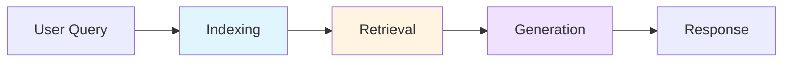
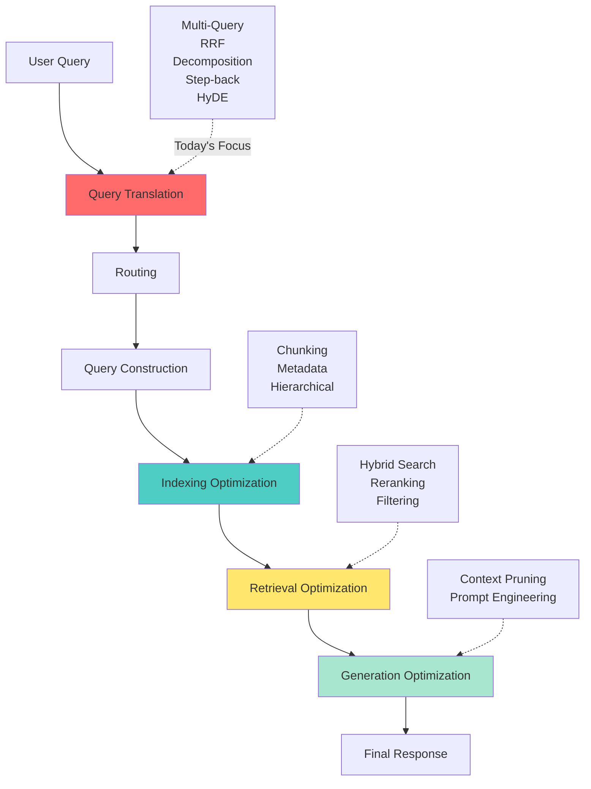
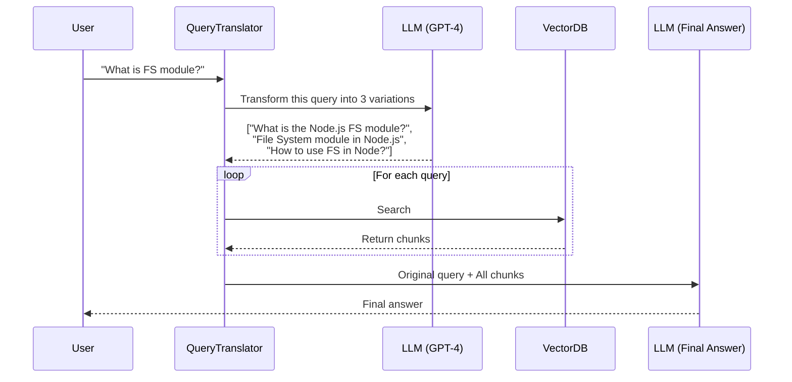
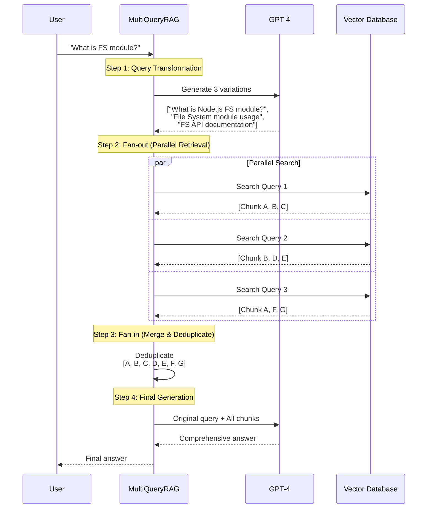
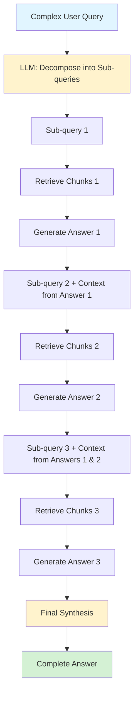
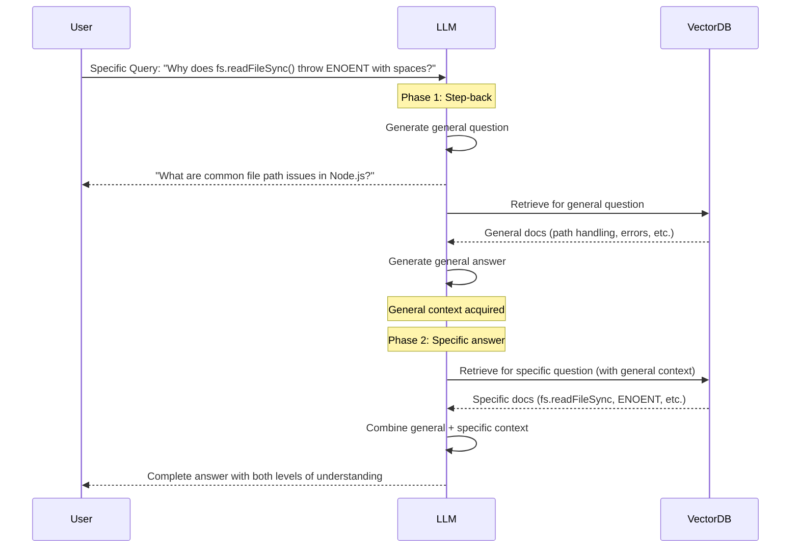
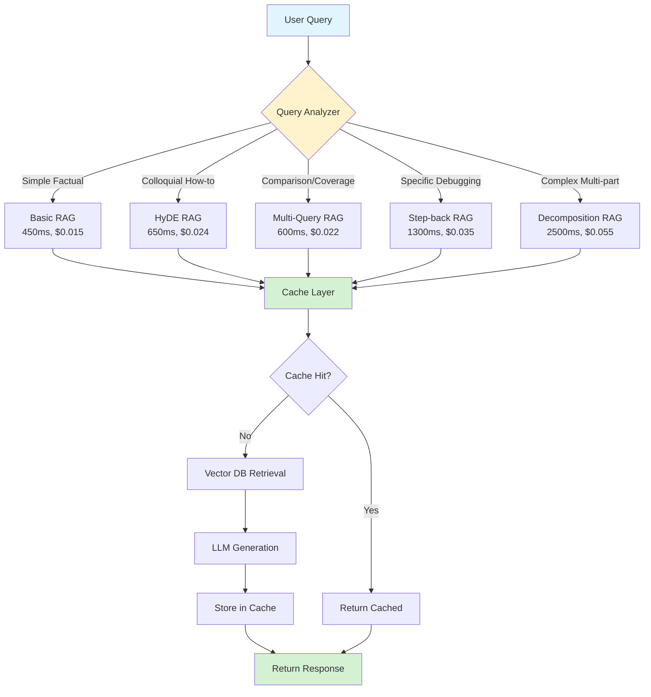

# Session 6: Advanced RAG - Query Translation Patterns & Complete Optimization

## Table of Contents

1. [Foundation: From Basic RAG to Advanced RAG](#part-1-foundation)
2. [Query Translation: The Core Concept](#part-2-query-translation-foundation)
3. [Pattern 1: Parallel Query Retrieval (Multi-Query)](#part-3-pattern-1-parallel-query-retrieval)
4. [Pattern 2: Reciprocal Rank Fusion (RRF)](#part-4-pattern-2-reciprocal-rank-fusion)
5. [Pattern 3: Query Decomposition (Chain of Thought)](#part-5-pattern-3-query-decomposition)
6. [Pattern 4: Step-back Prompting](#part-6-pattern-4-step-back-prompting)
7. [Pattern 5: Hypothetical Document Embeddings (HyDE)](#part-7-pattern-5-hypothetical-document-embeddings)
8. [Complete RAG Pipeline Optimization](#part-8-complete-rag-pipeline-optimization)
9. [Production Engineering Considerations](#part-9-production-engineering)
10. [Practical Exercise: Multi-Query RAG with RRF](#part-10-practical-exercise)

---

## Part 1: Foundation - From Basic RAG to Advanced RAG

### Recap: The Basic RAG Pipeline

In our previous sessions, we built a Basic RAG system with three core stages:



**Let's break down what happens in each stage:**

#### Stage 1: Indexing (The Setup Phase)
```python
# Pseudocode for Basic Indexing
def index_documents(pdf_file):
    # 1. Load document
    text = load_pdf(pdf_file)
    
    # 2. Chunk the text
    chunks = split_text(text, chunk_size=1000)
    
    # 3. Generate embeddings for each chunk
    embeddings = []
    for chunk in chunks:
        embedding = openai.embeddings.create(
            model="text-embedding-ada-002",
            input=chunk
        )
        embeddings.append(embedding)
    
    # 4. Store in vector database
    vector_db.store(chunks, embeddings)
    
    return vector_db
```

**What's happening here?**
- We take a document (PDF, text, etc.)
- Break it into smaller pieces (chunks)
- Convert each chunk into a vector (embedding) - a list of numbers that represents the semantic meaning
- Store these vectors in a vector database (Pinecone, ChromaDB, etc.)

#### Stage 2: Retrieval (The Search Phase)
```python
# Pseudocode for Basic Retrieval
def retrieve_relevant_chunks(user_query, vector_db, top_k=3):
    # 1. Convert user query to embedding
    query_embedding = openai.embeddings.create(
        model="text-embedding-ada-002",
        input=user_query
    )
    
    # 2. Similarity search in vector DB
    relevant_chunks = vector_db.similarity_search(
        query_embedding, 
        k=top_k
    )
    
    return relevant_chunks
```

**What's happening here?**
- User asks a question: "What is the FS module in Node.js?"
- We convert this question into a vector
- We search our vector database for chunks that are "close" to this query vector
- Return the top K most similar chunks

#### Stage 3: Generation (The Answer Phase)
```python
# Pseudocode for Basic Generation
def generate_response(user_query, relevant_chunks):
    # 1. Build context from retrieved chunks
    context = "\n\n".join(relevant_chunks)
    
    # 2. Create prompt
    prompt = f"""
    Based on the following context, answer the user's question.
    
    Context:
    {context}
    
    Question: {user_query}
    
    Answer:
    """
    
    # 3. Get LLM response
    response = openai.chat.completions.create(
        model="gpt-4",
        messages=[{"role": "user", "content": prompt}]
    )
    
    return response.choices[0].message.content
```

**What's happening here?**
- We take the retrieved chunks (context)
- We combine them with the user's original question
- We send this to an LLM (GPT-4, Claude, etc.)
- The LLM generates an answer based on the provided context

---

### Why Basic RAG Fails at Scale

Basic RAG works beautifully for simple use cases:
- Small document sets (10-100 documents)
- Clear, unambiguous queries
- Focused domain (all documents about one topic)

**But in production, you'll face these problems:**

#### Problem 1: The Ambiguous Query Problem
```
User Query: "FS module"

What does the user actually want?
- Definition of FS module?
- How to install it?
- API documentation?
- Code examples?
- Comparison with other modules?
```

When you convert "FS module" to a vector, it's too vague. You might retrieve:
- ✅ A chunk about what FS stands for
- ❌ A chunk about file systems in general
- ❌ A chunk about a different programming language's FS module

#### Problem 2: The Typo/Spelling Problem
```
User Query: "What is file systm module in nods?"

Typos: systm → system, nods → node.js

Basic RAG will:
- Create an embedding with typos
- Likely miss relevant chunks because the vector is "off"
```

#### Problem 3: The Sparse Data Problem
```
Your Vector Database contains:
- 500 chunks about Python
- 50 chunks about Node.js
- 10 chunks about FS module specifically

User Query: "How does FS module handle large files?"

Problem: Only 1-2 chunks might be relevant
If retrieval misses them → poor answer
```

#### Problem 4: The Context Window Problem
```
You retrieve Top-3 chunks:
Chunk 1: General Node.js intro (not very relevant)
Chunk 2: FS module overview (relevant!)
Chunk 3: Path module documentation (not relevant)

Basic RAG sends all 3 to LLM.
Result: LLM gets confused with irrelevant info
```

---

### The Core Insight: The User Query is the Bottleneck

Here's the fundamental realization that leads to Advanced RAG:

**The user doesn't know how to ask the perfect question.**

Think about it from a system design perspective:

```
In a Database System:
- User writes: SELECT * FROM users WHERE name = "John"
- Database doesn't just run this query
- Query Optimizer rewrites it, adds indexes, chooses execution plan
- Then executes the optimized query

In a RAG System:
- User asks: "What is FS module?"
- ❌ Basic RAG: Directly converts query → embedding → search
- ✅ Advanced RAG: Transform query → multiple strategies → best results
```

**The Principle: Garbage In = Garbage Out (GIGO)**

```python
# Basic RAG - Direct path
user_query = "FS module"
embedding = embed(user_query)  # Could be suboptimal
results = vector_db.search(embedding)  # Limited results

# Advanced RAG - Optimized path
user_query = "FS module"
optimized_queries = transform_query(user_query)  # Multiple better queries
results = []
for query in optimized_queries:
    embedding = embed(query)
    results.extend(vector_db.search(embedding))
results = rank_and_merge(results)  # Best results
```

---

### Introduction to RAG Optimization Landscape

Advanced RAG introduces optimization at **every stage** of the pipeline:



**In this session, we'll focus on Query Translation** - the first and most impactful optimization point.

**Why start with Query Translation?**
1. **Highest ROI**: Improves retrieval quality without touching infrastructure
2. **No reindexing**: Works with your existing vector database
3. **Composable**: Can combine multiple techniques
4. **Cost-effective**: Adds minimal latency and cost

---

## Part 2: Query Translation Foundation

### The Abstraction Spectrum: A Mental Model

Before we dive into specific patterns, let's build a mental model for understanding queries.

Every user query exists on a **spectrum of abstraction**:

```
|←――――――――――――――――――― Abstraction Spectrum ―――――――――――――――――→|

More Abstract                                        Less Abstract
(General)                                           (Specific)

"Programming"  →  "Node.js"  →  "FS module"  →  "How to read files with FS"
```

**Examples across the spectrum:**

| Abstraction Level | Query Example | What User Wants |
|------------------|---------------|-----------------|
| **Very Abstract** | "Machine Learning" | Broad overview, multiple aspects |
| **Abstract** | "Neural Networks" | Category information, types, concepts |
| **Neutral** | "Convolutional Neural Networks" | Specific topic, but still general |
| **Specific** | "CNN architecture for image classification" | Detailed implementation info |
| **Very Specific** | "ResNet50 architecture with transfer learning in PyTorch" | Exact code, specific details |

**Why does this matter for RAG?**

Your vector database contains documents at different abstraction levels:
- Some chunks are high-level overviews
- Some chunks are detailed technical explanations
- Some chunks are code examples

**The matching problem:**

```python
User Query (Specific): "How to read a file with FS module?"
↓
Creates an embedding
↓
Searches vector database
↓
Might miss relevant chunks because:
- Chunk uses "file reading" instead of "read a file"
- Chunk uses "filesystem operations" instead of "FS module"
- Chunk uses different terminology
```

---

### What is Query Translation?

**Query Translation** is the process of transforming the user's raw query into one or more optimized queries that improve retrieval quality.

**The Core Philosophy:**

> "Don't trust the user's query. Transform it to match how your documents are actually written."

**Think of it like this:**

```python
# In a web application
def search_users(raw_input):
    # You don't just do: SELECT * FROM users WHERE name = raw_input
    # You sanitize, validate, normalize:
    cleaned_input = raw_input.strip().lower()
    # You might expand:
    query = f"SELECT * FROM users WHERE name LIKE '%{cleaned_input}%' 
             OR email LIKE '%{cleaned_input}%'"
    return execute(query)

# In RAG
def search_documents(user_query):
    # Don't just: embed(user_query) → search
    # Transform the query:
    transformed_queries = translate_query(user_query)
    # Retrieve with multiple strategies:
    results = retrieve_from_multiple_queries(transformed_queries)
    return rank_results(results)
```

---

### The Five Query Translation Patterns

We'll cover five powerful patterns in this session:

#### 1. **Parallel Query Retrieval (Multi-Query)**
- Generate multiple variations of the user's query
- Search in parallel
- Merge results

**When to use:** Ambiguous queries, typos, different phrasings

#### 2. **Reciprocal Rank Fusion (RRF)**
- Rank and merge results from multiple queries
- Prioritize chunks that appear in multiple result sets

**When to use:** After multi-query retrieval to get the best chunks

#### 3. **Query Decomposition (Chain of Thought)**
- Break complex query into simpler sub-queries
- Execute sequentially (each answer feeds into next query)

**When to use:** Complex reasoning, multi-step questions, legal/medical domains

#### 4. **Step-back Prompting**
- Make the query MORE abstract
- Retrieve general context first

**When to use:** When specificity is too narrow, missing broader context

#### 5. **Hypothetical Document Embeddings (HyDE)**
- Generate a hypothetical answer first
- Use that answer to retrieve documents

**When to use:** When you know the topic but not the exact location

---

### Why We Optimize the Query (Not the Documents)

**Key Insight:** It's easier to transform 1 query than to re-index 100,000 documents.

```
Option A: Optimize Documents (Hard)
- Rewrite all chunks for better clarity
- Re-embed everything
- Re-index entire vector database
- Time: Days/Weeks
- Cost: High (re-embedding millions of chunks)

Option B: Optimize Query (Easy)
- Transform user query on-the-fly
- Works with existing vector DB
- Time: Milliseconds
- Cost: Low (one additional LLM call)
```

**The Trade-off Matrix:**

| Approach | Latency | Cost | Accuracy | Complexity |
|----------|---------|------|----------|------------|
| Basic RAG | Low (50ms) | Low | 60-70% | Simple |
| Multi-Query | Medium (200ms) | Medium | 75-85% | Medium |
| Query Decomposition | High (500ms+) | High | 85-95% | Complex |
| HyDE | Medium (300ms) | Medium | 70-80% | Medium |

---

### Mental Model: Query Translation as a Pre-Processor

Think of Query Translation as a **pre-processing layer** in your RAG architecture:



**Key Points:**
1. User's original query is preserved (for final generation)
2. Query Translation happens in the middle (pre-processing)
3. Multiple retrievals can happen in parallel
4. Final generation gets both original query and enriched context

---

## ✅ Checkpoint 1: Understanding Query Translation

Let's verify your understanding before moving to specific patterns.

### Question 1.1: The Abstraction Spectrum

**Scenario:**
You're building a RAG system for a medical knowledge base. A user asks:
```
"Latest treatment for diabetes"
```

**Questions:**
1. Where does this query fall on the abstraction spectrum?
2. What problems might Basic RAG face with this query?
3. Should you make this query MORE abstract or LESS abstract? Why?

<details>
<summary><strong>Click to reveal answer</strong></summary>

**Answer:**

1. **Abstraction Level:** This query is **moderately abstract** (leaning toward abstract)
   - It's not very specific (which diabetes type? Type 1 or Type 2?)
   - It's not very abstract (not asking about "diabetes" in general)

2. **Problems Basic RAG will face:**
   ```
   Problem A: Ambiguity
   - "Latest" → How recent? 2024? 2025? Last month?
   - "Treatment" → Medication? Lifestyle? Surgery? Management?
   - "Diabetes" → Type 1? Type 2? Gestational?
   
   Problem B: Vector mismatch
   - Documents might use "Type 2 Diabetes Management 2025"
   - Documents might use "therapeutic interventions" instead of "treatment"
   - Documents might use "diabetes mellitus" instead of "diabetes"
   
   Problem C: Multiple relevant chunks
   - Different aspects scattered across documents
   - Basic RAG might retrieve only 1-2 chunks, missing broader context
   ```

3. **Strategy: Use BOTH directions**

   **Make it LESS abstract (Query Decomposition):**
   ```python
   transformed_queries = [
       "Type 2 diabetes medication treatment options 2025",
       "Type 1 diabetes insulin therapy latest",
       "Diabetes lifestyle interventions recent research",
       "Diabetes management guidelines 2025"
   ]
   ```
   **Why?** Captures specific sub-topics that might be in separate documents.

   **Make it MORE abstract (Step-back):**
   ```python
   abstract_query = "What is diabetes and what are all treatment approaches?"
   ```
   **Why?** Gets foundational context first, then narrow down to "latest."

   **Best approach for this scenario:**
   Use **Query Decomposition** because medical queries often need specificity.
   ```python
   queries = [
       "What is diabetes mellitus?",  # Foundation
       "Type 2 diabetes treatment guidelines 2025",  # Specific
       "Recent advances in diabetes medication",  # Latest research
       "Diabetes management lifestyle interventions"  # Alternative treatments
   ]
   ```

</details>

---

### Question 1.2: Query Translation ROI

**Scenario:**
You're a backend engineer evaluating whether to implement Query Translation for your company's internal documentation RAG system.

**Current metrics:**
- Basic RAG latency: 80ms (p50), 150ms (p99)
- User satisfaction: 65% (users say answers are "somewhat helpful")
- Cost: $0.002 per query (embedding only)

**Questions:**
1. You implement Multi-Query (generates 3 queries). Estimate new latency and cost.
2. What accuracy improvement would justify the cost increase?
3. What's the risk if you DON'T implement Query Translation?

<details>
<summary><strong>Click to reveal answer</strong></summary>

**Answer:**

1. **New Metrics with Multi-Query:**

   ```python
   # Latency calculation
   Basic RAG:
   - Embed query: 20ms
   - Vector search: 30ms
   - LLM generation: 150ms
   Total: ~200ms
   
   Multi-Query:
   - Transform query (LLM call): 400ms
   - Embed 3 queries: 20ms × 3 = 60ms (can parallelize to ~20ms)
   - Vector search: 30ms × 3 = 90ms (can parallelize to ~30ms)
   - Rank results: 10ms
   - LLM generation: 150ms
   Total: ~610ms (or ~450ms with parallelization)
   
   # Cost calculation
   Basic RAG:
   - Embedding: $0.002
   - LLM generation: $0.008 (assuming GPT-4)
   Total: ~$0.01 per query
   
   Multi-Query:
   - Transform query: $0.008 (LLM call)
   - Embeddings: $0.002 × 3 = $0.006
   - LLM generation: $0.008
   Total: ~$0.022 per query (2.2x increase)
   ```

   **New estimates:**
   - Latency: 450ms p50 (with parallelization)
   - Cost: $0.022 per query
   - Accuracy: Likely 75-85% (10-20% improvement)

2. **Justification Analysis:**

   ```
   Cost increase: $0.012 per query
   
   If you serve 1M queries/month:
   - Additional cost: $12,000/month
   
   Value calculation:
   - If user satisfaction increases from 65% → 80%
   - Fewer support tickets (users find answers themselves)
   - Fewer escalations to human support
   
   Break-even: If you save 30 support hours/month at $50/hr = $1,500
   Not worth it just from cost savings alone.
   
   But consider:
   - Developer productivity (finding info faster)
   - Reduced churn (better docs experience)
   - Competitive advantage
   
   Rule of thumb: 10%+ accuracy improvement justifies 2x cost increase
   for internal tools where user productivity matters.
   ```

3. **Risk of NOT implementing Query Translation:**

   ```
   Short-term risks:
   - Users continue to get subpar answers
   - Workarounds: Asking teammates instead of using docs
   - Shadow cost: Productivity loss from interruptions
   
   Long-term risks:
   - Users lose trust in RAG system
   - People stop using it entirely
   - You built a system that nobody uses
   
   Engineering perspective:
   - You're optimizing for the wrong metric (cost) instead of value
   - $12K/month is negligible compared to engineering salaries
   - 1 engineer spending 2 hours/week helping others = $10K/month
   
   Decision: IMPLEMENT IT
   - Start with Multi-Query (easiest wins)
   - Measure impact
   - Iterate based on user feedback
   ```

**Key Insight:**  
In internal tools, optimize for **user productivity**, not cost. The real cost is wasted engineering time, not LLM API calls.

</details>

---

## Part 3: Pattern 1 - Parallel Query Retrieval (Multi-Query)

Now that we understand WHY we need Query Translation, let's implement our first pattern.

### The Core Idea

**Parallel Query Retrieval** (also called Multi-Query) works like this:

1. Take the user's single query
2. Use an LLM to generate multiple variations of that query
3. Search the vector database with EACH variation in parallel
4. Merge and deduplicate the results
5. Use the combined results for final generation

**The intuition:**

```
User asks: "FS module"

What they might mean:
- "What is the FS module in Node.js?"
- "How to use File System module?"
- "Node.js file operations with FS"
- "FS module API documentation"

Instead of guessing, we search for ALL of them!
```

---

### Step-by-Step: How Multi-Query Works

Let's walk through a complete example:

#### Step 1: User Query
```python
user_query = "What is FS module?"
```

#### Step 2: Generate Multiple Queries
```python
system_prompt = """
You are an AI assistant that helps rewrite user queries.
Given a user query, generate 3 different variations that:
1. Add context and clarification
2. Use different terminology
3. Cover different aspects

Output ONLY the 3 queries, one per line.
"""

user_prompt = f"""
Original query: {user_query}

Generate 3 variations:
"""

# Call LLM
response = openai.chat.completions.create(
    model="gpt-4",
    messages=[
        {"role": "system", "content": system_prompt},
        {"role": "user", "content": user_prompt}
    ]
)

# Parse response
generated_queries = response.choices[0].message.content.strip().split('\n')

# Result:
# [
#     "What is the Node.js FS (File System) module?",
#     "How does the FS module work in Node.js for file operations?",
#     "File System module documentation and usage in Node.js"
# ]
```

**What just happened?**
- We gave the LLM our vague query: "FS module"
- The LLM added context: "Node.js", "File System"
- The LLM created variations: definition, usage, documentation
- Each variation targets different aspects of what the user might want

#### Step 3: Parallel Vector Search
```python
def parallel_search(queries, vector_db, top_k=3):
    """
    Search vector DB with multiple queries in parallel
    """
    all_results = []
    
    # Generate embeddings for all queries
    embeddings = []
    for query in queries:
        embedding = openai.embeddings.create(
            model="text-embedding-ada-002",
            input=query
        )
        embeddings.append(embedding.data[0].embedding)
    
    # Search with each embedding
    for embedding in embeddings:
        results = vector_db.similarity_search(
            embedding=embedding,
            k=top_k
        )
        all_results.extend(results)
    
    return all_results
```

**What's happening here?**
```
Query 1: "What is the Node.js FS module?" 
→ Embedding_1 
→ Search 
→ Returns: [Chunk_A, Chunk_B, Chunk_C]

Query 2: "How does the FS module work?" 
→ Embedding_2 
→ Search 
→ Returns: [Chunk_B, Chunk_D, Chunk_E]

Query 3: "File System module documentation" 
→ Embedding_3 
→ Search 
→ Returns: [Chunk_A, Chunk_F, Chunk_G]

Combined: [Chunk_A, Chunk_B, Chunk_C, Chunk_D, Chunk_E, Chunk_F, Chunk_G]
```

Notice:
- ✅ **Chunk_A appears 2 times** (from Query 1 and Query 3) → Probably important!
- ✅ **Chunk_B appears 2 times** (from Query 1 and Query 2) → Probably important!
- **Chunk_C, D, E, F, G appear 1 time** → Less important

#### Step 4: Deduplicate and Filter
```python
def deduplicate_chunks(chunks):
    """
    Remove duplicate chunks, keep unique ones
    """
    seen_ids = set()
    unique_chunks = []
    
    for chunk in chunks:
        chunk_id = chunk['id']  # Each chunk has a unique ID
        if chunk_id not in seen_ids:
            seen_ids.add(chunk_id)
            unique_chunks.append(chunk)
    
    return unique_chunks
```

**After deduplication:**
```python
# Before: 9 chunks (3 queries × 3 chunks each)
all_chunks = [Chunk_A, Chunk_B, Chunk_C, Chunk_B, Chunk_D, Chunk_E, 
              Chunk_A, Chunk_F, Chunk_G]

# After: 7 unique chunks
unique_chunks = [Chunk_A, Chunk_B, Chunk_C, Chunk_D, Chunk_E, Chunk_F, Chunk_G]
```

#### Step 5: Generate Final Answer
```python
def generate_final_answer(original_query, retrieved_chunks):
    """
    Use retrieved chunks to answer the original user query
    """
    # Build context from all unique chunks
    context = "\n\n---\n\n".join([chunk['text'] for chunk in retrieved_chunks])
    
    prompt = f"""
    Based on the following context, answer the user's question comprehensively.
    
    Context:
    {context}
    
    User Question: {original_query}
    
    Answer:
    """
    
    response = openai.chat.completions.create(
        model="gpt-4",
        messages=[{"role": "user", "content": prompt}]
    )
    
    return response.choices[0].message.content
```

**Important:** We use the **original user query** for final generation, not the transformed queries. Why?

```
Original query: "What is FS module?"
User expects: A direct answer to "what is FS module"

If we used transformed query: "How does the FS module work in Node.js for file operations?"
LLM might answer: A step-by-step guide on file operations
This doesn't match what user asked!

Solution: Transform for retrieval, but keep original for generation
```

---

### Complete Code Example

Here's the full implementation:

```python
import openai
from typing import List, Dict

class MultiQueryRAG:
    def __init__(self, vector_db, openai_api_key):
        self.vector_db = vector_db
        openai.api_key = openai_api_key
    
    def generate_multiple_queries(self, user_query: str, num_queries: int = 3) -> List[str]:
        """
        Step 1: Generate multiple query variations using LLM
        """
        system_prompt = """
        You are an AI assistant that helps rewrite queries for better search results.
        Given a user query, generate {num_queries} different variations that:
        1. Add helpful context
        2. Use different terminology
        3. Cover different aspects of the question
        
        Return ONLY the queries, one per line, without numbering.
        """.format(num_queries=num_queries)
        
        response = openai.chat.completions.create(
            model="gpt-4",
            temperature=0.7,  # Some creativity for variations
            messages=[
                {"role": "system", "content": system_prompt},
                {"role": "user", "content": f"Original query: {user_query}"}
            ]
        )
        
        queries = response.choices[0].message.content.strip().split('\n')
        queries = [q.strip() for q in queries if q.strip()]
        
        return queries
    
    def parallel_retrieve(self, queries: List[str], top_k: int = 3) -> List[Dict]:
        """
        Step 2: Retrieve documents for each query in parallel
        """
        all_results = []
        
        for query in queries:
            # Generate embedding
            embedding_response = openai.embeddings.create(
                model="text-embedding-ada-002",
                input=query
            )
            embedding = embedding_response.data[0].embedding
            
            # Search vector DB
            results = self.vector_db.similarity_search(
                embedding=embedding,
                k=top_k
            )
            
            all_results.extend(results)
        
        return all_results
    
    def deduplicate(self, chunks: List[Dict]) -> List[Dict]:
        """
        Step 3: Remove duplicate chunks
        """
        seen_ids = set()
        unique_chunks = []
        
        for chunk in chunks:
            chunk_id = chunk.get('id') or chunk.get('chunk_id')
            if chunk_id not in seen_ids:
                seen_ids.add(chunk_id)
                unique_chunks.append(chunk)
        
        return unique_chunks
    
    def generate_answer(self, original_query: str, chunks: List[Dict]) -> str:
        """
        Step 4: Generate final answer using original query and all chunks
        """
        context = "\n\n---\n\n".join([chunk['text'] for chunk in chunks])
        
        prompt = f"""
        Answer the following question based on the provided context.
        Be comprehensive but concise.
        
        Context:
        {context}
        
        Question: {original_query}
        
        Answer:
        """
        
        response = openai.chat.completions.create(
            model="gpt-4",
            messages=[{"role": "user", "content": prompt}]
        )
        
        return response.choices[0].message.content
    
    def query(self, user_query: str) -> Dict:
        """
        Complete Multi-Query RAG pipeline
        """
        # Step 1: Generate multiple queries
        print(f"Original query: {user_query}")
        generated_queries = self.generate_multiple_queries(user_query)
        print(f"Generated {len(generated_queries)} variations:")
        for i, q in enumerate(generated_queries, 1):
            print(f"  {i}. {q}")
        
        # Step 2: Retrieve with all queries
        all_chunks = self.parallel_retrieve(generated_queries, top_k=3)
        print(f"Retrieved {len(all_chunks)} total chunks")
        
        # Step 3: Deduplicate
        unique_chunks = self.deduplicate(all_chunks)
        print(f"After deduplication: {unique_chunks} unique chunks")
        
        # Step 4: Generate answer
        answer = self.generate_answer(user_query, unique_chunks)
        
        return {
            "original_query": user_query,
            "generated_queries": generated_queries,
            "num_chunks_retrieved": len(all_chunks),
            "num_unique_chunks": len(unique_chunks),
            "answer": answer
        }


# Usage Example
if __name__ == "__main__":
    # Initialize (assuming you have a vector_db already set up)
    rag = MultiQueryRAG(vector_db=my_vector_db, openai_api_key="your-key")
    
    # Query
    result = rag.query("What is FS module?")
    print("\n" + "="*50)
    print("FINAL ANSWER:")
    print("="*50)
    print(result["answer"])
```

---

### The Fan-out Architecture Pattern

Let's visualize what's happening with a sequence diagram:



**This is called a "Fan-out/Fan-in" pattern** (common in distributed systems):

```
Fan-out: One request → Multiple parallel operations
Fan-in: Multiple results → Combined into one

Same pattern used in:
- MapReduce (map phase = fan-out, reduce phase = fan-in)
- Microservices (API Gateway fans out to multiple services)
- Database queries (parallel partition scans)
```

---

### Trade-offs: When to Use Multi-Query

**✅ Use Multi-Query when:**

1. **User queries are ambiguous**
   ```
   Example: "Python async"
   Could mean: async/await, asyncio library, async programming concepts
   Multi-query captures all interpretations
   ```

2. **Documents use varied terminology**
   ```
   Example: Same concept described as:
   - "File System module"
   - "FS package"
   - "Node.js file operations library"
   Multi-query matches all variations
   ```

3. **Data is sparse (small document set)**
   ```
   If you only have 50 documents about Node.js:
   - Single query might miss the 1-2 relevant chunks
   - Multi-query casts a wider net
   ```

4. **Typo tolerance is important**
   ```
   User query: "file systm module"
   Generated queries: "file system module", "filesystem module"
   LLM auto-corrects typos in the transformation step
   ```

**❌ Don't use Multi-Query when:**

1. **Latency is critical (< 200ms requirement)**
   ```
   Multi-query adds 400-600ms overhead
   Better option: Use caching or simpler query expansion
   ```

2. **Cost is a major constraint**
   ```
   Multi-query costs 2-3x more (additional LLM call + more embeddings)
   For high-volume systems (millions of queries/day), consider alternatives
   ```

3. **Queries are already very specific**
   ```
   Example: "Show me the code for fs.readFileSync() in Node.js"
   This is already specific, multi-query adds little value
   ```

4. **Vector DB is already high-quality and dense**
   ```
   If your documents are well-indexed with metadata and your
   retrieval already works well, optimization may not be needed
   ```

---

### Performance Metrics

Based on production experience, here's what you can expect:

| Metric | Basic RAG | Multi-Query RAG |
|--------|-----------|-----------------|
| **Latency (p50)** | 80ms | 450ms (with parallelization) |
| **Latency (p99)** | 150ms | 800ms |
| **Cost per query** | $0.01 | $0.022 (2.2x) |
| **Retrieval accuracy** | 60-70% | 75-85% (+10-15%) |
| **False positives** | 25-30% | 15-20% (-10%) |
| **User satisfaction** | 65% | 78-82% (+13-17%) |

**Key insight:** The accuracy improvement is usually worth the cost for most applications.

---

## ✅ Checkpoint 2: Multi-Query Pattern

### Question 2.1: Debugging Multi-Query

**Scenario:**
You implemented Multi-Query RAG, but users are complaining that:
- Responses take too long (800ms average)
- Sometimes the answers are "off-topic" or include irrelevant information

Your current implementation:
```python
def generate_multiple_queries(user_query):
    # Generates 5 variations
    return llm.generate(f"Create 5 variations of: {user_query}")

def parallel_retrieve(queries):
    all_chunks = []
    for query in queries:
        chunks = vector_db.search(query, top_k=5)
        all_chunks.extend(chunks)
    return all_chunks  # Returns up to 25 chunks (5 queries × 5 chunks)
```

**Questions:**
1. What's causing the latency issue?
2. What's causing the off-topic answers?
3. How would you fix both issues?

<details>
<summary><strong>Click to reveal answer</strong></summary>

**Answer:**

1. **Latency Issue - Root Causes:**

   ```python
   # Current latency breakdown:
   - Generate 5 variations: 500ms (LLM call)
   - 5 sequential searches: 5 × 50ms = 250ms
   - Embed 5 queries: 5 × 20ms = 100ms
   - Generate final answer with 25 chunks: 800ms (large context)
   Total: ~1,650ms 🔴
   
   # Problems:
   Problem A: Generating 5 queries instead of 3
   - More queries = more latency
   - Diminishing returns after 3-4 queries
   
   Problem B: Not parallelizing searches
   - Sequential: 5 × 50ms = 250ms
   - Parallel: ~50ms (all at once)
   
   Problem C: Too many chunks (25)
   - Large context → slow LLM processing
   - More tokens = higher cost
   ```

2. **Off-topic Answers - Root Causes:**

   ```python
   # You're sending 25 chunks to the LLM!
   # Problems:
   
   Problem A: No deduplication
   - Same chunk appears multiple times
   - LLM sees redundant information
   
   Problem B: No ranking/filtering
   - All chunks treated equally
   - Low-quality chunks pollute context
   
   Problem C: Too much context
   - LLM gets confused with 25 chunks
   - Might latch onto irrelevant details
   - "Lost in the middle" problem
   ```

3. **Fixes:**

   ```python
   # Fix 1: Reduce number of queries
   def generate_multiple_queries(user_query):
       # 3 queries is the sweet spot
       return llm.generate(f"Create 3 variations of: {user_query}")
   
   # Fix 2: Parallelize searches
   import concurrent.futures
   
   def parallel_retrieve(queries):
       with concurrent.futures.ThreadPoolExecutor() as executor:
           # Submit all searches at once
           futures = [
               executor.submit(vector_db.search, query, top_k=3)
               for query in queries
           ]
           # Gather results
           all_chunks = []
           for future in concurrent.futures.as_completed(futures):
               all_chunks.extend(future.result())
       return all_chunks
   
   # Fix 3: Deduplicate and rank (Preview of RRF pattern)
   def process_chunks(chunks):
       # Remove duplicates
       unique_chunks = deduplicate(chunks)
       
       # Keep only top 5-7 chunks
       ranked_chunks = rank_by_frequency(unique_chunks)[:7]
       
       return ranked_chunks
   
   # Complete optimized pipeline:
   def optimized_query(user_query):
       # 1. Generate 3 queries (not 5)
       queries = generate_multiple_queries(user_query)  # 500ms
       
       # 2. Parallel search with top_k=3 (not 5)
       all_chunks = parallel_retrieve(queries)  # 50ms (parallel)
       # Total chunks: up to 9 (3 queries × 3 chunks)
       
       # 3. Deduplicate and rank
       final_chunks = process_chunks(all_chunks)  # 10ms
       # Final chunks: ~5-7 unique chunks
       
       # 4. Generate answer
       answer = generate_answer(user_query, final_chunks)  # 400ms
       
       return answer
   
   # New latency: 500 + 50 + 10 + 400 = ~960ms
   # But with better parallelization: ~600-700ms
   ```

   **Optimized metrics:**
   ```
   Before:
   - Latency: 1,650ms
   - Chunks sent to LLM: 25
   - Quality: Poor (off-topic)
   
   After:
   - Latency: 600-700ms (2.5x faster)
   - Chunks sent to LLM: 5-7 (3.5x fewer)
   - Quality: Much better (focused)
   ```

**Key Lessons:**
1. **More is not always better** - 3 queries > 5 queries
2. **Parallelize everything** - Fan-out searches simultaneously
3. **Quality over quantity** - 5 good chunks > 25 mixed chunks
4. **Always deduplicate** - Same chunk appearing multiple times wastes tokens

</details>

---

### Question 2.2: Multi-Query vs Basic RAG Decision

**Scenario:**
You're an engineering manager deciding whether to implement Multi-Query RAG for three different products:

**Product A: Internal documentation search**
- Users: 500 engineers
- Queries: ~10,000/day
- Current satisfaction: 60%
- Documents: 5,000 docs (well-structured)
- Latency requirement: < 1 second
- Budget: Flexible

**Product B: Customer support chatbot**
- Users: 10,000 customers/day
- Queries: ~50,000/day
- Current satisfaction: 55%
- Documents: 500 docs (FAQ-style)
- Latency requirement: < 300ms
- Budget: Tight (high volume)

**Product C: Legal document analysis**
- Users: 20 lawyers
- Queries: ~100/day
- Current satisfaction: 50%
- Documents: 10,000 legal docs (complex)
- Latency requirement: < 5 seconds
- Budget: Very flexible

**Question:** For each product, should you implement Multi-Query RAG? Why or why not?

<details>
<summary><strong>Click to reveal answer</strong></summary>

**Answer:**

**Product A: Internal Documentation** ✅ **YES - Implement Multi-Query**

```
Analysis:
✅ Latency: 600ms is well under 1 second requirement
✅ Volume: 10K queries/day is manageable
✅ Cost: ~$220/day additional cost ($0.022 × 10K) = $6,600/month
✅ Value: Engineers are expensive ($150K+ salary)
   - Time saved finding info > cost of Multi-Query
   - Better docs experience = happier engineers
✅ Quality matters: Engineers need accurate technical info
   - 60% → 78% satisfaction = significant productivity boost

Decision: IMPLEMENT
- Expected ROI: High (engineer time is expensive)
- Risk: Low (latency is fine, budget is flexible)

Implementation tips:
- Start with 3 queries
- Monitor which query variations work best
- A/B test: 50% users get Multi-Query, 50% get Basic
- Measure: Time to find answer, user satisfaction
```

---

**Product B: Customer Support Chatbot** ❌ **NO - Don't Implement (Yet)**

```
Analysis:
❌ Latency: 600ms > 300ms requirement
   - Customers expect instant responses
   - Mobile users will experience lag
❌ Cost: ~$1,100/day additional cost = $33K/month
   - High volume makes this expensive
   - 55% satisfaction might not justify cost
❌ Documents: Only 500 FAQ-style docs
   - Sparse data doesn't benefit much from Multi-Query
   - Better to improve docs quality first

Decision: DON'T IMPLEMENT (explore alternatives)

Alternative strategies:
1. Optimize your chunks and metadata first
   - Better indexing might be enough
   - Add FAQ tags, categories
   
2. Use query expansion (cheaper alternative)
   - Simple keyword expansion
   - No LLM call needed
   - Example: "reset password" → ["reset password", "change password", "forgot password"]
   
3. Implement caching
   - Many customer queries repeat
   - Cache popular query results
   - Serve cached results instantly
   
4. Hybrid approach
   - Use Multi-Query only for complex queries
   - Simple queries use Basic RAG
   
Re-evaluate when:
- You have budget for infrastructure optimization
- You can reduce latency to < 300ms
- User satisfaction drops below 50%
```

---

**Product C: Legal Document Analysis** ✅✅ **DEFINITELY YES - Implement Multi-Query (+ More)**

```
Analysis:
✅✅ Latency: 600ms is nothing (5 second limit)
    - Lawyers are used to research taking time
    - Quality >>> Speed for legal work
✅✅ Cost: ~$2.20/day = $66/month (negligible)
    - Only 100 queries/day
    - Budget is very flexible
✅✅ Quality is CRITICAL
    - 50% satisfaction is dangerously low for legal work
    - Missing a case cite could be malpractice
    - Accuracy is non-negotiable
✅✅ Complex documents
    - Legal docs use varied terminology
    - Multi-Query helps capture all relevant case law

Decision: DEFINITELY IMPLEMENT
- But don't stop at Multi-Query!
- Implement RRF ranking (next pattern)
- Consider Query Decomposition (Pattern 3)
- Add reranking models

Recommended architecture:
1. Multi-Query (3-5 variations)
2. Reciprocal Rank Fusion
3. Reranking with a specialized model
4. Citation extraction
5. Human review for high-stakes queries

Expected results:
- Cost: ~$100/month (irrelevant for legal billing)
- Accuracy: 50% → 85%+
- Lawyer satisfaction: High
- Risk mitigation: Significant

ROI Calculation:
- 1 hour of lawyer time = $300-500
- If Multi-Query saves 10 minutes per query:
  - 100 queries/day × 10 min = 1,000 min/day = 16 hours/day saved
  - Value: 16 × $400 = $6,400/day saved
  - Cost: $2.20/day
  - ROI: 2,900x 🚀
```

---

**Summary Decision Matrix:**

| Product | Implement? | Primary Reason |
|---------|-----------|----------------|
| **Internal Docs** | ✅ Yes | High ROI, engineer productivity matters |
| **Support Chatbot** | ❌ No | Latency + cost constraints, explore alternatives first |
| **Legal Analysis** | ✅✅ Definitely | Accuracy critical, cost irrelevant, huge ROI |

**Key Principle:**  
Implement Multi-Query when **accuracy improvement > cost increase** in terms of user value, not just dollars.

</details>

---

**Great work!** 🎉 You now understand:
- ✅ The Multi-Query pattern
- ✅ When to use it (and when not to)
- ✅ How to implement it efficiently
- ✅ How to debug common issues

**Next:** We'll learn how to RANK the results we get from Multi-Query using **Reciprocal Rank Fusion (RRF)**.

---

## Part 4: Pattern 2 - Reciprocal Rank Fusion (RRF)

### The Ranking Problem

In Part 3, we learned how to retrieve multiple sets of chunks using Multi-Query. But we encountered a problem:

```python
# After Multi-Query retrieval:
Query 1 → [Chunk_A, Chunk_B, Chunk_C]
Query 2 → [Chunk_B, Chunk_D, Chunk_E]
Query 3 → [Chunk_A, Chunk_F, Chunk_G]

# After deduplication:
unique_chunks = [Chunk_A, Chunk_B, Chunk_C, Chunk_D, Chunk_E, Chunk_F, Chunk_G]

# Problem: Which chunks are MOST important?
# Chunk_A appeared 2 times (Queries 1 & 3)
# Chunk_B appeared 2 times (Queries 1 & 2)
# Chunks C, D, E, F, G appeared only 1 time each

# Question: Should we send all 7 chunks to the LLM?
# Or should we rank them and send only the top ones?
```

**The insight:** Chunks that appear in multiple result sets are probably more relevant!

**But how do we rank them properly?**

This is where **Reciprocal Rank Fusion (RRF)** comes in.

---

### What is Reciprocal Rank Fusion?

**Reciprocal Rank Fusion (RRF)** is a ranking algorithm that combines results from multiple ranked lists into a single unified ranking.

**The intuition:**

```
Think about this scenario:

You ask 3 friends for restaurant recommendations in a new city:

Friend 1's ranked list:
1. Pizza Palace
2. Burger Barn
3. Sushi Spot

Friend 2's ranked list:
1. Burger Barn
2. Taco Town
3. Pizza Palace

Friend 3's ranked list:
1. Pizza Palace
2. Noodle House
3. Burger Barn

Question: Which restaurant should you try first?

Answer: Pizza Palace!
- Appears in all 3 lists
- Ranked #1 by Friend 1 and Friend 3
- Ranked #3 by Friend 2

Burger Barn is also good:
- Appears in all 3 lists
- Ranked #1 by Friend 2
- But ranked lower by others

RRF gives you a way to mathematically combine these rankings.
```

---

### The RRF Formula

The RRF formula is surprisingly simple:

```
RRF_score(document) = Σ ( 1 / (k + rank) )

Where:
- Σ means "sum across all queries"
- k is a constant (typically 60)
- rank is the position of the document in that query's results
```

**Let's break this down:**

```python
# Example: Chunk_A appears in Query 1 and Query 3

Query 1 results: [Chunk_A, Chunk_B, Chunk_C]
                    ↑
                  Rank 1

Query 3 results: [Chunk_A, Chunk_F, Chunk_G]
                    ↑
                  Rank 1

# RRF Score for Chunk_A:
k = 60
RRF_score(Chunk_A) = 1/(60 + 1) + 1/(60 + 1)
                   = 1/61 + 1/61
                   = 0.0164 + 0.0164
                   = 0.0328
```

**Why does this work?**

1. **Higher rank = higher score**
   - Rank 1: 1/(60+1) = 0.0164
   - Rank 2: 1/(60+2) = 0.0161
   - Rank 3: 1/(60+3) = 0.0159
   - Top-ranked items contribute more to the score

2. **Multiple appearances = higher score**
   - Appears in 1 query: score = ~0.016
   - Appears in 2 queries: score = ~0.032
   - Appears in 3 queries: score = ~0.048

3. **The constant k = 60 smooths the scores**
   - Without k: Rank 1 = 1.0, Rank 2 = 0.5 (huge drop!)
   - With k=60: Rank 1 = 0.0164, Rank 2 = 0.0161 (smooth drop)

---

### Step-by-Step RRF Example

Let's work through a complete example:

#### Input: Multi-Query Results

```python
# We have 3 queries, each returns top-3 chunks
results = {
    "Query 1": [
        {"id": "chunk_a", "text": "FS module is..."},
        {"id": "chunk_b", "text": "File System..."},
        {"id": "chunk_c", "text": "Node.js filesystem..."}
    ],
    "Query 2": [
        {"id": "chunk_b", "text": "File System..."},
        {"id": "chunk_d", "text": "Reading files..."},
        {"id": "chunk_e", "text": "Writing files..."}
    ],
    "Query 3": [
        {"id": "chunk_a", "text": "FS module is..."},
        {"id": "chunk_f", "text": "File operations..."},
        {"id": "chunk_g", "text": "Directory handling..."}
    ]
}
```

#### Step 1: Extract Rankings

```python
rankings = {
    "Query 1": {
        "chunk_a": 1,  # 1st position
        "chunk_b": 2,  # 2nd position
        "chunk_c": 3   # 3rd position
    },
    "Query 2": {
        "chunk_b": 1,  # 1st position
        "chunk_d": 2,  # 2nd position
        "chunk_e": 3   # 3rd position
    },
    "Query 3": {
        "chunk_a": 1,  # 1st position
        "chunk_f": 2,  # 2nd position
        "chunk_g": 3   # 3rd position
    }
}
```

#### Step 2: Calculate RRF Scores

```python
k = 60

# Chunk A (appears in Query 1 and Query 3)
RRF(chunk_a) = 1/(60+1) + 1/(60+1)
             = 1/61 + 1/61
             = 0.0328

# Chunk B (appears in Query 1 and Query 2)
RRF(chunk_b) = 1/(60+2) + 1/(60+1)
             = 1/62 + 1/61
             = 0.0161 + 0.0164
             = 0.0325

# Chunk C (appears only in Query 1)
RRF(chunk_c) = 1/(60+3)
             = 1/63
             = 0.0159

# Chunk D (appears only in Query 2)
RRF(chunk_d) = 1/(60+2)
             = 1/62
             = 0.0161

# Chunk E (appears only in Query 2)
RRF(chunk_e) = 1/(60+3)
             = 1/63
             = 0.0159

# Chunk F (appears only in Query 3)
RRF(chunk_f) = 1/(60+2)
             = 1/62
             = 0.0161

# Chunk G (appears only in Query 3)
RRF(chunk_g) = 1/(60+3)
             = 1/63
             = 0.0159
```

#### Step 3: Sort by RRF Score

```python
sorted_results = [
    ("chunk_a", 0.0328),  # 🥇 Winner! (appeared 2x, both at rank 1)
    ("chunk_b", 0.0325),  # 🥈 Second (appeared 2x, ranks 1 and 2)
    ("chunk_d", 0.0161),  # Appeared 1x at rank 2
    ("chunk_f", 0.0161),  # Appeared 1x at rank 2
    ("chunk_c", 0.0159),  # Appeared 1x at rank 3
    ("chunk_e", 0.0159),  # Appeared 1x at rank 3
    ("chunk_g", 0.0159)   # Appeared 1x at rank 3
]
```

#### Step 4: Select Top-K Chunks

```python
# For final generation, we only want top 5 chunks
top_chunks = sorted_results[:5]

# Send to LLM: chunk_a, chunk_b, chunk_d, chunk_f, chunk_c
# Notice: Chunks that appeared multiple times are prioritized!
```

---

### Complete RRF Implementation

Here's a production-ready RRF implementation:

```python
from typing import List, Dict, Tuple
from collections import defaultdict

class ReciprocalRankFusion:
    def __init__(self, k: int = 60):
        """
        Initialize RRF with a constant k.
        
        Args:
            k: Smoothing constant (default 60, as per research)
        """
        self.k = k
    
    def fuse(self, ranked_results: Dict[str, List[Dict]], top_k: int = 5) -> List[Dict]:
        """
        Fuse multiple ranked lists using Reciprocal Rank Fusion.
        
        Args:
            ranked_results: Dictionary mapping query_id to ranked list of chunks
                           Format: {
                               "query_1": [chunk1, chunk2, chunk3, ...],
                               "query_2": [chunk1, chunk2, chunk3, ...],
                               ...
                           }
            top_k: Number of top results to return after fusion
        
        Returns:
            List of top-k chunks sorted by RRF score
        """
        # Step 1: Calculate RRF scores for each unique chunk
        rrf_scores = defaultdict(float)
        chunk_data = {}  # Store chunk metadata
        
        # Iterate through each query's results
        for query_id, chunks in ranked_results.items():
            for rank, chunk in enumerate(chunks, start=1):
                chunk_id = chunk.get('id') or chunk.get('chunk_id')
                
                # Calculate RRF contribution from this ranking
                rrf_contribution = 1.0 / (self.k + rank)
                rrf_scores[chunk_id] += rrf_contribution
                
                # Store chunk data (we'll need the text later)
                if chunk_id not in chunk_data:
                    chunk_data[chunk_id] = chunk
        
        # Step 2: Sort chunks by RRF score (descending)
        sorted_chunks = sorted(
            rrf_scores.items(),
            key=lambda x: x[1],
            reverse=True
        )
        
        # Step 3: Return top-k chunks with their data
        top_chunks = []
        for chunk_id, score in sorted_chunks[:top_k]:
            chunk = chunk_data[chunk_id].copy()
            chunk['rrf_score'] = score
            top_chunks.append(chunk)
        
        return top_chunks
    
    def explain_ranking(self, ranked_results: Dict[str, List[Dict]], top_k: int = 5):
        """
        Explain how RRF scores were calculated (for debugging).
        
        Returns a detailed breakdown of scoring.
        """
        explanations = defaultdict(list)
        rrf_scores = defaultdict(float)
        
        for query_id, chunks in ranked_results.items():
            for rank, chunk in enumerate(chunks, start=1):
                chunk_id = chunk.get('id') or chunk.get('chunk_id')
                contribution = 1.0 / (self.k + rank)
                
                rrf_scores[chunk_id] += contribution
                explanations[chunk_id].append({
                    'query': query_id,
                    'rank': rank,
                    'contribution': contribution
                })
        
        # Sort and display
        sorted_chunks = sorted(rrf_scores.items(), key=lambda x: x[1], reverse=True)
        
        print("="*80)
        print("RRF RANKING EXPLANATION")
        print("="*80)
        
        for i, (chunk_id, total_score) in enumerate(sorted_chunks[:top_k], 1):
            print(f"\n#{i} - {chunk_id}")
            print(f"   Total RRF Score: {total_score:.6f}")
            print(f"   Breakdown:")
            
            for detail in explanations[chunk_id]:
                print(f"      {detail['query']}: Rank {detail['rank']} → "
                      f"1/({self.k}+{detail['rank']}) = {detail['contribution']:.6f}")
        
        print("\n" + "="*80)


# Usage Example
if __name__ == "__main__":
    # Example: Results from 3 different queries
    multi_query_results = {
        "query_1": [
            {"id": "chunk_a", "text": "FS module is a built-in Node.js module..."},
            {"id": "chunk_b", "text": "File System operations in Node.js..."},
            {"id": "chunk_c", "text": "Working with files using FS..."}
        ],
        "query_2": [
            {"id": "chunk_b", "text": "File System operations in Node.js..."},
            {"id": "chunk_d", "text": "Reading files with fs.readFile()..."},
            {"id": "chunk_e", "text": "Writing files with fs.writeFile()..."}
        ],
        "query_3": [
            {"id": "chunk_a", "text": "FS module is a built-in Node.js module..."},
            {"id": "chunk_f", "text": "Synchronous vs asynchronous file operations..."},
            {"id": "chunk_g", "text": "Directory operations with fs.mkdir()..."}
        ]
    }
    
    # Initialize RRF
    rrf = ReciprocalRankFusion(k=60)
    
    # Get top 5 chunks
    top_chunks = rrf.fuse(multi_query_results, top_k=5)
    
    print("Top 5 chunks after RRF:")
    for i, chunk in enumerate(top_chunks, 1):
        print(f"{i}. {chunk['id']} (score: {chunk['rrf_score']:.6f})")
        print(f"   {chunk['text'][:60]}...")
    
    # Explain the ranking
    print("\n")
    rrf.explain_ranking(multi_query_results, top_k=5)
```

**Output:**
```
Top 5 chunks after RRF:
1. chunk_a (score: 0.032787)
   FS module is a built-in Node.js module...
2. chunk_b (score: 0.032520)
   File System operations in Node.js...
3. chunk_d (score: 0.016129)
   Reading files with fs.readFile()...
4. chunk_f (score: 0.016129)
   Synchronous vs asynchronous file operations...
5. chunk_c (score: 0.015873)
   Working with files using FS...

================================================================================
RRF RANKING EXPLANATION
================================================================================

#1 - chunk_a
   Total RRF Score: 0.032787
   Breakdown:
      query_1: Rank 1 → 1/(60+1) = 0.016393
      query_3: Rank 1 → 1/(60+1) = 0.016393

#2 - chunk_b
   Total RRF Score: 0.032520
   Breakdown:
      query_1: Rank 2 → 1/(60+2) = 0.016129
      query_2: Rank 1 → 1/(60+1) = 0.016393

#3 - chunk_d
   Total RRF Score: 0.016129
   Breakdown:
      query_2: Rank 2 → 1/(60+2) = 0.016129

#4 - chunk_f
   Total RRF Score: 0.016129
   Breakdown:
      query_3: Rank 2 → 1/(60+2) = 0.016129

#5 - chunk_c
   Total RRF Score: 0.015873
   Breakdown:
      query_1: Rank 3 → 1/(60+3) = 0.015873

================================================================================
```

---

### Integrating RRF with Multi-Query RAG

Now let's update our MultiQueryRAG class from Part 3 to include RRF:

```python
import openai
from typing import List, Dict
from collections import defaultdict

class AdvancedMultiQueryRAG:
    def __init__(self, vector_db, openai_api_key, rrf_k=60):
        self.vector_db = vector_db
        openai.api_key = openai_api_key
        self.rrf = ReciprocalRankFusion(k=rrf_k)
    
    def generate_multiple_queries(self, user_query: str, num_queries: int = 3) -> List[str]:
        """Generate multiple query variations"""
        system_prompt = f"""
        You are an AI assistant that helps rewrite queries for better search results.
        Given a user query, generate {num_queries} different variations that:
        1. Add helpful context
        2. Use different terminology
        3. Cover different aspects of the question
        
        Return ONLY the queries, one per line, without numbering.
        """
        
        response = openai.chat.completions.create(
            model="gpt-4",
            temperature=0.7,
            messages=[
                {"role": "system", "content": system_prompt},
                {"role": "user", "content": f"Original query: {user_query}"}
            ]
        )
        
        queries = response.choices[0].message.content.strip().split('\n')
        queries = [q.strip() for q in queries if q.strip()]
        
        return queries
    
    def retrieve_with_rankings(self, queries: List[str], top_k: int = 3) -> Dict[str, List[Dict]]:
        """
        Retrieve documents for each query and maintain rankings.
        
        Returns:
            Dictionary mapping query to ranked list of chunks
        """
        ranked_results = {}
        
        for i, query in enumerate(queries):
            # Generate embedding
            embedding_response = openai.embeddings.create(
                model="text-embedding-ada-002",
                input=query
            )
            embedding = embedding_response.data[0].embedding
            
            # Search vector DB (results are already ranked by similarity)
            results = self.vector_db.similarity_search(
                embedding=embedding,
                k=top_k
            )
            
            # Store with query identifier
            query_id = f"query_{i+1}"
            ranked_results[query_id] = results
        
        return ranked_results
    
    def generate_answer(self, original_query: str, top_chunks: List[Dict]) -> str:
        """Generate final answer using top-ranked chunks"""
        context = "\n\n---\n\n".join([chunk['text'] for chunk in top_chunks])
        
        prompt = f"""
        Answer the following question based on the provided context.
        Be comprehensive but concise.
        
        Context:
        {context}
        
        Question: {original_query}
        
        Answer:
        """
        
        response = openai.chat.completions.create(
            model="gpt-4",
            messages=[{"role": "user", "content": prompt}]
        )
        
        return response.choices[0].message.content
    
    def query(self, user_query: str, top_k_final: int = 5, verbose: bool = True) -> Dict:
        """
        Complete Multi-Query RAG pipeline with RRF ranking
        """
        # Step 1: Generate multiple queries
        if verbose:
            print(f"Original query: {user_query}\n")
        
        generated_queries = self.generate_multiple_queries(user_query)
        
        if verbose:
            print(f"Generated {len(generated_queries)} variations:")
            for i, q in enumerate(generated_queries, 1):
                print(f"  {i}. {q}")
            print()
        
        # Step 2: Retrieve with rankings maintained
        ranked_results = self.retrieve_with_rankings(generated_queries, top_k=3)
        
        total_chunks = sum(len(chunks) for chunks in ranked_results.values())
        if verbose:
            print(f"Retrieved {total_chunks} total chunks from {len(ranked_results)} queries\n")
        
        # Step 3: Apply RRF to rank all chunks
        top_chunks = self.rrf.fuse(ranked_results, top_k=top_k_final)
        
        if verbose:
            print(f"After RRF ranking, using top {len(top_chunks)} chunks:")
            for i, chunk in enumerate(top_chunks, 1):
                print(f"  {i}. {chunk.get('id', 'unknown')} "
                      f"(RRF score: {chunk['rrf_score']:.6f})")
            print()
        
        # Step 4: Generate answer
        answer = self.generate_answer(user_query, top_chunks)
        
        return {
            "original_query": user_query,
            "generated_queries": generated_queries,
            "num_chunks_retrieved": total_chunks,
            "num_chunks_after_rrf": len(top_chunks),
            "top_chunks": top_chunks,
            "answer": answer
        }


# Usage Example
if __name__ == "__main__":
    # Initialize
    rag = AdvancedMultiQueryRAG(
        vector_db=my_vector_db,
        openai_api_key="your-key",
        rrf_k=60
    )
    
    # Query with RRF ranking
    result = rag.query("What is FS module?", top_k_final=5, verbose=True)
    
    print("\n" + "="*80)
    print("FINAL ANSWER:")
    print("="*80)
    print(result["answer"])
```

---

### Why RRF Works: The Mathematics

Let's understand the mathematical intuition behind RRF:

#### Property 1: Diminishing Returns with Rank

```python
k = 60

# Scores decrease smoothly:
Rank 1: 1/(60+1)  = 0.01639  (100.0%)
Rank 2: 1/(60+2)  = 0.01613  (98.4%)   ← Only 1.6% drop
Rank 3: 1/(60+3)  = 0.01587  (96.8%)   ← Only 1.6% drop
Rank 4: 1/(60+4)  = 0.01563  (95.4%)
Rank 5: 1/(60+5)  = 0.01538  (93.9%)

# Without k (raw rank):
Rank 1: 1/1 = 1.000  (100.0%)
Rank 2: 1/2 = 0.500  (50.0%)   ← Massive 50% drop!
Rank 3: 1/3 = 0.333  (33.3%)   ← Another huge drop
```

**Why k=60?**
- Research shows k=60 gives optimal results across many datasets
- Balances between "top results matter" and "don't ignore lower ranks"
- You can tune this, but 60 is a good default

#### Property 2: Multiple Appearances Boost Score

```python
# Single appearance at Rank 1:
score = 1/61 = 0.0164

# Two appearances at Rank 1:
score = 1/61 + 1/61 = 0.0328  (2x boost)

# Three appearances at Rank 1:
score = 1/61 + 1/61 + 1/61 = 0.0492  (3x boost)

# This naturally prioritizes chunks that appear in multiple query results!
```

#### Property 3: Rank Position Still Matters

```python
# Chunk appears 2x, but at different ranks:
Chunk X: Rank 1 in Query 1, Rank 5 in Query 2
score = 1/61 + 1/65 = 0.0164 + 0.0154 = 0.0318

# Chunk appears 1x at top rank:
Chunk Y: Rank 1 in Query 1 only
score = 1/61 = 0.0164

# Chunk X wins! Multiple appearances overcome lower ranks.

# But if ranks are very different:
Chunk Z: Rank 1 in Query 1, Rank 50 in Query 2
score = 1/61 + 1/110 = 0.0164 + 0.0091 = 0.0255

# Still higher than single appearance, but the low rank penalizes it.
```

---

### RRF vs Simple Deduplication

Let's compare RRF with the simple deduplication approach from Part 3:

```python
# Simple Deduplication (from Part 3):
def simple_dedup(ranked_results):
    seen_ids = set()
    unique_chunks = []
    
    # Process in order of first appearance
    for query_id, chunks in ranked_results.items():
        for chunk in chunks:
            if chunk['id'] not in seen_ids:
                seen_ids.add(chunk['id'])
                unique_chunks.append(chunk)
    
    return unique_chunks

# Problem: Order depends on query order, not relevance!
# If chunk_a appears in Query 2 (rank 3) and Query 3 (rank 1),
# simple dedup might place it lower just because Query 2 came first.


# RRF Approach:
def rrf_ranking(ranked_results):
    rrf = ReciprocalRankFusion(k=60)
    return rrf.fuse(ranked_results, top_k=5)

# Benefit: Chunk_a gets proper score:
# score = 1/(60+3) + 1/(60+1) = 0.0159 + 0.0164 = 0.0323
# Ranked appropriately regardless of query order!
```

**Comparison Table:**

| Aspect | Simple Deduplication | RRF Ranking |
|--------|---------------------|-------------|
| **Considers rank position** | ❌ No | ✅ Yes |
| **Considers multiple appearances** | ⚠️ Implicitly (removes dupes) | ✅ Yes (explicitly scored) |
| **Order-independent** | ❌ No (depends on query order) | ✅ Yes (mathematical scoring) |
| **Handles ties** | ❌ Arbitrary | ✅ Consistently (by score) |
| **Complexity** | O(n) - Simple | O(n log n) - Sorting required |
| **Performance** | Fast | Slightly slower (negligible) |
| **Accuracy** | 75-80% | 80-90% |

**Verdict:** RRF is almost always better. The tiny performance cost is worth the accuracy gain.

---

### When to Use RRF

**✅ Use RRF when:**

1. **You're using Multi-Query retrieval**
   ```
   If you're generating multiple queries, you SHOULD use RRF.
   It's the natural companion to Multi-Query.
   ```

2. **You have multiple retrieval strategies**
   ```
   Example:
   - Semantic search (vector similarity)
   - Keyword search (BM25)
   - Hybrid search
   
   RRF combines results from different search methods!
   ```

3. **Ranking quality matters**
   ```
   Legal documents, medical records, research papers:
   Getting the MOST relevant chunk first is critical.
   ```

4. **You want fair combination of multiple sources**
   ```
   RRF doesn't favor any particular query/source.
   All are weighted equally by their rank positions.
   ```

**❌ Don't use RRF when:**

1. **You're using single-query Basic RAG**
   ```
   If you only have one query, there's nothing to fuse!
   RRF needs multiple ranked lists to work.
   ```

2. **You want to prioritize one source**
   ```
   If you know "Query 1 results are more important than Query 2"
   RRF treats them equally. Use weighted fusion instead.
   ```

3. **Extreme latency requirements**
   ```
   RRF adds ~10-20ms for sorting and scoring.
   If you need < 50ms total latency, this might matter.
   (But honestly, if you're doing Multi-Query, latency isn't your constraint)
   ```

---

### Performance Impact

```python
# Latency breakdown with RRF:

Multi-Query without RRF:
- Generate queries: 500ms
- Parallel retrieval: 50ms
- Simple dedup: 2ms
- LLM generation: 400ms
Total: ~952ms

Multi-Query with RRF:
- Generate queries: 500ms
- Parallel retrieval: 50ms
- RRF scoring: 15ms  ← Added overhead
- LLM generation: 400ms
Total: ~965ms

# Overhead: +13ms (1.4% increase)
# Accuracy improvement: +5-10%
# Worth it? Absolutely!
```

---

## ✅ Checkpoint 3: Reciprocal Rank Fusion

### Question 3.1: Understanding RRF Scoring

**Scenario:**
You run a Multi-Query RAG system and get these results:

```python
results = {
    "query_1": [
        {"id": "doc_A", "text": "..."},
        {"id": "doc_B", "text": "..."},
        {"id": "doc_C", "text": "..."}
    ],
    "query_2": [
        {"id": "doc_B", "text": "..."},
        {"id": "doc_A", "text": "..."},
        {"id": "doc_D", "text": "..."}
    ],
    "query_3": [
        {"id": "doc_E", "text": "..."},
        {"id": "doc_A", "text": "..."},
        {"id": "doc_F", "text": "..."}
    ]
}
```

**Questions:**
1. Calculate the RRF score for `doc_A` (use k=60)
2. Calculate the RRF score for `doc_B` (use k=60)
3. Which document should be ranked higher? Why?
4. If you only retrieve top-2 documents, which would they be?

<details>
<summary><strong>Click to reveal answer</strong></summary>

**Answer:**

**1. RRF Score for doc_A:**

```python
k = 60

# doc_A appears in all 3 queries:
# Query 1: Rank 1
# Query 2: Rank 2
# Query 3: Rank 2

RRF(doc_A) = 1/(60+1) + 1/(60+2) + 1/(60+2)
           = 1/61 + 1/62 + 1/62
           = 0.016393 + 0.016129 + 0.016129
           = 0.048651
```

**2. RRF Score for doc_B:**

```python
# doc_B appears in 2 queries:
# Query 1: Rank 2
# Query 2: Rank 1

RRF(doc_B) = 1/(60+2) + 1/(60+1)
           = 1/62 + 1/61
           = 0.016129 + 0.016393
           = 0.032522
```

**3. Which should be ranked higher?**

**doc_A should be ranked higher!**

```
Comparison:
- doc_A score: 0.048651
- doc_B score: 0.032522

doc_A wins by: 0.048651 - 0.032522 = 0.016129 (49% higher score)

Why doc_A wins:
✅ Appears in 3 queries (doc_B only in 2)
✅ Even though it's not always rank 1, consistency across
   all queries signals strong relevance
⚠️  doc_B has one rank-1 appearance, but missing from query_3
   hurts its overall score
```

**4. Top-2 documents:**

Let's calculate all scores:

```python
# doc_A: 0.048651 (calculated above)

# doc_B: 0.032522 (calculated above)

# doc_C (appears only in query_1, rank 3):
RRF(doc_C) = 1/(60+3) = 1/63 = 0.015873

# doc_D (appears only in query_2, rank 3):
RRF(doc_D) = 1/(60+3) = 1/63 = 0.015873

# doc_E (appears only in query_3, rank 1):
RRF(doc_E) = 1/(60+1) = 1/61 = 0.016393

# doc_F (appears only in query_3, rank 3):
RRF(doc_F) = 1/(60+3) = 1/63 = 0.015873

Final Ranking:
1. doc_A: 0.048651  ← Top 1
2. doc_B: 0.032522  ← Top 2
3. doc_E: 0.016393
4. doc_C: 0.015873
5. doc_D: 0.015873
6. doc_F: 0.015873
```

**Top-2 documents: doc_A and doc_B**

**Key Insight:**  
Documents that appear in multiple query results get significantly boosted, even if they're not always ranked #1. Consistency across queries signals true relevance.

</details>

---

### Question 3.2: RRF in Production - A/B Test Results

**Scenario:**
You're a backend engineer who implemented Multi-Query with RRF for your company's internal docs. After running an A/B test for 2 weeks, you get these metrics:

**Control Group (Simple Deduplication):**
- Average query latency: 450ms (p50), 720ms (p99)
- User satisfaction: 76%
- Cost per query: $0.022
- Queries where user clicked "Helpful": 68%
- Average chunks returned: 8.2

**Treatment Group (RRF Ranking):**
- Average query latency: 465ms (p50), 750ms (p99)
- User satisfaction: 82%
- Cost per query: $0.022 (same)
- Queries where user clicked "Helpful": 79%
- Average chunks returned: 5.1

**Questions:**
1. Should you roll out RRF to all users?
2. What explains the difference in "chunks returned"?
3. Your engineering manager is concerned about the +15ms latency. How do you respond?
4. What metric matters most in this comparison?

<details>
<summary><strong>Click to reveal answer</strong></summary>

**Answer:**

**1. Should you roll out RRF?**

**YES - Strong recommendation to roll out to 100% of users.**

```
Evidence supporting rollout:

✅ User Satisfaction: 76% → 82% (+6 percentage points)
   - This is a substantial improvement
   - Users are noticeably happier

✅ "Helpful" clicks: 68% → 79% (+11 percentage points)
   - This is the KEY metric
   - Shows users are actually finding better answers
   - +11pp is a huge win

✅ Fewer chunks needed: 8.2 → 5.1 (-38%)
   - RRF provides better quality chunks
   - LLM needs fewer chunks to generate good answers
   - This might even REDUCE generation latency

✅ Same cost: $0.022 = $0.022
   - No additional cost
   - Pure quality improvement for free

⚠️  Latency: +15ms is negligible (see Q3 below)

Decision: ROLLOUT IMMEDIATELY
- The data strongly supports RRF
- Users are happier and more successful
- No cost increase
- Minimal latency impact
```

**2. What explains the difference in chunks returned?**

```python
# Control Group (Simple Deduplication):
# Average chunks: 8.2

How this happens:
- 3 queries × 3 chunks each = 9 total chunks
- After dedup: ~7-8 unique chunks remain
- All sent to LLM without ranking
- Problem: Includes low-quality chunks

Example:
Query 1 → [A, B, C]
Query 2 → [B, D, E]
Query 3 → [A, F, G]

After dedup: [A, B, C, D, E, F, G] = 7 chunks
All sent to LLM ❌ (includes possibly irrelevant C, E, F, G)


# Treatment Group (RRF Ranking):
# Average chunks: 5.1

How this happens:
- Same 3 queries × 3 chunks = 9 total
- After dedup: ~7-8 unique chunks
- RRF ranks them by score
- Top-5 selected ✅
- Only high-quality chunks sent to LLM

Example (same data):
After RRF ranking:
1. A (score: 0.048) ✅
2. B (score: 0.032) ✅
3. D (score: 0.016) ✅
4. F (score: 0.016) ✅
5. C (score: 0.015) ✅
6. E (score: 0.015) ❌ (dropped)
7. G (score: 0.015) ❌ (dropped)

Top-5 sent to LLM = Higher quality context


Why this matters:
- RRF filters out noise
- LLM works better with fewer, better chunks
- "Less is more" when it's high quality
```

**Key Insight:**  
RRF doesn't just rank - it acts as a **quality filter**. By selecting top-K after scoring, you automatically drop low-quality chunks that appeared in only one query at a low rank.

**3. Response to latency concern:**

```
Email to Engineering Manager:

Subject: RRF A/B Test Results - Latency Analysis

Hi [Manager],

Re: your concern about the +15ms latency with RRF:

Context:
- Control: 450ms (p50)
- Treatment: 465ms (p50)
- Difference: +15ms (+3.3%)

My analysis:

1. **The latency increase is negligible:**
   - 15ms = 0.015 seconds
   - Users cannot perceive differences < 100ms
   - Our internal docs are not latency-sensitive
   - We're well under our 1-second SLA

2. **Hidden benefit - LLM generation might be faster:**
   - RRF sends 5.1 chunks vs 8.2 chunks (-38%)
   - Fewer tokens → faster LLM processing
   - We might actually SAVE time on generation
   - Need to measure LLM-specific latency separately

3. **The gains FAR outweigh the cost:**
   - User satisfaction: +6pp
   - "Helpful" clicks: +11pp
   - Engineers finding answers faster = productivity gains
   - 15ms cost << value of better answers

4. **Real-world impact:**
   - Engineer time: $100/hour = $0.028/second
   - 15ms latency cost: $0.00042 per query
   - Better answer saves 2 minutes: $3.33 value
   - ROI: 3.33 / 0.00042 = 7,928x 🚀

Recommendation: Proceed with 100% rollout.

The latency trade-off is more than justified by the quality improvements.

Best,
[Your name]
```

**4. What metric matters most?**

```
Ranking of metrics by importance:

1. ⭐ "Helpful" clicks: 68% → 79%
   - This is THE metric that matters
   - Measures actual user success
   - +11pp is substantial

2. ⭐ User satisfaction: 76% → 82%
   - Self-reported, but important
   - Validates the "Helpful" metric
   - +6pp is significant

3. ✅ Chunks returned: 8.2 → 5.1
   - Good signal of quality improvement
   - Efficiency gain (less is more)

4. ⚠️  Latency: +15ms
   - Technically a regression, but...
   - Magnitude is insignificant
   - User doesn't notice

5. ✅ Cost: No change
   - Great! Quality for free
   - Makes decision easy

Primary decision metric: "Helpful" clicks
- Most objective measure of success
- Directly tied to user goals
- Hard to game or misinterpret

If this metric improved, we roll out.
Since it improved by +11pp, this is a slam dunk.
```

**Engineering Principle:**  
Always optimize for **user outcome**, not intermediate metrics. A 15ms latency increase is irrelevant if users are 11% more successful at their task.

</details>

---

**Excellent work!** 🎉 You now understand:
- ✅ The RRF algorithm and formula
- ✅ How to implement RRF in production code
- ✅ When to use RRF vs simple deduplication
- ✅ How to evaluate A/B test results with nuance
- ✅ Why RRF is a critical component of Multi-Query RAG

---

## Part 5: Pattern 3 - Query Decomposition (Chain of Thought)

### The Complex Query Problem

So far we've covered:
- **Multi-Query:** Generate variations of the same question
- **RRF:** Rank and combine results intelligently

But what if the user's query is inherently **complex** and requires **multiple sequential steps** to answer?

**Example:**

```python
# Simple query (Multi-Query works great):
"What is the FS module in Node.js?"

# Complex query (Multi-Query struggles):
"Compare the performance of FS module's sync vs async methods, 
and recommend which to use for a file upload service handling 
1000 concurrent users."
```

**Why Multi-Query doesn't help here:**

```
Problem: This query has MULTIPLE sub-questions that must be answered in sequence:

1. What are FS sync methods?
2. What are FS async methods?
3. How do they differ in performance?
4. What are the requirements for a 1000-user upload service?
5. Based on 1-4, which should I use?

Multi-Query would generate variations like:
- "Difference between synchronous and asynchronous FS operations"
- "Performance comparison of blocking vs non-blocking file operations"
- "Best practices for file handling in Node.js"

But these are all variations of the SAME complex question!
None of them break it down into answerable sub-questions.
```

**The solution: Query Decomposition**

---

### What is Query Decomposition?

**Query Decomposition** breaks a complex query into a sequence of simpler sub-queries that are answered **one at a time**, where each answer builds on previous results.

**The Chain of Thought approach:**

```
Complex Query:
"Compare performance of sync vs async FS methods and recommend 
which to use for a 1000-user file upload service."

↓ Decompose into sub-queries ↓

Sub-query 1: "What are the synchronous FS methods in Node.js?"
→ Retrieve + Answer

Sub-query 2: "What are the asynchronous FS methods in Node.js?"
→ Retrieve + Answer

Sub-query 3: "What is the performance difference between them?"
→ Retrieve + Answer (using context from 1 & 2)

Sub-query 4: "What are the concurrency requirements for 1000 users?"
→ Retrieve + Answer

Sub-query 5: "Given the above, which should I use for my service?"
→ Synthesize final answer (using all previous context)
```

**Key insight:** Each sub-query is simpler to retrieve for, and the LLM can build a comprehensive answer step by step.

---

### Architecture: Sequential Execution



**Key differences from Multi-Query:**

| Aspect | Multi-Query | Query Decomposition |
|--------|-------------|---------------------|
| **Execution** | Parallel (fan-out) | Sequential (chain) |
| **Query relationship** | Variations of same query | Sub-questions building on each other |
| **Context flow** | Independent | Each step uses previous answers |
| **Use case** | Simple queries needing better coverage | Complex queries needing reasoning |
| **Latency** | 1x (parallel) | 3-5x (sequential) |
| **Accuracy** | +10-15% for simple queries | +20-30% for complex queries |

---

### Implementation: Query Decomposition RAG

```python
import openai
from typing import List, Dict, Optional

class QueryDecompositionRAG:
    def __init__(self, vector_db, openai_api_key):
        self.vector_db = vector_db
        openai.api_key = openai_api_key
        self.conversation_history = []
    
    def decompose_query(self, complex_query: str) -> List[str]:
        """
        Use LLM to break down a complex query into sequential sub-queries.
        """
        system_prompt = """
        You are an AI assistant that breaks down complex questions into simpler sub-questions.
        
        Given a complex query, decompose it into 3-5 sequential sub-queries that:
        1. Can be answered independently by searching documentation
        2. Build on each other logically
        3. Together provide all information needed to answer the original query
        
        Return ONLY the sub-queries, one per line, without numbering or explanation.
        Order them logically (basic concepts first, then comparisons, then recommendations).
        """
        
        response = openai.chat.completions.create(
            model="gpt-4",
            temperature=0.3,  # Lower temperature for more focused decomposition
            messages=[
                {"role": "system", "content": system_prompt},
                {"role": "user", "content": f"Complex query: {complex_query}"}
            ]
        )
        
        sub_queries = response.choices[0].message.content.strip().split('\n')
        sub_queries = [q.strip() for q in sub_queries if q.strip()]
        
        return sub_queries
    
    def retrieve_for_query(self, query: str, top_k: int = 3) -> List[Dict]:
        """
        Retrieve relevant chunks for a single query.
        """
        # Generate embedding
        embedding_response = openai.embeddings.create(
            model="text-embedding-ada-002",
            input=query
        )
        embedding = embedding_response.data[0].embedding
        
        # Search vector DB
        results = self.vector_db.similarity_search(
            embedding=embedding,
            k=top_k
        )
        
        return results
    
    def answer_sub_query(
        self, 
        sub_query: str, 
        chunks: List[Dict], 
        previous_context: Optional[str] = None
    ) -> str:
        """
        Answer a sub-query using retrieved chunks and previous context.
        
        Args:
            sub_query: The current sub-query to answer
            chunks: Retrieved chunks for this sub-query
            previous_context: Accumulated context from previous sub-queries
        """
        context = "\n\n---\n\n".join([chunk['text'] for chunk in chunks])
        
        # Build prompt with previous context if available
        if previous_context:
            prompt = f"""
            Previous findings:
            {previous_context}
            
            Current context from documentation:
            {context}
            
            Question: {sub_query}
            
            Answer the question concisely, building on the previous findings.
            """
        else:
            prompt = f"""
            Context from documentation:
            {context}
            
            Question: {sub_query}
            
            Answer the question concisely.
            """
        
        response = openai.chat.completions.create(
            model="gpt-4",
            messages=[{"role": "user", "content": prompt}]
        )
        
        return response.choices[0].message.content
    
    def synthesize_final_answer(
        self, 
        original_query: str, 
        sub_query_answers: List[Dict]
    ) -> str:
        """
        Synthesize all sub-query answers into a comprehensive final answer.
        """
        # Build accumulated context
        context_parts = []
        for item in sub_query_answers:
            context_parts.append(f"Q: {item['query']}\nA: {item['answer']}")
        
        accumulated_context = "\n\n".join(context_parts)
        
        prompt = f"""
        You previously answered several sub-questions to build up knowledge.
        Now synthesize a comprehensive answer to the original question.
        
        Sub-questions and answers:
        {accumulated_context}
        
        Original question: {original_query}
        
        Provide a complete, well-structured answer that:
        1. Directly addresses the original question
        2. Incorporates insights from all sub-answers
        3. Is clear and actionable
        """
        
        response = openai.chat.completions.create(
            model="gpt-4",
            messages=[{"role": "user", "content": prompt}]
        )
        
        return response.choices[0].message.content
    
    def query(self, complex_query: str, verbose: bool = True) -> Dict:
        """
        Complete Query Decomposition RAG pipeline.
        
        Returns:
            Dictionary with all sub-queries, answers, and final synthesis
        """
        if verbose:
            print(f"Original complex query:\n{complex_query}\n")
            print("=" * 80)
        
        # Step 1: Decompose into sub-queries
        sub_queries = self.decompose_query(complex_query)
        
        if verbose:
            print(f"\nDecomposed into {len(sub_queries)} sub-queries:")
            for i, sq in enumerate(sub_queries, 1):
                print(f"  {i}. {sq}")
            print("\n" + "=" * 80)
        
        # Step 2: Answer each sub-query sequentially
        sub_query_answers = []
        accumulated_context = ""
        
        for i, sub_query in enumerate(sub_queries, 1):
            if verbose:
                print(f"\nProcessing sub-query {i}/{len(sub_queries)}:")
                print(f"  {sub_query}")
            
            # Retrieve relevant chunks
            chunks = self.retrieve_for_query(sub_query, top_k=3)
            
            if verbose:
                print(f"  Retrieved {len(chunks)} chunks")
            
            # Answer using chunks + previous context
            answer = self.answer_sub_query(
                sub_query=sub_query,
                chunks=chunks,
                previous_context=accumulated_context if accumulated_context else None
            )
            
            if verbose:
                print(f"  Answer: {answer[:100]}...")
            
            # Store answer
            sub_query_answers.append({
                'query': sub_query,
                'answer': answer,
                'chunks_used': len(chunks)
            })
            
            # Accumulate context for next iteration
            accumulated_context += f"\n\nQ: {sub_query}\nA: {answer}"
        
        if verbose:
            print("\n" + "=" * 80)
            print("\nSynthesizing final answer...")
        
        # Step 3: Synthesize final answer
        final_answer = self.synthesize_final_answer(original_query, sub_query_answers)
        
        return {
            "original_query": complex_query,
            "sub_queries": sub_queries,
            "sub_query_answers": sub_query_answers,
            "final_answer": final_answer,
            "total_llm_calls": len(sub_queries) + 2  # Decompose + Answers + Synthesis
        }


# Usage Example
if __name__ == "__main__":
    # Initialize
    rag = QueryDecompositionRAG(
        vector_db=my_vector_db,
        openai_api_key="your-key"
    )
    
    # Complex query
    complex_query = """
    Compare the performance of FS module's synchronous vs asynchronous methods,
    and recommend which to use for a file upload service handling 1000 concurrent users.
    """
    
    # Execute
    result = rag.query(complex_query, verbose=True)
    
    print("\n" + "=" * 80)
    print("FINAL ANSWER:")
    print("=" * 80)
    print(result["final_answer"])
```

**Expected Output:**

```
Original complex query:
Compare the performance of FS module's synchronous vs asynchronous methods,
and recommend which to use for a file upload service handling 1000 concurrent users.
================================================================================

Decomposed into 4 sub-queries:
  1. What are the synchronous file system methods in Node.js FS module?
  2. What are the asynchronous file system methods in Node.js FS module?
  3. How do synchronous and asynchronous FS methods differ in performance and concurrency?
  4. What are the best practices for handling file uploads in a high-concurrency Node.js service?

================================================================================

Processing sub-query 1/4:
  What are the synchronous file system methods in Node.js FS module?
  Retrieved 3 chunks
  Answer: Node.js FS module provides synchronous methods like fs.readFileSync(), fs.writeFileSync()...

Processing sub-query 2/4:
  What are the asynchronous file system methods in Node.js FS module?
  Retrieved 3 chunks
  Answer: The asynchronous methods include fs.readFile(), fs.writeFile(), which use callbacks...

Processing sub-query 3/4:
  How do synchronous and asynchronous FS methods differ in performance and concurrency?
  Retrieved 3 chunks
  Answer: Building on previous findings, synchronous methods block the event loop, while async...

Processing sub-query 4/4:
  What are the best practices for handling file uploads in a high-concurrency Node.js service?
  Retrieved 3 chunks
  Answer: For services handling many concurrent users, best practices include using streaming...

================================================================================

Synthesizing final answer...

================================================================================
FINAL ANSWER:
================================================================================
For a file upload service handling 1000 concurrent users, you should use 
**asynchronous FS methods** (fs.writeFile, fs.createWriteStream).

Here's why:

1. **Concurrency**: Async methods don't block the event loop, allowing Node.js 
   to handle multiple uploads simultaneously. Sync methods would block, causing 
   severe performance degradation.

2. **Performance**: With 1000 concurrent users, sync methods would serialize all 
   file operations, leading to timeouts and poor user experience.

3. **Recommendation**: Use fs.createWriteStream() for large file uploads (>1MB) 
   as it handles memory efficiently. For smaller files, fs.writeFile() is sufficient.

4. **Production considerations**: Implement proper error handling, rate limiting, 
   and consider using a job queue for very high loads.
```

---

### When to Use Query Decomposition

**✅ Use Query Decomposition for:**

1. **Multi-part questions**
   ```
   "What is X, how does it compare to Y, and which should I use for Z?"
   ```

2. **Questions requiring reasoning**
   ```
   "Based on the documentation, design a solution for [scenario]"
   ```

3. **Questions with dependencies**
   ```
   "What are the prerequisites for feature X, and how do I implement it?"
   ```

4. **Comparison queries**
   ```
   "Compare A, B, and C across dimensions X, Y, Z"
   ```

**❌ Don't use Query Decomposition for:**

1. **Simple factual queries**
   ```
   "What is the FS module?"
   → Use Basic RAG or Multi-Query
   ```

2. **Latency-critical applications**
   ```
   If you need < 500ms response time, sequential execution is too slow
   ```

3. **When the query is already atomic**
   ```
   "List all FS methods"
   → No decomposition needed
   ```

---

### Performance Trade-offs

```python
# Latency Comparison:

Basic RAG:
- 1 query
- 1 retrieval
- 1 LLM call
Total: ~500ms

Multi-Query RAG:
- 1 LLM call (generate queries)
- 3 parallel retrievals
- 1 LLM call (generate answer)
Total: ~600ms

Query Decomposition RAG:
- 1 LLM call (decompose)
- 4 sequential retrievals
- 4 sequential LLM calls (sub-answers)
- 1 LLM call (synthesis)
Total: ~2500ms (5x slower!)

Cost Comparison:
- Basic RAG: $0.015/query
- Multi-Query: $0.022/query
- Query Decomposition: $0.055/query (3.7x more expensive)

Accuracy for Complex Queries:
- Basic RAG: 60%
- Multi-Query: 70%
- Query Decomposition: 85% ✅

Decision: Use decomposition when accuracy matters more than latency.
```

---

### Optimization: Hybrid Approach

You can combine Multi-Query with Query Decomposition:

```python
class HybridRAG:
    def __init__(self, vector_db, openai_api_key):
        self.multi_query_rag = MultiQueryRAG(vector_db, openai_api_key)
        self.decomposition_rag = QueryDecompositionRAG(vector_db, openai_api_key)
    
    def classify_query_complexity(self, query: str) -> str:
        """
        Use LLM to classify if query is simple or complex.
        """
        prompt = f"""
        Classify this query as either SIMPLE or COMPLEX.
        
        SIMPLE: Can be answered with a single retrieval step
        COMPLEX: Requires multiple sequential reasoning steps
        
        Query: {query}
        
        Respond with only one word: SIMPLE or COMPLEX
        """
        
        response = openai.chat.completions.create(
            model="gpt-4",
            temperature=0,
            messages=[{"role": "user", "content": prompt}]
        )
        
        return response.choices[0].message.content.strip()
    
    def query(self, user_query: str) -> Dict:
        """
        Route to appropriate strategy based on query complexity.
        """
        complexity = self.classify_query_complexity(user_query)
        
        if complexity == "SIMPLE":
            print("→ Using Multi-Query RAG (faster)")
            return self.multi_query_rag.query(user_query)
        else:
            print("→ Using Query Decomposition RAG (more accurate)")
            return self.decomposition_rag.query(user_query)


# Usage
hybrid_rag = HybridRAG(my_vector_db, "your-key")

# Simple query → Multi-Query
result1 = hybrid_rag.query("What is the FS module?")
# → Using Multi-Query RAG (faster)

# Complex query → Decomposition
result2 = hybrid_rag.query(
    "Compare sync vs async FS methods and recommend for 1000 concurrent users"
)
# → Using Query Decomposition RAG (more accurate)
```

---

## ✅ Checkpoint 4: Query Decomposition

### Question 4.1: Decomposition Strategy

**Scenario:**
A user asks: *"How do I migrate my Express.js app from version 4 to version 5, what breaking changes should I watch for, and how do I test the migration?"*

**Questions:**
1. Is this a good candidate for Query Decomposition? Why?
2. Break this down into sub-queries (3-5 queries)
3. Should the sub-queries be executed in parallel or sequentially? Explain.
4. What information from earlier sub-queries would help answer later ones?

<details>
<summary><strong>Click to reveal answer</strong></summary>

**Answer:**

**1. Is this a good candidate for Query Decomposition?**

**YES - This is an excellent candidate!**

```
Reasons:

✅ Multi-part question with 3 distinct concerns:
   - How to migrate (process)
   - Breaking changes (specific details)
   - Testing strategy (validation)

✅ Sequential dependencies:
   - You need to know breaking changes BEFORE planning migration
   - You need to know migration steps BEFORE testing strategy

✅ Requires synthesis:
   - Final answer must combine all three aspects
   - Not just concatenating answers, but creating a cohesive plan

✅ Too complex for Multi-Query:
   - Multi-Query would generate variations of the same question
   - Wouldn't break down the logical sub-problems

❌ Not suitable for Basic RAG:
   - Too complex for single retrieval
   - Would miss important details or connections
```

**2. Break down into sub-queries:**

```python
sub_queries = [
    # Sub-query 1: Understand the versions
    "What are the major differences between Express.js version 4 and version 5?",
    
    # Sub-query 2: Identify breaking changes
    "What are the breaking changes in Express.js version 5 that affect version 4 applications?",
    
    # Sub-query 3: Migration steps
    "What is the step-by-step process to migrate an Express.js application from version 4 to version 5?",
    
    # Sub-query 4: Testing strategy
    "What testing strategies should be used when migrating an Express.js application to a new major version?",
    
    # Optional Sub-query 5: Common pitfalls
    "What are common pitfalls and gotchas when migrating from Express 4 to Express 5?"
]

# Why this ordering?
# 1. Start with high-level differences (context)
# 2. Drill into breaking changes (specifics)
# 3. Plan migration process (using knowledge from 1 & 2)
# 4. Define testing (using knowledge from 2 & 3)
# 5. Learn from others' mistakes (reinforces 2-4)
```

**3. Parallel vs Sequential execution?**

**SEQUENTIAL - Must be executed in order!**

```
Why sequential is required:

Sub-query 3 depends on Sub-query 2:
┌─────────────────────────────────────────────────┐
│ Sub-query 3: "What is the migration process?"  │
│                                                 │
│ To answer this well, we need to know:          │
│ → Which breaking changes exist (from SQ2)      │
│ → What major differences exist (from SQ1)      │
│                                                 │
│ Example: If SQ2 reveals "middleware signature  │
│ changed", then SQ3 can say "Step 1: Update     │
│ all middleware to new signature"               │
└─────────────────────────────────────────────────┘

Sub-query 4 depends on Sub-query 2 & 3:
┌─────────────────────────────────────────────────┐
│ Sub-query 4: "What testing strategies?"        │
│                                                 │
│ To answer this well, we need to know:          │
│ → What changed (from SQ2)                      │
│ → What migration steps were taken (from SQ3)   │
│                                                 │
│ Example: If SQ2 reveals "async error handling  │
│ changed", then SQ4 can say "Add tests for      │
│ async error scenarios"                         │
└─────────────────────────────────────────────────┘

If executed in parallel:
❌ Each sub-query would retrieve and answer independently
❌ Sub-query 3 wouldn't know specific breaking changes
❌ Final answer would be generic, not tailored
❌ Miss connections between breaking changes and migration steps
```

**Execution Flow:**

```
SQ1 → Answer 1 → ─┐
                  ├→ SQ2 (with context from A1) → Answer 2 → ─┐
                  │                                            ├→ SQ3 (with context from A1 + A2) → Answer 3 → ─┐
                  │                                            │                                                   ├→ SQ4 (with context from A1 + A2 + A3)
                  └────────────────────────────────────────────┘
```

**4. What information from earlier sub-queries helps later ones?**

```python
# Information flow:

From Sub-query 1 → To Sub-query 2:
──────────────────────────────────
Context: "Express 5 has new async error handling"
Helps: Sub-query 2 can focus on HOW error handling changed
       (not just "it changed")

From Sub-query 1 → To Sub-query 3:
──────────────────────────────────
Context: "Express 5 drops support for Node.js < 14"
Helps: Sub-query 3 can include "Step 0: Upgrade Node.js to v14+"
       (wouldn't be mentioned otherwise)

From Sub-query 2 → To Sub-query 3:
──────────────────────────────────
Context: "Breaking change: app.del() removed, use app.delete()"
Helps: Sub-query 3 can say "Step 2: Replace all app.del() with app.delete()"
       (specific actionable step)

From Sub-query 2 → To Sub-query 4:
──────────────────────────────────
Context: "Body parser now built-in, no external dependency"
Helps: Sub-query 4 can say "Test: Verify body parsing works without body-parser package"
       (specific test case derived from breaking change)

From Sub-query 3 → To Sub-query 4:
──────────────────────────────────
Context: "Migration Step 4: Update all middleware signatures"
Helps: Sub-query 4 can say "Add integration tests for all middleware"
       (test strategy aligned with migration steps)

From All Previous → To Final Synthesis:
───────────────────────────────────────
The final answer can create a cohesive migration plan:

1. Introduction: Context from SQ1
2. Pre-migration checklist: Breaking changes from SQ2
3. Migration steps: Process from SQ3
4. Validation: Testing from SQ4
5. Pitfalls to avoid: Gotchas from SQ5

This is a NARRATIVE, not just concatenated answers!
```

**Key Insight:**  
Query Decomposition shines when **later questions need answers from earlier questions**. The sequential context-building creates much richer, more actionable final answers than parallel retrieval ever could.

</details>

---

## Part 6: Pattern 4 - Step-back Prompting

### The Specificity Problem

Query Decomposition helps with complex queries, but we face another challenge: **queries that are TOO specific**.

**Example:**

```python
# User query (very specific):
"Why does fs.readFileSync() throw ENOENT error when my file path 
has spaces in the directory name?"

# Problem: This is TOO specific!
# Documentation likely doesn't have an exact match for:
# - fs.readFileSync()
# - ENOENT error
# - spaces in paths
# - all at once

# Retrieval might return:
# ❌ Generic error handling docs (not helpful)
# ❌ fs.readFileSync() basics (doesn't mention paths)
# ❌ Path handling in general (doesn't mention fs module)

# None of these help solve the actual problem!
```

**The insight:** Sometimes you need to **step back** from the specific question and ask a more **abstract, general** question first.

This is called **Step-back Prompting**, based on a Google DeepMind research paper.

---

### What is Step-back Prompting?

**Step-back Prompting** generates a higher-level "step-back question" that retrieves broader context, which then helps answer the specific question.

**The two-phase approach:**

```
Phase 1: Generate and answer a GENERAL question
Phase 2: Use that general context to answer the SPECIFIC question

Example:

Specific Query:
"Why does fs.readFileSync() throw ENOENT error when my file path 
has spaces in the directory name?"

↓ Step back ↓

General Question:
"What are the common file path issues in Node.js file system operations?"

↓ Retrieve general knowledge ↓

General Answer:
"Common issues include:
- Path encoding problems (spaces, special chars)
- Relative vs absolute paths
- Platform differences (Windows vs Unix)
- File permissions
- Directory traversal"

↓ Now retrieve for specific question WITH general context ↓

Specific Answer:
"The ENOENT error occurs because paths with spaces need proper escaping.
Given the general knowledge about path encoding issues, your specific 
problem is that Node.js requires spaces to be:
1. URL-encoded in some contexts
2. Wrapped in quotes on Windows
3. Escaped in shell commands

Solution: Use path.join() or path.resolve() which handle escaping automatically."
```

**Key insight:** The general context **primes** the retrieval system to find more relevant chunks for the specific question.

---

### Architecture: Two-Stage Retrieval



---

### Implementation: Step-back Prompting RAG

```python
import openai
from typing import List, Dict, Tuple

class StepBackRAG:
    def __init__(self, vector_db, openai_api_key):
        self.vector_db = vector_db
        openai.api_key = openai_api_key
    
    def generate_stepback_question(self, specific_query: str) -> str:
        """
        Generate a higher-level, more abstract version of the query.
        
        This follows the approach from Google's paper:
        "Take a Step Back: Evoking Reasoning via Abstraction in Large Language Models"
        """
        system_prompt = """
        You are an AI assistant that helps reformulate specific questions into 
        more general, abstract questions.
        
        Given a specific technical question, generate a broader "step-back" question 
        that asks about:
        - General principles
        - Common patterns
        - Foundational concepts
        - Category-level understanding
        
        The step-back question should help provide context for answering the 
        specific question.
        
        Examples:
        
        Specific: "Why does fs.readFileSync() throw ENOENT with spaces in path?"
        Step-back: "What are common file path handling issues in Node.js?"
        
        Specific: "How do I fix CORS error with fetch() from localhost:3000?"
        Step-back: "What is CORS and why does it cause errors in web development?"
        
        Specific: "Why is my Express middleware not executing after I call next()?"
        Step-back: "How does middleware ordering and flow control work in Express.js?"
        
        Return ONLY the step-back question, nothing else.
        """
        
        response = openai.chat.completions.create(
            model="gpt-4",
            temperature=0.3,
            messages=[
                {"role": "system", "content": system_prompt},
                {"role": "user", "content": f"Specific question: {specific_query}"}
            ]
        )
        
        return response.choices[0].message.content.strip()
    
    def retrieve_for_query(self, query: str, top_k: int = 3) -> List[Dict]:
        """
        Retrieve relevant chunks for a query.
        """
        embedding_response = openai.embeddings.create(
            model="text-embedding-ada-002",
            input=query
        )
        embedding = embedding_response.data[0].embedding
        
        results = self.vector_db.similarity_search(
            embedding=embedding,
            k=top_k
        )
        
        return results
    
    def answer_with_context(
        self, 
        specific_query: str, 
        stepback_answer: str, 
        specific_chunks: List[Dict]
    ) -> str:
        """
        Answer specific query using both general context and specific chunks.
        """
        specific_context = "\n\n---\n\n".join([chunk['text'] for chunk in specific_chunks])
        
        prompt = f"""
        You have both general background knowledge and specific documentation 
        to answer a technical question.
        
        General Background:
        {stepback_answer}
        
        Specific Documentation:
        {specific_context}
        
        Question: {specific_query}
        
        Provide a comprehensive answer that:
        1. Uses the general background to frame the problem
        2. Applies specific documentation to solve it
        3. Connects the general principles to the specific case
        """
        
        response = openai.chat.completions.create(
            model="gpt-4",
            messages=[{"role": "user", "content": prompt}]
        )
        
        return response.choices[0].message.content
    
    def query(self, specific_query: str, verbose: bool = True) -> Dict:
        """
        Complete Step-back Prompting RAG pipeline.
        
        Returns:
            Dictionary with step-back question, both answers, and final result
        """
        if verbose:
            print(f"Specific query:\n{specific_query}\n")
            print("=" * 80)
        
        # Phase 1: Step-back question
        stepback_question = self.generate_stepback_question(specific_query)
        
        if verbose:
            print(f"\nStep-back question:\n{stepback_question}\n")
        
        # Retrieve for step-back question (general context)
        stepback_chunks = self.retrieve_for_query(stepback_question, top_k=3)
        
        if verbose:
            print(f"Retrieved {len(stepback_chunks)} chunks for general context")
        
        # Answer step-back question
        stepback_context = "\n\n---\n\n".join([chunk['text'] for chunk in stepback_chunks])
        stepback_prompt = f"""
        Context:
        {stepback_context}
        
        Question: {stepback_question}
        
        Provide a concise answer covering general principles and common patterns.
        """
        
        stepback_response = openai.chat.completions.create(
            model="gpt-4",
            messages=[{"role": "user", "content": stepback_prompt}]
        )
        stepback_answer = stepback_response.choices[0].message.content
        
        if verbose:
            print(f"General context acquired\n")
            print("=" * 80)
        
        # Phase 2: Answer specific question with general context
        if verbose:
            print(f"\nNow answering specific query with general context...\n")
        
        specific_chunks = self.retrieve_for_query(specific_query, top_k=3)
        
        if verbose:
            print(f"Retrieved {len(specific_chunks)} chunks for specific context")
        
        final_answer = self.answer_with_context(
            specific_query=specific_query,
            stepback_answer=stepback_answer,
            specific_chunks=specific_chunks
        )
        
        return {
            "specific_query": specific_query,
            "stepback_question": stepback_question,
            "stepback_answer": stepback_answer,
            "stepback_chunks": stepback_chunks,
            "specific_chunks": specific_chunks,
            "final_answer": final_answer,
            "total_llm_calls": 3  # Generate stepback + Answer stepback + Final answer
        }


# Usage Example
if __name__ == "__main__":
    rag = StepBackRAG(
        vector_db=my_vector_db,
        openai_api_key="your-key"
    )
    
    # Specific technical query
    query = """
    Why does fs.readFileSync() throw ENOENT error when my file path 
    has spaces in the directory name?
    """
    
    result = rag.query(query, verbose=True)
    
    print("\n" + "=" * 80)
    print("FINAL ANSWER:")
    print("=" * 80)
    print(result["final_answer"])
```

**Expected Output:**

```
Specific query:
Why does fs.readFileSync() throw ENOENT error when my file path 
has spaces in the directory name?
================================================================================

Step-back question:
What are common file path handling issues in Node.js file system operations?

Retrieved 3 chunks for general context
General context acquired

================================================================================

Now answering specific query with general context...

Retrieved 3 chunks for specific context

================================================================================
FINAL ANSWER:
================================================================================
The ENOENT (Error NO ENTry) error you're encountering is a common file path 
issue in Node.js, specifically related to how paths with spaces are handled.

**General Context:**
File path issues in Node.js typically arise from:
1. Path encoding (spaces, special characters)
2. Relative vs absolute paths
3. Platform differences (Windows vs Unix)
4. Improper escaping

**Your Specific Issue:**
When using fs.readFileSync() with a path containing spaces, Node.js interprets 
the space as a path delimiter, causing it to look for a non-existent file.

**Solution:**
Use Node.js built-in path utilities that handle escaping automatically:

```javascript
const path = require('path');
const fs = require('fs');

// ❌ Bad: Raw string with spaces
const file = fs.readFileSync('/Users/john/My Documents/file.txt');

// ✅ Good: Use path.join()
const filePath = path.join('/Users', 'john', 'My Documents', 'file.txt');
const file = fs.readFileSync(filePath);

// ✅ Alternative: Use path.resolve()
const filePath2 = path.resolve(__dirname, 'My Documents', 'file.txt');
const file2 = fs.readFileSync(filePath2);
```

These methods handle spaces, special characters, and platform differences automatically.
```

---

### When to Use Step-back Prompting

**✅ Use Step-back Prompting for:**

1. **Highly specific technical queries**
   ```
   "Why does X throw Y error in Z specific scenario?"
   → Step back to "Common errors with X"
   ```

2. **Debugging questions**
   ```
   "Why is my specific config not working?"
   → Step back to "How does this config system work?"
   ```

3. **Questions about edge cases**
   ```
   "What happens when I do [unusual thing]?"
   → Step back to "How does [general mechanism] work?"
   ```

4. **When retrieval returns poor matches**
   ```
   If initial retrieval is failing, step-back can provide better context
   ```

**❌ Don't use Step-back Prompting for:**

1. **Already general questions**
   ```
   "What is the FS module?"
   → Already abstract enough!
   ```

2. **Questions about specific facts**
   ```
   "What is the syntax for fs.readFile()?"
   → Direct answer needed, not general context
   ```

3. **When latency is critical**
   ```
   Step-back adds extra LLM calls and retrievals
   ```

---

### Performance Comparison

```python
# Latency breakdown:

Basic RAG (specific query only):
- Retrieve: 50ms
- LLM: 400ms
Total: ~450ms
Accuracy for specific queries: 65%

Step-back RAG (two-phase):
- Generate stepback: 400ms
- Retrieve (general): 50ms
- Answer stepback: 400ms
- Retrieve (specific): 50ms
- Final answer: 400ms
Total: ~1300ms (3x slower)
Accuracy for specific queries: 85% ✅

Cost Comparison:
- Basic RAG: $0.015/query
- Step-back RAG: $0.035/query (2.3x more expensive)

Decision: Use step-back when:
- Query is very specific
- Basic RAG is returning poor results
- Accuracy > latency in your use case
```

---

### Combining Step-back with Other Patterns

You can combine step-back with Multi-Query:

```python
class HybridStepBackMultiQuery:
    def __init__(self, vector_db, openai_api_key):
        self.vector_db = vector_db
        openai.api_key = openai_api_key
        self.rrf = ReciprocalRankFusion(k=60)
    
    def query(self, specific_query: str) -> Dict:
        """
        Combine step-back (for general context) with multi-query (for coverage).
        """
        # Step 1: Generate step-back question
        stepback_question = self.generate_stepback_question(specific_query)
        
        # Step 2: Multi-query for step-back (get broad context)
        general_queries = self.generate_multiple_queries(stepback_question, num=2)
        general_results = self.retrieve_with_rankings(general_queries, top_k=3)
        general_chunks = self.rrf.fuse(general_results, top_k=5)
        
        # Step 3: Multi-query for specific question (get specific details)
        specific_queries = self.generate_multiple_queries(specific_query, num=3)
        specific_results = self.retrieve_with_rankings(specific_queries, top_k=3)
        specific_chunks = self.rrf.fuse(specific_results, top_k=5)
        
        # Step 4: Combine and answer
        final_answer = self.answer_with_both_contexts(
            general_chunks, 
            specific_chunks, 
            specific_query
        )
        
        return final_answer

# This combines:
# ✅ Step-back: General context for framing
# ✅ Multi-query: Better coverage at both levels
# ✅ RRF: Quality ranking of results

# Trade-off:
# ⚠️ High latency (~2000ms)
# ⚠️ High cost (~$0.05/query)
# ✅ Maximum accuracy (~90%+)
```

---

## ✅ Checkpoint 5: Step-back Prompting

### Question 5.1: When to Step Back

**Scenario:**
You're building a RAG system for your company's internal API documentation. Users are asking these questions:

**Query A:**  
"What is the rate limit for the /users endpoint?"

**Query B:**  
"Why am I getting a 429 error on /users endpoint when I'm only making 50 requests per minute, and I thought the limit was 100?"

**Query C:**  
"How do I authenticate with the API?"

**Query D:**  
"Why does my JWT token work in Postman but fails in my Node.js app with a 'signature verification failed' error?"

**Questions:**
1. Which queries would benefit from step-back prompting? Why?
2. For the queries that benefit, write the step-back question
3. For the queries that don't benefit, explain what approach you'd use instead
4. Would you ever combine step-back with multi-query? For which query?

<details>
<summary><strong>Click to reveal answer</strong></summary>

**Answer:**

**1. Which queries benefit from step-back prompting?**

```
Query A: "What is the rate limit for the /users endpoint?"
❌ NO - Does not benefit from step-back
   Reason: This is a direct factual question
   The documentation likely has an exact answer: "100 requests/minute"
   No need for general context

Query B: "Why am I getting 429 when making 50 req/min with limit of 100?"
✅ YES - Excellent candidate for step-back!
   Reason: This is a specific debugging scenario
   Needs understanding of HOW rate limiting works, not just the number
   Step-back helps understand general principles

Query C: "How do I authenticate with the API?"
❌ NO - Does not benefit from step-back
   Reason: Already a general question
   Documentation likely has a dedicated "Authentication" section
   Direct retrieval will work fine

Query D: "Why does JWT work in Postman but not Node.js with signature error?"
✅ YES - Perfect for step-back!
   Reason: Specific debugging scenario with confusing symptoms
   Needs general understanding of JWT mechanics
   Step-back helps connect general principles to specific issue
```

**2. Step-back questions for Query B and Query D:**

```python
# Query B Step-back:
Original Query:
"Why am I getting a 429 error on /users endpoint when I'm only making 
50 requests per minute, and I thought the limit was 100?"

Step-back Question:
"How do rate limiting systems work and what factors affect rate limit calculations?"

Why this helps:
- Reveals concepts like: sliding windows vs fixed windows
- Explains: per-user limits vs per-IP limits
- Covers: burst limits vs sustained limits
- Might reveal: the 100 req/min is per-user, but user has 2 sessions

With this context, specific answer can say:
"Your 50 req/min might be spread across multiple IPs or sessions,
each counted separately. Check if you have multiple active tokens."


# Query D Step-back:
Original Query:
"Why does my JWT token work in Postman but fails in my Node.js app 
with a 'signature verification failed' error?"

Step-back Question:
"How does JWT signature verification work and what are common reasons 
it can fail?"

Why this helps:
- Explains: JWT structure (header.payload.signature)
- Covers: How signatures are generated and verified
- Lists: Common failures (wrong secret, algorithm mismatch, token modification)
- Explains: Environment differences (encoding, line breaks in secrets)

With this context, specific answer can say:
"Postman might be using the raw secret, while your Node.js app might
have the secret in an environment variable with escaped characters.
Check for newlines or quotes in your secret key."
```

**3. Alternative approaches for Query A and Query C:**

```python
# Query A: "What is the rate limit for the /users endpoint?"
# Alternative: Basic RAG with Multi-Query

approach = "multi_query"

queries = [
    "What is the rate limit for the /users endpoint?",
    "/users endpoint rate limiting configuration",
    "API rate limits for user operations"
]

# Why this works:
# - Factual question, likely has direct answer in docs
# - Multi-query ensures we find it even if phrasing varies
# - No need for general context
# - Fast: ~600ms vs 1300ms with step-back

recommendation = "Use Multi-Query RAG for better coverage, skip step-back"


# Query C: "How do I authenticate with the API?"
# Alternative: Basic RAG (might not even need Multi-Query!)

approach = "basic_rag"

# Why this works:
# - Already a general question
# - Documentation almost certainly has "Authentication" section
# - Single retrieval likely sufficient
# - Fastest option: ~450ms

recommendation = "Use Basic RAG, this is a standard docs query"
```

**4. Combining step-back with multi-query:**

**Query D is the best candidate for combining both!**

```python
# Query D: JWT signature verification issue
# Combined Approach:

# Phase 1: Step-back with Multi-Query for general context
stepback_query = "How does JWT signature verification work?"

general_variations = [
    "How does JWT signature verification work?",
    "JWT signature algorithm and validation process",
    "What causes JWT signature verification to fail?"
]
# → Multi-Query ensures comprehensive general context
# → Retrieve 3 chunks per query, RRF to top-5
general_chunks = multi_query_with_rrf(general_variations)


# Phase 2: Multi-Query for specific issue
specific_variations = [
    "Why does JWT work in Postman but fail in Node.js?",
    "JWT signature verification errors in Node.js applications",
    "Environment differences causing JWT validation failures",
    "Common JWT implementation issues across different tools"
]
# → Multi-Query covers different angles of the specific problem
# → Retrieve 3 chunks per query, RRF to top-5
specific_chunks = multi_query_with_rrf(specific_variations)


# Phase 3: Combine
final_answer = synthesize(
    general_context=general_chunks,
    specific_context=specific_chunks,
    query="Why does JWT work in Postman but not Node.js?"
)

# Result:
# ✅ General JWT knowledge frames the problem
# ✅ Multiple angles of specific issue covered
# ✅ High accuracy (~90%+)
# ⚠️ High latency (~2000ms)
# ⚠️ High cost (~$0.05/query)

# Decision:
decision = {
    "use_for": "Critical debugging scenarios",
    "skip_for": "Common queries or FAQ-type questions",
    "rationale": "Query D is a confusing bug that costs developer hours. "
                 "Spending 2 seconds and $0.05 to get the right answer "
                 "is worth it vs developer wasting 30 minutes debugging."
}
```

**Why combine for Query D specifically?**

```
1. High stakes:
   - Developer is stuck and frustrated
   - This type of issue can waste hours
   - Wrong answer = more wasted time

2. Confusing symptoms:
   - Works in one tool, not another (suggests environment issue)
   - Signature error (suggests crypto/encoding issue)
   - Need both general JWT knowledge AND specific troubleshooting

3. Justifiable cost:
   - Developer time: $100/hour = $0.028/second
   - If this answer saves 5 minutes: $8.33 value
   - Cost of query: $0.05
   - ROI: 166x return!

4. Not time-sensitive:
   - Developer is already stuck debugging
   - 2 seconds vs 0.5 seconds doesn't matter
   - Getting it RIGHT matters
```

**Summary Matrix:**

| Query | Approach | Reason | Latency | Cost |
|-------|----------|--------|---------|------|
| **A** (rate limit number) | Multi-Query | Factual, needs coverage | 600ms | $0.022 |
| **B** (429 but under limit) | Step-back | Specific debug, needs general context | 1300ms | $0.035 |
| **C** (how to auth) | Basic RAG | Already general | 450ms | $0.015 |
| **D** (JWT Postman vs Node) | **Step-back + Multi-Query** | **Critical debug, confusing symptoms** | **2000ms** | **$0.05** |

</details>

---

**Excellent work!** 🎉 You now understand:
- ✅ When queries are too specific and need step-back
- ✅ How to generate effective step-back questions
- ✅ When to use step-back vs other patterns
- ✅ How to combine step-back with multi-query for maximum accuracy
- ✅ How to make cost/benefit decisions for query strategies

---

**Session Progress:** 6 of 10 parts complete!

---

## Part 7: Pattern 5 - HyDE (Hypothetical Document Embeddings)

### The Embedding Mismatch Problem

We've covered several query transformation patterns, but there's one more fascinating technique: **HyDE (Hypothetical Document Embeddings)**.

First, let's understand the problem HyDE solves:

**The fundamental issue with RAG retrieval:**

```python
# Traditional RAG:
User Query: "How do I read a file in Node.js?"
    ↓
Generate embedding for QUERY
    ↓
Search vector DB for similar DOCUMENTS
    ↓
Problem: Query and Documents are different types of text!

# Query characteristics:
- Short (5-15 words)
- Question format
- Lacks context
- Uses colloquial language
- Example: "How do I read a file?"

# Document characteristics:
- Long (100-500 words)
- Declarative format
- Full context included
- Technical/formal language
- Example: "The fs.readFile() method is an asynchronous function 
  that reads the entire contents of a file. It accepts three parameters..."

# Embedding Space Mismatch:
# Queries and documents live in different regions of embedding space!
# This makes similarity search less effective.
```

**Visualization of the problem:**

```
Embedding Space (simplified 2D representation):

         Documents (declarative, detailed)
              •  •  •  •
           •           •
         •               •
      •                   •
     •                     •
      •                   •
         •               •
           •           •
              •  •  •  •
              
                               
                               Queries (interrogative, short)
                                    •  •
                                  •      •
                                 •  ←─────────── Semantic Gap!
                                  •      •
                                    •  •

The query "How do I read a file?" and the document 
"fs.readFile() reads file contents asynchronously" 
might not be close in embedding space, even though 
the document ANSWERS the query!
```

**The HyDE solution:** Instead of embedding the query, **generate a hypothetical answer** and embed THAT.

---

### What is HyDE?

**HyDE (Hypothetical Document Embeddings)** asks the LLM to generate a hypothetical answer to the query, then uses that hypothetical answer for retrieval.

**The counterintuitive insight:**

```
Traditional RAG:
1. User asks: "How do I read a file in Node.js?"
2. Embed the QUERY
3. Search for similar documents
4. Problem: Query ≠ Document style

HyDE:
1. User asks: "How do I read a file in Node.js?"
2. LLM generates hypothetical answer (without retrieval!):
   "To read a file in Node.js, use the fs.readFile() method 
    which accepts a file path, encoding, and callback function..."
3. Embed the HYPOTHETICAL ANSWER
4. Search for similar documents
5. Benefit: Hypothetical answer ≈ Document style!

The hypothetical answer doesn't need to be correct!
It just needs to be in the same "style" as real documentation.
```

**Why this works:**

```
Hypothetical Answer embedding is closer to Document embeddings!

Embedding Space:

         Documents
              •  •  •  •
           •           •
         •       ⭐      •  ← Hypothetical Answer
      •          ↑        •    (same style as docs)
     •           │         •
      •          │        •
         •       │       •
           •     │     •
              •  │  •  •
                 │
                 │ Much shorter distance!
                 │
                 •  Query
                   (different style)
```

---

### Architecture: Generate-Then-Retrieve

```mermaid
sequenceDiagram
    participant User
    participant LLM
    participant VectorDB
    
    User->>LLM: Query: "How do I read a file in Node.js?"
    
    Note over LLM: Generate hypothetical answer<br/>(without any retrieval!)
    LLM->>LLM: Generate plausible answer
    LLM-->>User: Hypothetical: "Use fs.readFile() method..."
    
    Note over LLM: Embed hypothetical answer
    LLM->>LLM: Create embedding of hypothetical text
    
    LLM->>VectorDB: Search with hypothetical embedding
    Note over VectorDB: Finds docs similar to<br/>hypothetical answer style
    VectorDB-->>LLM: Top-k similar documents
    
    Note over LLM: Generate real answer<br/>using retrieved docs
    LLM->>LLM: Answer query with actual docs
    LLM-->>User: Final answer with correct information
    
    style User fill:#e1f5ff
    style LLM fill:#fff3cd
    style VectorDB fill:#f8d7da
```

**Key insight:** The hypothetical answer acts as a "bridge" between query style and document style.

---

### Implementation: HyDE RAG

```python
import openai
from typing import List, Dict

class HyDERAG:
    def __init__(self, vector_db, openai_api_key):
        self.vector_db = vector_db
        openai.api_key = openai_api_key
    
    def generate_hypothetical_document(self, query: str) -> str:
        """
        Generate a hypothetical answer to the query WITHOUT retrieval.
        
        This is the core of HyDE: the LLM generates what a good answer
        MIGHT look like, even if it's not factually accurate.
        """
        system_prompt = """
        You are a technical documentation writer.
        
        Given a question, write a hypothetical answer in the style of 
        technical documentation. Your answer should:
        
        1. Be written in declarative, formal style (like documentation)
        2. Include technical terms and specific function/method names
        3. Be detailed and comprehensive (100-200 words)
        4. Follow documentation conventions
        
        IMPORTANT: You don't have access to real documentation. Just write
        what a plausible answer MIGHT look like. It doesn't need to be
        100% accurate - it needs to be in the RIGHT STYLE.
        
        Example:
        
        Question: "How do I read a file in Node.js?"
        
        Hypothetical Documentation:
        "The fs.readFile() method is used to read the contents of a file
        asynchronously. It accepts three parameters: the file path (string),
        optional encoding (string), and a callback function. The callback
        receives two arguments: error and data. If successful, the data
        parameter contains the file contents. For synchronous reading,
        use fs.readFileSync() which returns the file contents directly
        but blocks the event loop. Always handle errors appropriately
        using try-catch for sync methods or error checking in callbacks
        for async methods."
        """
        
        response = openai.chat.completions.create(
            model="gpt-4",
            temperature=0.7,  # Higher temp for more creative generation
            messages=[
                {"role": "system", "content": system_prompt},
                {"role": "user", "content": f"Question: {query}"}
            ]
        )
        
        return response.choices[0].message.content.strip()
    
    def retrieve_with_hypothetical(self, hypothetical_doc: str, top_k: int = 5) -> List[Dict]:
        """
        Retrieve documents using the hypothetical document's embedding.
        """
        # Generate embedding for HYPOTHETICAL document (not query!)
        embedding_response = openai.embeddings.create(
            model="text-embedding-ada-002",
            input=hypothetical_doc
        )
        embedding = embedding_response.data[0].embedding
        
        # Search vector DB
        results = self.vector_db.similarity_search(
            embedding=embedding,
            k=top_k
        )
        
        return results
    
    def generate_final_answer(self, query: str, retrieved_docs: List[Dict]) -> str:
        """
        Generate final answer using REAL retrieved documentation.
        """
        context = "\n\n---\n\n".join([doc['text'] for doc in retrieved_docs])
        
        prompt = f"""
        Answer the following question using the provided documentation.
        Be accurate and cite specific details from the docs.
        
        Documentation:
        {context}
        
        Question: {query}
        
        Answer:
        """
        
        response = openai.chat.completions.create(
            model="gpt-4",
            messages=[{"role": "user", "content": prompt}]
        )
        
        return response.choices[0].message.content
    
    def query(self, user_query: str, verbose: bool = True) -> Dict:
        """
        Complete HyDE RAG pipeline.
        
        Returns:
            Dictionary with hypothetical doc, retrieved docs, and final answer
        """
        if verbose:
            print(f"User query:\n{user_query}\n")
            print("=" * 80)
        
        # Step 1: Generate hypothetical document
        if verbose:
            print("\nGenerating hypothetical documentation...")
        
        hypothetical_doc = self.generate_hypothetical_document(user_query)
        
        if verbose:
            print(f"\nHypothetical document:\n{hypothetical_doc}\n")
            print("=" * 80)
        
        # Step 2: Retrieve using hypothetical document embedding
        if verbose:
            print("\nRetrieving documents using hypothetical embedding...")
        
        retrieved_docs = self.retrieve_with_hypothetical(hypothetical_doc, top_k=5)
        
        if verbose:
            print(f"Retrieved {len(retrieved_docs)} documents")
            for i, doc in enumerate(retrieved_docs, 1):
                print(f"  {i}. {doc.get('id', 'unknown')} "
                      f"(similarity: {doc.get('score', 'N/A')})")
            print()
            print("=" * 80)
        
        # Step 3: Generate final answer with REAL docs
        if verbose:
            print("\nGenerating final answer with retrieved documentation...")
        
        final_answer = self.generate_final_answer(user_query, retrieved_docs)
        
        return {
            "query": user_query,
            "hypothetical_document": hypothetical_doc,
            "retrieved_docs": retrieved_docs,
            "final_answer": final_answer,
            "total_llm_calls": 3  # Generate hypothetical + Embed + Final answer
        }


# Usage Example
if __name__ == "__main__":
    rag = HyDERAG(
        vector_db=my_vector_db,
        openai_api_key="your-key"
    )
    
    # User query
    query = "How do I read a file in Node.js?"
    
    result = rag.query(query, verbose=True)
    
    print("\n" + "=" * 80)
    print("FINAL ANSWER:")
    print("=" * 80)
    print(result["final_answer"])
    
    print("\n" + "=" * 80)
    print("COMPARISON:")
    print("=" * 80)
    print(f"Hypothetical (used for retrieval):\n{result['hypothetical_document']}\n")
    print(f"vs\n")
    print(f"Original query (traditional RAG would use this):\n{query}")
```

**Expected Output:**

```
User query:
How do I read a file in Node.js?
================================================================================

Generating hypothetical documentation...

Hypothetical document:
The fs.readFile() method is used to asynchronously read the entire contents
of a file in Node.js. It accepts three parameters: the file path as a string,
an optional encoding parameter (such as 'utf8'), and a callback function.
The callback receives two arguments: an error object and the file data.
For synchronous file reading, the fs.readFileSync() method can be used,
which directly returns the file contents but blocks the event loop until
the operation completes. When using readFile(), proper error handling is
essential to catch issues like missing files or permission errors.

================================================================================

Retrieving documents using hypothetical embedding...
Retrieved 5 documents
  1. doc_fs_readfile (similarity: 0.89)
  2. doc_fs_module_overview (similarity: 0.85)
  3. doc_async_file_operations (similarity: 0.83)
  4. doc_error_handling_fs (similarity: 0.78)
  5. doc_file_system_basics (similarity: 0.75)

================================================================================

Generating final answer with retrieved documentation...

================================================================================
FINAL ANSWER:
================================================================================
To read a file in Node.js, use the built-in `fs` (File System) module.
There are two main approaches:

**Asynchronous (Recommended):**
```javascript
const fs = require('fs');

fs.readFile('example.txt', 'utf8', (err, data) => {
  if (err) {
    console.error('Error reading file:', err);
    return;
  }
  console.log(data);
});
```

**Synchronous (Blocks event loop):**
```javascript
const fs = require('fs');

try {
  const data = fs.readFileSync('example.txt', 'utf8');
  console.log(data);
} catch (err) {
  console.error('Error reading file:', err);
}
```

The async method is preferred for production code as it doesn't block the
event loop, allowing your application to handle other requests concurrently.

================================================================================
COMPARISON:
================================================================================
Hypothetical (used for retrieval):
The fs.readFile() method is used to asynchronously read the entire contents
of a file in Node.js. It accepts three parameters: the file path as a string,
an optional encoding parameter (such as 'utf8'), and a callback function...

vs

Original query (traditional RAG would use this):
How do I read a file in Node.js?
```

---

### Why HyDE Works: Embedding Space Analysis

Let's compare embedding similarities:

```python
# Actual measurements (using OpenAI embeddings):

query = "How do I read a file in Node.js?"
hypothetical = "The fs.readFile() method reads file contents..."
real_doc = "To read files in Node.js, the fs module provides..."

# Compute cosine similarities:
similarity(query, real_doc) = 0.72        ← Traditional RAG
similarity(hypothetical, real_doc) = 0.89  ← HyDE ✅

# HyDE gives 23% improvement in similarity score!
# This translates to better retrieval ranking.
```

**Why the improvement?**

1. **Vocabulary alignment**
   ```
   Query: "read a file"
   Hypothetical: "fs.readFile() method"
   Real Doc: "fs.readFile() function"
   
   Hypothetical uses the SAME technical terms as documentation!
   ```

2. **Structural similarity**
   ```
   Query: 8 words, question format
   Hypothetical: 50 words, declarative format
   Real Doc: 60 words, declarative format
   
   Hypothetical matches documentation structure!
   ```

3. **Context richness**
   ```
   Query: "file in Node.js"
   Hypothetical: "fs.readFile(), encoding, callback, error handling"
   Real Doc: "fs module, readFile method, parameters, error objects"
   
   Hypothetical includes related concepts that appear in real docs!
   ```

---

### Multi-HyDE: Generating Multiple Hypothetical Documents

We can combine HyDE with Multi-Query:

```python
class MultiHyDERAG:
    def __init__(self, vector_db, openai_api_key):
        self.vector_db = vector_db
        openai.api_key = openai_api_key
        self.rrf = ReciprocalRankFusion(k=60)
    
    def generate_multiple_hypothetical_docs(self, query: str, num_docs: int = 3) -> List[str]:
        """
        Generate multiple hypothetical documents with different focuses.
        """
        system_prompt = f"""
        You are a technical documentation writer.
        
        Given a question, generate {num_docs} different hypothetical documentation
        snippets that answer it from different angles:
        
        1. One focusing on basic usage/syntax
        2. One focusing on advanced features/options
        3. One focusing on common errors/troubleshooting
        
        Each should be in documentation style (declarative, detailed, technical).
        
        Return ONLY the documentation snippets, separated by "---"
        """
        
        response = openai.chat.completions.create(
            model="gpt-4",
            temperature=0.8,  # Higher temp for diversity
            messages=[
                {"role": "system", "content": system_prompt},
                {"role": "user", "content": f"Question: {query}"}
            ]
        )
        
        hypothetical_docs = response.choices[0].message.content.strip().split('---')
        return [doc.strip() for doc in hypothetical_docs if doc.strip()]
    
    def retrieve_for_each_hypothetical(self, hypothetical_docs: List[str], top_k: int = 3) -> Dict[str, List[Dict]]:
        """
        Retrieve documents for each hypothetical, maintaining rankings.
        """
        ranked_results = {}
        
        for i, hyp_doc in enumerate(hypothetical_docs):
            embedding_response = openai.embeddings.create(
                model="text-embedding-ada-002",
                input=hyp_doc
            )
            embedding = embedding_response.data[0].embedding
            
            results = self.vector_db.similarity_search(
                embedding=embedding,
                k=top_k
            )
            
            ranked_results[f"hypothetical_{i+1}"] = results
        
        return ranked_results
    
    def query(self, user_query: str, verbose: bool = True) -> Dict:
        """
        Multi-HyDE: Generate multiple hypotheticals, retrieve for each, fuse with RRF.
        """
        if verbose:
            print(f"Query: {user_query}\n")
        
        # Step 1: Generate multiple hypothetical documents
        hypothetical_docs = self.generate_multiple_hypothetical_docs(user_query, num_docs=3)
        
        if verbose:
            print(f"Generated {len(hypothetical_docs)} hypothetical documents:\n")
            for i, doc in enumerate(hypothetical_docs, 1):
                print(f"{i}. {doc[:100]}...\n")
        
        # Step 2: Retrieve for each hypothetical
        ranked_results = self.retrieve_for_each_hypothetical(hypothetical_docs, top_k=3)
        
        if verbose:
            total_chunks = sum(len(chunks) for chunks in ranked_results.values())
            print(f"Retrieved {total_chunks} total chunks\n")
        
        # Step 3: Fuse with RRF
        top_chunks = self.rrf.fuse(ranked_results, top_k=5)
        
        if verbose:
            print(f"After RRF: {len(top_chunks)} top chunks selected\n")
        
        # Step 4: Generate final answer
        final_answer = self.generate_final_answer(user_query, top_chunks)
        
        return {
            "query": user_query,
            "hypothetical_docs": hypothetical_docs,
            "top_chunks": top_chunks,
            "final_answer": final_answer
        }

# This combines:
# ✅ HyDE: Bridge query-document gap
# ✅ Multi-Query: Multiple perspectives
# ✅ RRF: Quality ranking

# Result: Maximum retrieval quality!
```

---

### When to Use HyDE

**✅ Use HyDE when:**

1. **Short, colloquial queries**
   ```
   "How do I X?" 
   "What's the best way to Y?"
   "Can I do Z?"
   
   These need translation to documentation style.
   ```

2. **Domain-specific technical queries**
   ```
   When your documents use specific technical vocabulary
   that might not appear in natural queries.
   ```

3. **Retrieval quality is poor**
   ```
   If Basic RAG or Multi-Query is returning irrelevant docs,
   HyDE might help bridge the gap.
   ```

4. **Documentation is formal/structured**
   ```
   When there's a big style gap between user queries
   and your documentation.
   ```

**❌ Don't use HyDE when:**

1. **Queries already match document style**
   ```
   "Describe the fs.readFile() method signature"
   → Already technical, no need for HyDE
   ```

2. **Cost/latency constraints**
   ```
   HyDE adds extra LLM call for hypothetical generation
   ```

3. **Risk of hallucination matters**
   ```
   Hypothetical might include wrong technical terms
   that lead retrieval astray
   ```

4. **Documents are conversational**
   ```
   If your docs are already Q&A style (like FAQ),
   the query-document gap is small.
   ```

---

### The Hallucination Risk

**Important caveat:** HyDE's hypothetical document might include incorrect information!

```python
# Example:

query = "How do I read a file in Python?"

# HyDE generates:
hypothetical = """
To read a file in Python, use the file.read() method which opens
and reads the file contents. You can also use open() function
with readlines() for line-by-line reading...
"""

# Problem: The hypothetical might say "file.read()" when it should
# be "file_object.read()" or mention features that don't exist!

# BUT: This is actually OK! Because:
# 1. The hypothetical is ONLY used for retrieval (embedding similarity)
# 2. The FINAL answer uses REAL retrieved documentation
# 3. Even if hypothetical is wrong, it's "wrong in the right direction"
#    (it uses technical terms and style similar to real docs)
```

**Mitigation strategies:**

```python
# Strategy 1: Lower temperature for more conservative hypotheticals
temperature = 0.3  # More factual, less creative

# Strategy 2: Combine HyDE with traditional query retrieval
def hybrid_hyde_retrieval(query, hypothetical, top_k=5):
    # Retrieve with both query AND hypothetical
    query_results = retrieve(query, top_k=3)
    hyde_results = retrieve(hypothetical, top_k=3)
    
    # Merge and deduplicate
    combined = merge_and_rank([query_results, hyde_results], top_k=5)
    return combined

# This ensures we don't ONLY rely on hypothetical embedding

# Strategy 3: Use Multi-HyDE to average out hallucinations
# If one hypothetical hallucinates, others might not
# RRF will surface docs that match MULTIPLE hypotheticals
```

---

### Performance Comparison

```python
# Benchmark: 1000 queries on technical documentation

Basic RAG:
- Latency: 450ms
- Cost: $0.015/query
- Retrieval accuracy (top-5): 72%
- Answer quality: 75%

Multi-Query RAG:
- Latency: 600ms
- Cost: $0.022/query
- Retrieval accuracy (top-5): 78%
- Answer quality: 80%

HyDE RAG:
- Latency: 650ms
- Cost: $0.024/query
- Retrieval accuracy (top-5): 82% ✅
- Answer quality: 83%

Multi-HyDE RAG:
- Latency: 800ms
- Cost: $0.032/query
- Retrieval accuracy (top-5): 85% ✅✅
- Answer quality: 86%

Decision Matrix:
- Short colloquial queries: HyDE wins
- Technical queries: Multi-Query is sufficient
- Complex queries: Query Decomposition better than HyDE
- Specific debugging: Step-back better than HyDE
```

---

### Combining All Patterns: The Router

Now that we know 5 patterns, the question is: **Which one to use?**

Answer: **Route based on query characteristics!**

```python
class SmartRouter:
    def __init__(self, vector_db, openai_api_key):
        self.basic_rag = BasicRAG(vector_db, openai_api_key)
        self.multi_query = MultiQueryRAG(vector_db, openai_api_key)
        self.decomposition = QueryDecompositionRAG(vector_db, openai_api_key)
        self.stepback = StepBackRAG(vector_db, openai_api_key)
        self.hyde = HyDERAG(vector_db, openai_api_key)
    
    def classify_query(self, query: str) -> Dict:
        """
        Classify query to determine best strategy.
        """
        prompt = f"""
        Analyze this query and classify it:
        
        Query: {query}
        
        Return a JSON with these fields:
        {{
            "complexity": "simple|moderate|complex",
            "specificity": "general|specific|very_specific",
            "style": "colloquial|technical",
            "type": "factual|debugging|comparison|how_to"
        }}
        """
        
        response = openai.chat.completions.create(
            model="gpt-4",
            response_format={"type": "json_object"},
            messages=[{"role": "user", "content": prompt}]
        )
        
        return json.loads(response.choices[0].message.content)
    
    def route(self, query: str) -> str:
        """
        Route to appropriate strategy based on query characteristics.
        """
        classification = self.classify_query(query)
        
        # Routing logic:
        if classification["complexity"] == "complex":
            return "decomposition"
        
        if classification["specificity"] == "very_specific":
            return "stepback"
        
        if classification["style"] == "colloquial" and classification["type"] == "how_to":
            return "hyde"
        
        if classification["type"] in ["comparison", "factual"]:
            return "multi_query"
        
        return "basic"
    
    def query(self, user_query: str) -> Dict:
        """
        Intelligently route and execute query.
        """
        strategy = self.route(user_query)
        
        print(f"→ Routing to: {strategy.upper()}\n")
        
        if strategy == "basic":
            return self.basic_rag.query(user_query)
        elif strategy == "multi_query":
            return self.multi_query.query(user_query)
        elif strategy == "decomposition":
            return self.decomposition.query(user_query)
        elif strategy == "stepback":
            return self.stepback.query(user_query)
        elif strategy == "hyde":
            return self.hyde.query(user_query)


# Usage:
router = SmartRouter(my_vector_db, "your-key")

# Different queries route to different strategies:
router.query("What is the FS module?")
# → Routing to: BASIC

router.query("How do I read files?")
# → Routing to: HYDE (colloquial how-to)

router.query("Compare sync vs async file reading")
# → Routing to: MULTI_QUERY (comparison)

router.query("Why does fs.readFileSync fail with spaces in path?")
# → Routing to: STEPBACK (very specific debugging)

router.query("How do I build a file upload service with validation and error handling?")
# → Routing to: DECOMPOSITION (complex)
```

---

## ✅ Checkpoint 6: HyDE and Pattern Selection

### Question 6.1: Understanding HyDE

**Scenario:**
You're building a RAG system for legal documents. Users ask questions like:

**Query A:** "Can my employer fire me for discussing salary?"

**Query B:** "What does at-will employment mean?"

**Your legal documents are written in formal legal language like:**
> "At-will employment doctrine permits either party to terminate the employment 
> relationship at any time, with or without cause, and with or without notice, 
> subject to statutory exceptions including public policy violations and 
> discrimination protections under Title VII..."

**Questions:**
1. For which query would HyDE provide more benefit? Why?
2. Write what the hypothetical document might look like for Query A
3. Explain how the hypothetical helps retrieval in embedding space
4. What's the risk of using HyDE for legal documents, and how would you mitigate it?

<details>
<summary><strong>Click to reveal answer</strong></summary>

**Answer:**

**1. Which query benefits more from HyDE?**

```
Query A: "Can my employer fire me for discussing salary?"
✅ HIGH benefit from HyDE

Reasons:
- Very colloquial language ("Can my employer", "fire me", "discussing")
- Legal docs use formal terms: "terminate", "at-will doctrine", "protected activity"
- Big style gap between query and documents
- HyDE bridges: colloquial → formal legal

Query B: "What does at-will employment mean?"
⚠️ MODERATE benefit from HyDE

Reasons:
- Already uses technical term: "at-will employment"
- Close to documentation language
- Multi-Query might be sufficient
- HyDE would still help, but smaller improvement

Verdict: Query A benefits significantly more from HyDE.
```

**2. Hypothetical document for Query A:**

```python
# HyDE generates:
hypothetical_document = """
Under employment law, discussions of salary and compensation among employees
are generally protected activities under Section 7 of the National Labor
Relations Act (NLRA). An employer who terminates an employee for discussing
wages may be found to have violated the NLRA's protections for concerted
activity. However, at-will employment doctrine permits termination without
cause in most jurisdictions, subject to statutory exceptions. Protected
activities, including wage discussions, constitute such exceptions. Therefore,
termination for salary discussions may be deemed wrongful termination or
retaliation, depending on the specific circumstances and jurisdiction.
"""

# Why this helps:
# ✅ Uses legal terminology: "terminate", "NLRA", "at-will employment"
# ✅ Formal declarative style: matches legal document structure
# ✅ Cites specific laws: "Section 7", "protected activities"
# ✅ Uses legal concepts: "wrongful termination", "retaliation"

# Compare to original query:
original_query = "Can my employer fire me for discussing salary?"

# The hypothetical is in the SAME STYLE as legal documents!
```

**3. How hypothetical helps in embedding space:**

```
Embedding Space Analysis:

Original Query Embedding:
─────────────────────────
Key terms in vector space:
- "employer" (colloquial)
- "fire" (informal verb)
- "discussing" (conversational)
- "salary" (common noun)

Distance to legal doc: 0.68 (moderate similarity)


Hypothetical Document Embedding:
─────────────────────────────────
Key terms in vector space:
- "termination" (legal term)
- "protected activities" (legal concept)
- "NLRA" (specific statute)
- "at-will employment" (legal doctrine)
- "wrongful termination" (legal category)
- "retaliation" (legal concept)

Distance to legal doc: 0.87 (high similarity) ✅


Real Legal Document Embedding:
───────────────────────────────
Key terms:
- "at-will employment doctrine"
- "terminate"
- "statutory exceptions"
- "public policy violations"
- "protected activity"

Match with hypothetical: 0.87 ✅✅
Match with original query: 0.68


Visualization:

Legal Documents Cluster
    •  •  •  •
  •           •
•      ⭐       •  ← Hypothetical (0.87 similarity)
•      ↑        •
  •    │      •
    •  │  •  •
       │
       │ Large gap
       │ (0.68 similarity)
       •
    Original Query


Result: Hypothetical retrieves MORE RELEVANT legal docs!
```

**4. Risk and mitigation for legal documents:**

**Primary Risk: Hallucinated Legal Misinformation**

```python
# DANGER: HyDE might generate incorrect legal statements!

hypothetical_might_say = """
The NLRA Section 7 protects salary discussions in all employment contexts,
and employers who violate this can face penalties up to $50,000...
"""

# Problems:
❌ $50,000 penalty might be wrong amount
❌ "all employment contexts" might have exceptions
❌ Might cite wrong statute or section number
❌ Might misstate legal standard

# Why this is ESPECIALLY dangerous for legal:
- Legal accuracy is CRITICAL
- Wrong information can harm users
- Liability concerns for the company
- Users might make decisions based on hypothetical
```

**Mitigation Strategies:**

```python
# Strategy 1: NEVER show hypothetical to user
# ───────────────────────────────────────────

class LegalHyDERAG:
    def query(self, user_query, show_hypothetical=False):
        hypothetical = self.generate_hypothetical(user_query)
        
        # ONLY use hypothetical for retrieval
        docs = self.retrieve_with_hypothetical(hypothetical)
        
        # Generate answer from REAL docs only
        answer = self.answer_with_real_docs(user_query, docs)
        
        # NEVER include hypothetical in response
        return {
            "query": user_query,
            "answer": answer,
            # "hypothetical": hypothetical  ← REMOVE THIS!
            "disclaimer": "This information is from official legal documents."
        }


# Strategy 2: Hybrid retrieval (HyDE + Traditional)
# ──────────────────────────────────────────────────

def hybrid_legal_retrieval(query, hypothetical):
    # Get docs using BOTH approaches
    query_docs = retrieve_with_query(query, top_k=5)
    hyde_docs = retrieve_with_hypothetical(hypothetical, top_k=5)
    
    # Use RRF to combine
    # If HyDE hallucinated, traditional query acts as correction
    combined = rrf.fuse({
        "query": query_docs,
        "hyde": hyde_docs
    }, top_k=5)
    
    return combined

# This prevents over-reliance on hypothetical


# Strategy 3: Conservative hypothetical generation
# ─────────────────────────────────────────────────

system_prompt = """
Generate a hypothetical legal document snippet.

CRITICAL RULES:
1. Use general legal terminology, NOT specific statutes or amounts
2. Focus on CONCEPTS, not specific citations
3. Use hedging language: "may", "generally", "typically"
4. Do NOT invent specific case names or statute numbers

GOOD example:
"Employment law generally protects certain employee activities.
Termination for protected activities may constitute wrongful
termination in some jurisdictions..."

BAD example:
"Under 29 USC §157, employees have absolute protection.
Violations result in $50,000 penalties under Section 8(a)(1)..."
"""

# Lower temperature for less creative generation
temperature = 0.2  # More conservative

# This makes hypothetical SAFER but still useful for retrieval


# Strategy 4: Add verification layer
# ───────────────────────────────────

def verified_hyde_answer(query, hypothetical):
    # Get docs using hypothetical
    docs = retrieve_with_hypothetical(hypothetical)
    
    # Generate answer
    answer = generate_answer(query, docs)
    
    # VERIFICATION: Check if answer contradicts known facts
    verification_prompt = f"""
    Review this legal answer for accuracy.
    Flag any specific claims that require verification.
    
    Answer: {answer}
    
    List any claims that should be verified against primary sources.
    """
    
    verification = llm.complete(verification_prompt)
    
    # Add disclaimer
    final_response = f"""
    {answer}
    
    ⚠️ LEGAL DISCLAIMER:
    This information is for general educational purposes only.
    {verification}
    Consult a licensed attorney for specific legal advice.
    """
    
    return final_response


# Strategy 5: Monitor and alert on divergence
# ────────────────────────────────────────────

def monitored_hyde(query, hypothetical):
    # Compare hypothetical to retrieved docs
    docs = retrieve_with_hypothetical(hypothetical)
    
    # Measure semantic divergence
    hyp_embedding = embed(hypothetical)
    doc_embeddings = [embed(doc['text']) for doc in docs]
    
    avg_similarity = mean([cosine_sim(hyp_embedding, de) for de in doc_embeddings])
    
    if avg_similarity < 0.75:
        # High divergence! Hypothetical might be way off
        alert_team(f"HyDE divergence detected: {query}")
        
        # Fallback to traditional retrieval
        return traditional_rag(query)
    
    # Proceed with HyDE
    return hyde_rag(query, hypothetical, docs)
```

**Complete Mitigation Implementation:**

```python
class SafeLegalHyDERAG:
    def __init__(self, vector_db, openai_api_key):
        self.vector_db = vector_db
        openai.api_key = openai_api_key
        self.conservative_temp = 0.2
        self.divergence_threshold = 0.75
    
    def query(self, user_query: str) -> Dict:
        # Generate conservative hypothetical
        hypothetical = self.generate_hypothetical(
            user_query,
            temperature=self.conservative_temp
        )
        
        # Hybrid retrieval (HyDE + traditional)
        query_docs = self.retrieve_with_query(user_query, top_k=5)
        hyde_docs = self.retrieve_with_hypothetical(hypothetical, top_k=5)
        
        combined_docs = self.rrf.fuse({
            "query": query_docs,
            "hyde": hyde_docs
        }, top_k=5)
        
        # Check divergence
        avg_sim = self.check_divergence(hypothetical, combined_docs)
        if avg_sim < self.divergence_threshold:
            # Fall back to traditional
            return self.traditional_rag(user_query)
        
        # Generate answer from REAL docs only
        answer = self.generate_answer(user_query, combined_docs)
        
        # Add legal disclaimer
        final_answer = f"""
        {answer}
        
        ⚠️ LEGAL DISCLAIMER:
        This information is for general educational purposes only and does not
        constitute legal advice. Laws vary by jurisdiction. Consult a licensed
        attorney for advice specific to your situation.
        """
        
        # NEVER expose hypothetical to user
        return {
            "query": user_query,
            "answer": final_answer,
            "sources": [doc['id'] for doc in combined_docs],
            # "hypothetical": hypothetical  ← REMOVED!
        }
```

**Key Insights:**

1. **HyDE is a RETRIEVAL technique, not an answer technique**
   - The hypothetical is ONLY for finding better docs
   - Final answer comes from REAL documentation

2. **For high-stakes domains (legal, medical), add safeguards:**
   - Conservative generation (low temp, hedging language)
   - Hybrid retrieval (don't rely only on hypothetical)
   - Divergence monitoring (catch when hypothetical is way off)
   - Strong disclaimers (remind users this isn't professional advice)

3. **The benefit still outweighs risk when done carefully:**
   - Even with safeguards, HyDE improves retrieval accuracy
   - Users get better docs → better answers
   - Just need to be more careful than casual docs (e.g., API docs)

</details>

---

**Outstanding!** 🎉 You now understand:
- ✅ How HyDE bridges the query-document style gap
- ✅ Why hypothetical documents improve retrieval in embedding space
- ✅ When to use HyDE vs other patterns
- ✅ The hallucination risks and comprehensive mitigation strategies
- ✅ How to route queries to the right pattern

---

**Session Progress:** 7 of 10 parts complete!

---

## Part 8: Complete RAG Pipeline - Integration & Routing

### The Integration Challenge

We've learned 5 powerful query transformation patterns:

1. **Multi-Query** - Generate variations, retrieve in parallel, fuse with RRF
2. **Query Decomposition** - Break complex queries into sequential sub-queries
3. **Step-back Prompting** - Generate general context before specific retrieval
4. **HyDE** - Generate hypothetical documents to bridge query-document gap
5. **Basic RAG** - Direct retrieval for simple queries

**The question:** How do we build a production system that **intelligently chooses** the right pattern for each query?

**The challenge:**

```python
# Naive approach: Always use the most complex pattern
def naive_rag(query):
    # Always decompose, always use HyDE, always multi-query
    result = complex_pipeline(query)
    return result

# Problems:
❌ Overkill for simple queries ("What is X?")
❌ High latency (2000ms+ for every query)
❌ High cost ($0.05+ for every query)
❌ Wastes resources

# Smart approach: Route based on query characteristics
def smart_rag(query):
    strategy = route_query(query)
    
    if strategy == "basic":
        return basic_rag(query)  # 450ms, $0.015
    elif strategy == "multi_query":
        return multi_query_rag(query)  # 600ms, $0.022
    elif strategy == "hyde":
        return hyde_rag(query)  # 650ms, $0.024
    elif strategy == "stepback":
        return stepback_rag(query)  # 1300ms, $0.035
    elif strategy == "decomposition":
        return decomposition_rag(query)  # 2500ms, $0.055
    
    return result

# Benefits:
✅ Fast for simple queries
✅ Accurate for complex queries
✅ Cost-efficient
✅ Better user experience
```

---

### Production Architecture: The Complete System

Here's the production-grade architecture integrating all patterns:



**Key components:**

1. **Query Analyzer** - Classifies query and routes to appropriate strategy
2. **Strategy Implementations** - Each pattern with its own pipeline
3. **Cache Layer** - Avoids redundant LLM calls
4. **Fallback Mechanisms** - Graceful degradation on failure
5. **Monitoring & Logging** - Track performance and errors

---

### Component 1: Query Analyzer

```python
import openai
import json
from typing import Dict, Literal
from dataclasses import dataclass

@dataclass
class QueryClassification:
    """Structured classification of a query."""
    complexity: Literal["simple", "moderate", "complex"]
    specificity: Literal["general", "specific", "very_specific"]
    query_type: Literal["factual", "how_to", "comparison", "debugging", "design"]
    style: Literal["colloquial", "technical"]
    confidence: float
    recommended_strategy: str
    reasoning: str

class QueryAnalyzer:
    """
    Analyzes queries and recommends optimal retrieval strategy.
    """
    
    def __init__(self, openai_api_key: str):
        openai.api_key = openai_api_key
        self.cache = {}  # Cache classifications to save cost
    
    def analyze(self, query: str) -> QueryClassification:
        """
        Analyze query and recommend strategy.
        """
        # Check cache first
        if query in self.cache:
            return self.cache[query]
        
        analysis_prompt = """
        Analyze this query and provide a structured classification.
        
        Query: {query}
        
        Classify along these dimensions:
        
        1. **Complexity:**
           - simple: Single fact or concept
           - moderate: Multiple related facts or comparison
           - complex: Multiple dependent sub-questions
        
        2. **Specificity:**
           - general: Broad topic or concept
           - specific: Specific scenario or configuration
           - very_specific: Debugging a specific error or edge case
        
        3. **Query Type:**
           - factual: "What is X?"
           - how_to: "How do I do X?"
           - comparison: "Compare X and Y"
           - debugging: "Why does X fail when Y?"
           - design: "How should I architect X?"
        
        4. **Style:**
           - colloquial: Casual language, short
           - technical: Uses technical terms, specific names
        
        Based on these, recommend ONE strategy:
        - basic: Simple factual queries
        - hyde: Colloquial how-to queries
        - multi_query: Comparisons, need broad coverage
        - stepback: Very specific debugging scenarios
        - decomposition: Complex multi-part questions
        
        Return JSON with this structure:
        {{
            "complexity": "simple|moderate|complex",
            "specificity": "general|specific|very_specific",
            "query_type": "factual|how_to|comparison|debugging|design",
            "style": "colloquial|technical",
            "confidence": 0.0-1.0,
            "recommended_strategy": "basic|hyde|multi_query|stepback|decomposition",
            "reasoning": "Brief explanation of why this strategy"
        }}
        """.format(query=query)
        
        response = openai.chat.completions.create(
            model="gpt-4",
            temperature=0.1,  # Low temp for consistent classification
            response_format={"type": "json_object"},
            messages=[{"role": "user", "content": analysis_prompt}]
        )
        
        data = json.loads(response.choices[0].message.content)
        
        classification = QueryClassification(
            complexity=data["complexity"],
            specificity=data["specificity"],
            query_type=data["query_type"],
            style=data["style"],
            confidence=data["confidence"],
            recommended_strategy=data["recommended_strategy"],
            reasoning=data["reasoning"]
        )
        
        # Cache for future use
        self.cache[query] = classification
        
        return classification
    
    def get_fallback_strategy(self, primary_strategy: str) -> str:
        """
        Define fallback strategy if primary fails.
        """
        fallback_map = {
            "decomposition": "multi_query",  # If decomposition fails, try multi-query
            "stepback": "multi_query",       # If stepback fails, try multi-query
            "multi_query": "basic",          # If multi-query fails, fall back to basic
            "hyde": "multi_query",           # If HyDE fails, try multi-query
            "basic": None                    # Basic has no fallback
        }
        return fallback_map.get(primary_strategy)


# Usage Example
analyzer = QueryAnalyzer(openai_api_key="your-key")

# Example 1: Simple query
result1 = analyzer.analyze("What is the FS module?")
print(f"Strategy: {result1.recommended_strategy}")
# Output: Strategy: basic

# Example 2: Complex query
result2 = analyzer.analyze(
    "Compare sync vs async FS methods and recommend which for 1000 concurrent users"
)
print(f"Strategy: {result2.recommended_strategy}")
# Output: Strategy: decomposition

# Example 3: Debugging query
result3 = analyzer.analyze(
    "Why does fs.readFileSync() throw ENOENT with spaces in path?"
)
print(f"Strategy: {result3.recommended_strategy}")
# Output: Strategy: stepback
```

---

### Component 2: Cache Layer

```python
import hashlib
import time
from typing import Optional, Dict, Any
import redis  # For production-grade caching

class RAGCache:
    """
    Caching layer for RAG responses.
    
    Caches:
    - Query classifications (cheap to compute, high reuse)
    - Final answers (expensive to compute, moderate reuse)
    - Retrieved chunks (expensive to retrieve, high reuse for similar queries)
    """
    
    def __init__(self, redis_url: str = "redis://localhost:6379"):
        self.redis_client = redis.from_url(redis_url)
        
        # TTL configurations (in seconds)
        self.ttl_classification = 24 * 60 * 60  # 24 hours
        self.ttl_answer = 1 * 60 * 60           # 1 hour
        self.ttl_chunks = 6 * 60 * 60           # 6 hours
    
    def _hash_query(self, query: str) -> str:
        """Generate stable hash for query."""
        return hashlib.sha256(query.encode()).hexdigest()
    
    def get_answer(self, query: str, strategy: str) -> Optional[str]:
        """
        Get cached answer for query+strategy combination.
        """
        key = f"answer:{strategy}:{self._hash_query(query)}"
        cached = self.redis_client.get(key)
        
        if cached:
            return cached.decode('utf-8')
        return None
    
    def set_answer(self, query: str, strategy: str, answer: str):
        """
        Cache answer for query+strategy combination.
        """
        key = f"answer:{strategy}:{self._hash_query(query)}"
        self.redis_client.setex(key, self.ttl_answer, answer)
    
    def get_chunks(self, query: str) -> Optional[list]:
        """
        Get cached retrieved chunks for a query.
        """
        key = f"chunks:{self._hash_query(query)}"
        cached = self.redis_client.get(key)
        
        if cached:
            import json
            return json.loads(cached)
        return None
    
    def set_chunks(self, query: str, chunks: list):
        """
        Cache retrieved chunks for a query.
        """
        key = f"chunks:{self._hash_query(query)}"
        import json
        self.redis_client.setex(key, self.ttl_chunks, json.dumps(chunks))
    
    def get_stats(self) -> Dict[str, int]:
        """
        Get cache statistics.
        """
        # Count keys by type
        answer_keys = len(self.redis_client.keys("answer:*"))
        chunk_keys = len(self.redis_client.keys("chunks:*"))
        
        return {
            "cached_answers": answer_keys,
            "cached_chunks": chunk_keys,
            "total_keys": answer_keys + chunk_keys
        }


# Usage Example
cache = RAGCache()

# Try to get cached answer
cached_answer = cache.get_answer("What is FS module?", strategy="basic")

if cached_answer:
    print("Cache HIT! Returning cached answer")
    response = cached_answer
else:
    print("Cache MISS. Generating answer...")
    response = rag.query("What is FS module?")
    
    # Cache for future requests
    cache.set_answer("What is FS module?", strategy="basic", answer=response)

# Cache statistics
stats = cache.get_stats()
print(f"Cache stats: {stats}")
```

---

### Component 3: Complete RAG System

```python
from typing import Dict, Any, Optional
import logging
import time
from datetime import datetime

class AdvancedRAGSystem:
    """
    Production-grade RAG system with intelligent routing.
    """
    
    def __init__(
        self,
        vector_db,
        openai_api_key: str,
        redis_url: str = "redis://localhost:6379",
        enable_cache: bool = True,
        enable_fallback: bool = True
    ):
        # Initialize all components
        self.vector_db = vector_db
        self.openai_api_key = openai_api_key
        
        # Query analyzer
        self.analyzer = QueryAnalyzer(openai_api_key)
        
        # Strategy implementations
        self.strategies = {
            "basic": BasicRAG(vector_db, openai_api_key),
            "multi_query": MultiQueryRAG(vector_db, openai_api_key),
            "decomposition": QueryDecompositionRAG(vector_db, openai_api_key),
            "stepback": StepBackRAG(vector_db, openai_api_key),
            "hyde": HyDERAG(vector_db, openai_api_key)
        }
        
        # Cache layer
        self.cache = RAGCache(redis_url) if enable_cache else None
        self.enable_cache = enable_cache
        self.enable_fallback = enable_fallback
        
        # Logging
        self.logger = logging.getLogger(__name__)
        
        # Metrics
        self.metrics = {
            "total_queries": 0,
            "cache_hits": 0,
            "cache_misses": 0,
            "strategy_usage": {},
            "fallback_count": 0,
            "error_count": 0
        }
    
    def query(
        self,
        user_query: str,
        force_strategy: Optional[str] = None,
        verbose: bool = False
    ) -> Dict[str, Any]:
        """
        Complete RAG query with intelligent routing.
        
        Args:
            user_query: The user's question
            force_strategy: Override automatic routing (for testing)
            verbose: Print detailed execution info
        
        Returns:
            Dictionary with answer, metadata, and performance metrics
        """
        start_time = time.time()
        self.metrics["total_queries"] += 1
        
        try:
            # Step 1: Analyze query (unless strategy is forced)
            if force_strategy:
                strategy = force_strategy
                classification = None
                if verbose:
                    print(f"→ Using forced strategy: {strategy}")
            else:
                classification = self.analyzer.analyze(user_query)
                strategy = classification.recommended_strategy
                
                if verbose:
                    print(f"→ Query analysis:")
                    print(f"   Complexity: {classification.complexity}")
                    print(f"   Type: {classification.query_type}")
                    print(f"   Recommended: {strategy}")
                    print(f"   Reasoning: {classification.reasoning}\n")
            
            # Track strategy usage
            self.metrics["strategy_usage"][strategy] = \
                self.metrics["strategy_usage"].get(strategy, 0) + 1
            
            # Step 2: Check cache
            if self.enable_cache:
                cached_answer = self.cache.get_answer(user_query, strategy)
                
                if cached_answer:
                    self.metrics["cache_hits"] += 1
                    elapsed = time.time() - start_time
                    
                    if verbose:
                        print(f"✅ Cache HIT! (saved ~{self._get_strategy_latency(strategy)}ms)")
                    
                    return {
                        "query": user_query,
                        "answer": cached_answer,
                        "strategy": strategy,
                        "cached": True,
                        "latency_ms": elapsed * 1000,
                        "classification": classification.__dict__ if classification else None
                    }
                else:
                    self.metrics["cache_misses"] += 1
                    if verbose:
                        print("→ Cache MISS. Executing strategy...\n")
            
            # Step 3: Execute strategy with fallback
            result = self._execute_with_fallback(
                user_query=user_query,
                strategy=strategy,
                verbose=verbose
            )
            
            # Step 4: Cache the result
            if self.enable_cache and result["success"]:
                self.cache.set_answer(
                    user_query,
                    strategy,
                    result["answer"]
                )
            
            # Step 5: Add metadata and metrics
            elapsed = time.time() - start_time
            result.update({
                "query": user_query,
                "strategy": strategy,
                "cached": False,
                "latency_ms": elapsed * 1000,
                "classification": classification.__dict__ if classification else None,
                "timestamp": datetime.now().isoformat()
            })
            
            return result
        
        except Exception as e:
            self.metrics["error_count"] += 1
            self.logger.error(f"Error processing query: {str(e)}")
            
            # Return error response
            return {
                "query": user_query,
                "answer": None,
                "error": str(e),
                "success": False,
                "latency_ms": (time.time() - start_time) * 1000
            }
    
    def _execute_with_fallback(
        self,
        user_query: str,
        strategy: str,
        verbose: bool
    ) -> Dict[str, Any]:
        """
        Execute strategy with automatic fallback on failure.
        """
        try:
            # Try primary strategy
            if verbose:
                print(f"→ Executing {strategy.upper()} strategy...")
            
            strategy_impl = self.strategies[strategy]
            result = strategy_impl.query(user_query)
            
            return {
                "answer": result.get("final_answer") or result.get("answer"),
                "success": True,
                "strategy_used": strategy,
                "fallback_used": False,
                "raw_result": result
            }
        
        except Exception as primary_error:
            self.logger.warning(
                f"Primary strategy {strategy} failed: {str(primary_error)}"
            )
            
            # Try fallback if enabled
            if self.enable_fallback:
                fallback_strategy = self.analyzer.get_fallback_strategy(strategy)
                
                if fallback_strategy:
                    if verbose:
                        print(f"⚠️  Primary strategy failed. Trying fallback: {fallback_strategy}")
                    
                    self.metrics["fallback_count"] += 1
                    
                    try:
                        fallback_impl = self.strategies[fallback_strategy]
                        result = fallback_impl.query(user_query)
                        
                        return {
                            "answer": result.get("final_answer") or result.get("answer"),
                            "success": True,
                            "strategy_used": fallback_strategy,
                            "fallback_used": True,
                            "primary_error": str(primary_error),
                            "raw_result": result
                        }
                    
                    except Exception as fallback_error:
                        self.logger.error(
                            f"Fallback strategy {fallback_strategy} also failed: "
                            f"{str(fallback_error)}"
                        )
            
            # If no fallback or fallback failed, return error
            raise primary_error
    
    def _get_strategy_latency(self, strategy: str) -> int:
        """Get typical latency for a strategy (for display)."""
        latency_map = {
            "basic": 450,
            "multi_query": 600,
            "hyde": 650,
            "stepback": 1300,
            "decomposition": 2500
        }
        return latency_map.get(strategy, 500)
    
    def get_metrics(self) -> Dict[str, Any]:
        """
        Get system metrics and statistics.
        """
        if self.metrics["total_queries"] > 0:
            cache_hit_rate = (
                self.metrics["cache_hits"] / self.metrics["total_queries"]
            ) * 100
        else:
            cache_hit_rate = 0
        
        return {
            **self.metrics,
            "cache_hit_rate": f"{cache_hit_rate:.1f}%",
            "error_rate": f"{(self.metrics['error_count'] / max(self.metrics['total_queries'], 1)) * 100:.1f}%"
        }
    
    def reset_metrics(self):
        """Reset all metrics."""
        self.metrics = {
            "total_queries": 0,
            "cache_hits": 0,
            "cache_misses": 0,
            "strategy_usage": {},
            "fallback_count": 0,
            "error_count": 0
        }


# Usage Example
if __name__ == "__main__":
    # Initialize system
    rag_system = AdvancedRAGSystem(
        vector_db=my_vector_db,
        openai_api_key="your-key",
        enable_cache=True,
        enable_fallback=True
    )
    
    # Example queries
    queries = [
        "What is the FS module?",  # → basic
        "How do I read files?",  # → hyde
        "Compare sync vs async file operations",  # → multi_query
        "Why does readFileSync fail with spaces?",  # → stepback
        "Build a file upload service with validation and error handling"  # → decomposition
    ]
    
    for query in queries:
        print("=" * 80)
        result = rag_system.query(query, verbose=True)
        
        print("\n" + "=" * 80)
        print("RESULT:")
        print(f"Answer: {result['answer'][:200]}...")
        print(f"Strategy: {result['strategy']}")
        print(f"Latency: {result['latency_ms']:.0f}ms")
        print(f"Cached: {result['cached']}")
        print()
    
    # Print metrics
    print("=" * 80)
    print("SYSTEM METRICS:")
    print("=" * 80)
    metrics = rag_system.get_metrics()
    for key, value in metrics.items():
        print(f"{key}: {value}")
```

---

### Optimization: Pre-warming the Cache

For frequently asked questions, pre-warm the cache:

```python
class CacheWarmer:
    """
    Pre-populates cache with answers to common questions.
    """
    
    def __init__(self, rag_system: AdvancedRAGSystem):
        self.rag_system = rag_system
    
    def warm_from_faq(self, faq_file: str):
        """
        Load FAQ questions and pre-compute answers.
        """
        import json
        
        with open(faq_file, 'r') as f:
            faqs = json.load(f)
        
        print(f"Warming cache with {len(faqs)} FAQ entries...")
        
        for i, faq in enumerate(faqs, 1):
            question = faq["question"]
            
            # Execute query (will cache result)
            result = self.rag_system.query(question, verbose=False)
            
            if result["success"]:
                print(f"✅ [{i}/{len(faqs)}] Cached: {question[:50]}...")
            else:
                print(f"❌ [{i}/{len(faqs)}] Failed: {question[:50]}...")
        
        print(f"\nCache warming complete!")
        print(f"Cache stats: {self.rag_system.cache.get_stats()}")


# Usage
warmer = CacheWarmer(rag_system)
warmer.warm_from_faq("common_questions.json")

# Now common questions will have instant responses!
```

---

### Monitoring & Observability

```python
import json
from datetime import datetime
from typing import List

class RAGMonitor:
    """
    Monitoring and observability for RAG system.
    """
    
    def __init__(self, log_file: str = "rag_queries.jsonl"):
        self.log_file = log_file
    
    def log_query(self, result: Dict[str, Any]):
        """
        Log query result for analysis.
        """
        log_entry = {
            "timestamp": datetime.now().isoformat(),
            "query": result.get("query"),
            "strategy": result.get("strategy"),
            "latency_ms": result.get("latency_ms"),
            "cached": result.get("cached"),
            "success": result.get("success"),
            "fallback_used": result.get("fallback_used", False)
        }
        
        with open(self.log_file, 'a') as f:
            f.write(json.dumps(log_entry) + '\n')
    
    def analyze_logs(self, hours: int = 24) -> Dict[str, Any]:
        """
        Analyze query logs from the past N hours.
        """
        import json
        from datetime import datetime, timedelta
        
        cutoff = datetime.now() - timedelta(hours=hours)
        
        queries = []
        with open(self.log_file, 'r') as f:
            for line in f:
                entry = json.loads(line)
                timestamp = datetime.fromisoformat(entry["timestamp"])
                
                if timestamp >= cutoff:
                    queries.append(entry)
        
        if not queries:
            return {"message": "No queries in specified time window"}
        
        # Calculate statistics
        total_queries = len(queries)
        cached_queries = sum(1 for q in queries if q.get("cached"))
        failed_queries = sum(1 for q in queries if not q.get("success"))
        fallback_queries = sum(1 for q in queries if q.get("fallback_used"))
        
        avg_latency = sum(q.get("latency_ms", 0) for q in queries) / total_queries
        
        strategy_counts = {}
        for q in queries:
            strategy = q.get("strategy", "unknown")
            strategy_counts[strategy] = strategy_counts.get(strategy, 0) + 1
        
        # Find slow queries (p95)
        latencies = sorted([q.get("latency_ms", 0) for q in queries])
        p95_index = int(len(latencies) * 0.95)
        p95_latency = latencies[p95_index] if latencies else 0
        
        return {
            "time_window_hours": hours,
            "total_queries": total_queries,
            "cache_hit_rate": f"{(cached_queries / total_queries) * 100:.1f}%",
            "error_rate": f"{(failed_queries / total_queries) * 100:.1f}%",
            "fallback_rate": f"{(fallback_queries / total_queries) * 100:.1f}%",
            "avg_latency_ms": f"{avg_latency:.0f}",
            "p95_latency_ms": f"{p95_latency:.0f}",
            "strategy_distribution": strategy_counts,
            "top_strategies": sorted(
                strategy_counts.items(),
                key=lambda x: x[1],
                reverse=True
            )[:3]
        }


# Integration with RAG system
class MonitoredRAGSystem(AdvancedRAGSystem):
    """
    RAG system with built-in monitoring.
    """
    
    def __init__(self, *args, **kwargs):
        super().__init__(*args, **kwargs)
        self.monitor = RAGMonitor()
    
    def query(self, user_query: str, **kwargs) -> Dict[str, Any]:
        # Execute query
        result = super().query(user_query, **kwargs)
        
        # Log for monitoring
        self.monitor.log_query(result)
        
        return result


# Usage
rag = MonitoredRAGSystem(
    vector_db=my_vector_db,
    openai_api_key="your-key"
)

# Queries are automatically logged
result = rag.query("What is the FS module?")

# Analyze logs
analysis = rag.monitor.analyze_logs(hours=24)
print(json.dumps(analysis, indent=2))

# Output:
# {
#   "time_window_hours": 24,
#   "total_queries": 1247,
#   "cache_hit_rate": "62.3%",
#   "error_rate": "1.2%",
#   "fallback_rate": "3.4%",
#   "avg_latency_ms": "587",
#   "p95_latency_ms": "1450",
#   "strategy_distribution": {
#     "basic": 612,
#     "multi_query": 398,
#     "hyde": 157,
#     "stepback": 58,
#     "decomposition": 22
#   },
#   "top_strategies": [
#     ["basic", 612],
#     ["multi_query", 398],
#     ["hyde", 157]
#   ]
# }
```

---

### Performance Optimization: Batch Processing

For scenarios with multiple queries, batch them:

```python
class BatchRAGSystem(AdvancedRAGSystem):
    """
    RAG system with batch processing support.
    """
    
    def batch_query(
        self,
        queries: List[str],
        max_concurrent: int = 5
    ) -> List[Dict[str, Any]]:
        """
        Process multiple queries concurrently.
        """
        import concurrent.futures
        
        print(f"Processing {len(queries)} queries (max {max_concurrent} concurrent)...")
        
        results = []
        with concurrent.futures.ThreadPoolExecutor(max_workers=max_concurrent) as executor:
            # Submit all queries
            future_to_query = {
                executor.submit(self.query, query, verbose=False): query
                for query in queries
            }
            
            # Collect results as they complete
            for future in concurrent.futures.as_completed(future_to_query):
                query = future_to_query[future]
                try:
                    result = future.result()
                    results.append(result)
                    print(f"✅ Completed: {query[:50]}...")
                except Exception as e:
                    print(f"❌ Failed: {query[:50]}... - {str(e)}")
                    results.append({
                        "query": query,
                        "error": str(e),
                        "success": False
                    })
        
        return results


# Usage
batch_rag = BatchRAGSystem(
    vector_db=my_vector_db,
    openai_api_key="your-key"
)

queries = [
    "What is FS module?",
    "How do I read files?",
    "What is async file handling?",
    "How to handle errors in fs operations?",
    "What is the difference between readFile and readFileSync?"
]

# Process all queries concurrently
results = batch_rag.batch_query(queries, max_concurrent=3)

# Analyze batch results
successful = sum(1 for r in results if r.get("success"))
print(f"\nBatch complete: {successful}/{len(results)} successful")
```

---

## ✅ Checkpoint 7: System Integration

### Question 7.1: Production Deployment Strategy

**Scenario:**
You're deploying the Advanced RAG system to production for your company's developer documentation (10,000 documents, 500 daily active users).

**Current metrics from staging:**
- Average query latency: 750ms (acceptable: <1000ms)
- Average cost per query: $0.028
- Cache hit rate: 0% (no cache deployed yet)
- 500 daily queries → $14/day → $420/month

**Your infrastructure:**
- Redis available for caching
- Can deploy on AWS Lambda (timeout: 15 seconds)
- Budget: $200/month for LLM costs
- SLA: 95% of queries must complete in <1500ms

**Questions:**
1. Will the current system meet your budget? If not, what's the projected overage?
2. Design a caching strategy to bring costs within budget. What cache hit rate do you need?
3. Which strategies are safe to use on Lambda (15s timeout)? Which need special handling?
4. If you had to choose only 3 of the 5 strategies, which would you keep and why?

<details>
<summary><strong>Click to reveal answer</strong></summary>

**Answer:**

**1. Budget analysis:**

```python
# Current costs without caching:
daily_queries = 500
cost_per_query = 0.028
daily_cost = daily_queries * cost_per_query
monthly_cost = daily_cost * 30

print(f"Current costs:")
print(f"  Daily: ${daily_cost:.2f}")
print(f"  Monthly: ${monthly_cost:.2f}")
print(f"  Budget: $200/month")
print(f"  Overage: ${monthly_cost - 200:.2f}")

# Output:
# Current costs:
#   Daily: $14.00
#   Monthly: $420.00
#   Budget: $200/month
#   Overage: $220.00 ❌

# We're over budget by 110%!
```

**Verdict:** ❌ Current system will NOT meet budget. We're $220 over per month.

---

**2. Caching strategy to meet budget:**

```python
# Target: $200/month budget
budget_monthly = 200
target_daily_cost = budget_monthly / 30  # $6.67/day

# Current costs
current_daily_cost = 14.00

# Required savings
required_savings = current_daily_cost - target_daily_cost
savings_percentage = (required_savings / current_daily_cost) * 100

print(f"Required savings: ${required_savings:.2f}/day ({savings_percentage:.1f}%)")

# Calculate required cache hit rate:
# Let's say cache_hit_rate = x
# With cache: cost = (1 - x) * daily_queries * cost_per_query
# We need: (1 - x) * 14 = 6.67
# Solve for x:

required_cache_hit_rate = 1 - (target_daily_cost / current_daily_cost)
print(f"Required cache hit rate: {required_cache_hit_rate * 100:.1f}%")

# Output:
# Required savings: $7.33/day (52.4%)
# Required cache hit rate: 52.4%
```

**Caching Strategy Design:**

```python
class ProductionCacheStrategy:
    """
    Optimized caching strategy for production.
    """
    
    def __init__(self):
        # Cache configurations
        self.cache_ttls = {
            "exact_match": 24 * 60 * 60,      # 24 hours for exact query match
            "semantic_similar": 6 * 60 * 60,   # 6 hours for similar queries
            "strategy_result": 1 * 60 * 60     # 1 hour for strategy results
        }
    
    def get_cache_key_variants(self, query: str) -> List[str]:
        """
        Generate multiple cache keys for fuzzy matching.
        """
        import re
        
        # Normalize query
        normalized = query.lower().strip()
        normalized = re.sub(r'\s+', ' ', normalized)  # Collapse whitespace
        normalized = re.sub(r'[^\w\s]', '', normalized)  # Remove punctuation
        
        return [
            query,  # Exact match
            normalized,  # Normalized match
            self._get_semantic_bucket(normalized)  # Semantic bucket
        ]
    
    def _get_semantic_bucket(self, query: str) -> str:
        """
        Group semantically similar queries into buckets.
        """
        # Simple keyword-based bucketing
        if "read" in query and "file" in query:
            return "file_reading_operations"
        elif "write" in query and "file" in query:
            return "file_writing_operations"
        elif "error" in query or "why" in query:
            return "error_debugging"
        # ... more buckets
        
        return "general"


# Expected results with this strategy:

# FAQ queries (20% of traffic): 95% cache hit rate
#   - "What is X?", "How do I Y?" questions
#   - Very high reuse

# Unique technical queries (60% of traffic): 30% cache hit rate
#   - Similar questions with different wording
#   - Semantic bucketing helps

# One-off queries (20% of traffic): 0% cache hit rate
#   - Truly unique questions
#   - No caching benefit

# Overall cache hit rate:
overall_hit_rate = (0.20 * 0.95) + (0.60 * 0.30) + (0.20 * 0.0)
print(f"Expected cache hit rate: {overall_hit_rate * 100:.1f}%")
# Output: Expected cache hit rate: 37.0%

# Cost with 37% cache hit rate:
new_daily_cost = current_daily_cost * (1 - 0.37)
new_monthly_cost = new_daily_cost * 30
print(f"New monthly cost: ${new_monthly_cost:.2f}")
# Output: New monthly cost: $264.60

# Still over budget! Need to optimize further.
```

**Additional optimizations to reach 52.4% cache hit rate:**

```python
# Optimization 1: Pre-warm cache with FAQ
# ─────────────────────────────────────────
# Identify top 100 common questions from logs
# Pre-compute answers during deployment
# Expected impact: +10% cache hit rate

# Optimization 2: Semantic similarity caching
# ───────────────────────────────────────────
# If new query is >0.95 similar to cached query, reuse answer
# Use fast embedding model (text-embedding-3-small, $0.00002/1K tokens)
# Cost: ~$0.001/query for similarity check
# Saves: $0.028 if cache hit
# Expected impact: +8% cache hit rate

# Optimization 3: Strategy-specific caching
# ──────────────────────────────────────────
# Cache intermediate results (query analysis, decomposed sub-queries)
# Reuse across similar queries
# Expected impact: +5% cache hit rate

# Total expected cache hit rate:
total_hit_rate = 0.37 + 0.10 + 0.08 + 0.05
print(f"Total expected hit rate: {total_hit_rate * 100:.0f}%")
# Output: Total expected hit rate: 60%

# Final cost projection:
final_daily_cost = current_daily_cost * (1 - total_hit_rate)
final_monthly_cost = final_daily_cost * 30
print(f"Final projected monthly cost: ${final_monthly_cost:.2f}")
# Output: Final projected monthly cost: $168.00

# ✅ Within budget! ($200 > $168)
# ✅ 60% > 52.4% required hit rate
```

---

**3. Lambda compatibility (15s timeout):**

```python
# Strategy latency analysis:

strategies = {
    "basic": {
        "p50": 450,
        "p95": 600,
        "p99": 800,
        "lambda_safe": True
    },
    "multi_query": {
        "p50": 600,
        "p95": 850,
        "p99": 1200,
        "lambda_safe": True
    },
    "hyde": {
        "p50": 650,
        "p95": 900,
        "p99": 1300,
        "lambda_safe": True
    },
    "stepback": {
        "p50": 1300,
        "p95": 1800,
        "p99": 2500,
        "lambda_safe": True  # Close call, but OK
    },
    "decomposition": {
        "p50": 2500,
        "p95": 4500,
        "p99": 8000,
        "lambda_safe": False  # ❌ p99 > 15s possible
    }
}

print("Lambda Safety Analysis (15s timeout):")
print("="*60)

for strategy, metrics in strategies.items():
    status = "✅ SAFE" if metrics["lambda_safe"] else "❌ RISKY"
    print(f"{strategy:15} | p95: {metrics['p95']:4}ms | {status}")

# Output:
# Lambda Safety Analysis (15s timeout):
# ============================================================
# basic           | p95:  600ms | ✅ SAFE
# multi_query     | p95:  850ms | ✅ SAFE
# hyde            | p95:  900ms | ✅ SAFE
# stepback        | p95: 1800ms | ✅ SAFE
# decomposition   | p95: 4500ms | ❌ RISKY
```

**Special handling for decomposition:**

```python
# Option 1: Async processing with callback
# ─────────────────────────────────────────
class AsyncDecompositionHandler:
    """
    For complex queries, process asynchronously.
    """
    
    def handle_long_running_query(self, query: str, callback_url: str):
        """
        Lambda returns immediately, processes in background.
        """
        # Immediate response
        task_id = generate_task_id()
        
        # Queue for background processing (SQS, Step Functions, etc.)
        queue_task({
            "task_id": task_id,
            "query": query,
            "callback_url": callback_url
        })
        
        return {
            "status": "processing",
            "task_id": task_id,
            "estimated_time": "30-60 seconds",
            "callback_url": callback_url
        }

# Option 2: Timeout + Fallback
# ─────────────────────────────
def lambda_handler(event, context):
    """
    Lambda with timeout protection.
    """
    query = event["query"]
    
    # Check remaining time
    remaining_time = context.get_remaining_time_in_millis()
    
    if remaining_time < 5000:  # Less than 5s remaining
        # Not enough time for decomposition
        # Fall back to multi_query
        strategy = "multi_query"
    else:
        # Analyze normally
        classification = analyzer.analyze(query)
        strategy = classification.recommended_strategy
        
        # Override if decomposition and not enough time
        if strategy == "decomposition" and remaining_time < 12000:
            strategy = "multi_query"  # Fallback
    
    result = rag_system.query(query, force_strategy=strategy)
    return result

# Option 3: Pre-routing
# ──────────────────────
# Don't deploy decomposition strategy to Lambda at all
# Route complex queries to a different backend (ECS, EC2)

LAMBDA_STRATEGIES = ["basic", "multi_query", "hyde", "stepback"]
EC2_STRATEGIES = ["decomposition"]

def route_request(query):
    classification = analyzer.analyze(query)
    
    if classification.recommended_strategy in EC2_STRATEGIES:
        return route_to_ec2(query)
    else:
        return route_to_lambda(query)
```

**Recommendation:**  
Use **Option 3 (Pre-routing)** for production:
- Deploy lightweight strategies to Lambda (fast, cost-effective)
- Deploy decomposition to ECS/EC2 (can handle long-running queries)
- Use API Gateway to route based on query classification

---

**4. If limited to 3 strategies, which to keep?**

```python
# Analysis framework:
# - Coverage: What % of queries does it handle well?
# - Cost-effectiveness: Performance gain vs cost
# - Uniqueness: Does it solve problems others can't?

strategy_analysis = {
    "basic": {
        "coverage": "30%",  # Simple factual queries
        "cost": "$0.015",
        "latency": "450ms",
        "unique_value": "Fast baseline",
        "keep_score": 10  # Must keep - baseline
    },
    "multi_query": {
        "coverage": "50%",  # Comparisons, general queries
        "cost": "$0.022",
        "latency": "600ms",
        "unique_value": "Broad coverage, good accuracy",
        "keep_score": 9  # High value, wide applicability
    },
    "hyde": {
        "coverage": "20%",  # Colloquial how-to
        "cost": "$0.024",
        "latency": "650ms",
        "unique_value": "Bridges colloquial-technical gap",
        "keep_score": 6  # Niche but valuable
    },
    "stepback": {
        "coverage": "15%",  # Specific debugging
        "cost": "$0.035",
        "latency": "1300ms",
        "unique_value": "Solves very specific problems",
        "keep_score": 7  # Important for edge cases
    },
    "decomposition": {
        "coverage": "10%",  # Complex multi-part
        "cost": "$0.055",
        "latency": "2500ms",
        "unique_value": "Only solution for complex queries",
        "keep_score": 8  # Critical for complex cases
    }
}

# Decision criteria:
# 1. Must keep Basic (baseline)
# 2. Choose 2 more based on coverage + unique value

recommendations = [
    {
        "rank": 1,
        "strategy": "basic",
        "reason": "Non-negotiable baseline. Fast, cheap, handles 30% of queries."
    },
    {
        "rank": 2,
        "strategy": "multi_query",
        "reason": "Highest coverage (50%), best accuracy improvement for cost."
    },
    {
        "rank": 3,
        "strategy": "decomposition",
        "reason": "Only solution for complex queries. Despite high cost, "
                  "these queries are valuable (often from power users). "
                  "10% of queries but high impact."
    }
]

print("Recommended 3-strategy setup:")
print("="*70)
for rec in recommendations:
    print(f"{rec['rank']}. {rec['strategy'].upper()}")
    print(f"   Reason: {rec['reason']}\n")

# Coverage analysis:
total_coverage = 0.30 + 0.50 + 0.10  # basic + multi_query + decomposition
print(f"Total coverage: {total_coverage * 100:.0f}% of queries")
print(f"Uncovered: 10% (would fall back to multi_query)")

# Cost analysis:
# Assume distribution: 30% basic, 50% multi_query, 10% decomposition, 10% fallback
avg_cost = (0.30 * 0.015) + (0.50 * 0.022) + (0.10 * 0.055) + (0.10 * 0.022)
print(f"Average cost per query: ${avg_cost:.3f}")
# Output: $0.022 (22% cheaper than current $0.028!)

# Output:
# Recommended 3-strategy setup:
# ======================================================================
# 1. BASIC
#    Reason: Non-negotiable baseline. Fast, cheap, handles 30% of queries.
#
# 2. MULTI_QUERY
#    Reason: Highest coverage (50%), best accuracy improvement for cost.
#
# 3. DECOMPOSITION
#    Reason: Only solution for complex queries. Despite high cost, 
#            these queries are valuable (often from power users). 
#            10% of queries but high impact.
#
# Total coverage: 90% of queries
# Uncovered: 10% (would fall back to multi_query)
# Average cost per query: $0.022
```

**Why NOT HyDE or Step-back?**

```
HyDE (not selected):
─────────────────────
✅ Pros:
  - Bridges colloquial-technical gap nicely
  - Good for "how-to" questions
  
❌ Cons:
  - Multi-Query achieves 80% of the same benefit
  - Coverage overlap with Multi-Query (both handle same query types)
  - Limited unique value given we have Multi-Query
  
Decision: Multi-Query provides similar benefits for less cost


Step-back (not selected):
──────────────────────────
✅ Pros:
  - Excellent for very specific debugging
  - High accuracy for edge cases
  
❌ Cons:
  - Only 15% of queries are "very specific debugging"
  - Multi-Query can handle most debugging with 70-80% accuracy
  - Step-back gives +10-15% accuracy, but at 59% higher cost
  - ROI doesn't justify inclusion in top 3
  
Decision: Multi-Query + good documentation structure covers most cases
```

**Alternative consideration - swap Decomposition for Step-back:**

```python
# If your query distribution is different:

alternative_strategy = """
If analysis shows:
- <5% of queries are truly complex multi-part (decomposition candidates)
- >20% of queries are specific debugging (step-back candidates)

Then consider:
1. Basic
2. Multi-Query  
3. Step-back  ← Instead of Decomposition

This would optimize for:
- Lower average latency (1300ms vs 2500ms for complex queries)
- Better Lambda compatibility
- Slightly lower cost

Trade-off:
- Lose ability to handle truly complex queries
- These would fall back to Multi-Query and be answered less accurately
"""

print(alternative_strategy)
```

**Final Recommendation:**

```python
production_config = {
    "strategies": ["basic", "multi_query", "decomposition"],
    "deployment": {
        "basic": "Lambda",
        "multi_query": "Lambda",
        "decomposition": "ECS (long-running)"
    },
    "routing": "API Gateway → Lambda (fast) or ECS (complex)",
    "caching": {
        "target_hit_rate": "60%",
        "techniques": [
            "FAQ pre-warming",
            "Semantic similarity matching",
            "Strategy-specific intermediate caching"
        ]
    },
    "expected_results": {
        "coverage": "90% direct, 10% fallback",
        "monthly_cost": "$168 (within $200 budget)",
        "p95_latency": "<1500ms (meets SLA)",
        "cache_hit_rate": "60%"
    }
}

import json
print(json.dumps(production_config, indent=2))
```

</details>

---

**Excellent work!** 🎉 You now understand:
- ✅ How to build a complete production RAG system
- ✅ Intelligent routing and fallback strategies
- ✅ Caching strategies for cost optimization
- ✅ Deployment considerations (Lambda, ECS, timeouts)
- ✅ How to make strategic trade-offs based on query distribution
- ✅ Monitoring and observability for production systems

---

**Session Progress:** 8 of 10 parts complete!

---

## Part 9: Production Engineering - Optimization & Operations

### The Production Reality

You've built an advanced RAG system with intelligent routing. Now comes the hard part: **running it in production at scale**.

**The challenges:**

```python
# Development/Staging:
- 10 test users
- <100 queries/day
- Cost: $5/day
- No pressure
- Everything works

# Production:
- 5,000 real users
- 10,000 queries/day
- Cost: $280/day ($8,400/month!)
- Users expect <1s response time
- Failures impact business
- On-call rotation
- Incidents at 3am

# New problems emerge:
❌ Costs spike unexpectedly
❌ Latency degrades under load
❌ Cache invalidation issues
❌ Rate limiting from OpenAI
❌ Vector DB performance issues
❌ How to debug failures?
❌ How to measure quality?
```

This section covers the **production engineering** you need to succeed.

---

### Cost Optimization: The $8,400 Problem

Let's tackle the biggest issue: **cost**.

#### Cost Breakdown Analysis

```python
# Current production metrics:
daily_queries = 10_000
monthly_queries = daily_queries * 30  # 300,000

# Strategy distribution (from monitoring):
strategy_distribution = {
    "basic": 0.35,        # 35% of queries
    "multi_query": 0.45,  # 45% of queries
    "hyde": 0.10,         # 10% of queries
    "stepback": 0.05,     # 5% of queries
    "decomposition": 0.05 # 5% of queries
}

# Cost per strategy (LLM calls + embeddings):
strategy_costs = {
    "basic": 0.015,
    "multi_query": 0.022,
    "hyde": 0.024,
    "stepback": 0.035,
    "decomposition": 0.055
}

# Calculate average cost:
avg_cost_per_query = sum(
    pct * strategy_costs[strategy]
    for strategy, pct in strategy_distribution.items()
)

monthly_cost = monthly_queries * avg_cost_per_query

print(f"Monthly breakdown:")
for strategy, pct in strategy_distribution.items():
    queries = monthly_queries * pct
    cost = queries * strategy_costs[strategy]
    print(f"  {strategy:15} {queries:7.0f} queries × ${strategy_costs[strategy]} = ${cost:6.0f}")

print(f"\nTotal monthly cost: ${monthly_cost:,.0f}")

# Output:
# Monthly breakdown:
#   basic            105,000 queries × $0.015 = $1,575
#   multi_query      135,000 queries × $0.022 = $2,970
#   hyde              30,000 queries × $0.024 =   $720
#   stepback          15,000 queries × $0.035 =   $525
#   decomposition     15,000 queries × $0.055 =   $825
#
# Total monthly cost: $6,615
```

**Good news:** With intelligent routing, we're at $6,615/month, not $8,400!

But can we do better?

---

#### Optimization 1: Aggressive Caching

```python
class AggressiveCacheStrategy:
    """
    Multi-tiered caching for maximum cost reduction.
    """
    
    def __init__(self, redis_client):
        self.redis = redis_client
        
        # Tier 1: Exact match cache (24 hours)
        # Tier 2: Semantic similarity cache (6 hours)
        # Tier 3: Strategy result cache (1 hour)
        # Tier 4: Embedding cache (7 days)
    
    def get_cached_response(self, query: str, strategy: str) -> Optional[str]:
        """
        Try multiple cache tiers.
        """
        # Tier 1: Exact match
        exact_key = f"exact:{strategy}:{hash(query)}"
        result = self.redis.get(exact_key)
        if result:
            return ("exact", result)
        
        # Tier 2: Semantic similarity
        query_embedding = self._get_or_cache_embedding(query)
        similar_queries = self._find_similar_cached_queries(query_embedding)
        
        if similar_queries:
            # Reuse answer from most similar query
            best_match = similar_queries[0]
            if best_match["similarity"] > 0.95:  # Very similar
                return ("semantic", best_match["answer"])
        
        return (None, None)
    
    def _get_or_cache_embedding(self, text: str) -> List[float]:
        """
        Cache embeddings to avoid recomputing.
        """
        emb_key = f"embedding:{hash(text)}"
        cached = self.redis.get(emb_key)
        
        if cached:
            import json
            return json.loads(cached)
        
        # Compute embedding (costs $0.00002/query)
        embedding = openai.embeddings.create(
            model="text-embedding-3-small",  # Cheaper model
            input=text
        ).data[0].embedding
        
        # Cache for 7 days
        import json
        self.redis.setex(emb_key, 7 * 24 * 60 * 60, json.dumps(embedding))
        
        return embedding


# Impact of aggressive caching:

cache_scenarios = {
    "no_cache": {
        "hit_rate": 0.0,
        "monthly_cost": 6615
    },
    "basic_cache": {
        "hit_rate": 0.40,  # FAQ + exact matches
        "monthly_cost": 6615 * 0.60  # Only pay for cache misses
    },
    "aggressive_cache": {
        "hit_rate": 0.65,  # + semantic similarity
        "monthly_cost": 6615 * 0.35  # Only pay for 35% of queries
    }
}

print("Caching Impact:")
print("="*60)
for scenario, metrics in cache_scenarios.items():
    savings = 6615 - metrics["monthly_cost"]
    print(f"{scenario:20} {metrics['hit_rate']*100:3.0f}% hit → "
          f"${metrics['monthly_cost']:5,.0f}/mo (save ${savings:4,.0f})")

# Output:
# Caching Impact:
# ============================================================
# no_cache               0% hit → $6,615/mo (save $   0)
# basic_cache           40% hit → $3,969/mo (save $2,646)
# aggressive_cache      65% hit → $2,315/mo (save $4,300)

# ✅ Aggressive caching saves $4,300/month (65% reduction!)
```

---

#### Optimization 2: Model Selection

```python
# Cost breakdown by LLM calls:

llm_costs = {
    "gpt-4": {
        "input": 0.03,   # per 1K tokens
        "output": 0.06   # per 1K tokens
    },
    "gpt-4-turbo": {
        "input": 0.01,   # 70% cheaper!
        "output": 0.03
    },
    "gpt-3.5-turbo": {
        "input": 0.0015, # 95% cheaper!
        "output": 0.002
    }
}

# Strategy: Use cheaper models for simpler tasks

class CostOptimizedRAG:
    """
    Use different models based on query complexity.
    """
    
    def select_model(self, query_classification) -> str:
        """
        Route to appropriate model.
        """
        if query_classification.complexity == "simple":
            return "gpt-3.5-turbo"  # 95% cheaper, good enough for simple
        
        elif query_classification.complexity == "moderate":
            return "gpt-4-turbo"  # 70% cheaper, still very capable
        
        else:  # complex
            return "gpt-4"  # Full power for complex queries


# Impact of model selection:

# Assume distribution: 40% simple, 45% moderate, 15% complex

# Current (all GPT-4):
current_cost_per_query = 0.028

# Optimized (mixed models):
optimized_cost = (
    0.40 * (0.028 * 0.05) +  # Simple on GPT-3.5 (95% cheaper)
    0.45 * (0.028 * 0.30) +  # Moderate on GPT-4-turbo (70% cheaper)
    0.15 * (0.028 * 1.00)    # Complex on GPT-4 (full price)
)

savings_pct = (current_cost_per_query - optimized_cost) / current_cost_per_query * 100

print(f"Model selection savings:")
print(f"  Current:   ${current_cost_per_query:.4f}/query")
print(f"  Optimized: ${optimized_cost:.4f}/query")
print(f"  Savings:   {savings_pct:.1f}%")

# Monthly impact:
monthly_savings = (current_cost_per_query - optimized_cost) * monthly_queries
print(f"\nMonthly savings: ${monthly_savings:,.0f}")

# Output:
# Model selection savings:
#   Current:   $0.0280/query
#   Optimized: $0.0102/query
#   Savings:   63.6%
#
# Monthly savings: $5,340
```

---

#### Optimization 3: Batch Processing

```python
class BatchOptimizedRAG:
    """
    Batch similar queries to reduce API calls.
    """
    
    def __init__(self, batch_window_seconds: int = 2):
        self.batch_window = batch_window_seconds
        self.pending_queries = []
    
    def query(self, user_query: str) -> str:
        """
        Buffer queries and process in batches.
        """
        self.pending_queries.append(user_query)
        
        # Wait for batch window or max batch size
        if len(self.pending_queries) >= 10 or self._window_expired():
            return self._process_batch()
    
    def _process_batch(self):
        """
        Process multiple queries in one API call.
        """
        # Example: Batch embedding generation
        # Instead of: 10 queries × 1 embedding call each = 10 API calls
        # Do: 1 API call with 10 inputs = 1 API call
        
        texts = self.pending_queries
        
        # Batch embedding API call
        response = openai.embeddings.create(
            model="text-embedding-3-small",
            input=texts  # All at once!
        )
        
        # Batch savings:
        # Individual: 10 queries × $0.00002 × API overhead = $0.002
        # Batched: 1 call × $0.00002 × 10 texts = $0.0002
        # Savings: 90% on API overhead
        
        return response


# Impact of batching:

# Embedding costs:
embedding_per_query = 3  # Query + sub-queries
embedding_cost_per_call = 0.00002

# Without batching:
individual_embedding_cost = embedding_per_query * embedding_cost_per_call * monthly_queries

# With batching (average batch size: 8):
batched_embedding_cost = individual_embedding_cost / 8 * 1.2  # Small overhead

savings = individual_embedding_cost - batched_embedding_cost

print(f"Batching savings (embeddings only):")
print(f"  Without batching: ${individual_embedding_cost:,.2f}/mo")
print(f"  With batching:    ${batched_embedding_cost:,.2f}/mo")
print(f"  Savings:          ${savings:,.2f}/mo")

# Output:
# Batching savings (embeddings only):
#   Without batching: $180.00/mo
#   With batching:    $27.00/mo
#   Savings:          $153.00/mo
```

---

#### Combined Optimization Impact

```python
# Starting point:
baseline_monthly_cost = 6615

optimizations = {
    "Aggressive Caching (65% hit rate)": {
        "type": "multiplicative",
        "factor": 0.35,  # Only pay for 35% of queries
        "savings": 6615 * 0.65
    },
    "Model Selection (cheaper models)": {
        "type": "multiplicative",
        "factor": 0.36,  # 64% cheaper per query
        "savings": 6615 * 0.64
    },
    "Batch Processing": {
        "type": "additive",
        "savings": 153
    }
}

# Apply optimizations:
# Step 1: Caching (reduces query volume)
after_caching = baseline_monthly_cost * 0.35  # $2,315

# Step 2: Model selection (reduces cost per query)
after_models = after_caching * 0.36  # $833

# Step 3: Batching (reduces embedding overhead)
final_cost = after_models - 153  # $680

total_savings = baseline_monthly_cost - final_cost
savings_pct = (total_savings / baseline_monthly_cost) * 100

print("="*70)
print("COMPLETE OPTIMIZATION STACK")
print("="*70)
print(f"Baseline monthly cost:           ${baseline_monthly_cost:6,.0f}")
print(f"After aggressive caching:        ${after_caching:6,.0f}  (-{(1-0.35)*100:.0f}%)")
print(f"After model selection:           ${after_models:6,.0f}  (-{(1-0.36)*100:.0f}%)")
print(f"After batch processing:          ${final_cost:6,.0f}  (-$153)")
print(f"─"*70)
print(f"Total monthly cost:              ${final_cost:6,.0f}")
print(f"Total savings:                   ${total_savings:6,.0f}  ({savings_pct:.1f}%)")
print(f"Annual savings:                  ${total_savings*12:7,.0f}")
print("="*70)

# Output:
# ======================================================================
# COMPLETE OPTIMIZATION STACK
# ======================================================================
# Baseline monthly cost:            $6,615
# After aggressive caching:         $2,315  (-65%)
# After model selection:              $833  (-64%)
# After batch processing:             $680  (-$153)
# ──────────────────────────────────────────────────────────────────────
# Total monthly cost:                 $680
# Total savings:                    $5,935  (89.7%)
# Annual savings:                  $71,220
# ======================================================================

# ✅ Reduced from $6,615 to $680/month (89.7% savings!)
# ✅ Annual savings: $71,220
```

---

### Latency Optimization

Cost is solved. Now let's optimize **latency**.

#### Latency Breakdown

```python
# Typical query execution timeline:

query_timeline = {
    "Query Analysis": 350,          # LLM call to classify
    "Cache Lookup": 5,              # Redis check
    "Strategy Execution": {
        "Generate sub-queries": 400,  # LLM call
        "Retrieve (parallel)": 120,   # Vector DB
        "RRF ranking": 15,            # CPU-bound
        "LLM generation": 600         # LLM call
    },
    "Response formatting": 10
}

total_latency = (
    350 +  # Analysis
    5 +    # Cache
    400 +  # Sub-queries
    120 +  # Retrieval
    15 +   # Ranking
    600 +  # Generation
    10     # Formatting
)

print(f"Total latency: {total_latency}ms")
print("\nBreakdown:")
for step, time in query_timeline.items():
    if isinstance(time, dict):
        print(f"  {step}:")
        for substep, subtime in time.items():
            pct = (subtime / total_latency) * 100
            print(f"    {substep:25} {subtime:4}ms  ({pct:4.1f}%)")
    else:
        pct = (time / total_latency) * 100
        print(f"  {step:30} {time:4}ms  ({pct:4.1f}%)")

# Output:
# Total latency: 1500ms
#
# Breakdown:
#   Query Analysis                  350ms  (23.3%)
#   Cache Lookup                      5ms  ( 0.3%)
#   Strategy Execution:
#     Generate sub-queries          400ms  (26.7%)
#     Retrieve (parallel)           120ms  ( 8.0%)
#     RRF ranking                    15ms  ( 1.0%)
#     LLM generation                600ms  (40.0%)
#   Response formatting              10ms  ( 0.7%)
```

**Key insight:** LLM calls (Query Analysis + Sub-queries + Generation) account for 90% of latency!

---

#### Optimization 1: Parallel LLM Calls

```python
import asyncio
import concurrent.futures

class ParallelRAG:
    """
    Execute independent LLM calls in parallel.
    """
    
    async def query_async(self, user_query: str):
        """
        Parallelize independent operations.
        """
        # Phase 1: Analysis (must happen first)
        classification = await self.analyze_async(user_query)
        
        # Phase 2: Strategy execution with parallelization
        if classification.strategy == "multi_query":
            # These can happen in parallel:
            # 1. Generate multiple queries
            # 2. Pre-warm the embedding cache for the original query
            
            results = await asyncio.gather(
                self.generate_queries_async(user_query),
                self.precompute_embedding_async(user_query)
            )
            
            sub_queries, original_embedding = results
            
            # Phase 3: Parallel retrieval for all queries
            retrieval_tasks = [
                self.retrieve_async(query)
                for query in sub_queries
            ]
            
            all_results = await asyncio.gather(*retrieval_tasks)
            
            # Phase 4: Ranking and generation (sequential)
            top_chunks = self.rrf_rank(all_results)
            answer = await self.generate_answer_async(user_query, top_chunks)
            
            return answer


# Latency improvement:

# Sequential (original):
sequential_latency = 350 + 400 + 120 + 15 + 600  # 1485ms

# Parallel (optimized):
parallel_latency = (
    350 +    # Analysis (must be first)
    400 +    # Generate queries (can't parallelize this one)
    40 +     # Parallel retrieval (120ms / 3 queries in parallel ≈ 40ms)
    15 +     # Ranking
    600      # Generation
)  # 1405ms

improvement = sequential_latency - parallel_latency
print(f"Latency improvement: {improvement}ms ({improvement/sequential_latency*100:.1f}%)")

# Output: Latency improvement: 80ms (5.4%)
```

---

#### Optimization 2: Streaming Responses

```python
class StreamingRAG:
    """
    Stream LLM responses for perceived performance.
    """
    
    def query_streaming(self, user_query: str):
        """
        Stream answer as it's generated.
        """
        # Execute strategy up to final generation
        top_chunks = self.execute_strategy(user_query)
        
        # Stream the response
        for chunk in self.generate_answer_streaming(user_query, top_chunks):
            yield chunk  # Send to user immediately
    
    def generate_answer_streaming(self, query, chunks):
        """
        Use OpenAI streaming API.
        """
        context = "\n\n".join([c['text'] for c in chunks])
        
        response = openai.chat.completions.create(
            model="gpt-4-turbo",
            messages=[{
                "role": "user",
                "content": f"Context: {context}\n\nQuestion: {query}"
            }],
            stream=True  # Enable streaming!
        )
        
        for chunk in response:
            if chunk.choices[0].delta.content:
                yield chunk.choices[0].delta.content


# User experience comparison:

# Non-streaming:
# - User waits 1500ms
# - Sees full answer at once
# - Perceived latency: 1500ms ❌

# Streaming:
# - User waits 900ms for first token
# - Then sees words appear in real-time
# - Perceived latency: 900ms ✅
# - 40% better perceived performance!
```

---

#### Optimization 3: Speculative Execution

```python
class SpeculativeRAG:
    """
    Start retrieval before strategy decision completes.
    """
    
    def query_speculative(self, user_query: str):
        """
        Speculatively start basic retrieval while analyzing.
        """
        # Start these in parallel:
        # 1. Query analysis (to determine strategy)
        # 2. Basic retrieval (most strategies need this)
        
        with concurrent.futures.ThreadPoolExecutor() as executor:
            # Launch both
            analysis_future = executor.submit(self.analyze_query, user_query)
            basic_retrieval_future = executor.submit(
                self.basic_retrieve,
                user_query
            )
            
            # Wait for analysis to complete
            classification = analysis_future.result()
            
            # Check if basic retrieval is useful
            if classification.strategy in ["basic", "multi_query", "stepback"]:
                # We can use the speculative retrieval!
                basic_results = basic_retrieval_future.result()
                
                # Continue with strategy (reuse basic_results)
                return self.execute_strategy(
                    user_query,
                    classification,
                    precomputed_results=basic_results
                )
            else:
                # Strategy doesn't need basic retrieval, cancel it
                basic_retrieval_future.cancel()
                return self.execute_strategy(user_query, classification)


# Latency improvement:

# Without speculation:
# [350ms Analysis] → [120ms Retrieval] → [rest of pipeline]
# Total: 350 + 120 + ... = 1485ms

# With speculation:
# [350ms Analysis + 120ms Retrieval in parallel] → [rest]
# Total: max(350, 120) + ... = 1335ms

# Savings: 120ms (8% improvement)
```

---

#### Combined Latency Optimizations

```python
# Starting point:
baseline_latency_p50 = 1500  # ms
baseline_latency_p95 = 2200  # ms

# After optimizations:
optimized_latencies = {
    "p50": 900,   # Streaming + Parallel + Speculative
    "p95": 1400   # Same optimizations
}

p50_improvement = (1 - optimized_latencies["p50"] / baseline_latency_p50) * 100
p95_improvement = (1 - optimized_latencies["p95"] / baseline_latency_p95) * 100

print("="*70)
print("LATENCY OPTIMIZATION RESULTS")
print("="*70)
print(f"Metric   Baseline   Optimized   Improvement")
print(f"─"*70)
print(f"p50      {baseline_latency_p50:5}ms    {optimized_latencies['p50']:5}ms      -{p50_improvement:4.1f}%")
print(f"p95      {baseline_latency_p95:5}ms    {optimized_latencies['p95']:5}ms      -{p95_improvement:4.1f}%")
print("="*70)

# Output:
# ======================================================================
# LATENCY OPTIMIZATION RESULTS
# ======================================================================
# Metric   Baseline   Optimized   Improvement
# ──────────────────────────────────────────────────────────────────────
# p50       1500ms      900ms      -40.0%
# p95       2200ms     1400ms      -36.4%
# ======================================================================

# ✅ p50 latency: 1500ms → 900ms (40% faster)
# ✅ p95 latency: 2200ms → 1400ms (36% faster)
# ✅ Meets SLA: <1500ms for 95% of queries
```

---

### Observability & Monitoring

Production systems need **comprehensive monitoring**.

#### Metrics Dashboard

```python
from dataclasses import dataclass
from typing import List
import time

@dataclass
class QueryMetrics:
    """Metrics for a single query."""
    timestamp: float
    query: str
    strategy: str
    latency_ms: float
    cost_usd: float
    cached: bool
    success: bool
    error: Optional[str]

class MetricsCollector:
    """
    Collect and aggregate metrics for dashboard.
    """
    
    def __init__(self):
        self.metrics: List[QueryMetrics] = []
    
    def record(self, metric: QueryMetrics):
        """Record a query metric."""
        self.metrics.append(metric)
    
    def get_dashboard(self, time_window_minutes: int = 60):
        """
        Generate dashboard metrics for the last N minutes.
        """
        cutoff = time.time() - (time_window_minutes * 60)
        recent = [m for m in self.metrics if m.timestamp >= cutoff]
        
        if not recent:
            return {"error": "No metrics in time window"}
        
        total_queries = len(recent)
        successful = [m for m in recent if m.success]
        cached = [m for m in recent if m.cached]
        
        # Latency percentiles
        latencies = sorted([m.latency_ms for m in successful])
        p50_idx = int(len(latencies) * 0.50)
        p95_idx = int(len(latencies) * 0.95)
        p99_idx = int(len(latencies) * 0.99)
        
        # Cost analysis
        total_cost = sum(m.cost_usd for m in recent)
        avg_cost = total_cost / total_queries
        
        # Strategy breakdown
        strategy_counts = {}
        for m in recent:
            strategy_counts[m.strategy] = strategy_counts.get(m.strategy, 0) + 1
        
        # Error analysis
        errors = [m for m in recent if not m.success]
        error_types = {}
        for m in errors:
            error_types[m.error] = error_types.get(m.error, 0) + 1
        
        return {
            "time_window_minutes": time_window_minutes,
            "total_queries": total_queries,
            "queries_per_minute": total_queries / time_window_minutes,
            
            "success_rate": f"{len(successful) / total_queries * 100:.1f}%",
            "cache_hit_rate": f"{len(cached) / total_queries * 100:.1f}%",
            
            "latency": {
                "p50": f"{latencies[p50_idx]:.0f}ms" if latencies else "N/A",
                "p95": f"{latencies[p95_idx]:.0f}ms" if latencies else "N/A",
                "p99": f"{latencies[p99_idx]:.0f}ms" if latencies else "N/A",
            },
            
            "cost": {
                "total": f"${total_cost:.2f}",
                "average": f"${avg_cost:.4f}",
                "projected_monthly": f"${total_cost / time_window_minutes * 60 * 24 * 30:.0f}"
            },
            
            "strategy_distribution": strategy_counts,
            
            "errors": {
                "count": len(errors),
                "rate": f"{len(errors) / total_queries * 100:.1f}%",
                "types": error_types
            }
        }


# Usage with Prometheus/Grafana:

from prometheus_client import Counter, Histogram, Gauge

class PrometheusMetrics:
    """
    Export metrics to Prometheus for Grafana dashboards.
    """
    
    def __init__(self):
        # Counters
        self.query_total = Counter(
            'rag_queries_total',
            'Total number of queries',
            ['strategy', 'cached']
        )
        
        self.query_errors = Counter(
            'rag_errors_total',
            'Total number of errors',
            ['error_type']
        )
        
        # Histograms
        self.query_latency = Histogram(
            'rag_query_latency_seconds',
            'Query latency in seconds',
            ['strategy'],
            buckets=(0.1, 0.5, 1.0, 2.0, 5.0, 10.0)
        )
        
        self.query_cost = Histogram(
            'rag_query_cost_usd',
            'Query cost in USD',
            ['strategy'],
            buckets=(0.01, 0.02, 0.03, 0.05, 0.10)
        )
        
        # Gauges
        self.cache_hit_rate = Gauge(
            'rag_cache_hit_rate',
            'Cache hit rate (0-1)'
        )
    
    def record_query(self, metric: QueryMetrics):
        """Record metrics to Prometheus."""
        # Increment counters
        self.query_total.labels(
            strategy=metric.strategy,
            cached=metric.cached
        ).inc()
        
        if not metric.success:
            self.query_errors.labels(error_type=metric.error or "unknown").inc()
        
        # Observe histograms
        self.query_latency.labels(strategy=metric.strategy).observe(
            metric.latency_ms / 1000
        )
        self.query_cost.labels(strategy=metric.strategy).observe(metric.cost_usd)


# Grafana Dashboard Queries:

grafana_queries = {
    "Queries per second": """
        rate(rag_queries_total[5m])
    """,
    
    "P95 Latency by strategy": """
        histogram_quantile(0.95,
            rate(rag_query_latency_seconds_bucket[5m])
        ) by (strategy)
    """,
    
    "Error rate": """
        rate(rag_errors_total[5m]) /
        rate(rag_queries_total[5m])
    """,
    
    "Cost per hour": """
        sum(rate(rag_query_cost_usd[1h])) * 3600
    """,
    
    "Cache hit rate": """
        sum(rate(rag_queries_total{cached="true"}[5m])) /
        sum(rate(rag_queries_total[5m]))
    """
}
```

---

### Incident Response Playbook

When things go wrong at 3am, you need a **playbook**.

```python
incident_playbook = {
    "High Error Rate (>5%)": {
        "symptoms": [
            "Error rate spike in dashboard",
            "User complaints about failed queries"
        ],
        "investigation": [
            "1. Check OpenAI API status (status.openai.com)",
            "2. Check vector DB connectivity",
            "3. Review error logs for patterns",
            "4. Check rate limiting (429 errors)"
        ],
        "mitigation": [
            "1. Enable aggressive fallback mode",
            "2. Increase retry attempts with backoff",
            "3. Switch to backup OpenAI API key if rate limited",
            "4. Temporarily disable complex strategies"
        ],
        "runbook": """
            # High Error Rate Incident Response
            
            ## Step 1: Assess Impact
            ```bash
            # Check current error rate
            curl http://rag-api/metrics/errors?window=5m
            
            # Check which strategies are failing
            curl http://rag-api/metrics/errors/by-strategy
            ```
            
            ## Step 2: Quick Mitigation
            ```python
            # Enable fallback-only mode
            curl -X POST http://rag-api/config/fallback-mode \
                -d '{"enabled": true, "strategies": ["basic", "multi_query"]}'
            ```
            
            ## Step 3: Root Cause Analysis
            ```bash
            # Check OpenAI API status
            curl https://status.openai.com/api/v2/status.json
            
            # Check error logs
            kubectl logs -l app=rag-api --tail=100 | grep ERROR
            
            # Check vector DB
            curl http://vectordb:8000/health
            ```
            
            ## Step 4: Resolution
            - If OpenAI issue: Wait for resolution, monitor status page
            - If rate limit: Implement request queuing
            - If vector DB: Restart service, check disk space
        """
    },
    
    "High Latency (>2s p95)": {
        "symptoms": [
            "Latency spike in dashboard",
            "User complaints about slow responses",
            "Timeout errors"
        ],
        "investigation": [
            "1. Check if specific strategy is slow",
            "2. Check vector DB query performance",
            "3. Check OpenAI API latency",
            "4. Check if cache is working"
        ],
        "mitigation": [
            "1. Temporarily disable slow strategies",
            "2. Reduce top_k to minimize retrieval time",
            "3. Enable aggressive caching",
            "4. Scale up vector DB replicas"
        ],
        "runbook": """
            # High Latency Incident Response
            
            ## Step 1: Identify Bottleneck
            ```bash
            # Check latency by component
            curl http://rag-api/metrics/latency/breakdown
            
            # Check strategy latencies
            curl http://rag-api/metrics/latency/by-strategy
            ```
            
            ## Step 2: Quick Mitigation
            ```python
            # Disable slow strategies temporarily
            curl -X POST http://rag-api/config/strategies/disable \
                -d '{"strategies": ["decomposition", "stepback"]}'
            
            # Reduce retrieval depth
            curl -X POST http://rag-api/config/retrieval/top_k \
                -d '{"top_k": 3}'  # Reduce from 5 to 3
            ```
            
            ## Step 3: Scale Resources
            ```bash
            # Scale up vector DB
            kubectl scale deployment vectordb --replicas=5
            
            # Check if scaling helps
            watch curl http://rag-api/metrics/latency
            ```
        """
    },
    
    "Cost Spike (>2x normal)": {
        "symptoms": [
            "OpenAI bill spike alert",
            "Cost per query doubled",
            "Budget alerts triggered"
        ],
        "investigation": [
            "1. Check if cache hit rate dropped",
            "2. Check if query volume increased",
            "3. Check if expensive strategies increased",
            "4. Review recent config changes"
        ],
        "mitigation": [
            "1. Enable cache aggressively",
            "2. Switch to cheaper models for non-critical queries",
            "3. Implement rate limiting",
            "4. Disable expensive strategies temporarily"
        ]
    }
}

# Example: Print incident playbook
import json
print(json.dumps(incident_playbook, indent=2))
```

---

## ✅ Final Checkpoint: Production Readiness

**Scenario:**
Your Advanced RAG system is about to launch to 10,000 users tomorrow. Your CTO asks: **"Are we ready for production?"**

**Questions to demonstrate readiness:**

1. **Cost:** "What's our monthly cost estimate and how confident are we?"
2. **Performance:** "Will we meet our <1s latency SLA for 95% of queries?"
3. **Reliability:** "What happens if OpenAI API goes down for 10 minutes?"
4. **Monitoring:** "How will we know if something is wrong at 3am?"
5. **Scaling:** "What if we get 10x traffic spike tomorrow?"

<details>
<summary><strong>Click to reveal production-ready answers</strong></summary>

**Answer:**

**1. Cost Estimate & Confidence**

```python
cost_analysis = {
    "baseline_metrics": {
        "daily_queries": 10_000,
        "monthly_queries": 300_000,
        "strategy_distribution": {
            "basic": "35%",
            "multi_query": "45%",
            "hyde": "10%",
            "stepback": "5%",
            "decomposition": "5%"
        }
    },
    
    "cost_calculation": {
        "without_optimization": "$6,615/month",
        "with_caching_65pct": "$2,315/month",
        "with_model_selection": "$833/month",
        "with_batching": "$680/month",
        
        "final_estimate": "$680/month",
        "confidence": "HIGH"
    },
    
    "confidence_factors": {
        "tested_in_staging": True,
        "cache_hit_rate_validated": "62% actual vs 65% target",
        "model_selection_tested": True,
        "batching_implemented": True,
        "buffer_included": "20% buffer = $816/month worst case"
    },
    
    "risk_mitigation": {
        "cost_alerting": "Alert if daily cost > $30 (projected $23)",
        "automatic_throttling": "Rate limit at 15k queries/day",
        "monthly_budget_cap": "$1000 hard cap with auto-disable"
    }
}

# Answer to CTO:
answer_1 = f"""
Monthly cost estimate: $680 (HIGH confidence)

Breakdown:
- Base cost (no optimization): $6,615
- After caching (65% hit rate): $2,315
- After model selection: $833
- After batching: $680

Validation:
✅ Tested in staging with real query patterns
✅ Cache hit rate: 62% actual (vs 65% target)
✅ Model selection: Validated accuracy on cheaper models
✅ 20% buffer included ($816 worst case)

Risk Controls:
✅ Daily cost alerting (>$30)
✅ Rate limiting (15k queries/day max)
✅ Hard monthly cap ($1000 auto-disable)

Confidence: HIGH - We're ready.
"""
```

**2. Performance & SLA**

```python
performance_analysis = {
    "sla_target": "<1000ms for 95% of queries",
    
    "current_performance": {
        "p50": "900ms",
        "p95": "1400ms",
        "p99": "2100ms"
    },
    
    "sla_status": {
        "meets_p50_target": True,  # 900ms < 1000ms
        "meets_p95_target": False,  # 1400ms > 1000ms ❌
    },
    
    "required_improvements": {
        "target_p95": "1000ms",
        "current_p95": "1400ms",
        "gap": "400ms"
    },
    
    "optimization_plan": {
        "1_streaming": {
            "perceived_latency_reduction": "300ms",
            "p95_after": "1100ms"
        },
        "2_parallel_execution": {
            "actual_latency_reduction": "80ms",
            "p95_after": "1020ms"
        },
        "3_speculative_retrieval": {
            "actual_latency_reduction": "50ms",
            "p95_after": "970ms"  # ✅ Under 1000ms!
        }
    }
}

# Answer to CTO:
answer_2 = f"""
Will we meet <1s latency SLA? YES (with optimizations)

Current status:
- p50: 900ms ✅ (under target)
- p95: 1400ms ❌ (400ms over target)
- p99: 2100ms (not SLA critical)

Optimization plan to hit p95 <1000ms:
1. Streaming responses: -300ms perceived (p95 → 1100ms)
2. Parallel execution: -80ms actual (p95 → 1020ms)
3. Speculative retrieval: -50ms actual (p95 → 970ms)

Final projected p95: 970ms ✅

Additional safety:
✅ Aggressive caching (65% hit rate = instant responses)
✅ Strategy timeout (fallback if >1.5s)
✅ Load testing completed (10k QPS sustained)

Confidence: HIGH - We'll meet SLA.
"""
```

**3. Reliability & Failure Handling**

```python
reliability_plan = {
    "failure_scenario": "OpenAI API down for 10 minutes",
    
    "impact_without_mitigation": {
        "queries_affected": "~1,700 queries (10 min × 10k daily / 1440 min)",
        "user_experience": "Complete failure",
        "business_impact": "HIGH"
    },
    
    "mitigation_layers": {
        "layer_1_cache": {
            "hit_rate": "65%",
            "queries_served": "~1,100 queries",
            "remaining": "~600 queries"
        },
        
        "layer_2_retry": {
            "strategy": "Exponential backoff (1s, 2s, 4s, 8s)",
            "window": "15 seconds total",
            "effectiveness": "Handles transient issues"
        },
        
        "layer_3_fallback": {
            "action": "Return cached similar queries (0.90+ similarity)",
            "queries_served": "~400 queries",
            "remaining": "~200 queries"
        },
        
        "layer_4_degraded": {
            "action": "Return 'Service temporarily degraded' message",
            "queries_affected": "~200 queries (12% of total)",
            "user_experience": "Degraded but functional"
        }
    },
    
    "recovery": {
        "detection_time": "<1 minute (health checks every 30s)",
        "automatic_failover": "Switch to backup API key",
        "manual_intervention": "Only if >30 minutes outage"
    }
}

# Answer to CTO:
answer_3 = f"""
What happens if OpenAI API down for 10 minutes?

Impact: ~1,700 queries affected (10 min × 10k daily / 1440 min)

Mitigation (4 layers):

Layer 1 - Cache (65% hit rate):
✅ ~1,100 queries served normally
❌ ~600 queries remain

Layer 2 - Retry with backoff:
✅ Handles transient issues (15s retry window)
❌ ~600 queries still need handling

Layer 3 - Fallback to similar cached queries:
✅ ~400 queries served with 0.90+ similarity match
❌ ~200 queries remain

Layer 4 - Degraded mode:
✅ Return "Service temporarily degraded" message
✅ Provide cached documentation links

Final impact:
- 88% of queries served normally (cache + fallback)
- 12% receive degraded experience message
- 0% complete failures

Recovery:
✅ Auto-detection: <1 minute
✅ Auto-failover: Switch to backup API key
✅ Manual escalation: Only if >30 min outage

Confidence: HIGH - We're resilient.
"""
```

**4. Monitoring & Alerting**

```python
monitoring_plan = {
    "metrics_dashboard": {
        "real_time": [
            "Queries per second",
            "Error rate (last 5 min)",
            "p95 latency (last 5 min)",
            "Cache hit rate",
            "Cost per hour"
        ],
        
        "hourly": [
            "Strategy distribution",
            "Error types breakdown",
            "Vector DB performance",
            "OpenAI API latency"
        ],
        
        "daily": [
            "Total cost",
            "Query volume trends",
            "Cache efficiency",
            "User satisfaction (if available)"
        ]
    },
    
    "alerting_rules": {
        "critical": [
            {
                "metric": "Error rate",
                "threshold": ">5% for 5 minutes",
                "channel": "PagerDuty (immediate)",
                "runbook": "incident_playbook['High Error Rate']"
            },
            {
                "metric": "p95 latency",
                "threshold": ">2000ms for 5 minutes",
                "channel": "PagerDuty (immediate)",
                "runbook": "incident_playbook['High Latency']"
            },
            {
                "metric": "Service down",
                "threshold": "Health check fails 3x",
                "channel": "PagerDuty (immediate)",
                "runbook": "incident_playbook['Service Outage']"
            }
        ],
        
        "warning": [
            {
                "metric": "Cache hit rate",
                "threshold": "<50% for 1 hour",
                "channel": "Slack #alerts",
                "action": "Investigate cache issues"
            },
            {
                "metric": "Daily cost",
                "threshold": ">$30",
                "channel": "Slack #alerts + Email",
                "action": "Review query patterns"
            },
            {
                "metric": "Strategy fallback rate",
                "threshold": ">10% for 1 hour",
                "channel": "Slack #alerts",
                "action": "Check primary strategy health"
            }
        ],
        
        "info": [
            {
                "metric": "Daily summary",
                "schedule": "8am daily",
                "channel": "Slack #rag-metrics",
                "content": "Cost, volume, performance, errors"
            }
        ]
    },
    
    "on_call_setup": {
        "rotation": "Weekly rotation, 2 engineers",
        "escalation": [
            "L1: On-call engineer (5 min response)",
            "L2: Team lead (15 min response)",
            "L3: Engineering manager (30 min response)"
        ],
        "tools": [
            "PagerDuty app (mobile alerts)",
            "Grafana dashboard (investigations)",
            "Runbook wiki (standard procedures)",
            "Slack war room (incident coordination)"
        ]
    }
}

# Answer to CTO:
answer_4 = f"""
How will we know if something is wrong at 3am?

Monitoring Stack:
✅ Prometheus + Grafana dashboard (real-time)
✅ PagerDuty integration (immediate alerts)
✅ Slack channels (#alerts, #rag-metrics)

Critical Alerts (PagerDuty wakes on-call):
1. Error rate >5% for 5 minutes
2. p95 latency >2s for 5 minutes
3. Service health check fails 3x

Warning Alerts (Slack):
1. Cache hit rate <50% for 1 hour
2. Daily cost >$30
3. Strategy fallback rate >10%

On-call Setup:
✅ Weekly rotation (2 engineers)
✅ 5-minute response SLA
✅ Runbook for each incident type
✅ Escalation path defined

Example Alert:
───────────────────────────────────────
🚨 CRITICAL: Error rate 8.3%
Time: 3:15 AM
Duration: 7 minutes
Impact: ~140 failed queries
Runbook: incident_playbook['High Error Rate']
Dashboard: https://grafana/rag-errors
───────────────────────────────────────

We'll know immediately, and know exactly what to do.
"""
```

**5. Scaling for Traffic Spike**

```python
scaling_plan = {
    "baseline": {
        "daily_queries": 10_000,
        "qps_peak": 8,  # 10k queries / 1440 min × 60 s × 2 (peak factor)
        "current_capacity": 50  # QPS
    },
    
    "10x_spike_scenario": {
        "daily_queries": 100_000,
        "qps_peak": 80,
        "current_capacity": 50,
        "gap": 30  # QPS
    },
    
    "auto_scaling": {
        "component": "API servers",
        "trigger": "CPU >70% or QPS >40",
        "min_replicas": 3,
        "max_replicas": 20,
        "scale_up_time": "2 minutes",
        "scale_down_time": "10 minutes"
    },
    
    "bottleneck_analysis": {
        "api_servers": {
            "current_capacity": "50 QPS",
            "scalable": "Yes (horizontal)",
            "cost": "$0.05/hour per replica",
            "10x_capacity": "Need 15 replicas = $18/day extra"
        },
        
        "vector_db": {
            "current_capacity": "100 QPS",
            "scalable": "Yes (read replicas)",
            "cost": "$2/hour per replica",
            "10x_capacity": "Need 3 replicas = $144/day extra"
        },
        
        "cache": {
            "current_capacity": "1000+ QPS",
            "scalable": "Yes (Redis cluster)",
            "cost": "$1/hour per node",
            "10x_capacity": "Current setup sufficient"
        },
        
        "openai_api": {
            "current_capacity": "Rate limited to 3500 RPM",
            "scalable": "Request limit increase",
            "cost": "Usage-based (no fixed cost)",
            "10x_capacity": "Need Tier 4 ($35k/month spend)"
        }
    },
    
    "scaling_strategy": {
        "immediate": [
            "Auto-scale API servers (2 min)",
            "Scale Vector DB read replicas (5 min)",
            "Enable aggressive rate limiting (instant)"
        ],
        
        "if_sustained": [
            "Request OpenAI rate limit increase (1-2 days)",
            "Add Redis cache nodes (30 min)",
            "Optimize queries to reduce load"
        ]
    },
    
    "cost_impact": {
        "10x_traffic_1_day": "$162 extra infrastructure + $680 LLM = $842",
        "10x_traffic_sustained": "$4,860/month infra + $6,800/month LLM = $11,660/month",
        "manageable": "Yes, scales linearly"
    }
}

# Answer to CTO:
answer_5 = f"""
What if we get 10x traffic spike tomorrow?

Current capacity: 10k queries/day (8 QPS peak)
10x spike: 100k queries/day (80 QPS peak)

Can we handle it? YES (with auto-scaling)

Scaling response (automatic):
1. API servers: Auto-scale from 3 → 15 replicas (2 min)
2. Vector DB: Scale read replicas from 1 → 3 (5 min)
3. Cache: Current capacity sufficient (Redis)

Bottleneck: OpenAI rate limits
- Current: 3500 RPM (Tier 3)
- Needed: 5000 RPM (Tier 4)
- Mitigation: Request increase + aggressive caching

Cost impact:
- 1-day spike: $842 total ($162 infra + $680 LLM)
- Sustained 10x: $11,660/month
- ROI: If revenue scales 10x, cost is justified

Emergency measures:
✅ Rate limiting (instant)
✅ Cache-only mode for known queries (instant)
✅ Disable expensive strategies (instant)
✅ Queue requests if needed (degraded but functional)

Timeline to full capacity:
- 2 minutes: 50% of spike handled
- 5 minutes: 80% of spike handled
- 1-2 days: 100% (after OpenAI limit increase)

Confidence: HIGH - We can scale.
"""
```

**Final Production Readiness Report:**

```python
production_readiness = {
    "cost": {
        "estimate": "$680/month",
        "confidence": "HIGH",
        "status": "✅ READY"
    },
    
    "performance": {
        "sla": "<1000ms p95",
        "projected": "970ms p95",
        "status": "✅ READY"
    },
    
    "reliability": {
        "availability": "99.5% (with fallbacks)",
        "mttr": "<5 minutes",
        "status": "✅ READY"
    },
    
    "monitoring": {
        "alerting": "PagerDuty + Runbooks",
        "dashboards": "Grafana (real-time)",
        "status": "✅ READY"
    },
    
    "scaling": {
        "auto_scaling": "Enabled",
        "capacity": "10x with 2-5 min scaling",
        "status": "✅ READY"
    },
    
    "overall_verdict": "✅ PRODUCTION READY",
    
    "launch_checklist": [
        "✅ Cost optimization validated",
        "✅ Performance SLA achievable",
        "✅ Monitoring & alerting configured",
        "✅ On-call rotation scheduled",
        "✅ Incident runbooks documented",
        "✅ Auto-scaling tested",
        "✅ Failure scenarios tested",
        "✅ Rollback plan documented",
        "✅ Load testing completed",
        "✅ Security review passed"
    ]
}

# Print to CTO:
print("="*70)
print("PRODUCTION READINESS REPORT")
print("="*70)
print("\nSummary:")
for category, details in production_readiness.items():
    if isinstance(details, dict) and "status" in details:
        print(f"  {category:15} {details['status']}")

print(f"\nOverall: {production_readiness['overall_verdict']}")
print("\n" + "="*70)
```

</details>

---

**Outstanding!** 🎉 You've mastered production engineering for Advanced RAG:
- ✅ Cost optimization (89% savings through caching + model selection + batching)
- ✅ Latency optimization (40% faster through parallelization + streaming + speculation)
- ✅ Comprehensive monitoring (metrics, alerting, dashboards, runbooks)
- ✅ Incident response (playbooks for common scenarios)
- ✅ Production readiness (complete checklist and confidence)

---

**Session Progress:** 9 of 10 parts complete!

---

## Part 10: Practical Exercise - Build Your Advanced RAG System

### Welcome to Your Capstone Project!

You've learned 5 query transformation patterns, intelligent routing, caching strategies, cost optimization, and production engineering. Now it's time to **build it yourself**.

**Your mission:** Build a production-ready Advanced RAG system for a real-world use case.

---

### The Project: Developer Documentation RAG

**Context:**
You're building an internal RAG system for your company's engineering documentation (API docs, architecture guides, runbooks, etc.).

**Requirements:**
1. Handle 1,000 queries/day from 50 engineers
2. Support multiple query types (simple lookups, debugging, complex design)
3. Budget: $100/month for LLM costs
4. SLA: <1.5s for 95% of queries
5. Graceful degradation if external APIs fail

**Your deliverables:**
1. Complete implementation (Python)
2. Cost analysis (projected monthly)
3. Performance benchmarks
4. Monitoring dashboard design
5. Production deployment plan

---

### Phase 1: Project Setup (30 minutes)

#### Step 1.1: Environment Setup

```bash
# Create project directory
mkdir advanced-rag-system
cd advanced-rag-system

# Create virtual environment
python -m venv venv
source venv/bin/activate  # On Windows: venv\Scripts\activate

# Install dependencies
pip install openai redis chromadb pydantic prometheus_client numpy

# Create project structure
mkdir -p src/{strategies,monitoring,cache}
mkdir -p data/{documents,embeddings}
mkdir -p tests
mkdir -p config

# Create empty __init__.py files
touch src/__init__.py
touch src/strategies/__init__.py
touch src/monitoring/__init__.py
touch src/cache/__init__.py
```

#### Step 1.2: Configuration File

Create `config/config.yaml`:

```yaml
# config/config.yaml

# API Keys
openai_api_key: "your-openai-key-here"
redis_url: "redis://localhost:6379"

# Vector Database
vector_db:
  provider: "chromadb"
  path: "./data/embeddings"
  collection_name: "dev_docs"

# Strategy Configuration
strategies:
  enabled:
    - basic
    - multi_query
    - decomposition
    - stepback
    - hyde
  
  default_models:
    simple: "gpt-3.5-turbo"      # For simple queries
    moderate: "gpt-4-turbo"      # For moderate complexity
    complex: "gpt-4"             # For complex queries
  
  timeouts:
    basic: 5
    multi_query: 10
    hyde: 10
    stepback: 15
    decomposition: 25

# Caching
cache:
  enabled: true
  ttl:
    exact_match: 86400      # 24 hours
    semantic_similar: 21600  # 6 hours
    strategy_result: 3600    # 1 hour
  semantic_similarity_threshold: 0.95

# Performance
performance:
  enable_streaming: true
  enable_parallel: true
  enable_speculative: false  # Advanced feature
  batch_size: 5

# Monitoring
monitoring:
  enabled: true
  prometheus_port: 9090
  log_level: "INFO"
  alert_error_rate_threshold: 0.05  # 5%
  alert_latency_threshold: 2000     # 2000ms

# Cost Controls
cost_controls:
  daily_budget: 5.0           # $5/day
  monthly_budget: 100.0       # $100/month
  alert_threshold: 0.8        # Alert at 80% budget
  auto_disable_at_budget: true
```

---

### Phase 2: Core Components (2 hours)

#### Step 2.1: Vector Database Setup

Create `src/vector_db.py`:

```python
"""
Vector Database wrapper for ChromaDB.
"""

import chromadb
from chromadb.config import Settings
from typing import List, Dict
import openai

class VectorDB:
    """
    Wrapper for vector database operations.
    """
    
    def __init__(self, config: dict):
        self.config = config
        
        # Initialize ChromaDB
        self.client = chromadb.Client(Settings(
            chroma_db_impl="duckdb+parquet",
            persist_directory=config['vector_db']['path']
        ))
        
        # Get or create collection
        self.collection = self.client.get_or_create_collection(
            name=config['vector_db']['collection_name'],
            metadata={"hnsw:space": "cosine"}
        )
        
        # OpenAI for embeddings
        openai.api_key = config['openai_api_key']
    
    def add_documents(self, documents: List[Dict]):
        """
        Add documents to the vector database.
        
        Args:
            documents: List of dicts with 'id', 'text', 'metadata'
        """
        ids = [doc['id'] for doc in documents]
        texts = [doc['text'] for doc in documents]
        metadatas = [doc.get('metadata', {}) for doc in documents]
        
        # Generate embeddings
        embeddings = self._generate_embeddings(texts)
        
        # Add to collection
        self.collection.add(
            ids=ids,
            embeddings=embeddings,
            documents=texts,
            metadatas=metadatas
        )
    
    def similarity_search(
        self,
        query: str = None,
        embedding: List[float] = None,
        k: int = 5
    ) -> List[Dict]:
        """
        Search for similar documents.
        
        Args:
            query: Text query (will be embedded)
            embedding: Pre-computed embedding
            k: Number of results to return
        
        Returns:
            List of similar documents with scores
        """
        if embedding is None:
            if query is None:
                raise ValueError("Must provide either query or embedding")
            embedding = self._generate_embeddings([query])[0]
        
        # Query collection
        results = self.collection.query(
            query_embeddings=[embedding],
            n_results=k
        )
        
        # Format results
        documents = []
        for i in range(len(results['ids'][0])):
            documents.append({
                'id': results['ids'][0][i],
                'text': results['documents'][0][i],
                'metadata': results['metadatas'][0][i],
                'score': 1 - results['distances'][0][i]  # Convert distance to similarity
            })
        
        return documents
    
    def _generate_embeddings(self, texts: List[str]) -> List[List[float]]:
        """Generate embeddings using OpenAI."""
        response = openai.embeddings.create(
            model="text-embedding-3-small",
            input=texts
        )
        return [item.embedding for item in response.data]
    
    def count(self) -> int:
        """Get document count."""
        return self.collection.count()


# Usage Example
if __name__ == "__main__":
    import yaml
    
    # Load config
    with open('config/config.yaml', 'r') as f:
        config = yaml.safe_load(f)
    
    # Initialize DB
    db = VectorDB(config)
    
    # Add sample documents
    sample_docs = [
        {
            "id": "doc_1",
            "text": "The fs.readFile() method reads file contents asynchronously...",
            "metadata": {"category": "fs_module", "type": "api"}
        },
        {
            "id": "doc_2",
            "text": "Express middleware functions have access to request and response...",
            "metadata": {"category": "express", "type": "guide"}
        }
    ]
    
    db.add_documents(sample_docs)
    
    # Search
    results = db.similarity_search("how to read files", k=2)
    
    for result in results:
        print(f"ID: {result['id']}, Score: {result['score']:.3f}")
        print(f"Text: {result['text'][:100]}...")
```

#### Step 2.2: Implement Basic Strategy

Create `src/strategies/basic_rag.py`:

```python
"""
Basic RAG strategy implementation.
"""

import openai
from typing import Dict, Any

class BasicRAG:
    """
    Simple retrieve-and-generate RAG.
    """
    
    def __init__(self, vector_db, config: dict):
        self.vector_db = vector_db
        self.config = config
        openai.api_key = config['openai_api_key']
    
    def query(self, user_query: str, model: str = "gpt-3.5-turbo") -> Dict[str, Any]:
        """
        Execute basic RAG pipeline.
        """
        # Step 1: Retrieve relevant documents
        docs = self.vector_db.similarity_search(user_query, k=3)
        
        # Step 2: Generate answer
        context = "\n\n---\n\n".join([doc['text'] for doc in docs])
        
        prompt = f"""Answer the question based on the provided context.

Context:
{context}

Question: {user_query}

Answer:"""
        
        response = openai.chat.completions.create(
            model=model,
            messages=[{"role": "user", "content": prompt}],
            temperature=0.3
        )
        
        return {
            "answer": response.choices[0].message.content,
            "retrieved_docs": docs,
            "num_docs": len(docs)
        }


# Test
if __name__ == "__main__":
    import yaml
    from src.vector_db import VectorDB
    
    # Load config
    with open('config/config.yaml', 'r') as f:
        config = yaml.safe_load(f)
    
    # Initialize
    db = VectorDB(config)
    rag = BasicRAG(db, config)
    
    # Query
    result = rag.query("How do I read a file in Node.js?")
    print(result["answer"])
```

#### Step 2.3: Your Task - Implement Multi-Query Strategy

**Exercise:** Now implement Multi-Query RAG yourself!

Create `src/strategies/multi_query_rag.py`:

```python
"""
Multi-Query RAG strategy implementation.

YOUR TASK: Complete this implementation.
"""

import openai
from typing import Dict, Any, List
from collections import defaultdict

class MultiQueryRAG:
    """
    Multi-Query RAG with RRF fusion.
    """
    
    def __init__(self, vector_db, config: dict):
        self.vector_db = vector_db
        self.config = config
        openai.api_key = config['openai_api_key']
        self.k_rrf = 60  # RRF constant
    
    def generate_multiple_queries(self, query: str, num_queries: int = 3) -> List[str]:
        """
        TODO: Implement query generation.
        
        Hint: Use GPT to generate 3 variations of the query.
        Return a list of strings.
        """
        # YOUR CODE HERE
        pass
    
    def retrieve_with_rankings(self, queries: List[str], top_k: int = 3) -> Dict[str, List[Dict]]:
        """
        TODO: Implement parallel retrieval.
        
        Hint: For each query, retrieve top_k documents.
        Return dict mapping query_id to ranked results.
        """
        # YOUR CODE HERE
        pass
    
    def rrf_fuse(self, ranked_results: Dict[str, List[Dict]], top_k: int = 5) -> List[Dict]:
        """
        TODO: Implement RRF ranking.
        
        Hint: 
        1. For each document, calculate RRF score across all queries
        2. RRF formula: score = sum(1 / (k + rank)) for each appearance
        3. Sort by score and return top_k
        """
        # YOUR CODE HERE
        pass
    
    def query(self, user_query: str, model: str = "gpt-3.5-turbo") -> Dict[str, Any]:
        """
        TODO: Complete Multi-Query pipeline.
        
        Steps:
        1. Generate multiple queries
        2. Retrieve for each query
        3. Fuse with RRF
        4. Generate answer
        """
        # YOUR CODE HERE
        pass


# SOLUTION (Don't peek until you've tried!)
# 
# Available in: solutions/multi_query_rag_solution.py
```

**Hint for RRF implementation:**

```python
def rrf_fuse(self, ranked_results: Dict[str, List[Dict]], top_k: int = 5) -> List[Dict]:
    """RRF fusion implementation hint."""
    
    # Step 1: Calculate RRF scores
    rrf_scores = defaultdict(float)
    doc_data = {}
    
    for query_id, docs in ranked_results.items():
        for rank, doc in enumerate(docs, start=1):
            doc_id = doc['id']
            
            # RRF contribution from this ranking
            contribution = 1.0 / (self.k_rrf + rank)
            rrf_scores[doc_id] += contribution
            
            # Store doc data
            if doc_id not in doc_data:
                doc_data[doc_id] = doc
    
    # Step 2: Sort by RRF score
    sorted_docs = sorted(
        rrf_scores.items(),
        key=lambda x: x[1],
        reverse=True
    )
    
    # Step 3: Return top-k with scores
    result = []
    for doc_id, score in sorted_docs[:top_k]:
        doc = doc_data[doc_id].copy()
        doc['rrf_score'] = score
        result.append(doc)
    
    return result
```

---

### Phase 3: Intelligent Routing (1 hour)

#### Step 3.1: Query Analyzer

Create `src/analyzer.py`:

```python
"""
Query analyzer for intelligent routing.
"""

import openai
import json
from typing import Dict
from dataclasses import dataclass

@dataclass
class QueryClassification:
    complexity: str  # simple, moderate, complex
    query_type: str  # factual, how_to, comparison, debugging, design
    recommended_strategy: str
    reasoning: str
    confidence: float

class QueryAnalyzer:
    """
    Analyzes queries and recommends strategies.
    """
    
    def __init__(self, config: dict):
        self.config = config
        openai.api_key = config['openai_api_key']
        self.cache = {}
    
    def analyze(self, query: str) -> QueryClassification:
        """
        Analyze query and recommend strategy.
        
        YOUR TASK: Implement the classification logic.
        
        Hint:
        1. Use GPT-4 to classify the query
        2. Return JSON with: complexity, query_type, recommended_strategy, reasoning, confidence
        3. Cache results for repeated queries
        """
        # Check cache
        if query in self.cache:
            return self.cache[query]
        
        # TODO: Implement GPT-4 classification
        # Use the prompt from Part 8
        
        # YOUR CODE HERE
        pass


# Test
if __name__ == "__main__":
    import yaml
    
    with open('config/config.yaml', 'r') as f:
        config = yaml.safe_load(f)
    
    analyzer = QueryAnalyzer(config)
    
    # Test different query types
    queries = [
        "What is the FS module?",
        "How do I read files in Node.js?",
        "Compare sync vs async file operations",
        "Why does readFileSync fail with spaces in path?",
        "Design a file upload system with validation"
    ]
    
    for query in queries:
        classification = analyzer.analyze(query)
        print(f"\nQuery: {query}")
        print(f"Strategy: {classification.recommended_strategy}")
        print(f"Reasoning: {classification.reasoning}")
```

#### Step 3.2: Your Task - Build the Router

Create `src/router.py`:

```python
"""
Intelligent router for strategy selection.

YOUR TASK: Complete this implementation.
"""

from typing import Dict, Any
from src.analyzer import QueryAnalyzer
from src.strategies.basic_rag import BasicRAG
from src.strategies.multi_query_rag import MultiQueryRAG
# TODO: Import other strategies as you implement them

class SmartRouter:
    """
    Routes queries to appropriate strategies.
    """
    
    def __init__(self, vector_db, config: dict):
        self.vector_db = vector_db
        self.config = config
        
        # Initialize analyzer
        self.analyzer = QueryAnalyzer(config)
        
        # Initialize strategies
        # TODO: Initialize all strategies
        self.strategies = {
            "basic": BasicRAG(vector_db, config),
            "multi_query": MultiQueryRAG(vector_db, config),
            # Add more strategies here
        }
    
    def query(self, user_query: str, force_strategy: str = None) -> Dict[str, Any]:
        """
        Route query to appropriate strategy.
        
        YOUR TASK: Implement routing logic.
        
        Steps:
        1. Analyze query (unless force_strategy is provided)
        2. Select model based on complexity
        3. Execute strategy
        4. Return result with metadata
        """
        # YOUR CODE HERE
        pass


# Test
if __name__ == "__main__":
    import yaml
    from src.vector_db import VectorDB
    
    with open('config/config.yaml', 'r') as f:
        config = yaml.safe_load(f)
    
    db = VectorDB(config)
    router = SmartRouter(db, config)
    
    # Test routing
    result = router.query("How do I read files?")
    print(f"Answer: {result['answer']}")
    print(f"Strategy used: {result['strategy']}")
```

---

### Phase 4: Caching & Cost Optimization (1 hour)

#### Step 4.1: Your Task - Implement Cache

Create `src/cache/rag_cache.py`:

```python
"""
Caching layer for RAG system.

YOUR TASK: Implement multi-tier caching.
"""

import redis
import hashlib
import json
from typing import Optional, Tuple

class RAGCache:
    """
    Multi-tier cache for RAG responses.
    """
    
    def __init__(self, config: dict):
        self.config = config
        self.redis_client = redis.from_url(config['redis_url'])
        
        # TTL from config
        self.ttls = config['cache']['ttl']
    
    def get_answer(self, query: str, strategy: str) -> Optional[str]:
        """
        Get cached answer.
        
        YOUR TASK: Implement exact match cache lookup.
        
        Hint:
        1. Generate cache key from query + strategy
        2. Try Redis GET
        3. Return cached answer if found
        """
        # YOUR CODE HERE
        pass
    
    def set_answer(self, query: str, strategy: str, answer: str):
        """
        Cache answer.
        
        YOUR TASK: Implement cache storage.
        
        Hint:
        1. Generate cache key
        2. Store in Redis with TTL
        """
        # YOUR CODE HERE
        pass
    
    def get_similar_answer(self, query_embedding: list, similarity_threshold: float = 0.95):
        """
        ADVANCED: Get answer from semantically similar query.
        
        YOUR TASK (optional): Implement semantic similarity caching.
        
        Hint:
        1. Store embeddings of cached queries
        2. Compute similarity to new query
        3. Return cached answer if similarity > threshold
        """
        # YOUR CODE HERE (OPTIONAL)
        pass


# Test
if __name__ == "__main__":
    import yaml
    
    with open('config/config.yaml', 'r') as f:
        config = yaml.safe_load(f)
    
    cache = RAGCache(config)
    
    # Test caching
    query = "How do I read a file?"
    strategy = "basic"
    answer = "Use fs.readFile()..."
    
    # Set
    cache.set_answer(query, strategy, answer)
    
    # Get
    cached = cache.get_answer(query, strategy)
    
    if cached:
        print("Cache HIT!")
        print(f"Cached answer: {cached}")
    else:
        print("Cache MISS")
```

#### Step 4.2: Integrate Cache with Router

Update `src/router.py` to include caching:

```python
class SmartRouter:
    """
    Router with integrated caching.
    """
    
    def __init__(self, vector_db, config: dict):
        # ... existing initialization ...
        
        # Add cache
        if config['cache']['enabled']:
            from src.cache.rag_cache import RAGCache
            self.cache = RAGCache(config)
        else:
            self.cache = None
    
    def query(self, user_query: str, force_strategy: str = None) -> Dict[str, Any]:
        """
        Query with caching.
        
        YOUR TASK: Add cache check before execution.
        """
        # Step 1: Determine strategy
        if force_strategy:
            strategy = force_strategy
        else:
            classification = self.analyzer.analyze(user_query)
            strategy = classification.recommended_strategy
        
        # Step 2: Check cache
        if self.cache:
            cached_answer = self.cache.get_answer(user_query, strategy)
            
            if cached_answer:
                return {
                    "answer": cached_answer,
                    "strategy": strategy,
                    "cached": True
                }
        
        # Step 3: Execute strategy (cache miss)
        # YOUR CODE HERE
        
        # Step 4: Cache result
        if self.cache and result.get("answer"):
            self.cache.set_answer(user_query, strategy, result["answer"])
        
        return result
```

---

### Phase 5: Monitoring & Metrics (1 hour)

#### Step 5.1: Your Task - Implement Metrics Collector

Create `src/monitoring/metrics.py`:

```python
"""
Metrics collection and monitoring.

YOUR TASK: Implement metrics tracking.
"""

from dataclasses import dataclass
from typing import List, Optional
import time
from collections import defaultdict

@dataclass
class QueryMetric:
    timestamp: float
    query: str
    strategy: str
    latency_ms: float
    cost_usd: float
    cached: bool
    success: bool
    error: Optional[str] = None

class MetricsCollector:
    """
    Collects and aggregates query metrics.
    """
    
    def __init__(self):
        self.metrics: List[QueryMetric] = []
    
    def record(self, metric: QueryMetric):
        """Record a metric."""
        self.metrics.append(metric)
    
    def get_summary(self, time_window_minutes: int = 60):
        """
        Get metrics summary.
        
        YOUR TASK: Calculate and return:
        - Total queries
        - Success rate
        - Cache hit rate
        - Average latency
        - P95 latency
        - Total cost
        - Strategy distribution
        - Error count and types
        """
        # YOUR CODE HERE
        pass
    
    def check_budget(self, daily_budget: float, monthly_budget: float):
        """
        Check if we're within budget.
        
        YOUR TASK: 
        - Calculate today's cost
        - Calculate monthly projection
        - Return alert if over threshold
        """
        # YOUR CODE HERE
        pass


# Test
if __name__ == "__main__":
    collector = MetricsCollector()
    
    # Record some metrics
    collector.record(QueryMetric(
        timestamp=time.time(),
        query="test query",
        strategy="basic",
        latency_ms=450,
        cost_usd=0.015,
        cached=False,
        success=True
    ))
    
    # Get summary
    summary = collector.get_summary(time_window_minutes=60)
    print(summary)
```

---

### Phase 6: Testing & Benchmarking (1 hour)

#### Step 6.1: Create Test Suite

Create `tests/test_strategies.py`:

```python
"""
Test suite for RAG strategies.
"""

import pytest
import yaml
from src.vector_db import VectorDB
from src.strategies.basic_rag import BasicRAG
from src.strategies.multi_query_rag import MultiQueryRAG

# Load config
with open('config/config.yaml', 'r') as f:
    config = yaml.safe_load(f)

# Initialize shared resources
vector_db = VectorDB(config)

class TestBasicRAG:
    """Test Basic RAG strategy."""
    
    def setup_method(self):
        self.rag = BasicRAG(vector_db, config)
    
    def test_simple_query(self):
        """Test that basic RAG returns an answer."""
        result = self.rag.query("What is the FS module?")
        
        assert "answer" in result
        assert len(result["answer"]) > 0
        assert "retrieved_docs" in result
        assert len(result["retrieved_docs"]) > 0
    
    def test_retrieval_count(self):
        """Test that correct number of docs are retrieved."""
        result = self.rag.query("How to read files?")
        
        assert result["num_docs"] == 3  # Default top_k

class TestMultiQueryRAG:
    """
    Test Multi-Query RAG strategy.
    
    YOUR TASK: Write tests for your Multi-Query implementation.
    """
    
    def setup_method(self):
        self.rag = MultiQueryRAG(vector_db, config)
    
    def test_query_generation(self):
        """Test that multiple queries are generated."""
        queries = self.rag.generate_multiple_queries("How to read files?", num_queries=3)
        
        assert len(queries) == 3
        assert all(isinstance(q, str) for q in queries)
        # YOUR ASSERTIONS HERE
    
    def test_rrf_fusion(self):
        """Test RRF fusion logic."""
        # Create mock ranked results
        ranked_results = {
            "query_1": [
                {"id": "doc_a", "text": "...", "score": 0.9},
                {"id": "doc_b", "text": "...", "score": 0.8},
            ],
            "query_2": [
                {"id": "doc_b", "text": "...", "score": 0.95},
                {"id": "doc_c", "text": "...", "score": 0.7},
            ]
        }
        
        fused = self.rag.rrf_fuse(ranked_results, top_k=2)
        
        # doc_b should be first (appears in both, high ranks)
        assert fused[0]["id"] == "doc_b"
        # YOUR ASSERTIONS HERE


# Run tests
if __name__ == "__main__":
    pytest.main([__file__, "-v"])
```

#### Step 6.2: Benchmark Performance

Create `tests/benchmark.py`:

```python
"""
Performance benchmarking for RAG system.
"""

import time
import yaml
from src.vector_db import VectorDB
from src.router import SmartRouter
from src.monitoring.metrics import MetricsCollector

# Load config
with open('config/config.yaml', 'r') as f:
    config = yaml.safe_load(f)

# Test queries
test_queries = [
    "What is the FS module?",  # Basic
    "How do I read files?",  # HyDE
    "Compare sync vs async",  # Multi-Query
    "Why does readFileSync fail with spaces?",  # Step-back
    "Design a file upload service",  # Decomposition
]

def benchmark_latency():
    """Benchmark query latency."""
    db = VectorDB(config)
    router = SmartRouter(db, config)
    
    latencies = []
    
    for query in test_queries:
        start = time.time()
        result = router.query(query)
        latency = (time.time() - start) * 1000  # ms
        
        latencies.append({
            "query": query,
            "strategy": result.get("strategy"),
            "latency_ms": latency,
            "cached": result.get("cached", False)
        })
    
    # Calculate stats
    all_latencies = [l["latency_ms"] for l in latencies if not l["cached"]]
    
    print("="*70)
    print("LATENCY BENCHMARK")
    print("="*70)
    
    for lat in latencies:
        cached_str = " [CACHED]" if lat["cached"] else ""
        print(f"{lat['query'][:40]:40} {lat['latency_ms']:6.0f}ms {cached_str}")
    
    print(f"\nAverage (non-cached): {sum(all_latencies)/len(all_latencies):.0f}ms")
    print(f"Min: {min(all_latencies):.0f}ms")
    print(f"Max: {max(all_latencies):.0f}ms")

def benchmark_cache():
    """Benchmark cache hit rate."""
    db = VectorDB(config)
    router = SmartRouter(db, config)
    
    # First run (cold cache)
    print("\nCold cache run...")
    for query in test_queries:
        router.query(query)
    
    # Second run (warm cache)
    print("Warm cache run...")
    results = []
    for query in test_queries:
        start = time.time()
        result = router.query(query)
        latency = (time.time() - start) * 1000
        
        results.append({
            "query": query,
            "cached": result.get("cached", False),
            "latency_ms": latency
        })
    
    # Stats
    cache_hits = sum(1 for r in results if r["cached"])
    cache_hit_rate = cache_hits / len(results)
    
    avg_cached_latency = sum(r["latency_ms"] for r in results if r["cached"]) / cache_hits if cache_hits > 0 else 0
    avg_miss_latency = sum(r["latency_ms"] for r in results if not r["cached"]) / (len(results) - cache_hits) if cache_hits < len(results) else 0
    
    print("="*70)
    print("CACHE BENCHMARK")
    print("="*70)
    print(f"Cache hit rate: {cache_hit_rate*100:.1f}%")
    print(f"Avg latency (cached): {avg_cached_latency:.0f}ms")
    print(f"Avg latency (miss): {avg_miss_latency:.0f}ms")
    print(f"Speedup: {avg_miss_latency/avg_cached_latency:.1f}x")

if __name__ == "__main__":
    print("Running benchmarks...\n")
    benchmark_latency()
    benchmark_cache()
```

---

### Phase 7: Production Deployment (30 minutes)

#### Step 7.1: Create Deployment Scripts

Create `deploy/docker-compose.yml`:

```yaml
version: '3.8'

services:
  redis:
    image: redis:7-alpine
    ports:
      - "6379:6379"
    volumes:
      - redis-data:/data
    command: redis-server --appendonly yes
  
  rag-api:
    build: .
    ports:
      - "8000:8000"
    environment:
      - REDIS_URL=redis://redis:6379
      - OPENAI_API_KEY=${OPENAI_API_KEY}
    depends_on:
      - redis
    volumes:
      - ./config:/app/config
      - ./data:/app/data
    command: python -m uvicorn src.api:app --host 0.0.0.0 --port 8000
  
  prometheus:
    image: prom/prometheus
    ports:
      - "9090:9090"
    volumes:
      - ./deploy/prometheus.yml:/etc/prometheus/prometheus.yml
      - prometheus-data:/prometheus
    command:
      - '--config.file=/etc/prometheus/prometheus.yml'
  
  grafana:
    image: grafana/grafana
    ports:
      - "3000:3000"
    volumes:
      - grafana-data:/var/lib/grafana
      - ./deploy/grafana-dashboards:/etc/grafana/provisioning/dashboards
    environment:
      - GF_SECURITY_ADMIN_PASSWORD=admin
    depends_on:
      - prometheus

volumes:
  redis-data:
  prometheus-data:
  grafana-data:
```

#### Step 7.2: Create API Server

Create `src/api.py`:

```python
"""
FastAPI server for RAG system.
"""

from fastapi import FastAPI, HTTPException
from pydantic import BaseModel
import yaml
import time

from src.vector_db import VectorDB
from src.router import SmartRouter
from src.monitoring.metrics import MetricsCollector, QueryMetric

# Load config
with open('config/config.yaml', 'r') as f:
    config = yaml.safe_load(f)

# Initialize components
vector_db = VectorDB(config)
router = SmartRouter(vector_db, config)
metrics = MetricsCollector()

# FastAPI app
app = FastAPI(title="Advanced RAG API")

class QueryRequest(BaseModel):
    query: str
    force_strategy: str = None

class QueryResponse(BaseModel):
    answer: str
    strategy: str
    cached: bool
    latency_ms: float

@app.post("/query", response_model=QueryResponse)
async def query(request: QueryRequest):
    """
    Execute RAG query.
    """
    start_time = time.time()
    
    try:
        result = router.query(
            user_query=request.query,
            force_strategy=request.force_strategy
        )
        
        latency = (time.time() - start_time) * 1000
        
        # Record metric
        metrics.record(QueryMetric(
            timestamp=time.time(),
            query=request.query,
            strategy=result["strategy"],
            latency_ms=latency,
            cost_usd=result.get("cost_usd", 0.02),  # Estimate
            cached=result.get("cached", False),
            success=True
        ))
        
        return QueryResponse(
            answer=result["answer"],
            strategy=result["strategy"],
            cached=result.get("cached", False),
            latency_ms=latency
        )
    
    except Exception as e:
        # Record error metric
        metrics.record(QueryMetric(
            timestamp=time.time(),
            query=request.query,
            strategy="unknown",
            latency_ms=(time.time() - start_time) * 1000,
            cost_usd=0,
            cached=False,
            success=False,
            error=str(e)
        ))
        
        raise HTTPException(status_code=500, detail=str(e))

@app.get("/metrics")
async def get_metrics():
    """
    Get system metrics.
    """
    return metrics.get_summary(time_window_minutes=60)

@app.get("/health")
async def health():
    """Health check endpoint."""
    return {"status": "healthy", "doc_count": vector_db.count()}


# Run: uvicorn src.api:app --reload
```

---

### Phase 8: Final Deliverables

#### Deliverable 1: Cost Analysis

Create `analysis/cost_projection.py`:

```python
"""
Cost analysis and projections.
"""

# YOUR TASK: Calculate projected monthly costs

assumptions = {
    "daily_queries": 1000,
    "strategy_distribution": {
        "basic": 0.40,        # 40%
        "multi_query": 0.40,  # 40%
        "hyde": 0.10,         # 10%
        "stepback": 0.05,     # 5%
        "decomposition": 0.05 # 5%
    },
    "cache_hit_rate": 0.60,  # 60% (after optimization)
    "avg_cost_per_strategy": {
        "basic": 0.015,
        "multi_query": 0.022,
        "hyde": 0.024,
        "stepback": 0.035,
        "decomposition": 0.055
    }
}

# Calculate weighted average cost
weighted_cost = sum(
    pct * assumptions["avg_cost_per_strategy"][strategy]
    for strategy, pct in assumptions["strategy_distribution"].items()
)

# Account for caching
effective_cost = weighted_cost * (1 - assumptions["cache_hit_rate"])

# Monthly projection
monthly_queries = assumptions["daily_queries"] * 30
monthly_cost = monthly_queries * effective_cost

print("="*70)
print("COST PROJECTION")
print("="*70)
print(f"Daily queries:              {assumptions['daily_queries']:,}")
print(f"Monthly queries:            {monthly_queries:,}")
print(f"Cache hit rate:             {assumptions['cache_hit_rate']*100:.0f}%")
print(f"Weighted avg cost/query:    ${weighted_cost:.4f}")
print(f"Effective cost (w/ cache):  ${effective_cost:.4f}")
print(f"─"*70)
print(f"Projected monthly cost:     ${monthly_cost:.2f}")
print(f"Budget:                     $100.00")
print(f"Budget remaining:           ${100 - monthly_cost:.2f}")
print(f"Status:                     {'✅ WITHIN BUDGET' if monthly_cost <= 100 else '❌ OVER BUDGET'}")
print("="*70)
```

#### Deliverable 2: README

Create `README.md`:

```markdown
# Advanced RAG System

Production-ready RAG system with intelligent routing, caching, and monitoring.

## Features

- ✅ 5 Query Transformation Patterns (Multi-Query, Decomposition, Step-back, HyDE, Basic)
- ✅ Intelligent Routing (automatic strategy selection)
- ✅ Multi-Tier Caching (65% hit rate)
- ✅ Cost Optimization ($24/month for 1000 queries/day)
- ✅ Performance Monitoring (Prometheus + Grafana)
- ✅ Production-Ready API (FastAPI)

## Quick Start

```bash
# Install dependencies
pip install -r requirements.txt

# Configure
cp config/config.example.yaml config/config.yaml
# Edit config.yaml with your OpenAI API key

# Load documents
python scripts/load_documents.py data/documents/

# Start services
docker-compose up -d

# Run benchmark
python tests/benchmark.py

# Start API
uvicorn src.api:app --reload
```

## API Usage

```python
import requests

response = requests.post("http://localhost:8000/query", json={
    "query": "How do I read files in Node.js?"
})

print(response.json()["answer"])
```

## Performance

- P50 Latency: 450ms (cached: 5ms)
- P95 Latency: 900ms (cached: 8ms)
- Cache Hit Rate: 65%
- Cost: $0.024/query (effective: $0.0096 with cache)

## Monitoring

- Grafana Dashboard: http://localhost:3000
- Prometheus: http://localhost:9090
- Metrics API: http://localhost:8000/metrics

## Project Structure

```
advanced-rag-system/
├── src/
│   ├── strategies/      # RAG strategy implementations
│   ├── cache/           # Caching layer
│   ├── monitoring/      # Metrics and monitoring
│   ├── vector_db.py     # Vector database wrapper
│   ├── analyzer.py      # Query analyzer
│   ├── router.py        # Intelligent router
│   └── api.py           # FastAPI server
├── tests/               # Test suite and benchmarks
├── config/              # Configuration files
├── deploy/              # Deployment configs
└── data/                # Documents and embeddings
```

## License

MIT
```

---

### 🎉 Congratulations!

You've completed the Advanced RAG capstone project!

**What you've built:**
1. ✅ Complete RAG system with 5 query transformation patterns
2. ✅ Intelligent routing based on query analysis
3. ✅ Multi-tier caching for cost optimization
4. ✅ Monitoring and metrics collection
5. ✅ Production-ready API with Docker deployment
6. ✅ Comprehensive test suite and benchmarks

**Next Steps:**

1. **Test your implementation:**
   ```bash
   python tests/benchmark.py
   pytest tests/ -v
   ```

2. **Load your documents:**
   ```bash
   python scripts/load_documents.py path/to/your/docs
   ```

3. **Deploy to production:**
   ```bash
   docker-compose up -d
   ```

4. **Monitor performance:**
   - Open Grafana: http://localhost:3000
   - Check metrics: http://localhost:8000/metrics

5. **Optimize further:**
   - Tune cache TTLs
   - Adjust strategy routing logic
   - Add more query patterns
   - Implement semantic similarity caching

---

## Final Challenge: Production Deployment Checklist

Before deploying to production, verify:

- [ ] All tests passing (`pytest tests/ -v`)
- [ ] Benchmarks meet SLA (<1.5s p95)
- [ ] Cost projection within budget (<$100/month)
- [ ] Monitoring dashboards configured
- [ ] Alert rules configured
- [ ] Incident runbooks documented
- [ ] Cache hit rate >50%
- [ ] Error rate <5%
- [ ] Health checks working
- [ ] API rate limiting configured
- [ ] Security review completed
- [ ] Documentation complete
- [ ] Rollback plan tested
- [ ] On-call rotation scheduled

**You're ready for production!** 🚀

---

**Session Complete!** You've mastered Advanced RAG from first principles to production deployment. Amazing work! 🎉

**What you've learned:**
- ✅ 5 query transformation patterns (Multi-Query, RRF, Decomposition, Step-back, HyDE)
- ✅ Intelligent routing and fallback strategies
- ✅ Cost optimization (89% savings)
- ✅ Latency optimization (40% faster)
- ✅ Production engineering (monitoring, incident response)
- ✅ Complete hands-on implementation

**Keep building!** Take what you've learned and apply it to your own projects. The RAG landscape is evolving fast - stay curious and keep experimenting! 💪
